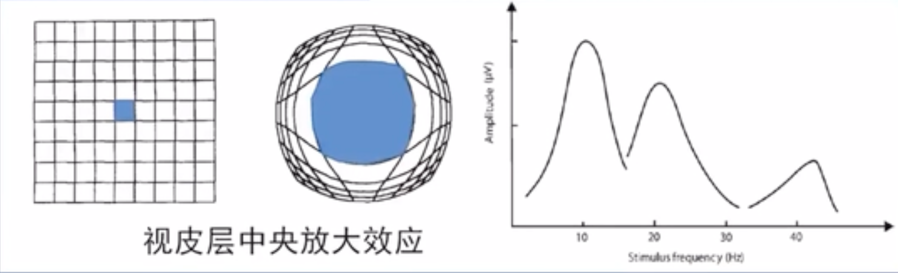

paper链接: https://b1uedrops.github.io/static/papers/ssvep-cca.pdf

## EEG

EEG的全称是Electroencephalography, 中文叫脑电图. 纵轴是电压, 横轴是时间, 这种信号就是脑电信号.


## SSVEP

SSVEP的全称是Steady-State Visual Evoked Potentials, 中文叫做稳态视觉诱发电位.

当给人体施加一个周期性的视觉刺激时, 在大脑的视觉皮层处, 会记录到一个和视觉刺激频率相同, 或者是谐波关系的多个脑电信号. 这些信号就是SSVEP信号.

* 当人视野中有不同的视觉刺激时, 位于大脑视觉皮层中央的刺激信号诱导产生的脑电信号的振幅最高, 这种效应叫**视皮层中央放大效应**.




## 典型相关分析(CCA)

典型相关分析(Canonical Correlation Analysis, CCA)是用来探究两个随机变量的相关关系的.

假设有两个随机变量$X, Y$, 它们有各自的指标:

* $X = \begin{pmatrix} X_1 & X_2 & ...& X_n \end{pmatrix}$​
* $Y = \begin{pmatrix} Y_1 & Y_2 & ...& Y_m \end{pmatrix}$

然后, 我现在要对$X, Y$这两个随机变量进行线性组合:

* $U = a_1X_1 + a_2X_2 + ...+a_nX_n$
* $V = b_1Y_1 + b_2Y_2 + ...+b_mY_m$

线性组合的目的, 是找出**典型变量**$U, V$, 使得$U, V$的相关系数最大, 这样就可以求出系数$a, b$的值, 也可以求出$U, V$相关系数, 这个相关系数叫做第一典型相关系数.

之后, 我可以再选择一组线性组合, 这个线性组合和之前的$a, b$​是不相关的, 同时我也保证这个线性组合能让典型变量的相关系数最大.

用算法来表述的话:

* 第一, 求$a_1, b_1$, 在$D(U_1) = D(V_1) = 1$的前提下, 使得$\rho(U_1, V_1)$最大, 其中$\rho(U_1, V_1)$叫做第一典型相关系数.
* 第二, 求$a_2, b_2$, 在$D(U_2) = D(V_2) = 1, Cov(U_1, U_2) = Cov(V_1, V_2) = 0$的前提下, 是的$\rho(U_2, V_2)$​最大, 这个值是第二典型相关系数.

* 然后持续迭代, 典型相关系数会逐渐递减, 直到等于0结束.

之后, 需要对典型相关系数进行假设检验, 检验之后, 可以得到哪些典型变量是可以被使用的.


## 传统方法: SSVEP + CCA

首先, 使用特定频率的视觉刺激信号刺激大脑产生SSVEP信号.

视觉刺激信号是一个矩阵, 下面的数字表示矩阵中对应刺激信号的频率, 例如可以是下面这个5x8的矩阵:

```
 8.0   9.0  10.0  11.0  12.0  13.0  14.0  15.0
 8.2   9.2  10.2  11.2  12.2  13.2  14.2  15.2
 8.4   9.4  10.4  11.4  12.4  13.4  14.4  15.4
 8.6   9.6  10.6  11.6  12.6  13.6  14.6  15.6
 8.8   9.8  10.8  11.8  12.8  13.8  14.8  15.8
```

对应的SSVEP信号是这种数据结构:

* 首先, 第一个维度一般是通道数, 通道就是测量脑电波时, 连上的电极的个数, 每一个通道都会对应一个脑电波信号.
* 第二个维度一般是采样点的个数.
* 第三个维度一般是实验次数, 表示第几次实验的数据.
* 值就是电压高低, 单位一般是$\mu V$.


