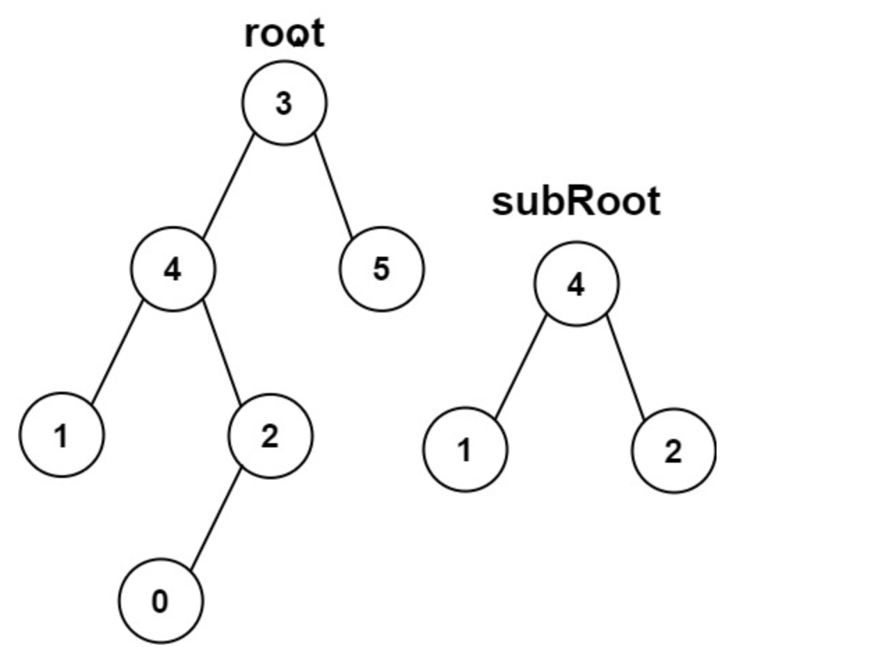

[TOC]


## 中序遍历

> https://leetcode.cn/problems/binary-tree-inorder-traversal/

中序遍历是左, 中, 右.


### 递归写法

```cpp
class Solution {
public:
    vector<int> ans;
    vector<int> inorderTraversal(TreeNode* root) {
        dfs(root);
        return ans;
    }
    void dfs(TreeNode *root) {
        if (!root) return ;
        dfs(root->left);
        ans.push_back(root->val);
        dfs(root->right);
    }
};
```

同类题: 二叉搜索树的第k小元素: https://leetcode.cn/problems/kth-smallest-element-in-a-bst/

```cpp
class Solution {
public:
    int k, ans;
    int kthSmallest(TreeNode* root, int _k) {
        k = _k;
        dfs(root);
        return ans;
    }

    bool dfs(TreeNode *root) {
        if (!root) return false;
        if (dfs(root->left)) return true;
        if (-- k == 0) {
            ans = root->val;
            return true;
        }
        return dfs(root->right);
    }
};
```

简单的递归应用 (二叉搜索树的范围和): https://leetcode.cn/problems/range-sum-of-bst/

```cpp
class Solution {
public:
    int rangeSumBST(TreeNode* root, int low, int high) {
        if (!root) return 0;
        int sum = rangeSumBST(root->left, low, high);
        sum += rangeSumBST(root->right, low, high);
        if (root->val >= low && root->val <= high) sum += root->val;
        return sum;
    }
};
```


### 迭代写法

```cpp
class Solution {
public:

    vector<int> ans;
    stack<TreeNode*> stk;
    vector<int> inorderTraversal(TreeNode* root) {
        while (root || stk.size()) 
        {
            while (root)
            {
                stk.push(root);
                root = root->left;
            }

            root = stk.top();
            stk.pop();
            ans.push_back(root->val);
            root = root->right;
        }
        return ans;
    }
};
```

同类题(二叉树中序遍历迭代器): https://leetcode.cn/problems/binary-search-tree-iterator/

```cpp
class BSTIterator {
public:
    stack<TreeNode *> stk;

    BSTIterator(TreeNode* root) {
        while (root) {
            stk.push(root);
            root = root->left;
        }
    }
    
    int next() {
        auto root = stk.top();
        stk.pop();
        int val = root->val;
        root = root->right;
        while (root) {
            stk.push(root);
            root = root->left;
        }
        return val;
    }
    
    bool hasNext() {
        return stk.size();
    }
};
```


## 前序遍历

> https://leetcode.cn/problems/binary-tree-preorder-traversal/


前序遍历是根, 左, 右.

### 递归写法

```cpp
class Solution {
public:
    vector<int> ans;
    vector<int> preorderTraversal(TreeNode* root) {
        dfs(root);
        return ans;
    }
    void dfs(TreeNode *root) {
        if (!root) return ;
        ans.push_back(root->val);
        dfs(root->left);
        dfs(root->right);
    }
};
```

### 迭代写法

```cpp
class Solution {
public:
    vector<int> ans;
    stack<TreeNode *> stk;
    vector<int> preorderTraversal(TreeNode* root) {
        while (root || stk.size())
        {
            while (root)
            {
                ans.push_back(root->val);
                stk.push(root);
                root = root->left;
            }

            root = stk.top();
            stk.pop();
            root = root->right;
        }
        return ans;
    }
};
```


同类题(根据二叉树创建字符串): https://leetcode.cn/problems/construct-string-from-binary-tree/

```cpp
class Solution {
public:
    string ans = "";
    string tree2str(TreeNode* root) {
        dfs(root);
        return ans;
    }

    void dfs(TreeNode * root) {
        if (!root) {
            ans += "()";
            return ;
        }
        ans += to_string(root->val);
        if (!root->left && !root->right) return ;
        else if (root->left && !root->right) {
            ans += "(";
            dfs(root->left);
            ans += ")";
        }
        else if (!root->left && root->right) {
            ans += "()";
            ans += "(";
            dfs(root->right);
            ans += ")";
        }
        else {
            ans += "(";
            dfs(root->left);
            ans += ")";
            ans += "(";
            dfs(root->right);
            ans += ")";
        }
        
    }
};
```

同类题: 叶子相似的树, https://leetcode.cn/problems/leaf-similar-trees/description/

```cpp
class Solution {
public:
    void dfs(TreeNode *root, vector<int> &a) {
        if (!root) return ;
        if (!root->left && !root->right) a.push_back(root->val);
        dfs(root->left, a), dfs(root->right, a);
    }
    bool leafSimilar(TreeNode* root1, TreeNode* root2) {
        vector<int> a, b;
        dfs(root1, a);
        dfs(root2, b);
        return a == b;
    }
};
```


## 后序遍历

> https://leetcode.cn/problems/binary-tree-postorder-traversal/


后序遍历是左, 右, 根.

### 递归写法


```cpp
class Solution {
public:
    vector<int> ans;
    vector<int> postorderTraversal(TreeNode* root) {
        dfs(root);
        return ans;
    }
    void dfs(TreeNode *root) {
        if (!root) return ;
        dfs(root->left);
        dfs(root->right);
        ans.push_back(root->val);
    }
};
```

### 迭代写法

 先按照根右左的顺序遍历, 然后反向即可.

```cpp
class Solution {
public:
    vector<int> ans;
    stack<TreeNode *> stk;
    vector<int> postorderTraversal(TreeNode* root) {
        while (root || stk.size()) {
            while (root) {
                ans.push_back(root->val);
                stk.push(root);
                root = root->right;
            }
            root = stk.top();
            stk.pop();
            root = root->left;
        }
        reverse(ans.begin(), ans.end());
        return ans;
    }
};
```


## 层序遍历

> https://leetcode.cn/problems/binary-tree-level-order-traversal
>
> https://www.acwing.com/problem/content/description/41/
>
> https://www.acwing.com/problem/content/42/
>
> https://leetcode.cn/problems/binary-tree-level-order-traversal-ii/

```cpp
/**
 * Definition for a binary tree node.
 * struct TreeNode {
 *     int val;
 *     TreeNode *left;
 *     TreeNode *right;
 *     TreeNode() : val(0), left(nullptr), right(nullptr) {}
 *     TreeNode(int x) : val(x), left(nullptr), right(nullptr) {}
 *     TreeNode(int x, TreeNode *left, TreeNode *right) : val(x), left(left), right(right) {}
 * };
 */
class Solution {
public:
    vector<vector<int>> levelOrder(TreeNode* root) {
        vector<vector<int>> ans;
        if (!root) return ans;

        queue<TreeNode *> q;
        q.push(root);

        while (q.size()) {
            vector<int> level;
            int len = q.size();
						
          /* 每一层单独放 */
            while (len --) {
                auto t = q.front();
                q.pop();
                level.push_back(t->val);
                if (t->left) q.push(t->left);
                if (t->right) q.push(t->right);
            }
            ans.push_back(level);
        }

        return ans;
    }
};
```

同类题(二叉树的右视图): https://leetcode.cn/problems/binary-tree-right-side-view/

```cpp
class Solution {
public:
    vector<int> rightSideView(TreeNode* root) {

        vector<int> ans;
        // 注意层序遍历不要忘记判断空节点
        if (!root) return ans;
        queue<TreeNode *> q;

        q.push(root);

        while (q.size()) {
            int len = q.size();

            for (int i = 0; i < len; i ++) {
                auto t = q.front();
                q.pop();
                if (t->left) q.push(t->left);
                if (t->right) q.push(t->right);
                if (i == len - 1) ans.push_back(t->val);
            }
        }
        return ans;
    }
};
```


## 之字形层序遍历

> https://www.acwing.com/problem/content/description/43/
>
> https://leetcode.cn/problems/binary-tree-zigzag-level-order-traversal/description/

在层序遍历的基础上用一个变量控制一下是否反转`level`即可.

```cpp
class Solution {
public:
    vector<vector<int>> printFromTopToBottom(TreeNode* root) {
        
        vector<vector<int>> ans;
        if (!root) return ans;
        
        queue<TreeNode *> q;
        q.push(root);
        
        bool rev = false;
        
        while (q.size())
        {
            vector<int> level;
            int len = q.size();
            
            while (len --)
            {
                auto t = q.front();
                q.pop();
                level.push_back(t->val);
                if (t->left) q.push(t->left);
                if (t->right) q.push(t->right);
            }
            if (rev) reverse(level.begin(), level.end());
            ans.push_back(level);
            rev = !rev;
        }
        return ans;
    }
};
```


## 前序中序恢复二叉树

> https://leetcode.cn/problems/construct-binary-tree-from-preorder-and-inorder-traversal/

首先, 前序遍历序列的第一个元素就是根节点, 通过哈希表可以找到第一个元素在中序遍历中的位置, 假设根节点在中序遍历中的下标是$k$.

假设前序遍历的下标范围是$[pl, pr]$, 中序遍历的下标范围是$[il, ir]$, 那么:

* 左子树在前序遍历的下标范围是$[pl + 1, pl + 1 + (k - 1 - il + 1) - 1]$
* 右子树在前序遍历的下标范围是$[pl + 1 +  (k - il + 1) - 1 + 1, pr]$
* 左子树在中序遍历的下标范围是$[il, k - 1]$
* 右子树在中序遍历的下标范围是$[k + 1, ir]$

然后递归建树即可, 时间复杂度是$O(n)$.

```cpp
class Solution {
public:
    unordered_map<int, int> hash;
    TreeNode *dfs(vector<int> &preorder, vector<int> &inorder, int pl, int pr, int il, int ir) {
        if (pl > pr) return NULL;
        int val = preorder[pl];
        int k = hash[val];
        TreeNode *root = new TreeNode(val);

        root->left = dfs(preorder, inorder, pl + 1, pl + 1 + k - 1 - il, il, k - 1);
        root->right = dfs(preorder, inorder, pl + 1 + k - 1 - il + 1, pr, k + 1, ir);

        return root;
    }
    TreeNode* buildTree(vector<int>& preorder, vector<int>& inorder) {
        int n = inorder.size();
        for (int i = 0; i < n; i++) hash[inorder[i]] = i;
        return dfs(preorder, inorder, 0, n - 1, 0, n - 1);
    }
};
```

注意, 只有前序和后序不能唯一确定一个二叉树 


## 后序中序恢复二叉树

> https://leetcode.cn/problems/construct-binary-tree-from-inorder-and-postorder-traversal/description

分析思路和上一题相同.

```cpp
class Solution {
public:
    unordered_map<int, int> hash;

    TreeNode *dfs(vector<int> &inorder, vector<int> &postorder, int il, int ir, int pl, int pr) {
        if (pl > pr) return NULL;
        int val = postorder[pr];
        int k = hash[val];

        TreeNode *root = new TreeNode(val);

        root->left = dfs(inorder, postorder, il, k - 1, pl, pl + k - 1 - il);
        root->right = dfs(inorder, postorder, k + 1, ir, pl + k - 1 - il + 1, pr - 1);

        return root;
    }

    TreeNode* buildTree(vector<int>& inorder, vector<int>& postorder) {
        int n = inorder.size();
        for (int i = 0; i < n; i++) hash[inorder[i]] = i;
        return dfs(inorder, postorder, 0, n - 1, 0, n - 1); 
    }
};
```


## 前序后序恢复二叉树

> https://leetcode.cn/problems/construct-binary-tree-from-preorder-and-postorder-traversal/

> 为什么根据前序遍历和后序遍历无法恢复二叉树?

假设我有一个节点, 它的左子树/右子树不存在, 但是在前序/后序遍历中, 都无法反映这个子树不存在的信息, 因此如果你从前序/后序遍历中发现一个子树不存在, 它既可以是左子树不存在, 也可以是右子树不存在, 选一个就可以.

```cpp
class Solution {
public:
    unordered_map<int, int> hash;

    TreeNode *dfs(vector<int> &preorder, vector<int> &postorder, int a, int b, int x, int y) {
        if (a > b) return NULL;
        TreeNode *root = new TreeNode(preorder[a]);
        if (a == b) return root;
        // 左根在后序遍历中的位置
        int k = hash[preorder[a + 1]];
        root->left = dfs(preorder, postorder, a + 1, a + 1 + (k - x + 1) - 1, x, k);
        root->right = dfs(preorder, postorder, a + 1 + (k - x + 1), b, k + 1, y - 1);
        return root;
    }
    TreeNode* constructFromPrePost(vector<int>& preorder, vector<int>& postorder) {
        int n = postorder.size();
        for (int i = 0; i < n; i ++) hash[postorder[i]] = i;
        return dfs(preorder, postorder, 0, n - 1, 0, n - 1);
    }
}
```


## 二叉树中序遍历的下一个节点

> https://www.acwing.com/problem/content/description/31/

分两种情况:

* 第一: 如果给定节点有右子树, 那么下一个节点就是右子树最左边的节点, 对应左根右的右这一部分.
* 第二: 如果给定节点没有右子树, 那么它需要向上, 找到节点$p$, 使得$p.father.left = p$, 那么$p.father$就是下一个节点, 对应左根右的根这一部分.

```cpp
class Solution {
public:
    TreeNode* inorderSuccessor(TreeNode* p) {
        if (p->right) {
            p = p->right;
            while (p->left) p = p->left;
            return p;
        }
        else {
            while (p->father && p->father->right == p) p = p->father;
            return p->father;
        }
    }
};
```


## 二叉搜索树的搜索操作

> https://leetcode.cn/problems/search-in-a-binary-search-tree/

迭代写法:

```cpp
class Solution {
public:
    TreeNode* searchBST(TreeNode* root, int val) {
        if (!root) return NULL;

        while (root) {
            if (val < root->val) root = root->left;
            else if (val > root->val) root = root->right;
            else return root;
        }
        return NULL;
    }
};
```

递归写法:

```cpp
class Solution {
public:
    TreeNode* searchBST(TreeNode* root, int val) {
        if (!root) return NULL;
        if (val == root->val) return root;
        if (val < root->val) return searchBST(root->left, val);
        return searchBST(root->right, val);
    }
};
```


## 二叉搜索树的插入操作

> https://leetcode.cn/problems/insert-into-a-binary-search-tree/

递归写法:

```cpp
class Solution {
public:
    TreeNode* insertIntoBST(TreeNode* root, int val) {
        if (!root) return new TreeNode(val);
        if (val < root->val) root->left = insertIntoBST(root->left, val);
        else root->right = insertIntoBST(root->right, val);
        return root;
    }
};
```


## 二叉搜索树的删除操作

> https://leetcode.cn/problems/delete-node-in-a-bst/

二叉搜索树的删除分为如下三种情况:

* 如果要删除的节点是叶子节点, 那么直接把这个节点变成null就行.
* 如果要删除的节点只有左子树/右子树, 那么直接把左子树/右子树提上来就行.
* 如果要删除的节点左子树和右子树都有, 那么就找后继节点, 让后继节点覆盖当前节点, 然后再从右子树中递归删除后继节点.
  * 注意, 由于后继节点没有左子树, 如果递归的话, 那么就是第一种/第二种情况.

```cpp
class Solution {
public:
    TreeNode* deleteNode(TreeNode* root, int key) {
        del(root, key);
        return root;
    }

    void del(TreeNode* &root, int key) {
        if (!root) return ;

        if (key < root->val) {
            del(root->left, key);
            return ;
        }
        if (key > root->val) {
            del(root->right, key);
            return ;
        }

        if (!root->left && !root->right) root = NULL;
        else if (!root->left) root = root->right;
        else if (!root->right) root = root->left;
        else {
            auto next = root->right;
            while (next->left) next = next->left;
            root->val = next->val;
            del(root->right, next->val);
        }
    }
};
```


## 二叉搜索树的后序遍历

> https://www.acwing.com/problem/content/44/


```cpp
class Solution {
public:
    bool verifySequenceOfBST(vector<int> sequence) {
        int n = sequence.size();
        if (!n) return true;
        return dfs(0, n - 1, sequence);
    }
    
    bool dfs(int l, int r, vector<int> &sequence) {
        if (l >= r) return true;
        
        int index = l, root = sequence[r];
        
        while (index < r && sequence[index] < root) index ++;
        
        for (int i = index; i < r; i ++)
            if (sequence[i] < root)
                return false;
        return dfs(l, index - 1, sequence) && dfs(index, r - 1, sequence);
    }
};
```


## 二叉树中和是某一值的路径

> https://www.acwing.com/problem/content/description/45/
>
> https://leetcode.cn/problems/path-sum-ii

```cpp
class Solution {
public:
    vector<int> path;
    vector<vector<int>> ans;
    
    vector<vector<int>> findPath(TreeNode* root, int sum) {
        
        if (!root) return ans;
        dfs(root, sum);
        return ans;
    }
    
    void dfs(TreeNode *root, int sum)
    {
        if (!root) return ;
        
        path.push_back(root->val);
        sum -= root->val;
        
        if (!root->left && !root->right && !sum)
        {
            ans.push_back(path);
            path.pop_back();
            sum += root->val;
            return ;
        }
        
        dfs(root->left, sum);
        dfs(root->right, sum);

        path.pop_back();
        
        return ;
    }
};
```

> https://leetcode.cn/problems/path-sum/

```cpp
class Solution {
public:
    bool hasPathSum(TreeNode* root, int targetSum) {
        if (!root) return false;
        
        targetSum -= root->val;

        if (!root->left && !root->right && !targetSum) {
            targetSum += root->val;
            return true;
        }

        auto left = hasPathSum(root->left, targetSum);
        auto right = hasPathSum(root->right, targetSum);

        if (left || right) {
            targetSum += root->val;
            return true;
        }
        return false;
    }
};
```


## 树的子结构

> https://www.acwing.com/problem/content/35/

注意, 在这个题中, 空🌲不是任何🌲的子结构, 在这个图中, `subRoot`是`root`的子结构.



```cpp
class Solution {
public:
    /* 判断r2子树是否是r1子树的子结构 */
    bool dfs(TreeNode *r1, TreeNode *r2) {
      // 注意, 这里有顺序, 一定要先判断r2是否为空
        if (!r2) return true;
        if (!r1) return false;
        if (r1->val != r2->val) return false;
        return dfs(r1->left, r2->left) && dfs(r1->right, r2->right);
    }
    
    bool hasSubtree(TreeNode* pRoot1, TreeNode* pRoot2) {
        /* 如果是有一个是NULL, 那么就不是子结构 */
        if (!pRoot1 || !pRoot2) return false;
        if (dfs(pRoot1, pRoot2)) return true;
      	// 注意这里是hasSubtree而不是dfs
        return hasSubtree(pRoot1->left, pRoot2) || hasSubtree(pRoot1->right, pRoot2);
    }
};
```

这里还有一道变式题, https://leetcode.cn/problems/subtree-of-another-tree/

要求判断是不是子树, 在这种情况下`subRoot`肯定不是`Root`的子树.

```cpp
class Solution {
public:
    bool dfs(TreeNode *p, TreeNode *q) {
        if (!p || !q) return !p && !q;
        if (p->val != q->val) return false;
        return dfs(p->left, q->left) && dfs(p->right, q->right);
    }
    bool isSubtree(TreeNode* root, TreeNode* subRoot) {
        if (!root || !subRoot) return false;
        if (dfs(root, subRoot)) return true;
        return isSubtree(root->left, subRoot) || isSubtree(root->right, subRoot);
    }
};
```


## 二叉树的镜像

> https://www.acwing.com/problem/content/description/37/
>
> https://leetcode.cn/problems/invert-binary-tree/

将二叉树变成镜像的方法就是递归地把左右节点交换即可.

```cpp
class Solution {
public:
    void mirror(TreeNode* root) {
        
        if (!root) return ;
        mirror(root->left);
        mirror(root->right);
        
        auto t = root->left;
        root->left = root->right;
        root->right = t;
    }
};
```


## 二叉树的最大深度

> https://leetcode.cn/problems/maximum-depth-of-binary-tree/

```cpp
class Solution {
public:
    int maxDepth(TreeNode* root) {
        if (!root) return 0;
        return max(maxDepth(root->left), maxDepth(root->right)) + 1;
    }
};
```

同类题: 判断是否是平衡二叉树, 就是在`maxDepth`函数中再维护其他信息.

(平衡🌲就是对于🌲中的任意一个节点, 左子树和右子树的最大深度之差绝对值不超过1, 空🌲也是平衡树).

链接: https://leetcode.cn/problems/balanced-binary-tree/

```cpp
class Solution {
public:
    bool ans = true;
    bool isBalanced(TreeNode* root) {
        dfs(root);
        return ans;
    }

    int dfs(TreeNode *root) {
        if (!root) return 0;
        int lh = dfs(root->left), rh = dfs(root->right);
        if (abs(lh - rh) > 1) ans = false;
        return max(lh, rh) + 1;
    }
};
```

变式题: 二叉树的最小深度, https://leetcode.cn/problems/minimum-depth-of-binary-tree/

```cpp
class Solution {
public:
    int minDepth(TreeNode* root) {
        if (!root) return 0;
        // 注意一个节点为空, 另一个节点不为空的情况, 这种情况应该只取一边
        if (!root->left) return minDepth(root->right) + 1;
        if (!root->right) return minDepth(root->left) + 1;
        return min(minDepth(root->left), minDepth(root->right)) + 1;
    }
};
```


## 对称的二叉树

> https://www.acwing.com/problem/content/description/38/
>
> https://leetcode.cn/problems/symmetric-tree/

```cpp
class Solution {
public:
    /* 判断p和q所在的子树是否对称 */
    bool dfs(TreeNode *p, TreeNode *q) {
        if (!p || !q) return !p && !q;
        if (p->val != q->val) return false;
        return dfs(p->left, q->right) && dfs(p->right, q->left);
    }
    bool isSymmetric(TreeNode* root) {
        if (!root) return true;
        return dfs(root->left, root->right);
    }
};
```

同类题: https://leetcode.cn/problems/same-tree/description/

```cpp
class Solution {
public:
    bool isSameTree(TreeNode* p, TreeNode* q) {
        if (!p || !q) return !p && !q;
        if (p->val != q->val) return false;
        return isSameTree(p->left, q->left) && isSameTree(p->right, q->right);
    }
};
```

同类题(翻转等价二叉树): https://leetcode.cn/problems/flip-equivalent-binary-trees/

* 这个题的时间复杂度是$O(n)$, 原因在于每个点都是不一样的, 也就是说等价的方式只有一种.

```cpp 
class Solution {
public:
    bool flipEquiv(TreeNode* root1, TreeNode* root2) {
        if (!root1 || !root2) return !root1 && !root2;
        if (root1->val != root2->val) return false;
        return (flipEquiv(root1->left, root2->left) && flipEquiv(root1->right, root2->right)) || (flipEquiv(root1->left, root2->right) && flipEquiv(root1->right, root2->left));
    }
};
```


## 合并二叉树

> https://leetcode.cn/problems/merge-two-binary-trees/

```cpp
class Solution {
public:
    TreeNode* mergeTrees(TreeNode* root1, TreeNode* root2) {
        if (!root1) return root2;
        if (!root2) return root1;

        root1->left = mergeTrees(root1->left, root2->left);
        root1->right = mergeTrees(root1->right, root2->right);

        root1->val += root2->val;
        return root1;
    }

};
```


## 二叉树的所有路径

> https://leetcode.cn/problems/binary-tree-paths/

```cpp
class Solution {
public:
    vector<string> ans;

    vector<string> binaryTreePaths(TreeNode* root) {
        dfs(root, "");
        return ans;
    }

    void dfs(TreeNode *root, string path) {
        if (!root) return ;

        path += to_string(root->val);

        if (!root->left && !root->right) {
            ans.push_back(path);
            return ;
        }

        dfs(root->left, path + "->");
        dfs(root->right, path + "->");

        return ;
    }
};
```

同类题: 求根节点到叶节点的数字之和

https://leetcode.cn/problems/sum-root-to-leaf-numbers/


## 完全二叉树求节点个数

> https://leetcode.cn/problems/count-complete-tree-nodes/

通用的代码: 这个所有树都可以使用, 时间复杂度是$O(n)$.

```cpp
class Solution {
public:
    int countNodes(TreeNode* root) {
        if (!root) return 0;
        return countNodes(root->left) + countNodes(root->right) + 1;
    }
};
```

同类题: 二叉树的坡度 https://leetcode.cn/problems/binary-tree-tilt/

```cpp
class Solution {
public:
    int ans = 0;
    int findTilt(TreeNode* root) {
        if (!root) return 0;
        dfs(root);
        return ans;
    }

    int dfs(TreeNode *root) {
        if (!root) return 0;
        int left = dfs(root->left), right = dfs(root->right);
        ans += abs(left - right);
        return left + right + root->val;
    }
};
```


## 不同的二叉搜索树求数目

> https://leetcode.cn/problems/unique-binary-search-trees/

> 二叉搜索树的中序遍历一定是严格递增的.

假设$f(n)$表示长度为$n$, 元素为$[1, n]$的二叉搜索树的个数.

初始状态是`f[0] = 1`. 注意空子树这个形态是合法的, 因为一个状态会由它的左子树和右子树的状态转移而来, 而左子树和右子树可以为空.

从$[1, n]$进行枚举, 对于状态`i`, 再从$j \in [1, i]$进行枚举, $j$作为根节点, 那么左子树和右子树的个数就分别是`f[j - 1]`和`f[i - (j + 1) + 1]`, 进行状态转移即可.

```cpp
class Solution {
public:
    int numTrees(int n) {
        vector<int> f(n + 1);
        f[0] = 1;
        for (int i = 1; i <= n; i ++) {
            for (int j = 1; j <= i; j ++) {
                f[i] += f[j - 1] * f[i - j];
            }
        }
        return f[n];
    }
};
```

> 从1~n构成的互不相同的二叉搜索树的个数是卡特兰数.


## 不同的二叉搜索树求方案

> https://leetcode.cn/problems/unique-binary-search-trees-ii/

常规的搜索问题.

```cpp
class Solution {
public:
    vector<TreeNode*> generateTrees(int n) {
        return dfs(1, n);
    }

    vector<TreeNode *> dfs(int l, int r) {
        if (l > r) return {NULL};
        vector<TreeNode *> res;

        // 枚举根节点的位置
        for (int i = l; i <= r; i ++) {
            auto left = dfs(l, i - 1), right = dfs(i + 1, r);
            for (auto p : left) {
                for (auto q: right) {
                    TreeNode *root = new TreeNode(i);
                    root->left = p, root->right = q;
                    res.push_back(root);
                }
            }
        }
        return res;
    }
};
```


## 验证二叉搜索树

> https://leetcode.cn/problems/validate-binary-search-tree/

方法一: 如果一个树是二叉搜索树, 等价于中序遍历严格递增.

方法二: 按照定义搜索, 需要求子树中所有元素的最小值和最大值.

```cpp
class Solution {
public:
    bool isValidBST(TreeNode* root) {
        if (!root) return true;
        return dfs(root)[0];
    }
    // 返回三个信息, 是否是二叉搜索树, 子树最大值, 子树最小值
    vector<int> dfs(TreeNode *root) {
        vector<int> res({ 1, root->val, root->val });
				
        if (root->left) {
            auto t = dfs(root->left);
            if (!t[0] || t[2] >= root->val) res[0] = 0;
            res[1] = min(root->val, t[1]);
            res[2] = max(root->val, t[2]);
        }
        if (root->right) {
            auto t = dfs(root->right);
            if (!t[0] || t[1] <= root->val) res[0] = 0;
            // 注意这里min里面是res[1], 而不是root->val, 因为取最小值要连上左子树一起比较
            res[1] = min(res[1], t[1]);
            res[2] = max(res[2], t[2]);
        }
        return res;
    }
};
```


## 恢复二叉搜索树

> https://leetcode.cn/problems/recover-binary-search-tree/description/

首先, 对于一个二叉搜索树, 它的中序遍历一定是严格单调递增的序列.

如果两个节点被错误地交换了, 那么只有可能是两种情况:

* 相邻的两个节点, 例如:

  ```
  1, 2, 3, 4, 5 -> 1, 3, 2, 4, 5
  ```

  这种情况下, 有一个相邻元素组成的逆序对`(3, 2)`, 只需要交换这两个元素的位置即可.

* 不相邻的两个节点, 例如:

  ```
  1, 2, 3, 4, 5 -> 1, 4, 3, 2, 5
  ```

  这种情况下, 有两个相邻元素组成的逆序对`(4, 3)`和`(3, 2)`, 只需要交换4和2的位置即可.

时间复杂度是$O(n)$.

如果空间复杂度要求是$O(n)$的话, 可以在进行中序遍历时记录哪些节点需要交换, 直接交换即可.

```cpp
class Solution {
public:
    stack<TreeNode*> stk;
    vector<TreeNode *> inorder;
    vector<TreeNode *> element;
    void recoverTree(TreeNode* root) {
        if (!root) return ;
        
        while (root || stk.size()) {
            while (root) {
                stk.push(root);
                root = root->left;
            }
            root = stk.top();
            stk.pop();
            if (inorder.size() != 0 && inorder.back()->val > root->val) {
                element.push_back(inorder.back());
                element.push_back(root);
            }
            inorder.push_back(root);
            root = root->right;
        }

        if (element.size() == 2) {
            int t = element[0]->val;
            element[0]->val = element[1]->val;
            element[1]->val = t;
        }
        else if (element.size() == 4) {
            int t = element[0]->val;
            element[0]->val = element[3]->val;
            element[3]->val = t;
        }
    }
};
```

如果空间复杂度要求是$O(1)$​的话, 就需要用到Morris遍历.


### Morris中序遍历

Morris遍历的流程大概如下:

* 首先, 将当前节点设置成根节点: `cur = root`.
* 如果当前节点有左子树:
  * 找当前节点的前驱`prev`:
    * 如果`prev`的右子树为空, 证明`cur`的左子树没有被遍历过, 将`prev->right`设置成当前节点`cur`, 然后`cur = cur->left`.
    * 如果`prev`的右子树不为空, 证明`cur`的左子树已经被遍历过, 此时将`prev->right`设置为空, 然后打印`cur`的值, 然后跳转到右子树`cur = cur->right`.
* 如果当前节点没有左子树:
  * 打印当前节点的值, 直接进入右子树 (此时一般会回溯到树的上层).

> 在Morris遍历中, 需要对每个节点都求一次前驱, 但是节点求前驱的时间复杂度是$O(n)$, 为什么Morris遍历的时间复杂度是$O(n)$而不是$O(n^2)$?

对二叉树的所有节点求一遍前驱的时间复杂度其实就是$O(n)$, 因为每条边只会被遍历两次.

Morris遍历生成中序遍历的代码如下:

```cpp
class Solution {
public:
    vector<int> inorderTraversal(TreeNode* root) {
        vector<int> ans;
        if (!root) return ans;

        auto cur = root;
        while (cur) {
            
            if (cur->left) {
                // find prev
                auto prev = cur->left;
                while (prev->right && prev->right != cur) prev = prev->right;
                
                if (!prev->right) {
                    prev->right = cur;
                    cur = cur->left;
                }
                else {
                    prev->right = NULL;
                    ans.push_back(cur->val);
                    cur = cur->right;
                }
            }
            else {
                ans.push_back(cur->val);
                cur = cur->right;
            }
        }
        return ans;
    }
};
```

使用Morris遍历解决此题的代码如下:

```cpp
class Solution {
public:
    void recoverTree(TreeNode* root) {
        if (!root) return ;

        auto cur = root;
        TreeNode *p = NULL;
        TreeNode *first = NULL;
        TreeNode *second = NULL;

        while (cur) {

            if (cur->left) {
                auto prev = cur->left;
                while (prev->right && prev->right != cur) prev = prev->right;
                if (!prev->right) {
                    prev->right = cur;
                    cur = cur->left;
                }
                else {
                    prev->right = NULL;
                    if (p && p->val > cur->val) {
                        if (!first) first = p, second = cur;
                        else second = cur;
                    }
                    p = cur;
                    cur = cur->right;
                }
            }
            else {
                if (p && p->val > cur->val) {
                    if (!first) first = p, second = cur;
                    else second = cur;
                }
                p = cur;
                cur = cur->right;
            }
        }
        swap(first->val, second->val);
    }
};
```


## 有序数组变二叉搜索树

> https://leetcode.cn/problems/convert-sorted-array-to-binary-search-tree/

时间复杂度是$O(n)$​.

```cpp
class Solution {
public:
    TreeNode* sortedArrayToBST(vector<int>& nums) {
        return dfs(nums, 0, nums.size() - 1);
    }

    TreeNode *dfs(vector<int> &nums, int l, int r) {
        if (l > r) return NULL;

        int mid = l + (r - l) / 2;

        TreeNode *root = new TreeNode(nums[mid]);

        root->left = dfs(nums, l, mid - 1);
        root->right = dfs(nums, mid + 1, r);
        
        return root;
    }
};
```

> 证明: 用该算法得到的二叉搜索树的所有高度(不是最大高度)之差的最大值不超过1

* 左半部分的节点每次最多比右半部分少1, 如果高度差最大值是2, 那么必然左边会比右边多一层, 这根本不可能, 多1个节点贡献的高度差肯定吵不过1.


## 有序链表变二叉搜索树

> https://leetcode.cn/problems/convert-sorted-list-to-binary-search-tree/

找有序链表的终点可以使用快慢指针.

```cpp
class Solution {
public:
    TreeNode* sortedListToBST(ListNode* head) {
        
        if (!head) return NULL;
        return build(head, NULL);
    }

    TreeNode *build(ListNode *s, ListNode *t) {
        
        if (s == t) return NULL;

        auto fast = s, slow = s;

        while (fast != t && fast->next != t) {
            fast = fast->next->next;
            slow = slow->next;
        }

        TreeNode *root = new TreeNode(slow->val);
        root->left = build(s, slow);
        root->right = build(slow->next, t);

        return root;
    }
};
```

时间复杂度是$T(n) = 2T(\frac{n}{2}) + O(n)$, 根据主定理, 最后的时间复杂度是$O(nlogn)$.


## 二叉树展开为链表

> https://leetcode.cn/problems/flatten-binary-tree-to-linked-list/

每一次只需要将当前节点`cur`的左节点`cur->left`到`cur`的前驱节点这一条路合并到右子树就可以了, 合并之后`cur`向右移动.

效果如下所示:

```
1.  1
   / \
  2   5
 / \   \
3   4   6

2.  1
     \
      2
     / \
    3   4
         \
          5
           \
            6

3.  1
     \
      2
       \
        3
         \
          4
           \
            5
             \
              6
```


```cpp
class Solution {
public:
    void flatten(TreeNode* root) {
        auto cur = root;

        while (cur) {
            if (cur->left) {
                auto prev = cur->left;
                while (prev->right) prev = prev->right;
                prev->right = cur->right;
                cur->right = cur->left;
                cur->left = 0;
            }
            cur = cur->right;
        }
    }
};
```


类似的题 (递增顺序搜索树):https://leetcode.cn/problems/increasing-order-search-tree/

```cpp
class Solution {
public:
    TreeNode *cur;
    void dfs(TreeNode * root) {
        if (!root) return ;
        dfs(root->left);
        
        cur = cur->right = root;
        root->left = NULL;

        dfs(root->right);
    }
    TreeNode* increasingBST(TreeNode* root) {
        auto dummy = new TreeNode(-1);
        cur = dummy;
        dfs(root);
        return dummy->right;
    }
};
```


## 填充每个节点的下一个右侧节点

> https://leetcode.cn/problems/populating-next-right-pointers-in-each-node/

最简单也是最容易想的方法: 层序遍历

```cpp
class Solution {
public:
    Node* connect(Node* root) {
        
        if (!root) return NULL;

        queue<Node *> q;
        
        q.push(root);

        while (q.size()) {
            int len = q.size();
            vector<Node *> level;
            while (len --) {
                auto t = q.front();
                q.pop();
                level.push_back(t);
                if (t->left) q.push(t->left);
                if (t->right) q.push(t->right);
            }
            for (int i = 0; i < level.size(); i ++) {
                if (i + 1 < level.size()) {
                    level[i]->next = level[i + 1];
                }
                else level[i]->next = NULL;
            }
        }
        return root;
    }
};
```

但是用层序遍历的空间复杂度是$O(n)$, 如果要求用常数空间, 可以借助bfs的思想

```cpp
class Solution {
public:
    Node* connect(Node* root) {
        if (!root) return NULL;
				
      	// 注意这里判断p的时候应该用p->left不为空, 因为要操作下一层节点
        for (auto p = root; p->left; p = p->left) {
            for (auto q = p; q; q = q->next) {
              // 核心点
                q->left->next = q->right;
                q->right->next = q->next ? q->next->left : NULL;
            }
        }
        return root;
    }
};
```

其中核心点在于, 我遍历这一层时, 我操作下一层的`next`指针, 假设我遍历到节点`cur`:

* `cur`左儿子的`next`应该指向`cur->right`.
* `cur`右儿子的`next`应该指向`cur->next->left`.
  * 注意, `cur`右儿子的`next`应该是我在遍历`cur`上层节点的时候设置好了, 这其实就是一个`bfs`迭代的过程.


变式: 如果二叉树不是满二叉树

https://leetcode.cn/problems/populating-next-right-pointers-in-each-node-ii/

此时, 再遍历上一层时, 只需要用链表的形式把下一层节点串起来即可.

```cpp
class Solution {
public:
    Node* connect(Node* root) {
        
        if (!root) return NULL;

        auto cur = root;

        while (cur) {
            // 每一层维护两个变量, 所以是常数空间
            auto head = new Node(-1);
            auto tail = head;

            for (auto p = cur; p; p = p->next) {
                if (p->left) tail = tail->next = p->left;
                if (p->right) tail = tail->next = p->right;
            }
            
            cur = head->next;
            delete head;
        }
        return root;
    }
};
```


## 二叉搜索树的LCA

> https://leetcode.cn/problems/lowest-common-ancestor-of-a-binary-search-tree/

时间复杂度是$O(h)$, 其中$h$是二叉搜索树的高度.

```cpp
class Solution {
public:
    TreeNode* lowestCommonAncestor(TreeNode* root, TreeNode* p, TreeNode* q) {
        if (p->val > q->val) swap(p, q);
        if (p->val <= root->val && q->val >= root->val) return root;
        if (q->val < root->val) return lowestCommonAncestor(root->left, p, q);
        if (p->val > root->val) return lowestCommonAncestor(root->right, p, q);
        return NULL;
    }
};
```


## 二叉树的LCA

> https://leetcode.cn/problems/lowest-common-ancestor-of-a-binary-tree/

时间复杂度是$O(n)$.

```cpp
class Solution {
public:
    TreeNode * ans = NULL;
    TreeNode* lowestCommonAncestor(TreeNode* root, TreeNode* p, TreeNode* q) {
        dfs(root, p, q);
        return ans;
    }

    // 判断root所在子树中是否存在节点p, q
    // 00: 没有pq, 01: 有p, 10: 有q, 11: 有pq
    int dfs(TreeNode *root, TreeNode *p, TreeNode *q) {
        if (!root) return 0;

        int state = dfs(root->left, p, q);
        if (root == p) state |= 1;
        else if (root == q) state |= 2;
        state |= dfs(root->right, p, q);
      // 如果一个子树里同时有p, q, 并且第一次被遍历到, 就是LCA
        if (state == 3 && !ans) ans = root;
        return state;
    }
};
```


## 验证二叉树前序序列化

> https://leetcode.cn/problems/verify-preorder-serialization-of-a-binary-tree/

按照前序遍历的递归过程模拟吃掉元素, 如果吃掉元素过程中有问题就有问题.

```cpp
class Solution {
public:

    bool isValidSerialization(string preorder) {
        preorder += ",";
        int u = 0;
        if (!dfs(preorder, u)) return false;
        // 如果我遍历完了, 但是字符串还有, 不合法
        return u == preorder.size();
    }
		
  // 注意这里的u加了引用, 表示所有dfs共用u
    bool dfs(string preorder, int &u) {
        // 如果我还没遍历完, 但是字符串没了, 不合法
        if (u == preorder.size()) return false;
        // 子树遍历完了
        if (preorder[u] == '#') {
            u += 2;
            return true;
        }
        // 过滤到下一个元素
        while (preorder[u] != ',') u ++;
        // 过滤,
        u ++;
        return dfs(preorder, u) && dfs(preorder, u);
    }
};
```


## 二叉树的序列化和反序列化

> https://leetcode.cn/problems/serialize-and-deserialize-binary-tree/

序列化可以采用前序遍历+记录空节点的方式.

```cpp
class Codec {
public:
    // Encodes a tree to a single string.
    string serialize(TreeNode* root) {
        dfs_s(root, path);
        return path;
    }

    void dfs_s(TreeNode *root, string &path) {
        if (!root) {
            path += "#,";
            return ;
        }
        path += to_string(root->val) + ",";
        dfs_s(root->left, path);
        dfs_s(root->right, path);
    }

    // Decodes your encoded data to tree.
    TreeNode* deserialize(string data) {
        int u = 0;
        return dfs_d(data, u);
    }

    TreeNode *dfs_d(string data, int &u) {
      if (u == data.size()) return NULL;
        if (data[u] == '#') {
            u += 2;
            return NULL;
        }
        else {
            int k = u;
            while (data[u] != ',') u ++;
            int val = stoi(data.substr(k, u - k));
            u ++;
            auto root = new TreeNode(val);
            root->left = dfs_d(data, u);
            root->right = dfs_d(data, u);
            return root;
        }
    }
};
```


## 二叉搜索树的序列化和反序列化

> https://leetcode.cn/problems/serialize-and-deserialize-bst/

如果是二叉搜索树, 那么就默认中序遍历已经给了, 因此, 可以直接拿前序遍历来做序列化.

反序列化时, 可以根据二叉搜索树的定义来区分左右子树的边界.

```cpp
class Codec {
public:

    // Encodes a tree to a single string.
    string serialize(TreeNode* root) {
        string path = "";
        dfs_s(root, path);
        return path;
    }
    void dfs_s(TreeNode *root, string &path) {
        if (!root) return ;
        path += to_string(root->val) + ' ';
        dfs_s(root->left, path), dfs_s(root->right, path);
    }

    // Decodes your encoded data to tree.
    TreeNode* deserialize(string data) {
        // 先将字符串转换为vector
        vector<int> arr;
        stringstream ssin(data);
        int x = 0;
        while (ssin >> x) arr.push_back(x);

        int u = 0;
        return dfs_d(arr, u, INT_MIN, INT_MAX);
    }

    TreeNode *dfs_d(vector<int> &arr, int &u, int minv, int maxv) {
        // 遍历完
        if (u == arr.size() || arr[u] < minv || arr[u] > maxv) return NULL;
        auto root = new TreeNode(arr[u]);
        u ++;
        // 左子树中节点的值在[minv, root->val]之间, 如果超出范围, 表示遍历完了
        root->left = dfs_d(arr, u, minv, root->val);
        root->right = dfs_d(arr, u, root->val, maxv);
        return root;
    }
};
```


## 左子叶之和

> https://leetcode.cn/problems/sum-of-left-leaves/

```cpp
class Solution {
public:
    int ans = 0;
    int sumOfLeftLeaves(TreeNode* root) {
        if (!root) return 0;
        dfs(root);
        return ans;
    }

    void dfs(TreeNode *root) {
        if (!root) return ;
        
        // 如果root有左儿子, 并且还是叶子节点, 再累加
        if (root->left && !root->left->left && !root->left->right) ans += root->left->val;

        dfs(root->left);
        dfs(root->right);
    }
};
```


## 二叉树的最大路径和

> https://leetcode.cn/problems/binary-tree-maximum-path-sum/

枚举路径的时候, 我们可以先枚举这条路径左右端点的LCA, 假设LCA是u

* 然后可以发现, 这个路径和是由三部分组成:
  * 节点u本身的值.
  * 节点u左子树往下的所有路径(注意这个路径不拐弯)的最大值.
  * 节点u右子树往下所有路径的最大值.
* 路径和可以由这三部分相加组成, 其中后两部分可以通过递归求出.

```cpp
class Solution {
public:
    int ans = INT_MIN;
    int maxPathSum(TreeNode* root) {
        dfs(root);
        return ans;
    }
    int dfs(TreeNode *root) {
        if (!root) return 0;
        int left = max(0, dfs(root->left));
        int right = max(0, dfs(root->right));

        ans = max(ans, root->val + left + right);
        return root->val + max(left, right);
    }
};
```

同类题: 二叉树的直径: https://leetcode.cn/problems/diameter-of-binary-tree/

```cpp
class Solution {
public:
    int ans = 0;
    int diameterOfBinaryTree(TreeNode* root) {
        dfs(root);
      // 直径是边数, 等于点数-1
        return ans - 1;
    }
    int dfs(TreeNode * root) {
        if (!root) return 0;
        int left = dfs(root->left), right = dfs(root->right);
        int res = left + right + 1;
        ans = max(ans, res);
        return max(left, right) + 1;
    }
};
```

同类题: 最长同值路径, https://leetcode.cn/problems/longest-univalue-path/

```cpp
class Solution {
public:
    int ans = 0;
    int longestUnivaluePath(TreeNode* root) {
        dfs(root);
        return ans;
    }

    int dfs(TreeNode *root) {
        if (!root) return 0;
        int l = dfs(root->left), r = dfs(root->right);
        if (!root->left || root->left->val != root->val) l = 0;
        if (!root->right || root->right->val != root->val) r = 0;
        ans = max(ans, l + r );
        return max(l, r) + 1;
    }
};
```


## 找树左下角的值

> https://leetcode.cn/problems/find-bottom-left-tree-value/

用bfs记录一下即可.

```cpp
class Solution {
public:
    TreeNode* deleteNode(TreeNode* root, int key) {
        del(root, key);
        return root;
    }

    void del(TreeNode* &root, int key) {
        if (!root) return ;

        if (key < root->val) {
            del(root->left, key);
            return ;
        }
        if (key > root->val) {
            del(root->right, key);
            return ;
        }

        if (!root->left && !root->right) root = NULL;
        else if (!root->left) root = root->right;
        else if (!root->right) root = root->left;
        else {
            auto next = root->right;
            while (next->left) next = next->left;
            root->val = next->val;
            del(root->right, next->val);
        }
    }
};
```

同类题: https://leetcode.cn/problems/find-largest-value-in-each-tree-row/

```cpp
class Solution {
public:
    vector<int> largestValues(TreeNode* root) {
        vector<int> ans;
        if (!root) return ans;

        queue<TreeNode *> q;
        q.push(root);

        while (q.size()) {
            int len = q.size();
            int maxv = INT_MIN;
            while (len --) {
                auto t = q.front();
                q.pop();
                maxv = max(maxv, t->val);
                if (t->left) q.push(t->left);
                if (t->right) q.push(t->right);
            }
            ans.push_back(maxv);
        }
        return ans;
    }
};
```

同类题: https://leetcode.cn/problems/merge-two-binary-trees/

二叉树层平均值.

```cpp
class Solution {
public:
    vector<double> ans;
    vector<double> averageOfLevels(TreeNode* root) {
        if (!root) return ans;

        queue<TreeNode *> q;
        q.push(root);

        while (q.size()) {
            int len = q.size();
            double sum = 0;
            for (int i = 0; i < len; i ++) {
                auto t = q.front();
                q.pop();
                sum += t->val;
                if (t->left) q.push(t->left);
                if (t->right) q.push(t->right);
            }
            ans.push_back(sum / len);
        }
        return ans;
    }
};
```


## 路径总和III

> https://leetcode.cn/problems/path-sum-iii/

这个题有一个一维版本: https://leetcode.cn/problems/subarray-sum-equals-k/

解法使用前缀和+哈希表.

```cpp
class Solution {
public:
    long long ans = 0;
    unordered_map<long long, int> hash;
    int pathSum(TreeNode* root, int targetSum) {
        hash[0] = 1;
        dfs(root, targetSum, 0);
        return ans;
    }

    void dfs(TreeNode *root, int targetSum, long long path) {
        if (!root) return ;
        path += root->val;
        ans += hash[path - targetSum];
        hash[path] ++;
        dfs(root->left, targetSum, path), dfs(root->right, targetSum, path);
        hash[path] --;
    }
};
```


## 二叉搜索树中的众数

> https://leetcode.cn/problems/find-mode-in-binary-search-tree/

* 首先, 二叉搜索树的中序遍历一定是有序的, 那么重复元素在中序遍历序列中一定是连续出现了.
* 可以在中序遍历的过程中维护一些信息用来统计众数:
  * `last`: 某一段连续的数, 这个数是什么.
  * `curc`: 当前这个数出现的次数.
  * `maxc`: 全局中, 出现次数最多的数, 它出现的次数到底是多少.

```cpp
class Solution {
public:
    int maxc = 0, curc = 0, last;
    vector<int> ans;
    vector<int> findMode(TreeNode* root) {
        if (!root) return ans;
        dfs(root);
        return ans;
    }

    void dfs(TreeNode *root) {
        if (!root) return ;

        dfs(root->left);
        if (!curc || root->val == last) {
            curc ++;
            last = root->val;
        }
        else {
            curc = 1;
            last = root->val;
        }
        // 每次更新都需要维护maxc
        if (curc > maxc) {
            maxc = curc;
            ans = {last};
        }
        else if (curc == maxc) ans.push_back(last);
        dfs(root->right);
    }
};
```


## 出现次数最多的子树元素和

> https://leetcode.cn/problems/most-frequent-subtree-sum/

在求子树和的过程中, 用哈希表维护子树和的信息即可.

```cpp
class Solution {
public:
    vector<int> ans;
    int maxc = 0;
    unordered_map<int, int> hash;
    vector<int> findFrequentTreeSum(TreeNode* root) {
        dfs(root);
        return ans;
    }

    int dfs(TreeNode *root) {
        if (!root) return 0;

        int sum = root->val + dfs(root->left) + dfs(root->right);
        hash[sum] ++;
        if (hash[sum] > maxc) {
            maxc = hash[sum];
            ans = {sum};
        }
        else if (hash[sum] == maxc) ans.push_back(sum);

        return sum;
    }
};
```


## 二叉搜索树的最小绝对差

> https://leetcode.cn/problems/minimum-absolute-difference-in-bst/

二叉搜索树的中序遍历是有序的, 因此, 最小绝对差只能在相邻的元素中取到, 只需要在中序遍历中维护一下相关信息即可.

```cpp
class Solution {
public:
    int ans = INT_MAX;
    bool is_first = true;
    TreeNode * last;
    int getMinimumDifference(TreeNode* root) {
        dfs(root);
        return ans;
    }

    void dfs(TreeNode *root) {
        if (!root) return ;
        dfs(root->left);

        if (is_first) is_first = false, last = root;
        else {
            ans = min(ans, root->val - last->val);
        }
        last = root;
        dfs(root->right);
    }
};
```

一种同类题: 二叉搜索树转换为累加树, https://leetcode.cn/problems/convert-bst-to-greater-tree/

```cpp
class Solution {
public:
    int sum = 0;
    TreeNode* convertBST(TreeNode* root) {
        dfs(root);
        return root;
    }

    void dfs(TreeNode *root) {
        if (!root) return ;
        dfs(root->right);

        int x = root->val;
        root->val += sum;
        sum += x;

        dfs(root->left);
    }
};
```


## 在二叉树中增加一行

> https://leetcode.cn/problems/add-one-row-to-tree/description/

涉及二叉树行的问题, 其实都可以用层序遍历解决.

```cpp
class Solution {
public:
    TreeNode* addOneRow(TreeNode* root, int val, int depth) {
        depth --;
        if (!depth) {
            auto cur = new TreeNode(val);
            cur->left = root;
            return cur;
        }
        queue<TreeNode *> q;
        q.push(root);

        while (q.size()) {
            int len = q.size();
            depth --;
            for (int i = 0; i < len; i ++) {
                auto t = q.front();
                q.pop();
                if (!depth) {
                    auto cur1 = new TreeNode(val);
                    auto cur2 = new TreeNode(val);
                    cur1->left = t->left;
                    t->left = cur1;
                    cur2->right = t->right;
                    t->right = cur2;
                }
                if (t->left) q.push(t->left);
                if (t->right) q.push(t->right);
            }
            if (!depth) break;
        }
        return root;
    }
};
```


## 寻找重复的子树

> https://leetcode.cn/problems/find-duplicate-subtrees/description/

这个题涉及二叉树中哈希一颗子树的方案, 可以采用如下的方案:

* 对于每个子树, 用一个三元组来表示, 三元组的构成是: `(root->val, 左子树id, 右子树id)`.
* 左子树id和右子树id可以用一个全局的变量来分配.

这个三元组可以变成一个字符串存储在哈希表中, 这个哈希表可以将字符串映射到一个唯一的`id`, 这个`id`可以映射到`id`出现的次数, 如果出现次数大于1, 证明出现了重复的子树.

```cpp
class Solution {
public:
    vector<TreeNode *> ans;
    int cnt = 0;
    unordered_map<string, int> ids;
    unordered_map<int, int> hash;

    vector<TreeNode*> findDuplicateSubtrees(TreeNode* root) {
        dfs(root);
        return ans;
    }
    /* Return id */
    int dfs(TreeNode * root) {
        // Use 0 to map NULL
        if (!root) return 0;

        int left = dfs(root->left), right = dfs(root->right);
        string key = to_string(root->val) + ' ' + to_string(left) + ' ' + to_string(right);

        if (ids.count(key) == 0) ids[key] = ++cnt;
        int id = ids[key];
        if (++ hash[id] == 2) ans.push_back(root);
        return id;
    }
};
```


## 两数之和-二叉搜索树

> https://leetcode.cn/problems/two-sum-iv-input-is-a-bst/

直接采用哈希表做.

```cpp
class Solution {
public:
    unordered_set<int> hash;
    bool findTarget(TreeNode* root, int k) {
        return dfs(root, k);
    }

    bool dfs(TreeNode *root, int k) {
        if (!root) return false;
        if (dfs(root->left, k)) return true;
        if (hash.count(k - root->val)) return true;
        hash.insert(root->val);
        return dfs(root->right, k);
    }
}
```


## 最大二叉树

> https://leetcode.cn/problems/maximum-binary-tree/description/

RMQ和二叉树结合的问题, 注意此时`f`数组中维护的不是最大值, 而是最大值的下标.

```cpp
class Solution {
public:
    vector<int> nums;
    vector<vector<int>> f;
    TreeNode* constructMaximumBinaryTree(vector<int>& _nums) {
        nums = _nums;
        int n = nums.size();
        if (!n) return NULL;
        int k = log(n) / log(2);
        f = vector<vector<int>>(n + 1, vector<int>( k + 1 ));
        for (int j = 0; j <= k; j ++) {
            for (int i = 0; i + (1 << j) - 1 < n; i ++) {
                if (!j) f[i][j] = i;
                else {
                    int l = f[i][j - 1], r = f[i + (1 << j - 1)][j - 1];
                    if (nums[l] > nums[r]) f[i][j] = l;
                    else f[i][j] = r;
                }
            }
        }
        return build(0, n - 1);
    }
    int query(int l, int r) {
        // query
        int k = log(r - l + 1) / log(2);
        int a = f[l][k], b = f[r - (1 << k) + 1][k];
        if (nums[a] > nums[b]) return a;
        else return b;
    }
    TreeNode * build(int l, int r) {
        if (l > r) return NULL;
        int k = query(l, r);
        auto root = new TreeNode(nums[k]);
        root->left = build(l, k - 1);
        root->right = build(k + 1, r);
        return root;
    }
};
```


## 二叉树的最大宽度

> https://leetcode.cn/problems/maximum-width-of-binary-tree/

在二叉树中, 节点可以有编号, 这个编号类似于堆, 假设一个节点编号是`u`:

* 左节点一般是`u * 2`, 右节点一般是`u * 2 + 1`.

这个节点编号可以做很多事情, 这个题就是考察这个编号的用法.

但是, 如果二叉树节点一多, 编号每次都乘2, 那么很快就会爆`int`.

在这个题中, 只在意编号的相对关系, 因此可以让每层的编号强制从1开始.

```cpp
class Solution {
public:
    typedef long long LL;
    LL ans = -1;
    int widthOfBinaryTree(TreeNode* root) {
        if (!root) return 0;
        // int stands for id for TreeNode
        queue<pair<TreeNode *, LL>> q;
        q.push({ root, 1 });

        while (q.size()) {
            int len = q.size();
            LL l = q.front().second, r;
            for (int i = 0; i < len; i ++) {
                auto t = q.front();
                q.pop();
                auto v = t.first;
                r = t.second;
                LL p = r - l + 1;
                if (v->left) q.push({ v->left, p * 2 });
                if (v->right) q.push({ v->right, p * 2 + 1 });
            }
            ans = max(ans, r - l + 1);
        }
        return ans;
    }
};
```


## 修建二叉搜索树

> https://leetcode.cn/problems/trim-a-binary-search-tree/

这个题有个规律, 如果一个节点要被删除了:

* 如果节点小于low, 那么这个点连同左子树都要没, 直接把右子树提上来.
* 大于high的情况同理.
* 如果节点在区间范围, 只需要递归左右子树修剪即可.

```cpp
class Solution {
public:
    TreeNode* trimBST(TreeNode* root, int low, int high) {
        if (!root) return NULL;
        if (root->val < low) return trimBST(root->right, low, high);
        if (root->val > high) return trimBST(root->left, low, high);
        root->left = trimBST(root->left, low, high);
        root->right = trimBST(root->right, low, high);
        return root;
    }
};
```


## 二叉树中第二小的节点

> https://leetcode.cn/problems/second-minimum-node-in-a-binary-tree/description/

直接遍历即可, 注意维护最小值和次小值的逻辑(`<`和`<=`).

```cpp
class Solution {
public:
    typedef long long LL;
    LL d1, d2;
    int findSecondMinimumValue(TreeNode* root) {
        d1 = d2 = 1e18;
        dfs(root);
        if (d2 == 1e18) d2 = -1;
        return d2;
    }
    void dfs(TreeNode *root) {
        if (!root) return ;
        // 注意这里一定是<, 不是<=
        if (root->val < d1) d2 = d1, d1 = root->val;
        else if (root->val > d1 && root->val < d2) d2 = root->val;
        dfs(root->left), dfs(root->right);
    }
};
```


## 输出二叉树

> https://leetcode.cn/problems/print-binary-tree/

<font color=red>注意: 🌲的高度和深度的定义不同:</font>

* 高度: 从根节点到叶子节点的**边**的数量.
* 深度: 从根节点到叶子节点经过的**节点**数量.

满二叉树第$n$层的节点个数是$2^{n}-1$​.

这个题直接递归打印即可.

```cpp
class Solution {
public:
    vector<vector<string>> ans;
		// 返回树的最大高度和最大宽度
    vector<int> dfs(TreeNode *root) {
        if (!root) return { 0, 0 };
        auto l = dfs(root->left), r = dfs(root->right);
        return { max(l[0], r[0]) + 1, max(l[1], r[1]) * 2 + 1 };
    }
    void print(TreeNode * root, int h, int l, int r) {
        if (!root) return ;
        int mid = l + (r - l) / 2;
        ans[h][mid] = to_string(root->val);
        print(root->left, h + 1, l, mid - 1);
        print(root->right, h + 1, mid + 1, r);
    }
    vector<vector<string>> printTree(TreeNode* root) {
        auto t = dfs(root);
        int h = t[0], w = t[1];
        ans = vector<vector<string>>(h, vector<string>(w));
        print(root, 0, 0, w - 1);
        return ans;
    }
};
```


## 二叉树剪枝

> https://leetcode.cn/problems/binary-tree-pruning/

dfs直接遍历一遍就可以.

```cpp
class Solution {
public:
    TreeNode* pruneTree(TreeNode* root) {
        // root没有1, 那么就要删掉
        if (!dfs(root)) root = NULL;
        return root;
    }
    // 返回root所在子树是否包含1
    bool dfs(TreeNode *root) {
        if (!root) return false;
        // 删除左右子树
        if (!dfs(root->left)) root->left = NULL;
        if (!dfs(root->right)) root->right = NULL;
        return root->val || root->left || root->right;
    }
};
```


## 二叉树中所有距离为k的点

> https://leetcode.cn/problems/all-nodes-distance-k-in-binary-tree/

直接把二叉树变成一个无向图, 然后从target开始搜索即可.

```cpp
class Solution {
public:
    unordered_map<TreeNode *, vector<TreeNode*>> g;
    vector<int> ans;

    void dfs1(TreeNode *root) {
        if (!root) return ;
        if (root->left) {
            g[root].push_back(root->left);
            g[root->left].push_back(root);
            dfs1(root->left);
        }
        if (root->right) {
            g[root].push_back(root->right);
            g[root->right].push_back(root);
            dfs1(root->right);
        }
    }
    
    void dfs2(TreeNode *u, TreeNode *father, int k) {
        if (!u) return ;
        if (!k) ans.push_back(u->val);
        for (auto son : g[u]) {
            if (son != father) {
                dfs2(son, u, k - 1);
            }
        }
    }
    vector<int> distanceK(TreeNode* root, TreeNode* target, int k) {
        dfs1(root);
        dfs2(target, NULL, k);
        return ans;
    }
};
```


## 最深节点的最小子树

> https://leetcode.cn/problems/smallest-subtree-with-all-the-deepest-nodes/


递归需要考虑两个问题:

* 我需要维护什么信息.
* 知道左子树/右子树的信息, 如何求出根的信息.

这个题中, 我需要维护一个节点所在子树, 最深的节点的深度, 以及这个点最小子树的树根, 假设叫h:

* 如果`left.h == right.h`, 那么根节点就是答案.
* 如果`left.h > right.h`, 那么最深的点在左子树.
* 如果`left.h < right.h`, 那么最深的点在右子树.

```cpp
class Solution {
public:
    pair<TreeNode*, int> dfs(TreeNode *root) {
        if (!root) return { NULL, 0 };
        auto l = dfs(root->left), r = dfs(root->right);
        if (l.second == r.second) return { root, l.second + 1 };
        if (l.second > r.second) return { l.first, l.second + 1 };
        return { r.first, r.second + 1 };
    }
    TreeNode* subtreeWithAllDeepest(TreeNode* root) {
        return dfs(root).first;
    }
};
```


## 所有可能的真二叉树

> https://leetcode.cn/problems/all-possible-full-binary-trees/

首先, 对于这种二叉树, 节点的个数必须是奇数, 因为边数肯定是偶数.

然后, 对于可能的解, 可以分为如下几类:

* 左子树1个节点, 右子树n - 2个.
* 左子树3个节点, 右子树n - 4个.
* ...
* 左子树n - 2个, 右子树1个.

每次递归左右子树后, 按照乘法原理, 从左右子树中任选一种方案都是合法方案.

```cpp
class Solution {
public:
    vector<TreeNode*> allPossibleFBT(int n) {
        if (n % 2 == 0) return {};
        
        vector<TreeNode *> ans;
        if (n == 1) {
            ans.push_back(new TreeNode(0));
            return ans;
        }

        for (int i = 1; i < n - 1; i += 2) {
            auto left = allPossibleFBT(i);
            auto right = allPossibleFBT(n - 1 - i);

            auto root = new TreeNode(0);

            for (auto l : left)
                for (auto r: right)
                    ans.push_back(new TreeNode(0, l, r));
        }
        return ans;
    }
};
```


## 完全二叉树插入器

这个题考查的是完全二叉树的堆存储方式.

```cpp
class CBTInserter {
public:
    TreeNode* R;
    // 堆的存储方式
    vector<TreeNode *> h;
    CBTInserter(TreeNode* root) {
      // 完全二叉树堆存储, 下标从1开始
        h.resize(1);
        R = root;
        // 宽搜, 放到堆里
        queue<TreeNode *> q;
        q.push(root);
        while (q.size()) {
            auto t = q.front();
            q.pop();
            h.push_back(t);
            if (t->left) q.push(t->left);
            if (t->right) q.push(t->right);
        }
    }
    
    int insert(int val) {
        auto t = new TreeNode(val);
        h.push_back(t);
        int k = h.size() - 1;
        int p = k / 2;
        if (p * 2 == k) h[p]->left = t;
        else h[p]->right = t;
        return h[p]->val;
    }
    
    TreeNode* get_root() {
        return R;
    }
};
```


## 判断是否是完全二叉树

> https://leetcode.cn/problems/check-completeness-of-a-binary-tree/

同样考察完全二叉树的堆式存储.

```cpp
class Solution {
public:
    // n用来记录遍历了多少点, p用来记录下标的最大值
    int n = 0, p = 0;

    bool dfs(TreeNode *root, int k) {
        if (!root) return true;
        // 节点数目最多100, 如果超过了就直接返回false, 避免x2溢出
        if (k > 100) return false;
        n ++;
        p = max(p, k);
        return dfs(root->left, k * 2) && dfs(root->right, k * 2 + 1);
    }

    bool isCompleteTree(TreeNode* root) {
        if (!dfs(root, 1)) return false;
        // 如果遍历的点正好等于p, 那么就是完全二叉树
        return n == p;
    }
};
```


## 二叉树的堂兄弟节点

> https://leetcode.cn/problems/cousins-in-binary-tree/

在搜索的时候记录一下父亲节点和深度信息即可.

```cpp
class Solution {
public:
    vector<int> dfs(TreeNode *root, int x, int fa, int depth) {
        if (!root) return { 0, 0 };
        if (root->val == x) return { fa, depth };

        auto l = dfs(root->left, x, root->val, depth + 1);
        auto r = dfs(root->right, x, root->val, depth + 1);
				// 这里, l和r只会有一边有值, 另一边会返回{0, 0}, trick
        return { l[0] + r[0], l[1] + r[1] };
    }
    bool isCousins(TreeNode* root, int x, int y) {
        auto a = dfs(root, x, -1, 0);
        auto b = dfs(root, y, -1, 0);

        return a[0] != b[0] && a[1] == b[1];
    }
};
```


## 翻转二叉树以匹配先序遍历

> https://leetcode.cn/problems/flip-binary-tree-to-match-preorder-traversal/description/

```cpp
class Solution {
public:
    vector<int> ans;

    bool dfs(TreeNode *root, vector<int> &voyage, int &k) {
        if (!root) return true;
        // 如果根节点的值不等于voyage当前元素, 直接返回
        if (root->val != voyage[k]) return false;
        // 跳过根节点
        k ++;
        // 如果左子树根节点不等于当前前序遍历第一个元素, 则需要反转
        if (root->left && root->left->val != voyage[k]) {
            ans.push_back(root->val);
            // 先遍历右子树, 然后遍历左子树, 代表反转
            return dfs(root->right, voyage, k) && dfs(root->left, voyage, k);
        }
        // 如果不需要反转
        return dfs(root->left, voyage, k) && dfs(root->right, voyage, k);
    }

    vector<int> flipMatchVoyage(TreeNode* root, vector<int>& voyage) {
        int k = 0;
        if (dfs(root, voyage, k)) return ans;
        return {-1};
    }
};
```


## 在二叉树中分配硬币

> https://leetcode.cn/problems/distribute-coins-in-binary-tree/

考虑一颗子树, 和它上面的一条边.

如果在这颗子树中:

* 节点总数`x`比金币总数`y`多, 那么就会有`x - y`个硬币从这条边经过.
* 同理, 如果金币数多, 那么就有`y - x `个硬币经过.

因此, 只需要遍历所有的边, 计算每一条边的贡献即可

```cpp
class Solution {
public:

    vector<int> dfs(TreeNode *root) {
        // 节点数, 边数, 操作数
        if (!root) return { 0, 0, 0 };
        auto l = dfs(root->left), r = dfs(root->right);

        int x = l[0] + r[0] + 1;
        int y = l[1] + r[1] + root->val;
        return { x, y, abs(x - y) + l[2] + r[2] };
    }
    int distributeCoins(TreeNode* root) {
        return dfs(root)[2];
    }
};
```


## 从叶节点开始的最小字符串

> https://leetcode.cn/problems/smallest-string-starting-from-leaf/

直接爆搜 每一个字符串即可, 时间复杂度是$O(n^2)$, 数据范围是8500, 勉强能过.

```cpp
class Solution {
public:
    string ans, path;

    void dfs(TreeNode * root) {
        if (!root) return ;
        path += root->val + 'a';

        if (!root->left && !root->right) {
            reverse(path.begin(), path.end());
            if (ans.empty() || ans > path) ans = path;
            // 恢复现场
            reverse(path.begin(), path.end());
        }
        else {
            dfs(root->left);
            dfs(root->right);
        }
        path.pop_back();
    }
    string smallestFromLeaf(TreeNode* root) {
        dfs(root);
        return ans;
    }
};
```

