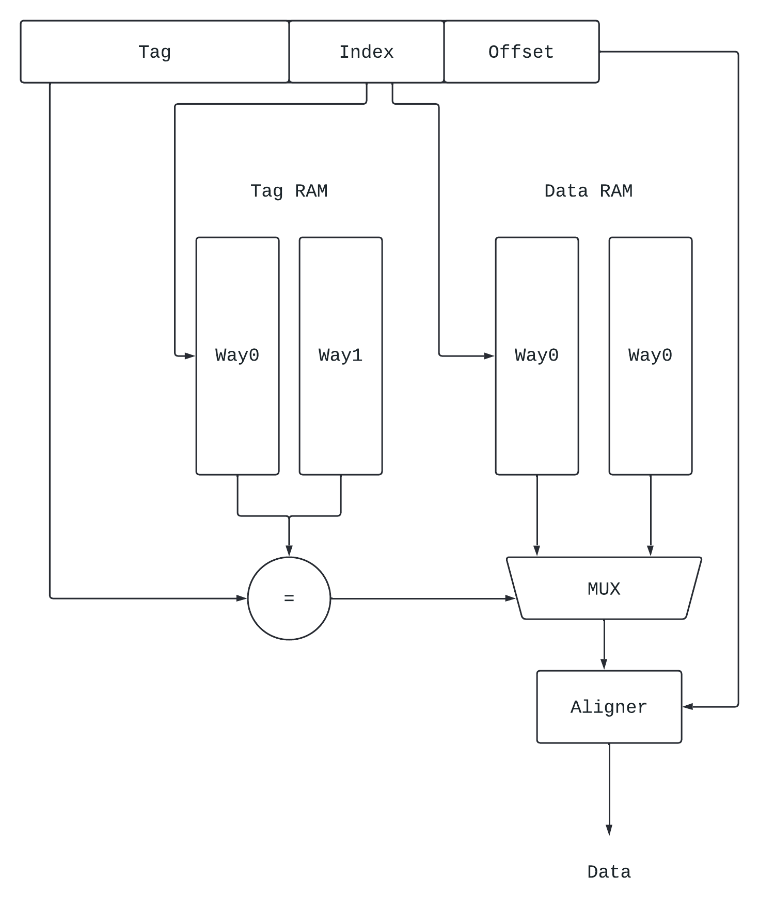
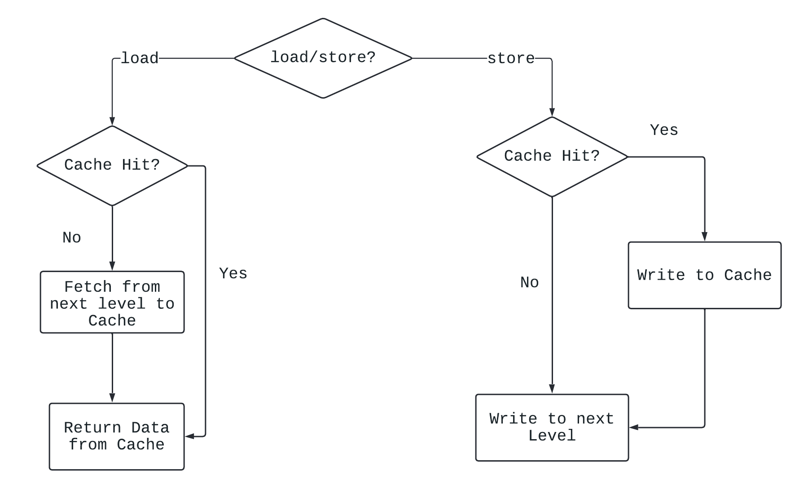
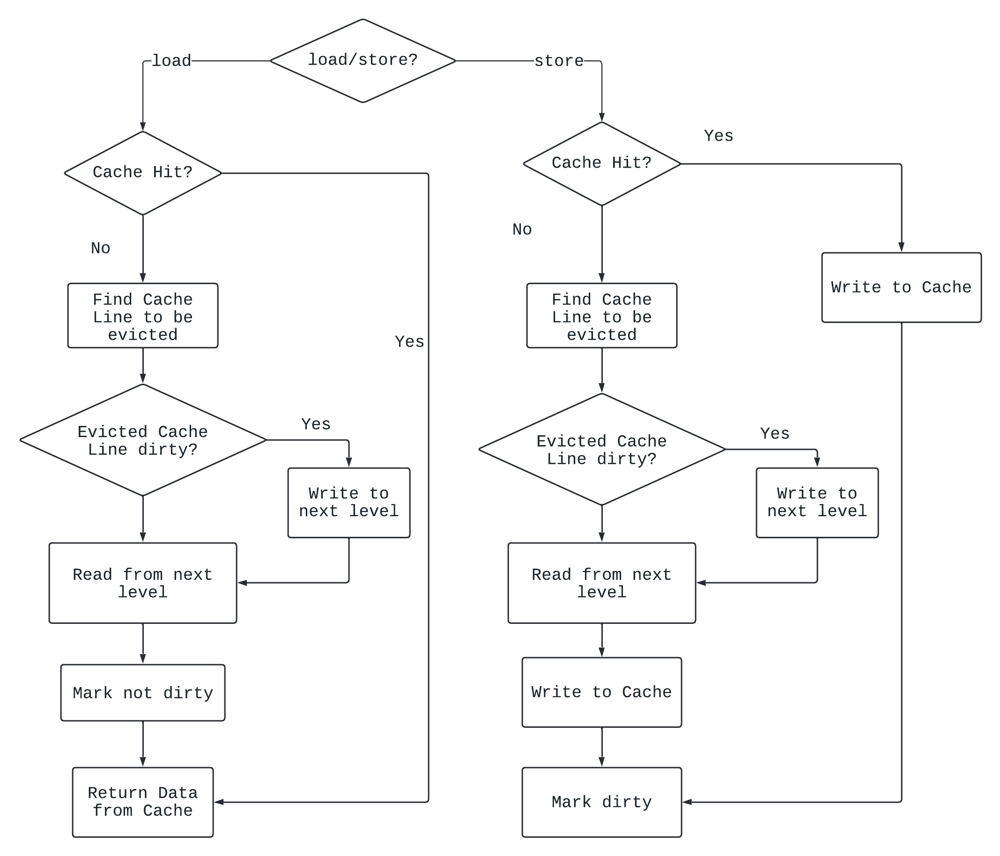

[TOC]


## Cache的架构


### N-way Set Associative Cache

可以把Cache当成一个二维对象数组:

* 一行叫做一个Set.
* 一列叫做一个Way.


其中的元素有如下属性:

  * 有效位(Valid bit): 这个元素是不是存储数据了.
  * Tag: 用来判断Cache是否命中.
  * Cache Data: 存储的数据.

这一个元素就是一个Cache Line.


> 那么如何根据一个地址(这里先当作物理地址)定位Cache中的元素呢?

* 第一步: 根据Cache Line数据部分的大小, 计算Offset所占用的位数.
  * 例如Cache Line数据部分的大小是$A$个字节, 那么Offset占用的位数就是$log_2(A)$.
* 第二步: 根据Set的个数, 得到地址中的Index位.
  * 假设Set的个数是$N$, 那么Index占用的位数就是$log_2(N)$, Index的具体值就是$addr[log_2(N) + log_2(A)-1, log_2(A)]$

* 第三步: 根据这个Index, 定位到Set.
* 第四步: 地址剩下的部分作为Tag, 和一个Set中每一个元素的Tag进行比较, 如果有一个元素相同, 那么就是命中了(Cache Hit).

这种Cache叫做N-way Set Associative Cache.


其中还有两种特殊的Cache:

* Direct Mapped Cache: Way的个数是1.
* Fully Associative Cache: Set的个数是1.


## 访问Cache的设计


### Tag与Data并行访问

工作原理如下:



其中Tag的读取和Data的读取是并行的, 根据Tag比较的结果, 用多路选择器选择对应的Data, 然后根据Offset定位最后的数据输出.

设计优点:

* 如果Cache Hit, 那么能够在一个周期内完成Cache的访问.

设计缺点:

* 时钟频率较低.
* 功耗较大, 因为有很多信号需要驱动.

如果需要提高时钟频率, 可以将Cache的访问设计成如下流水线:

* 第一阶段 (Address Calculation): 根据地址计算Tag, Index和Offset.
* 第二阶段 (Disambiguation): 检查load/store指令之间的dependency, 看是否能bypass.
* 第三阶段 (Cache Access): 并行读取tag和Data.
* 第四阶段 (Result Drive): 将读取的Data根据Offset进行调整后输出.


### Tag与Data串行访问

串行访问是指: Tag读取完之后, 再根据Tag比较的结果取读取Data.

设计优点:

* 无需多路选择器, 对于Data无需访问所有Way的数据, 并且使能信号的个数减少, 功耗降低.

设计缺点:

* 时钟频率更低.

串行访问也可以设计成流水线, 在上面并行访问的第三阶段拆成两个, 分别访问Tag和访问Data即可.


### 如何选择串行还是并行?

并行流水线的最突出的优点是: 访问Cache可以少一个时钟周期.

串行流水线最突出的优点是: 时钟频率更高, 功耗更低.


## 全相连Cache架构

* 全相连Cache一般使用CAM(Content Address Memory)进行实现. CAM可以理解成一个哈希表, 输入一个内容后, CAM会把这个内容和自己存储的所有表项进行比较, 如果匹配就会输出对应的值.

* 在全相连Cache中, 键就是Tag, 值就是Data.

* 由于全相连的Cache涉及很多的比较, 因此延时会更大, 所以全相连的Cache容量一般不会太大.

* TLB就是一种特殊的全相连Cache.


## 写入Cache的设计

首先, Cache分为I-Cache与D-Cache, 只有D-Cache涉及写入的问题.


### Write Through与Non-Write Allocate

假设有数据要写入Cache:

* 如果Cache Hit, 选择将写入数据同时写到D-Cache和下级存储器, 就是Write Through.
* 如果Cache Miss, 选择直接将数据写到下级存储器, 不用写到D-Cache, 就是Non-Write Allocate.

工作流程如下:



设计优点: 方便管理各级存储器的一致性.

设计缺点: 效率低, 访问下级存储器时间很长, 内存写指令一般比较多.


### Write Back与Write Allocate

假设有数据要写入Cache:

* 如果Cache Hit, 选择先将数据写入Cache, 然后标记这个Cache Line为dirty, 当这个Cache Line被替换时再写入下级存储器.
* 如果Cache Miss, 选择先将数据从下级存储器拿上来放到Cache中, 然后写入Cache, 然后标记Cache dirty, 就是Write Allocate.

流程如下:




### Cache写入的流水线

对于写Cache来说, Tag的读取和写Data的操作必须是串行的 (只有比较完Tag, 确认要写的地址真在Cache里, 才可以写Cache), 对于频率比较高的处理器很难在一个周期完成, 需要流水线.

通常流水线如下:

* 第一阶段 (Address Calculation): 根据地址计算Tag, Index和Offset.
* 第二阶段 (Disambiguation): 检查load/store指令之间的dependency, 看是否能把store的结果bypass给load.
* 第三阶段: 读取tag, 判断Cache Hit/Miss.
* 第四阶段: 根据Cache Hit/Miss的结果以及Cache写入策略决定下面的操作.


## Cache替换算法

当读取/写入D-Cache时, 如果发生了Cache Miss, 就需要从下级存储器把对应的Cache Line放到Set中, 但是如果Cache的某个Set已经放满了, 就需要从这个Set中找一个Cache Line驱逐出去, 选哪个Cache Line驱逐就是Cache的替换算法.


### LRU/Pseudo-LRU

LRU算法就是选择最近没被使用过的一个Cache Line进行驱逐. 但是, 当Cache中Way的个数增多后, 实现LRU的代价就比较高, 因此, 一般采用伪LRU进行实现.

假设一个Cache Set中有$N$个Way, 那么用$log_2(N)$个比特存储LRU信息.

* 第0个比特:
  * 如果是0, 表示Way $[0, \frac{N}{2}]$没被使用.
  * 如果是1, 表示Way $[\frac{N}{2}+1, N - 1]$没被使用.
* 第1个比特: 取决于第0个比特的情况
  * 如果是0, 并且第0个比特是0: 表示$[0, \frac{N}{4}]$没被使用.
  * 如果是0, 并且第0个比特是1: 表示$[\frac{N}{4}+1, \frac{N}{2}]$没被使用.
  * 如果是1, 并且第0个比特是0: 表示$[\frac{N}{2}+1, \frac{N-1}{2}]$没被使用.
  * 如果是1, 并且第0个比特是1: 表示$[\frac{N-1}{2}+1, N-1]$没被使用.

就这样, 看一个比特就能把没被使用的区间缩小一半, 最终就可以定位到一个Way的Cache Line.


### Random

Random算法是考虑到Cache替换算法如果过于复杂, 会影响CPU的频率.

一般在实现时, 采用时钟算法(Clock Algorithm):

* 维护一个计数器, 计数器宽度是$log_2(N)$, 其中$N$是Cache Way的个数.
* 每个时钟周期加1.
* 计数器的内容就是要替换的Cache Line所在Way的编号.


## Cache的多级结构


### L1 Cache

* L1 Cache采用SRAM实现, 最靠近处理器, 最快, 容量最小.

*  可以分为L1 I-Cache和L1 D-Cache.
* 一个CPU有一个L1 Cache, 多个CPU就有多个L1 Cache.
* 一般采用Write Through和Non-Write Allocate.


### L2 Cache

* L2 Cache比较大 (MB单位), 要求比较全, L2 Cache的容量要大于L1 I-Cache和L1 D-Cache的容量之和.
* 要尽可能提高L2 Cache的命中率, 防止访问DRAM.
* L2 Cache可以一个CPU一个, 也可以几个CPU共享, 取决于实现.
* 一般采用Write Back和Write Allocate.


### Inclusive/Exclusive

Inclusive和Exclusive描述了L1 Cache和L2 Cache之间的关系.


#### Inclusive

如果L1 Cache和L2 Cache之间是Inclusive的关系, 那么:

* 如果L1 Cache Hit, 那么数据直接给CPU, 和L2 Cache没关系.
* 如果L1 Cache Miss, L2 Cache Hit, 那么数据给CPU后, L2 Cache中的Cache Line要放到L1 Cache中, L2 Cache还保存这个Cache Line.
  * 如果Cache Line放到L1 Cache的过程中, 出现了replacement, 那么直接replace就行, 跟L2 Cache没关系.
* 如果L1 Cache和L2 Cache都Miss, 那么从DRAM中取出数据填到L1 Cache和L2 Cache中.
  * 如果Cache Line放到L2 Cache的过程中, 出现了replacement, 那么需要告诉L1 Cache, 让L1 Cache里对应的Cache Line置为无效.

优点: 方便管理缓存一致性.

缺点: 浪费硬件资源.

#### Exclusive

如果L1 Cache和L2 Cache之间是Exclusive的关系, 那么:

* 如果L1 Cache Hit, 那么数据直接给CPU, 和L2 Cache没关系.
* 如果L1 Cache Miss, L2 Cache Hit, 那么数据给CPU后, L2 Cache中的Cache Line要放到L1 Cache中, L2 Cache中去除这个Cache Line.
  * 如果Cache Line放到L1 Cache的过程中, 出现了replacement, 被驱逐的Cache Line转移到L2 Cache.
* 如果L1 Cache和L2 Cache都Miss, 那么从DRAM中取出数据只填到L1 Cache中.
  * 如果放到L1 Cache的过程中出现了replacement, 被驱逐的Cache Line要转移到L2 Cache中.

优点: 节省了硬件资源.

缺点: 缓存一致性算法复杂, 可能会影响CPU性能.

大多数处理器采用了Inclusive的策略.


## 优化Cache的一些小技巧


### Write Buffer

无论读写, 当D-Cache发生Cache Miss时, 需要有如下几个动作:

* 从D-Cache中驱逐一个Cache Line.
* 如果被驱逐的Cache Line是Dirty, 要写入下级存储器 (Write Back).
* 从下级存储器把Cache Line读出来, 并写入D-Cache.

此时对于下级存储器来说, 我既需要读取对应的Cache Line, 有需要把D-Cache中Dirty的Cache Line写入, 如果下级存储器只有一个读写端口, 那么这两个操作必须串行也就是说:

* 先把Dirty的Cache Line写入.
* 再把Cache Line取出来放到D Cache.

此时, 由于是串行, 再加上访问下级存储器延时较高, 性能就会受影响.

此时, 可以加一个Write Buffer, 把Dirty的Cache Line写入Write Buffer, 和把Cache Line取出来放到D Cache这两个过程可以并行.

对于Write Through的D Cache, 直接就先写入Write Buffer, 可以提高很多性能, 因此, 对于Write Through的Cache, Write Buffer是很必要的.

当读取Cache发生Cache Miss时, 注意还要检查Write Buffer.


### Filter Cache

Filter Cache的目的是减少偶然使用的数据, 提高Cache的利用率.

* 当发生Cache Miss时, 从下级存储器拿出来的Cache Line会先被放到Filter Cache中.
* 当再次使用Filter Cache中的数据时, 数据才会从Filter Cache搬到真正的Cache.


### Victim Cache

Victim Cache的目的是存储暂时被踢出Cache的Cache Line, 减少Conflict Miss.

* Victim Cache位于L1 Cache和L2 Cache之间.
* Victim Cache一般是一个Fully Associative Cache.
* 工作原理:
  * 当Cache Line从L1 Cache被踢出去时, 会放到Victim Cache中.
  * 如果L1 Cache Miss, 但是Victim Cache Hit, 那么Cache Line会从Victim Cache搬到L1 Cache.
  * 因此, L1 Cache和Victim Cache之间是Exclusive的关系.


### Prefetching


#### Hardware Prefetching

首先, 这种Hardware Prefetching一般针对I-Cache, 对于D-Cache来说, 由于数据访问的规律不好把握, 因此Prefetch的效果不是很好.

工作原理:

* 当I-Cache出现Cache Miss时, 会把对应的Cache Line放到I-Cache中.
* 除此之外, 还有一个Prefetch Buffer, 里面存储后面连续的几块数据.
* 当I-Cache出现Cache Miss, 但是在Prefetch Buffer中命中了:
  * 对应的Cache Line会从Prefetch Buffer中搬到L1 Cache, 
  * Prefetch Buffer会从下级存储器再读取一个Cache Line.

> 为什么需要Prefetch Buffer?

如果没有Prefetch Buffer, 那么分支预测如果错误, 会导致没用的数据读入I-Cache, 降低了I-Cache的利用率.

如果有了Prefetch Buffer, 那么直接把Prefetch Buffer中的数据置为无效即可.


#### Software Prefetching

Software Prefetching一般针对D-Cache, 在程序的编译阶段, 编译器会对程序进行静态分析, 来确定哪些数据需要进行预取, 编译器可以插入预取指令(prefetching instruction).

如果CPU支持虚拟内存, 那么预取指令可能会导致异常 (例如Page Fault), 此时有两种处理方法:

* 处理异常: 这种预取指令叫做Faulting Prefetch Instruction.
* 不处理异常: 这种预取指令叫做Nonfaulting Prefetch Instruction, 此时发生异常的预取指令就变成了空指令, 一般CPU都采用这种方式.


## 超标量CPU的取指令

假设一个超标量CPU一个周期内最多能够取出$n$条指令.

* Cache中Cache Line的大小至少要是$n$个字的长度.

但是, 由于分支和异常的存在, 取值的指令不一定是按照$n$个字对齐的, 在这种情况下, 一个周期取出的指令就会小于$n$.

因此, 为了使后续流水线充足, 需要让Cache Line的大小增大到$m, (m > n)$, 如果指令是按照m字对齐的, 那么一个周期就会取出$m$条指令.

* 多余的指令会被存储在Instruction Buffer中, Decoder会从Instruction Buffer中取出指令, 这样就能保证流水线充足.
* Instruction Buffer是一个多端口的FIFO.


## 验证Cache功效的一段代码

这里有两个函数`vecdot1`和`vecdot2`, 都是用来计算浮点数向量的点乘.

* `vecdot1`是按照矩阵的格式存储的, 计算的时候`a`的每一列和`b`的每一列相乘, 每次访问内存, 访问的地址都不连续.
* `vecdot2`计算`a`的每一行和`b`的每一行相乘.

```c
#include <time.h>
#include <stdio.h>
#include <stdlib.h>

#define ROW 10000
#define COL 10000

void vecdot1() {
    
    double (*a)[COL] = malloc(ROW * sizeof(double[COL]));
    double (*b)[COL] = malloc(ROW * sizeof(double[COL]));
    double (*c)[COL] = malloc(ROW * sizeof(double[COL]));

    // Init a and b
    srand(time(NULL));
    for (int i = 0; i < ROW; i ++) {
        for (int j = 0; j < COL; j ++) {
            a[i][j] = (double)rand() / RAND_MAX;
            b[i][j] = (double)rand() / RAND_MAX;
        }
    }

    clock_t start = clock();
    for (int j = 0; j < COL; j ++) {
        for (int i = 0; i < ROW; i ++) {
            c[i][j] = a[i][j] * b[i][j];
        }
    }
    clock_t end = clock();

    printf("Vecdot1 time: %lf secs\n", (double)(end - start) / CLOCKS_PER_SEC);

    free(a);
    free(b);
    free(c);
}

void vecdot2() {
    
    double (*a)[COL] = malloc(ROW * sizeof(double[COL]));
    double (*b)[COL] = malloc(ROW * sizeof(double[COL]));
    double (*c)[COL] = malloc(ROW * sizeof(double[COL]));

    // Init a and b
    srand(time(NULL));
    for (int i = 0; i < ROW; i ++) {
        for (int j = 0; j < COL; j ++) {
            a[i][j] = (double)rand() / RAND_MAX;
            b[i][j] = (double)rand() / RAND_MAX;
        }
    }

    clock_t start = clock();
    for (int i = 0; i < ROW; i ++) {
        for (int j = 0; j < COL; j ++) {
            c[i][j] = a[i][j] * b[i][j];
        }
    }
    clock_t end = clock();

    printf("Vecdot2 time: %lf secs\n", (double)(end - start) / CLOCKS_PER_SEC);

    free(a);
    free(b);
    free(c);
}
int main() {

    vecdot1();
    vecdot2();
    return 0;
}
```

输出的结果是:

```
Vecdot1 time: 1.456165 secs
Vecdot2 time: 0.233061 secs
```

