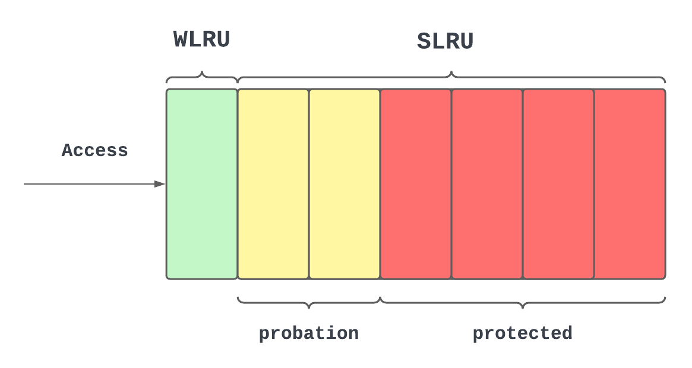
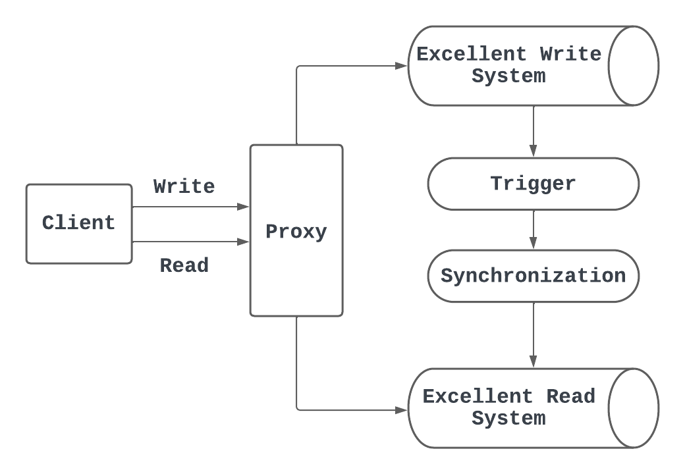

## 高并发架构的衡量指标

高并发系统需要同时满足三个需求:

* 高性能
* 高可用
* 高扩展性

> 高性能指标: 平均响应时间和`PCTn`

* 平均响应时间: 所有请求从发出到接收所需的时间的平均值.
* `PCTn`: 所有请求按照请求时间从小到大排序后, 第$n$个数, 含义是: 在所有请求中, 有$n / N$比例的请求响应时间在这个值内.
  * PCT指的是单词percentile.

* 一般平均响应时间小于200ms, `PCT99`小于1s的系统能够满足高并发需求.

> 高可用性指标: 系统正常工作时间 / 系统总运行时间.

* 一般要做到99.95%的可用性.

> 高扩展性指标: 吞吐量提升比例 / 节点数增加比例.

* 一般70%~80%可以满足高扩展性需求.

## 高并发读架构

### 数据库读写分离

* 为什么要读写分离:
  * 大部分互联网应用都是读多, 写少.
  * 读写分离有助于分担数据库访问压力, 减少请求的响应时间.
* 实现读写分离的方式:
  * 主从复制: Master作为写库, Slave作为读库, Master与Slave通过主从复制实现数据同步.
* 如何区分是读还是写?
  * 增加Proxy节点, Proxy节点判断读写进行转发.
  * 在数据库连接框架 (应用内部)里区分读写.

#### 主从延迟的解决方案

* 主从延迟: 在Slave获取Master的最新数据时, 会有一段延迟, 在这个延迟中, 会出现Master和Slave数据不一致的情景.
* 根据对主从延迟的容忍度的大小, 有三种方法.
  * 容忍度最低: 同步数据复制.
    * 只有所有Slave被同步成功之后, Master才会返回写入成功.
  * 容忍度较高: 强制读主.
    * 有些场景下, 主从延迟不可容忍(例如你刚发了个帖子, 肯定自己要读出来).
    * 但是有些场景下, 主从延迟能容忍 (别人读的时候可以等会).
    * 因此, 对于不可容忍的场景, 强制将读请求定向到Master上.

### 缓存

#### 缓存淘汰策略

* FIFO: 如果被频繁访问的数据较早地进入队列, 就会被淘汰.
* LFU:
  * 对于每个数据, 维护一个访问次数.
  * 优先淘汰访问次数最少的数据.
  * 适合短时间内频繁访问的热点数据.
  * 缺点: 最新进入缓存的数据淘汰率太高.
* LRU:
  * 维护一个双向链表和一个哈希表.
  * 如果一个数据被访问了, 就把它放到双向链表的最后面 (哈希表用来定位节点在双向链表中的位置).
  * 适合短时间内频繁访问的热点数据.
  * 缺点: 如果我有偶尔几个新进来的数据, 那么老的热点数据就很容易出局.

##### W-TinyLFU策略

* 全称是Window Tiny LFU, 是一种结合了LRU和LFU的缓存淘汰策略.
  * Redis和Java的本地缓存Caffeine Cache都使用了W-TinyLFU.

* W-TinyLFU的缓存结构:
  * WLRU (Window LRU): 占用极少缓存空间, 使用LRU.
  * SLRU: 包括probation段和protected段:
* W-TinyLFU的工作原理:
  * 首次访问的数据x, 存到WLRU.
  * WLRU如果满了, 使用LRU淘汰, 被淘汰的数据x放到probation.
  * probation如果满了, 先用LRU淘汰一个数据y, 然后对比x和y的访问频率:
    * 访问频率高的数据留在probation中, 访问频率低的淘汰.
  * probation中的数据如果再被访问, 就放到protected中.
  * protected如果满了, 通过LRU策略淘汰, 放回probation中.
* W-TinyLFU算法通过Count-Min Sketch算法计算每个数据被访问的频率.

##### Count-Min Sketch算法

* 如果想统计数据流中不同元素出现的次数, 那么可以用HashMap, 存储每个元素的计数.
* 但是, 如果只需要近似计数, 并且只需要比较两个元素之间频率的差别, 可以采用Count-Min Sketch, 花销更小.

工作原理:

* 选择M个哈希函数, 采用一个`M x N`的二维数组维护频率信息.
* 当进行一次访问, 将这次访问的数据作为输入, 计算所有哈希函数, 得到M个哈希函数值.
* 然后, 在二维数组的`(i, hash[i] % N)`的位置加1.
  * `i`是每一行, `i`属于`[0, M - 1]`.
  * `hash[i]`是第`i`个哈希函数计算的结果.

当查询某个数据的访问频率时:

* 进行同样的哈希计算, 将`M`个位置的数值读出, 选择最小值作为数据的访问频率.

> 如何减少二维数组的存储空间?

* 采用一个全局计数器, 二维数组的存储空间缩小.
* 当更新二维数组时, 全局计数加1.
* 全局计数达到某个阈值, 二维数组中的数值除以2, 全局计数器除以2.

#### 缓存击穿 (Cache Breakdown)

* 假设有一条数据并没有在缓存中, 那么对这一条数据的巨量高并发访问就会直接到数据库中, 占用巨量网络带宽资源, 这就是缓存击穿.
* 解决缓存击穿问题的核心: 将对同一个数据的高并发请求进行合并, 只有一个请求访问, 请求之间共享.
* 解决缓存击穿的实例: Go语言中的`SingleFlight`:
  * `SingleFlight`的作用: 当多个goroutine并发调用同一个函数的时候, 只允许一个goroutine去调用这个函数, 等到这个goroutine返回结果的时候, 再把结果同步到几个同时调用的goroutine上.

#### 缓存穿透 (Cache Penetration)

* 假设有大量恶意请求, 访问在数据库中根本不可能存在的数据, 那么请求全部就会访问到数据库中, 这就是缓存穿透问题.
* 解决缓存穿透问题需要用到「布隆过滤器」.
* 布隆过滤器由一个长度为n的`bitmap`和k个哈希函数组成, 它用来判断一个数据是否在一个集合内.
  * 某个数据被加入到布隆过滤器后时, 首先计算这几个数据经过k个哈希函数得到的值, 然后和n取模, 然后把这些值当作下标在对应位置上设置成1.
  * 当查询某个数据是否存在时, 同样计算哈希函数的值, 然后看`bitmap`:
    * 如果对应k个位置有一个是0, 那么数据一定不存在.
    * 如果所有位置都是1, 那么可能不存在, 因为有哈希碰撞, 可以调整n和k的值减少碰撞概率.

* 可以将数据库中的数据加入到布隆过滤器中, 如果缓存中不存在数据, 那么可以先通过布隆过滤器判断一次, 如果布隆过滤器说数据库不存在, 就拒绝访问数据库.

#### 缓存雪崩(Cache Avalanche)

* 在缓存中插入数据时, 一般会设定数据的过期时间, 设定过期时间有如下好处:
  * 防止大量不再被访问的数据占据缓存.
  * 在Redis缓存与数据库不一致的情况下, 过期时间可以兜底 (过了过期时间, 缓存就没有了, 就没有一致性问题).
* 如果同一时间内, 缓存中的数据大量过期, 那么请求都会访问到数据库, 这种情况就是“缓存雪崩”, 产生原因有:
  * Redis宕机, 需要保证Redis高可用.
  * 大量数据过期时间相同: 需要保证为缓存设定过期时间时, 让过期时间在小范围内随机分布.

#### 缓存与数据库一致性

保证缓存与数据库一致性有四种解决方案:

* 先更新缓存, 再更新数据库.
* 先更新数据库, 再更新缓存.
* 先删除缓存, 再更新数据库.
* 先更新数据库, 再删除缓存.

但是只有最后一种不会出现缓存与数据库不一致的情况.

> 先更新缓存, 再更新数据库:

在高并发写场景下, 会出现如下问题:

* 对同一个数据的两个不同修改请求, 更新缓存的顺序和更新数据库的顺序不一致, 导致缓存和数据库不一致.

> 先更新数据库, 再更新缓存:

* 和上面的问题一样.

> 先删除缓存, 再更新数据库:

* 在高并发读写场景下, 会出现如下问题:
* 对同一个数据, 有并发的一个读和一个写请求, 写请求删除缓存以后, 读请求到了数据库, 并且把原始数据放到缓存, 然后写请求再更新数据库, 这样数据就不一致.

> 最终方案: 先更新数据库, 再删除缓存:

* 如果删除缓存失败, 则有几种处理方案:
  * 如果对数据库和缓存一致性要求较高, 那么需要启用单独线程, 重复删除缓存, 直到成功.
    * 或者借助数据库的`binlog`, 将删除缓存任务放入消息队列中.
  * 如果要求不高, 可以只进行一次重试, 如果失败了, 就不再处理, 因为有缓存过期时间兜低, 只有缓存过期时间内不一致.

### CQRS思想

* 无论是数据库读写分离, 还是加缓存, 都体现了系统设计的一种思想, 就是CQRS (Command Query Responsibility Segregation).

* CQRS可以用如下图示说明:

  

* 首先, 读写分离, 写操作定位到写性能好的存储系统 , 读操作定位到读比较好的存储系统.
* 之后, 写操作需要通过「同步机制」保证两个存储系统的一致性.
* 同步时, 还可以异步触发一些计算任务, 让读库中缓存一些复杂计算的结果.
  * 例如数据库`join`查询, 可以专门找一个库存储复杂`join`查询的结果, 然后用CQRS同步.

## 高并发写架构

