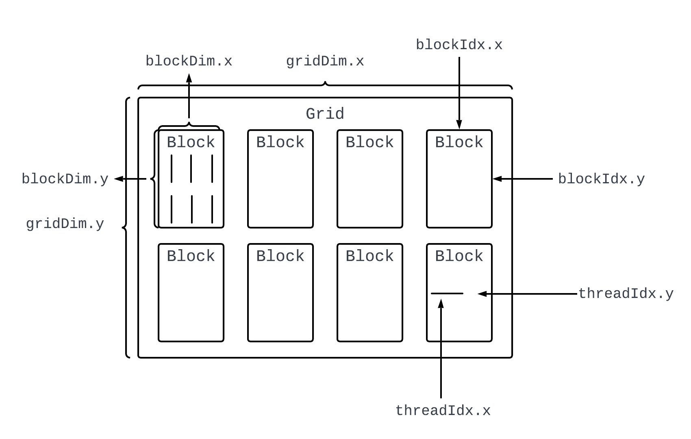

## 配环境

> CUDA ToolKit下载地址:  https://developer.nvidia.com/cuda-toolkit-archive

* CUDA有两个组成部分, 一个是显卡驱动, 一个是CUDA Toolkit.

  * 可以通过`nvidia-smi`查看驱动/CUDA Toolkit的版本.
  * CUDA Toolkit的版本也可以通过`nvcc --version`查看.
  
* 配置CUDA环境需要有以下几个步骤:

  * 第一, 查看GPU上的Software Specification, 找到GPU硬件对于显卡驱动的要求.
  * 第二, 配置好相应的显卡驱动之后, 直接下载对应的CUDA Toolkit即可, 每一个Toolkit对应一个最低版本的显卡驱动.

* 确定好CUDA Toolkit的版本之后, 需要安装cuda运行时和nvcc编译器:

  ```bash
  ```


## CUDA编程模型

* CUDA的编程模型叫SIMT (Single Instruction Multiple Threads).

  * 就是有多个线程执行同一条指令.

* CUDA按照Grid, Block, Thread来组织线程, 并且提供了一些内置变量:

  

> 如何获取线程的全局标识符`global_tid`.

* 如果`Grid`是一维, `Block`也是一维, 那么全局id可以是:

  ```cpp
  unsigned int global_tid = blockDim.x * blockIdx.x + threadIdx.x;
  ```

* 如果`Grid`是二维, `Block`是一维, 那么全局id可以是:

  ```cpp
  unsigned int global_tid = (gridDim.x * blockIdx.y + blockIdx.x) * blockDim.x + threadIdx.x;
  ```

  

## 函数修饰符

* 在CUDA的眼里, 有两种设备:
  * `host`: 就是CPU.
  * `device`: 就是GPU.
* 对于一个函数在哪种设备上运行, CUDA提供了内置的修饰符:
  * `__host__`: CPU上调用, CPU上执行.
  * `__device__`: GPU上调用, GPU上执行.
  * `__global__`: CPU上调用, GPU上执行.
  * 在NVIDIA GPU上执行的函数可以叫做CUDA Kernel.

例如:

```cpp
#include <stdio.h>

__global__ void hello_world() {
  	printf("hello world");
}
```

> `__host__`和`__device__`可以在一起使用, 表示函数既要在CPU上运行, 也要在GPU上运行:

```cpp
__host__ __device__ int run_cpu_gpu() {
  return 1;
}
```

* 如果一个函数不加修饰符, 默认是`__host__`.

* 调用在GPU上执行的函数: 其中`N`是Blocks的数量, `M`是threads的数量, 他们都是`unsigned int`类型.

  ```cpp
  hello_world<<<N, M>>>();
  ```


## main函数模板

* 一个CUDA的`main`函数模板组成部分如下:

  * Host申请内存, 并初始化.
  * Device申请显存.
  * Host把内存拷贝到显存.
  * 开始计时.
  * 启动CUDA Kernel.
  * 结束计时.
  * Device把显存拷贝回内存.
  * 检查Host计算结果和Device计算结果是否一致.
  * 释放Host内存和Device显存.

* 下面是一个完整的向量加法的实现过程:

  ```cpp
  #include <stdio.h>
  
  __global__ void vec_add_gpu(float *dx, float *dy, float *dz, int N) {
      unsigned int global_tid = blockDim.x * (blockIdx.x + blockIdx.y * gridDim.x) + threadIdx.x;
      if (global_tid < N) dz[global_tid] = dx[global_tid] + dy[global_tid];
  }
  
  void vec_add_cpu(float *hx, float *hy, float *hz, int N) {
      for (int i = 0; i < N; i ++)
          hz[i] = hx[i] + hy[i];
  }
  
  int main() {
  
      int N = 10000;
      int nbytes = N * sizeof(float);
      int block_size = 256;
      int s = ceil(sqrt(N + block_size - 1. / block_size));
      dim3 grid(s, s);
  
      /* Host分配内存并初始化 */
      float *hx;
      float *hy;
      float *hz;
      hx = (float *)malloc(nbytes);
      hy = (float *)malloc(nbytes);
      hz = (float *)malloc(nbytes);
      for (int i = 0; i < N; i ++) {
          hx[i] = 1;
          hy[i] = 1;
      }
  
      /* Device分配显存 */
      float *dx;
      float *dy;
      float *dz;
      cudaMalloc((void **)&dx, nbytes);
      cudaMalloc((void **)&dy, nbytes);
      cudaMalloc((void **)&dz, nbytes);
  
      /* Host把内存数据拷贝到显存 */
      cudaMemcpy(dx, hx, nbytes, cudaMemcpyHostToDevice);
      cudaMemcpy(dy, hy, nbytes, cudaMemcpyHostToDevice);
  
      /* 计时并运行CUDA Kernel */
      cudaEvent_t start, stop;
      cudaEventCreate(&start);
      cudaEventCreate(&stop);
      float miliseconds = 0;
      cudaEventRecord(start);
      vec_add_gpu<<<grid, block_size>>>(dx, dy, dz, N);
      cudaEventRecord(stop);
      cudaEventSynchronize(stop);
      cudaEventElapsedTime(&miliseconds, start, stop);
  
      /* 把显存结果拷贝到内存 */
      cudaMemcpy(hz, dz, nbytes, cudaMemcpyDeviceToHost);
      
      /* 验证CPU和GPU运算结果 */
      float *hz_cpu = (float *)malloc(nbytes);
      vec_add_cpu(hx, hy, hz_cpu, N);
      for (int i = 0; i < N; i ++)
          if (fabs(hz_cpu[i] - hz[i]) > 1e-6)
              printf("Result failed at index: %d\n", i);
      printf("Result Right with time %.2f milisecs.\n", miliseconds);
  
      /* 释放显存和内存 */
      cudaFree(dx); cudaFree(dy); cudaFree(dz);
      free(hx); free(hy); free(hz); free(hz_cpu);
      return 0;
  }
  ```

  

> 如何根据数据长度N分配Grid, Block, Thread的数量.

* 首先, `int block_size = 256;` 表示一个Block中有256个线程, 这个自己定义.
* 然后, `a / b`如果要向上取整, 可以用`(a + b - 1) / b`.
* `(N + block_size - 1) / block_size`就是求这些数据一共需要几个block.
* 然后`sqrt`一次, 就求出`x`方向和`y`方向一共要多少`block`.
* `dim3 grid(sx, sy);`就用来定义一个`grid`.


> 如何分配显存?

* 分配显存的函数是`cudaMalloc`, 函数签名如下:

  ```cpp
  cudaError_t cudaMalloc(void **devPtr, size_t size);
  ```

  * `size`是占用内存的字节数.

* 为什么要传递二级指针?

  * 用户在写CUDA代码时, 分配显存的流程是:

    ```cpp
    float *dx;
    cudaMalloc((void **)&dx, nbytes);
    ```

  * 但是实际上, 一开始定义`dx`的时候, 这个指针是在CPU上的, 如果需要把这个指针搬到GPU的显存上, 就需要传递二级指针, 然后更改一级指针的位置.


## 错误检测宏

* CUDA中, 一些runtime API (例如`cudaMalloc`, `cudaMemcpy`) 等, 都会返回`cudaError_t`表示操作是否成功.

* 在文件开头加上这个:

  ```cpp
  # define gpu_err_chk(ans) { gpu_assert((ans), __FILE__, __LINE__); }
  inline void gpu_assert(cudaError_t code, const char *file, int line, bool abort=true) {
    if (code != cudaSuccess) {
      fprintf(stderr, "GPU Assert: %s %s %d\n", cudaGetErrorString(code), file, line);
      if (abort) exit(code);
    }
  }
  ```

* 然后在必要时调用`gpu_assert`, 可以优雅地检查CUDA runtime API是否有错误.


## 向量化操作

* 向量化操作是指在SIMT的基础上, 对于每一个线程用SIMD的方式优化:

  * 例如向量加法, 可以让一个线程每次处理1个浮点数, 但是也可以让用SIMD实现一次处理4个浮点数加法.

* 例子如下 (一个线程操作4个浮点数):

  ```cpp
  #include <stdio.h>
  
  #define ARR_SIZE 10000
  #define NUM_THREAD 256
  
  __global__ void vec_add_gpu(float *dx, float *dy, float *dz) {
      unsigned int global_tid = blockIdx.x * blockDim.x + threadIdx.x;
      for (int i = global_tid; i < ARR_SIZE / 4; i += blockDim.x * gridDim.x) {
          float4 dx1 = reinterpret_cast<float4*>(dx)[i];
          float4 dy1 = reinterpret_cast<float4*>(dy)[i];
          float4 dz1;
          dz1.x = dx1.x + dy1.x;
          dz1.y = dx1.y + dy1.y;
          dz1.z = dx1.z + dy1.z;
          dz1.w = dx1.w + dy1.w;
          reinterpret_cast<float4*>(dz)[i] = dz1;
      }
  }
  
  void vec_add_cpu(float *hx, float *hy, float *hz) {
      for (int i = 0; i < ARR_SIZE; i ++)
          hz[i] = hx[i] + hy[i];
  }
  
  int main() {
  
      size_t nbytes = ARR_SIZE * sizeof(float);
      float *hx = (float *)malloc(nbytes);
      float *hy = (float *)malloc(nbytes);
      float *hz = (float *)malloc(nbytes);
      for (int i = 0; i < ARR_SIZE; i ++) {
          hx[i] = (float)1;
          hy[i] = (float)1;
      }
  
      float *dx, *dy, *dz;
      cudaMalloc((void **)&dx, nbytes);
      cudaMalloc((void **)&dy, nbytes);
      cudaMalloc((void **)&dz, nbytes);
  
      cudaMemcpy(dx, hx, nbytes, cudaMemcpyHostToDevice);
      cudaMemcpy(dy, hy, nbytes, cudaMemcpyHostToDevice);
  
      /* 4表示一个线程处理4个浮点数 */
      unsigned int block_num = ceil(ARR_SIZE / (NUM_THREAD * 4));
  
      float miliseconds = 0.0;
      cudaEvent_t start, stop;
      cudaEventCreate(&start);
      cudaEventCreate(&stop);
      cudaEventRecord(start);
      vec_add_gpu<<<block_num, NUM_THREAD>>>(dx, dy, dz);
      cudaEventRecord(stop);
      cudaEventSynchronize(stop);
      cudaEventElapsedTime(&miliseconds, start, stop);
  
      cudaMemcpy(hz, dz, nbytes, cudaMemcpyDeviceToHost);
  
      float *hz_cpu = (float *)malloc(ARR_SIZE * sizeof(float));
      vec_add_cpu(hx, hy, hz_cpu);
  
      for (int i = 0; i < ARR_SIZE; i ++) {
          if (fabs(hz_cpu[i] - hz[i]) > 1e-6) {
              printf("Test failed at index %d\n", i);
          }
      }
      printf("Test Result Correct!\n");
      printf("Elapsed Time: %.2f\nmilisecs\n", miliseconds);
      cudaFree(dx); cudaFree(dy); cudaFree(dz);
      free(hx); free(hy); free(hz); free(hz_cpu);
      return 0;
  }
  ```

* `float4`类型是CUDA内置的类型:

  ```cpp
  struct float4 {
      float x, y, z, w;
  };
  ```


> CUDA Kernel中使用`for`循环:

* 如果数据量很大的话, 很有可能显卡上的所有线程一次处理不了, 这个时候就需要循环做SIMT操作.

* CUDA Kernel中写法如下:

  ```cpp
  __global__ void cuda_kernel() {
    unsigned int global_tid = blockDim.x * blockIdx.x + threadIdx.x;
    for (int i = global_tid; i < N; i += blockDim.x * gridDim.x) {
      // Operation...
    }
  }
  ```

  * 其中这个`N`是每个线程处理数据的数据边界.


## 获取GPU spec

```cpp
#include <stdio.h>

void query_gpu() {
    /* Query Device Count */
    int device_cnt = 0;
    cudaGetDeviceCount(&device_cnt);
    if (device_cnt == 0)
        puts("No Available GPU that support CUDA...\n");
    else
        printf("There are %d CUDA Capable GPUs.\n", device_cnt);

    for (int dev = 0; dev < device_cnt; dev ++) {
        cudaSetDevice(dev);
        // 初始化当前device的属性获取对象
        cudaDeviceProp deviceProp;
        cudaGetDeviceProperties(&deviceProp, dev);
    
        printf("\nDevice %d: \"%s\"\n", dev, deviceProp.name);
        // 显存容量
        printf("  Total amount of global memory:                 %.0f MBytes "
                    "(%llu bytes)\n",
                    static_cast<float>(deviceProp.totalGlobalMem / 1048576.0f),
                    (unsigned long long)deviceProp.totalGlobalMem);
        // 时钟频率
        printf( "  GPU Max Clock rate:                            %.0f MHz (%0.2f "
            "GHz)\n",
            deviceProp.clockRate * 1e-3f, deviceProp.clockRate * 1e-6f);
        // L2 cache大小
        printf("  L2 Cache Size:                                 %d bytes\n",
                    deviceProp.l2CacheSize);
        // high-frequent used
        // 注释见每个printf内的字符串
        printf("  Total amount of shared memory per block:       %zu bytes\n",
                deviceProp.sharedMemPerBlock);
        printf("  Total shared memory per multiprocessor:        %zu bytes\n",
                deviceProp.sharedMemPerMultiprocessor);
        printf("  Total number of registers available per block: %d\n",
                deviceProp.regsPerBlock);
        printf("  Warp size:                                     %d\n",
                deviceProp.warpSize);
        printf("  Maximum number of threads per multiprocessor:  %d\n",
                deviceProp.maxThreadsPerMultiProcessor);
        printf("  Maximum number of threads per block:           %d\n",
                deviceProp.maxThreadsPerBlock);
        printf("  Max dimension size of a block size (x,y,z): (%d, %d, %d)\n",
                deviceProp.maxThreadsDim[0], deviceProp.maxThreadsDim[1],
                deviceProp.maxThreadsDim[2]);
        printf("  Max dimension size of a grid size    (x,y,z): (%d, %d, %d)\n",
                deviceProp.maxGridSize[0], deviceProp.maxGridSize[1],
                deviceProp.maxGridSize[2]);
        }
}
```


## GPU的硬件模型

* GPU上, 最小的调度单位叫做Warp, 一个Warp包括32个硬件线程.
  * 一个Warp中的所有的active threads都执行相同的指令, 但是处理不同的数据.

* GPU包括计算部分和存储部分:
  * 计算部分: 由多个Streaming Multiprocessor (SM)组成. 一个SM可以执行一个Warp.

* GPU中, 一次显存 (Global Memory) 访问叫做一个Memory Transaction.
  * Memory Transaction的起始地址是32的倍数.
  * 一次Memory Transaction可以访问32字节的数据 (可以变, 取决于计算设备).
* 一个Warp中的所有线程发起访存操作, GPU会把这些操作打包成尽可能少的Memory Transaction. 这叫做Memory coalescing.
  * 因此, 需要优化访存, 让访存操作占用的Memory Transaction更少, 提高显存带宽利用率.
  * 需要确保一个Warp中所有线程访问的显存地址连续的.

* GPU相对CPU的结构特点:
  * GPU核心数量多, 核心频率低, Cache大小更小, 控制单元更少.


## Warp Divergence

* GPU的编程模型是SIMT, 也就是说, 一个Warp中的32个线程是同时执行一条指令的.

  * 那么一个Warp中的32个线程就是共用一个PC和一个栈空间.

* 此时, 如果你的CUDA Kernel中, 出现了分支, 并且32个线程中, 有一部分走的是`if`分支, 另一部分走了`else`分支, 此时就不满足SIMT的要求.

* GPU的做法是:

  * 选择一个分支的线程先执行, 另一部分线程先被mask.
  * 执行完之后, 再执行被mask的线程.
  * 如果分支内的线程因为访存等原因被stall, 那么GPU会调度到其他的Warp执行.

  这种做法会带来性能上的下降, 叫做Warp Divergence.

* 在NVIDIA Volta架构之后, 引入了**independent thread scheduling**:
  * Warp内部的每一个线程都有独立的PC和栈空间.
  * 架构仍然遵循SIMT, 如果遇到了分支, 还是一个分支的线程先执行, 另一部分线程被mask.
  * 但不一样的是, 如果分支内的线程因为访存被stall, GPU可以调度Warp内部被mask的线程继续执行, 而不是跨Warp的调度.
    * 这样可以模拟TLP (Thread-Level Parallelism)的效果.


## Reduce算子优化

* Reduce算子是一类算子, 给定N个数值, 求最大/最小/求和/均值/异或等操作.

* 下面的例子是: 给定N个数, 求它们的总和.

### Reduce baseline

用一个Block和一个Thread, 然后在kernel中做累加.

```cpp
#include <stdio.h>

__global__ void reduce_baseline(int *dx, int *dz, const int N) {
    int sum = 0;
    for (int i = 0; i < N; i ++) sum += dx[i];
    *dz = sum;
}

int main() {

    const int N = 25600000;
    const int grid_size = 1;
    const int block_size = 1;

    int *hx = (int *)malloc(N * sizeof(int));
    for (int i = 0; i < N; i ++) hx[i] = 1;
    
    int *dx, *dz;
    cudaMalloc((void **)&dx, N * sizeof(int));
    cudaMalloc((void **)&dz, grid_size * sizeof(int));

    cudaMemcpy(dx, hx, N * sizeof(int), cudaMemcpyHostToDevice);
    
    dim3 grid(grid_size);
    dim3 block(block_size);

    float miliseconds = 0.0;
    cudaEvent_t start, stop;
    cudaEventCreate(&start);
    cudaEventCreate(&stop);
    cudaEventRecord(start);
    reduce_baseline<<<1, 1>>>(dx, dz, N);
    cudaEventRecord(stop);
    cudaEventSynchronize(stop);
    cudaEventElapsedTime(&miliseconds, start, stop);

    int *hz = (int *)malloc(grid_size * sizeof(int));
    cudaMemcpy(hz, dz, grid_size * sizeof(int), cudaMemcpyDeviceToHost);
    printf("Allocated %d Blocks, Data Counts are %d\n", grid_size, N);

    /* Check correctness */
    int ground_truth = N * 1;
    if (*hz != ground_truth) printf("Test Failed...");
    printf("Reduce Latency: %.2fms\n", miliseconds);

    cudaFree(dx); cudaFree(dz);
    free(hx); free(hz);
    return 0;
}
```


### Reduce v0

* 用256个Threads, 然后用`N / 256`个Blocks.
* 每一个Block分别进行`N / block_size`的累加运算.
* 每一个Block中, 首先将数据从显存中放到Block的Shared Memory中, 然后在Shared Memory里操作.

```cpp
// 0.53ms
#include <bits/stdc++.h>

template<int block_size>
__global__ void reduce_v0(float *dx, float *dz) {
    __shared__ float smem[block_size];
    int local_tid = threadIdx.x;
    /* 对全局数组的操作要用全局的id */
    int global_tid = blockIdx.x * block_size + threadIdx.x;
    smem[local_tid] = dx[global_tid];
    /* 保证每一个线程都写入shared memory后在进行操作 */
    __syncthreads();
    for (int index = 1; index < blockDim.x; index *= 2) {
        if (local_tid % (index * 2) == 0)
            smem[local_tid] += smem[local_tid + index];
        __syncthreads();
    }
    if (local_tid == 0) dz[blockIdx.x] = smem[0];
}

int main() {

    cudaDeviceProp device_prop;
    cudaGetDeviceProperties(&device_prop, 0);

    const int N = 25600000;
    const int block_size = 256;
    const int grid_size = std::min(
        (N + 256 - 1) / 256,
        device_prop.maxGridSize[0]
    );

    float *hx = (float *)malloc(N * sizeof(float));
    for (int i = 0; i < N; i ++) hx[i] = 1.0f;

    float *dx, *dz;
    cudaMalloc((void **)&dx, N * sizeof(float));
    cudaMalloc((void **)&dz, grid_size * sizeof(float));

    float ground_truth = N * 1.0f;

    cudaMemcpy(dx, hx, N * sizeof(float), cudaMemcpyHostToDevice);
    dim3 grid(grid_size);
    dim3 block(block_size);

    cudaEvent_t start, stop;
    float miliseconds = 0.0f;
    cudaEventCreate(&start);
    cudaEventCreate(&stop);
    cudaEventRecord(start);
    reduce_v0<block_size><<<grid, block>>>(dx, dz);
    cudaEventRecord(stop);
    cudaEventSynchronize(stop);
    cudaEventElapsedTime(&miliseconds, start, stop);

    float *hz = (float *)malloc(grid_size * sizeof(float));
    cudaMemcpy(hz, dz, grid_size * sizeof(float), cudaMemcpyDeviceToHost);

    float res = 0;
    for (int i = 0; i < grid_size; i ++) res += hz[i];

    std::cout << res << std::endl;
    if (fabs(res - ground_truth) > 1e-6) printf("Not Right\n");
    else printf("Right\n");

    printf("Latency: %.2fmilisecs\n", miliseconds);
    cudaFree(dx); cudaFree(dz);
    free(hx); free(hz);
    return 0;
}
```

