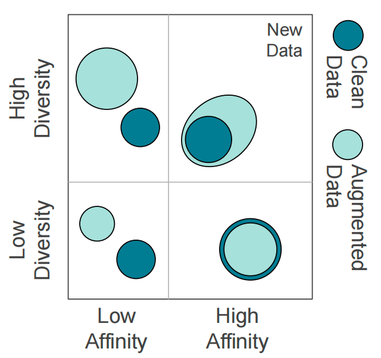

## 数据增广的本质

* 首先需要明确, 数据增广的最终目的, 是提高模型经过数据增广后的性能, 不能抛开模型.
* 假设模型在训练集上学习到的数据分布是$D_{t}$, 真实的数据分布是$D$:
  * 模型的性能取决于$|D_t\cap D|$.
* 数据增广的目标在于, 对$D_t$进行变换, 变成$D_t'$, 使得$|D_t' \cap D| > |D_t \cap D|$.
* 也就是说, 数据增广性能如何, 最终取决于$|D_t' \cap D|$的大小.

## 衡量数据增广的有效性

* Affinity: 用来衡量模型视角下, 经过数据增广后的分布, 和它之前学到的分布有多像, 也就是$\frac{|D_t' \cap D|}{|D_t'|}$.

  * 计算方法: 假设$m$表示没有经过数据增广的训练集训出来的模型, $A$表示模型在原始测试集上的准确率, $A'$表示模型在数据增广测试集上的准确率, 那么: $Affinity = A' - A$.

* Diversity: 用来衡量模型如果要学习数据增广后的分布, 需要付出多大的代价, 也就是$|D_t'|$.

  * 计算方法: 画出模型的准确率变化曲线或Loss变化曲线, 衡量两者差异.

* 可视化:

  
