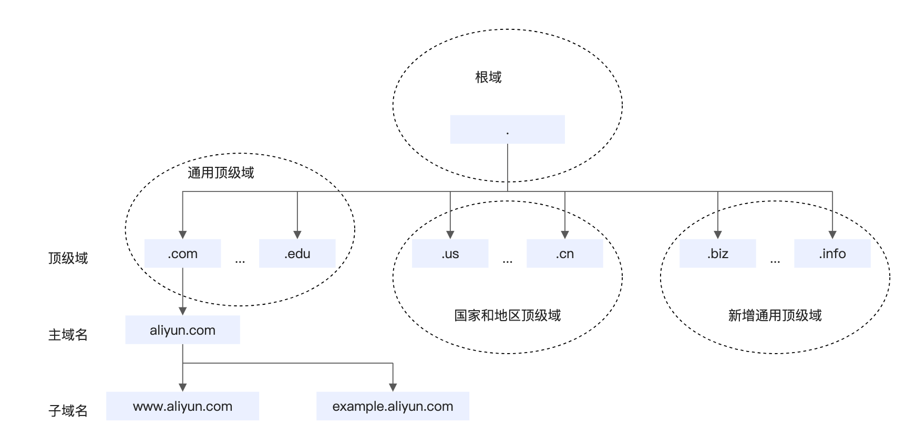

## 引言

客户端启动之后, 需要做的第一件事情, 就是连接到机房, 连接到机房用的技术就是DNS.

用户已知的是什么, 是URL:

一般URL中会采用域名, 而不是公网IP地址, DNS就负责将域名转换为公网的IP地址.

## DNS的基础知识

#### 域名结构

* `.com`是顶级域名.
* `aliyun.com`是二级域名.
* `www.aliyun.com`是三级域名.

#### 域名服务器

* 本地DNS缓存: 发起DNS查询时, 会首先查本地DNS缓存是否有记录.
  * 一般就是本地`/etc/hosts`目录中的若干个文件, 或者在浏览器中.

* 本地域名服务器: 本地域名服务器一般有两个作用
  * 第一: 作为DNS的查询代理, 客户端会发送递归查询的DNS请求到本地域名服务器, 然后全权由本地域名服务器进行查询.
  * 第二: 作为DNS的查询缓存, 缓存常见的查询结果, 提高响应速度.
  * 本地域名服务器一般由网络运营商提供, 个人设备连接网络时, 会自动在个人设备配置本地域名服务器的IP地址.
* 根域名服务器:
  * 根域名服务器负责查询`.`后面的部分对应的域名服务器的IP地址, 例如`.com`的, `.edu`的还是`.cn`的, 然后返回它们的IP地址.
  * 全球一共有13台根域名服务器.

* 顶级域名服务器:
  * 假设根域名服务器查出来你是在`.com`域下, 顶级域名服务器就负责查询`.com`域下面的所有二级域名, 例如`apple.com`, 或者`google.com`.
* 权威域名服务器:
  * 一般解析到`apple.com`这种后, 就基本定位到某家公司了, 这个时候有两种选择:
    * 公司自己建立DNS服务器, 负责解析`apple.com`下面所有的域名, 这就是某家公司的权威域名服务器.
      * 一般大公司会自己建立权威域名服务器.
    * 还是借用运营商的DNS服务器, 这就不是权威域名服务器.

#### DNS解析过程

* 主机中的某个进程, 首先看本地DNS缓存有没有.
* 然后, 向本地域名服务器进行递归查询.
* 本地域名服务器进行迭代查询.
* 每一层的服务器都会首先查询自己的DNS缓存.

## DNS问题

* 个人设备对本地域名服务器是递归查询, 可能会带来更高的访问延迟.
* 本地域名服务器分运营商, 不同运营商的实现策略不同:
  * 一般来说, 公司服务器会有定位客户端地理位置的需求, 然后提供最近的服务节点加速访问.
  * 但是如果使用运营商的本地域名服务器, 公司服务器只能定位运营商的地理位置, 不准确.
  * 甚至有些运营商会将请求转发, 结果更加不准.
* DNS劫持攻击:
  * 运营商可能追求广告收入, 将DNS进行劫持, 然后附加多余的广告.
  * 黑客做DNS劫持, 可能将用户访问定位到有害的网站.
  * 因为这个原因, 有些公司提供了干净免费的DNS服务器, 例如Google的8.8.8.8等.

## HTTP DNS

* HTTP DNS的原理:
  * 首先, 在客户端配置HTTP DNS的IP地址 (这个IP地址就是公网地址, 不用域名).
  * 客户端将DNS查询封装成一个HTTP请求, 发到HTTP DNS服务器, HTTP DNS作为代理帮忙查询.
    * HTTP DNS一般是一家公司提供的, 比如解析`www.baidu.com`, 直接发给HTTP DNS服务器, 这个服务器一般会直接转发到权威域名服务器, 查询链路缩短, 效率提高.
  * 查询结果通过HTTP响应返回给客户端.

* HTTP DNS的访问速度:
  * HTTP DNS可以采用BGP协议, 不同地理位置的用户访问一个IP地址都可以做到就近访问.
* HTTP DNS的高可用:
  * 在多个数据中心部署多个HTTP DNS服务节点.
* HTTP的优点:
  * 查询链路缩短, 速度提高.
  * 防止运营商域名劫持.
  * 可以准确获取客户端IP地址.
  * 服务器IP地址改变的时候, 只需要在HTTP DNS上改变一下就好, 不受传统DNS查询多重缓存的影响, 域名更新快速覆盖到客户端,

## 客户端连接机房架构

* 客户端连接机房架构可以采用HTTP DNS和传统DNS结合的架构:
  * 客户端首先使用HTTP DNS进行域名解析.
  * 如果HTTP DNS出现错误, 降级为向本地域名服务器进行解析.
  * 如果仍然失败, 客户端中需要存储公司核心业务的IP地址, 这个地址是写死的, 可以保证用户能正常访问核心业务.
* HTTP DNS的设置:
  * 使用HTTPS.
  * IP地址高可用: HTTP DNS可以将多个最优IP地址进行下发, 用户按照顺序测试连通性, 如果连通性不好再选择下一个.
  * 批量拉取映射: 客户端冷启动/网络切换(WiFi切换到蜂窝网络)时, 自动从HTTP DNS服务器拉取映射并缓存.
