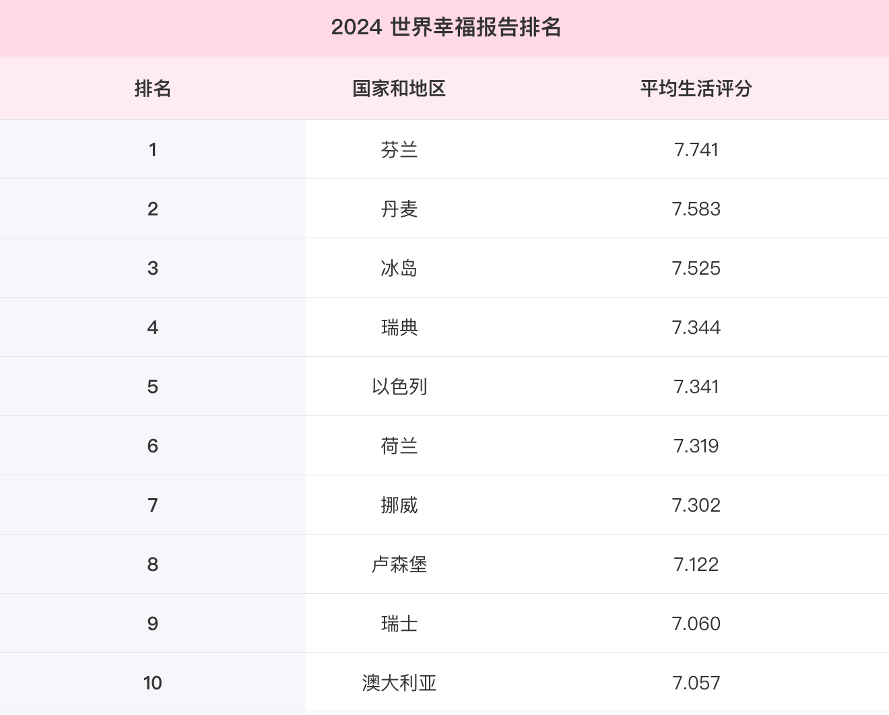

## 对资源的理解

* **全球足迹网络(Global Footprint Network)**: 

  * 一个智库组织 (think tank), 非盈利组织, 可以免税.
  * GFN负责对可持续发展进行探讨.
  * 提出如果全人类都要达到美国这种发展程度, 需要5个地球, 按照中国的标准, 需要1个地球.

* 因此, 制约全人类达到现代化的**主要约束**, 就是地球的资源不足.

* 世界上的各种冲突, 往往有两个目的:

  * 控制资源.
  * 控制资源的运输通道.

  冲突主要集中在资源的密集地区.

> 伊拉克战争的起因

* 伊拉克是除了沙特阿拉伯, 俄罗斯之外, 石油出口最多的国家, 每年有几百亿美元的石油出口.
* 伊拉克在石油出口结算中, 使用欧元作为结算货币, 这会有如下影响:
  * 美元需求减少, 可能贬值.
  * 如果贬值, 那么美国国债公信力下降, 必须提高利息才能让别人买, 融资成本上升.
  * 如果贬值, 如果金融市场波动, 美国更容易收到影响.
  * 如果贬值, 美国进口成本上升, 对于一些高科技行业来说, 成本就会上升.

* 因此, 伊拉克对美国构成了很大的威胁.

* **经济指标**高, 往往意味着对资源的浪费, 因此, 不能只观察经济指标, 还要注意其他指标:

  * 可持续发展程度 (经济指标高往往意味着对资源的过度消耗).

  * 幸福指数 (发达国家往往具有病态).

    

* 核心来说, 人类具有**贪婪**的这种特性, 而且其中的制度, 思想体系在有意无意地纵容这种贪婪.