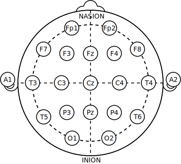
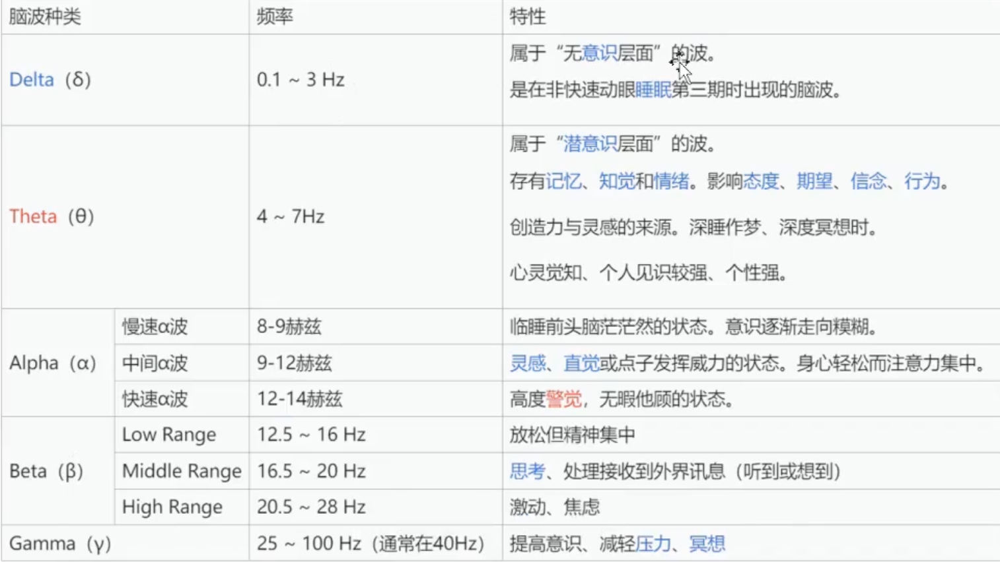

## International 10-20 system

* Nasion: 鼻根
* Inion: 枕骨隆突
* Fp: pre-frontal lobe, 前额叶
* F: frontal lobe, 额叶
* T: temporal lobe, 颞叶, 头颅两侧靠近耳朵的地方
* P: parietal lobe, 顶叶
* O: occipital lobe, 枕叶
* C: center
* Fz, Cz, Pz: 用于参考.
* 奇数编号在左, 偶数编号在右.

## 脑电干湿电极

[你知道该如何选择脑电采集电极吗?](https://zhuanlan.zhihu.com/p/540101050)

## EEG五种频段

* EEG中, 运动想象对Alpha波和Beta波的影响最大, 当人在脑中想象肢体运动的时候, Alpha波和Beta波出现明显的振幅衰减.
* 如果是运动想象(motor imagery), 一般想象左手, 右手或者脚的运动, 左手MI变化来自于C3, 右手来自于C4, 脚来自于Cz.

