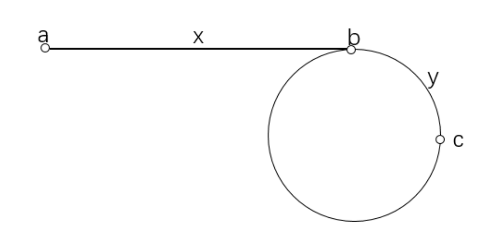

## 手写单链表

> https://www.acwing.com/problem/content/description/828/

```cpp
#include <iostream>

using namespace std;

const int N = 100010;

int m;
int h, e[N], ne[N], idx;

void init()
{
    h = -1;
}

/* 头插法 */
void insert(int x)
{
    e[idx] = x;
    ne[idx] = h;
    h = idx ++;
}

/* 在下标idx为k的节点后面插入x */
void insert(int k, int x)
{
    e[idx] = x;
    ne[idx] = ne[k];
    ne[k] = idx ++;
}

/* 删除下标idx为k的节点后面插入的数 */
void remove(int k)
{
    ne[k] = ne[ne[k]];
}

int main()
{
    scanf("%d", &m);
    /* 不要忘了init */
    init();
    while (m --)
    {
        char op[2];
        scanf("%s", op);
        
        if (*op == 'H')
        {
            int x;
            scanf("%d", &x);
            insert(x);
        }
        else if (*op == 'D')
        {
            int k;
            scanf("%d", &k);
            /* k = 0表示删除头节点 */
            if (!k) h = ne[h];
            /* 第k个插入的数下标映射为k-1 */
            else remove(k - 1);
        }
        else
        {
            int k, x;
            scanf("%d%d", &k, &x);
            insert(k - 1, x);
        }
    }
    
    for (int i = h; i != -1; i = ne[i]) printf("%d ", e[i]);
    return 0;
}
```


## 手写双链表

> https://www.acwing.com/problem/content/description/829/

```cpp
#include <iostream>

using namespace std;

const int N = 100010;

int m;
int l[N], r[N], e[N], idx;

void init()
{
    l[1] = 0;
    r[0] = 1;
    idx = 2;
}

void insert(int k, int x)
{
    e[idx] = x;
    /* 新插入节点右边指向k右边 */
    r[idx] = r[k];
    /* 新插入节点左边指向k */
    l[idx] = k;
    /* 新插入节点右边的节点, 它的左边指向要插入的idx */
    l[r[k]] = idx;
    /* 下标为k的节点, 它的右边指向要插入的idx */
    r[k] = idx ++;
}

void remove(int k)
{
    l[r[k]] = l[k];
    r[l[k]] = r[k];
}

int main()
{
    init();
    
    cin >> m;
    while (m --)
    {
        string op;
        int k, x;
        
        cin >> op;
        if (op == "L")
        {
            cin >> x;
            insert(0, x);
        }
        else if (op == "R")
        {
            cin >> x;
            insert(l[1], x);
        }
        else if (op == "D")
        {
            cin >> k;
            remove(k + 1);
        }
        else if (op == "IL")
        {
            cin >> k >> x;
            insert(l[k + 1], x);
        }
        else
        {
            cin >> k >> x;
            insert(k + 1, x);
        }
    }
    
    for (int i = r[0]; i != 1; i = r[i]) printf("%d ", e[i]);
    
    return 0;
}
```


## 反转链表

> https://www.acwing.com/problem/content/description/33/

### 递归版本

```cpp
class Solution {
public:
    ListNode* reverseList(ListNode* head) {
        if (!head || !head->next) return head;
        auto tail = reverseList(head->next);
        head->next->next = head;
        head->next = NULL;
        return tail;
    }
};
```


### 迭代版本

```cpp
class Solution {
public:
    ListNode* reverseList(ListNode* head) {
        ListNode * p = NULL;
        ListNode * q = head;
        while (q) {
            auto r = q->next;
            q->next = p;
            p = q, q = r;
        }
        return p;
    }
};
```

迭代写法的使用范围更广, 可以在一个区间范围内翻转链表

> https://leetcode.cn/problems/reverse-linked-list-ii/

```cpp
class Solution {
public:
    ListNode* reverseBetween(ListNode* head, int left, int right) {
        
        auto dummy = new ListNode(-1);
        dummy->next = head;

        auto p = dummy;
        for (int i = 0; i < left - 1; i ++) p = p->next;

        auto q = p->next;
        auto r = q->next;

        for (int i = 0; i < right - left; i ++)
        {
            auto x = r->next;
            r->next = q;
            q = r, r = x;
        }

        p->next->next = r;
        p->next = q;

        return dummy->next;
    }
};
```


## O(1)时间删除单链表节点

> https://www.acwing.com/problem/content/description/85/

```cpp
class Solution {
public:
    void deleteNode(ListNode* node) {
        node->val = node->next->val;
        node->next = node->next->next;
    }
};
```


## 删除链表的倒数第n个节点

> https://leetcode.cn/problems/remove-nth-node-from-end-of-list/
>
> https://www.acwing.com/problem/content/32/

假设链表总共的节点数目是$N$, 那么倒数第$n$个节点就是正数第$N - n + 1$个节点, 需要从虚拟头节点开始跳$N - n$次才能跳到要删除节点的上一个节点.

``` cpp
class Solution {
public:
    ListNode* removeNthFromEnd(ListNode* head, int n) {
            auto dummy = new ListNode(-1);
            dummy->next = head;

            int N = 0;
            for (auto p = dummy->next; p ; p = p->next) N++;

            auto p = dummy;
            for (int i = 0; i < N - n; i ++) p = p->next;

            p->next = p->next->next;

            return dummy->next;
    }
};
```


## 合并两个排序链表

> https://leetcode.cn/problems/merge-two-sorted-lists/

```cpp
class Solution {
public:
    ListNode* mergeTwoLists(ListNode* l1, ListNode* l2) {
        
        auto dummy = new ListNode(-1), cur = dummy;

        while (l1 && l2) {
            if (l1->val < l2->val) {
                cur = cur->next = new ListNode(l1->val);
                l1 = l1->next;
            }
            else {
                cur = cur->next = new ListNode(l2->val);
                l2 = l2->next;
            }
        }

        if (l1) cur->next = l1;
        if (l2) cur->next = l2;

        return dummy->next;
    }
};
```


## 合并K个有序链表

> https://leetcode.cn/problems/merge-k-sorted-lists/

思路比较简单, 从0到末尾遍历这k个链表的相同位置, 每一次都把它们加入到小根堆中, 然后合并即可, 时间复杂度是$O(nlogk)$, 其中$n$是每个链表长度.

```cpp
class Solution {
public:

    struct Cmp {
        bool operator() (ListNode *a, ListNode *b) {
            return a->val > b->val;
        }
    };
    ListNode* mergeKLists(vector<ListNode*>& lists) {

        ListNode* dummy = new ListNode(-1);
        ListNode* cur = dummy;

        priority_queue<ListNode*, vector<ListNode*>, Cmp> heap;

        /* 注意判断为空的情况 */
        for (auto l : lists) if (l) heap.push(l);

        while (heap.size()) {
            auto t = heap.top();
            heap.pop();
            cur = cur->next = new ListNode(t->val);

            if (t->next) heap.push(t->next);
        }

        return dummy->next;
    }
};
```


## 两两交换链表中的节点

> https://leetcode.cn/problems/swap-nodes-in-pairs/

* 对于链表节点`p->a->b`, 只需要做如下几件事情:
  * `p->next = b`
  * `a->next = b->next`
  * `b->next = a`, 即可把`a->b`这两个节点反向, 前面的`p`一开始可以指向虚拟头节点.
* 然后让`p`指向`a`即可.

```cpp
class Solution {
public:
    ListNode* swapPairs(ListNode* head) {
        
        auto dummy = new ListNode(-1);
        dummy->next = head;

        for (auto p = dummy; p->next && p->next->next;) {
            auto a = p->next, b = a->next;
            p->next = b;
            a->next = b->next;
            b->next = a;
            p = a;
        }

        return dummy->next;
    }
};
```


## K个一组反转链表

> https://leetcode.cn/problems/reverse-nodes-in-k-group/

假设`p`一开始是虚拟头节点.

* 第一步. 我需要确定`p`后面有没有`k`个节点, 用一个指针`q`从`p`开始向后跳`k`次, 如果有`k`个节点的话, `q`就应该在第`k`个节点上.
* 之后, 我需要把这`k`个节点内部的边全部反向, 参考反转链表的迭代写法.
* 然后, 我需要让`p->next`指向第`k`个节点, 然后让这`k`个节点中, 第一个节点的`next`指向第`k`个节点.

```cpp
class Solution {
public:
    ListNode* reverseKGroup(ListNode* head, int k) {
            
            auto dummy = new ListNode(-1);
            dummy->next = head;

            for (auto p = dummy;;) {
                auto q = p;
                for (int i = 0; i < k && q; i ++) {
                    q = q->next;
                }
                if (!q) break;
                auto a = p->next, b = a->next;
                for (int i = 0; i < k - 1; i ++) {
                    auto c = b->next;
                    b->next = a;
                    a = b, b = c;
                }
                auto c = p->next;
                p->next = a;
                c->next = b;

                p = c;
            }

            return dummy->next;
    }
};
```

## 用链表模拟两数相加

> https://leetcode.cn/problems/add-two-numbers/

直接背模板.

```cpp
/**
 * Definition for singly-linked list.
 * struct ListNode {
 *     int val;
 *     ListNode *next;
 *     ListNode() : val(0), next(nullptr) {}
 *     ListNode(int x) : val(x), next(nullptr) {}
 *     ListNode(int x, ListNode *next) : val(x), next(next) {}
 * };
 */
class Solution {
public:
    ListNode* addTwoNumbers(ListNode* l1, ListNode* l2) {

        auto dummy = new ListNode(-1), cur = dummy;
        int t = 0;

        while (l1 || l2 || t) {
            if (l1) t += l1->val, l1 = l1->next;
            if (l2) t += l2->val, l2 = l2->next;

            cur = cur->next = new ListNode(t % 10);
            t /= 10;
        }

        return dummy->next;
    }
};
```


## 判断链表是否有环/找到环的入口

> https://www.acwing.com/problem/content/description/86/

用两个指针, 快指针一次走两步, 慢指针一次走一步, 如果快慢指针可以重合, 证明链表有环.

当快慢指针重合之后, 把慢指针放到链表头节点, 然后快慢指针同时前进一步, 两个指针相遇后, 相遇的地方就是链表环的入口.

证明:

假设链表起始位置是$a$, 环的入口节点是$b$, 两个指针第一次相遇的位置是$c$, $z$表示从$c$顺时针走到$b$的距离.

第一次在$c$相遇时, 慢指针一共走了$x + y$, 快指针一共走了$x + n(y + z) + y$, 其中$n$是圈数.

那么有: $2(x + y) = x + n(y + z) + y$, 可以得到$x = n(y + z) - y$

那么慢指针再走$x$步, 就相当于快指针从$c$点在环上走了$n(y + z) - y$步, 就到达了$b$, 证明完成.



```cpp
class Solution {
public:
    ListNode *entryNodeOfLoop(ListNode *head) {
        
        if (!head || !head->next) return NULL;
        
        auto p = head, q = head;
        
        while (q && q->next)
        {
            p = p->next;
            q = q->next->next;
            if (p == q) break;
        }
        
        if (!q || !q->next) return NULL;
        
        p = head;
        
        while (p != q)
        {
            p = p->next;
            q = q->next;
        }
        return p;
    }
};
```


## 删除链表中的重复节点

> https://www.acwing.com/problem/content/27/

和双指针算法差不多.

```cpp
class Solution {
public:
    ListNode* deleteDuplication(ListNode* head) {
        
        auto dummy = new ListNode(-1);
        dummy->next = head;
        
        auto p = dummy;
        
        while (p->next)
        {
            auto q = p->next;
            while (q && q->val == p->next->val) q = q->next;
            
            if (p->next->next == q) p = p->next;
            else p->next = q;
        }
        
        return dummy->next;
    }
};
```

