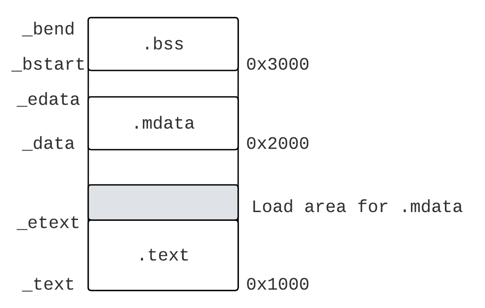
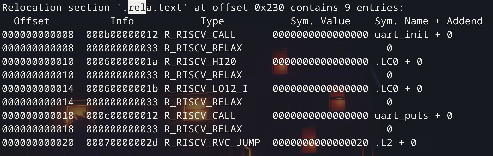

## 数据类型

### 整数

* `size_t`: 和体系结构相关的**无符号整数**.
  * 在32位系统上, 可能是32位, 也可能是64位.
  * 在64位系统上, 一定是64位.
* `ssize_t`: 是`size_t`的有符号整数版本.

## 引用

* 引用就相当于对原始变量所有权的租借, 对引用的操作等价于对原变量的操作:

  ```cpp
  int num = 0;
  // 取num引用
  int &b = num;
  
  Student s(string("haha"), 1);
  Student &stu = s;
  // 操作引用操作变量和操作原变量接口相同
  cout << s.print() << endl;
  ```

  * <font color=red>**引用变量必须初始化 ! 编译器会在编译层面保证这一点.**</font>


### 不可变引用

* 借助`const`可以实现不可变引用.

* 不可变引用: `const Type &`.

  ```cpp
  // 获取变量不可变引用
  int num = 0;
  const int &b = num;
  ```

* 可变引用: `Type &`.


### 常见问题

> 引用和指针的区别?

* 指针, 本质上是一种所有权的量化, 它代表所有权本身, 这个所有权会由一个变量承载.
* 引用, 本质上是对所有权的租借, 它可以让多个变量承载同一个所有权.

## 函数

### 函数重载

* 注意: 重载是C++的特性, 而不是C语言的特性.

* 函数重载:
  * 可以同时定义多个重名函数, 这些函数参数, 返回值类型可以不同.
  * 具体执行哪个函数是在编译时完成.

## 动态内存管理

### `new`和`delete`

* `delete`:
  * 如果`new`的时候是`Student *a = new Student();`, 那么就用`delete a;`
  * 如果`new`的时候是`Student *stus = new Student()[];`, 那么就用`delete [] a;`

### 常见问题

> `malloc`和`new`的区别?

* `malloc`是C++标准库函数, `new`是C++的一个运算符.
* `malloc`需要手动计算内存大小, `new`可以自动计算.

* `malloc`返回`void *`类型的指针, 而`new`返回具体类型的指针.

* `malloc`不是类型安全的, 而`new`是类型安全的.
  * 假设你申请了一大块内存, 但是赋给了一个小变量(例如`int`类型), `new`会在编译时期报错, 而`malloc`不会.
* `new`由 `malloc`, 指针转换, 构造函数三部分组成.


> `malloc`申请的内存可以用`delete`释放吗? `new`申请的内存可以用`free`释放吗?

* 都不可以, 核心在于:
  * `malloc`不会调用构造函数, 而`new`会调用构造函数.
    * 如果类的构造函数中有动态申请内存, 那么就会出现问题.
  * `free`不会调用析构函数, 而`delete`会调用析构函数.
    * 如果类的析构函数中有释放成员变量占用的内存, 那么就会出现内存泄漏.


## 内存分区

* 由低地址向高地址为:
  * `.text`: 代码段.
  * `.data`: 初始化的全局变量与静态变量.
  * `.bss`: 全称为Block Started by Symbol, 包括未初始化的全局变量和静态变量.
  * `heap`: 由低向高延伸, 存储动态申请的内存.
  * `stack`: 由高向低延伸, 存储函数参数, 局部变量等栈帧信息. 

> 栈和堆的区别 (几个重要的点)?

* 栈是固定大小, 连续的内存区域 (不会产生碎片), 在CPU级别会提供栈的操作指令及相关寄存器. 栈由编译器进行管理.
* 堆是不固定大小, 不连续的内存区域 (OS链表管理, 会产生碎片), 堆的操作需要C++标准库提供, 堆由程序员管理.


## 链接与多文件编程

### C语言程序是如何执行的

* 第一步: 预处理, 对C语言各种预处理命令进行处理

  ```bash
  gcc -E test.c -o test.i
  ```

* 第二步: 编译, 将C语言程序转换为对应的汇编语言

  ```bash
  gcc -S test.i -o test.s
  ```

* 第三步: 汇编, 将汇编语言转换成可重定位目标文件, 可重定位目标文件有很多段

  ```bash
  as test.s -o test.o
  ```

* 第四步: 链接, 链接有三个任务:

  * 符号解析, 把每个符号的引用和定义关联起来.
  * 合并段: 把可重定位目标文件的段合并
  * 重定位: 可重定位目标文件的每个符号的起始地址都从`0x0`开始, 但是生成的可执行目标文件需要按照OS的要求把每个段摆放到对应的地址.
  
```bash
# -lc是链接到libc.a
ld -o test test.o -lc
```


### 链接器的符号解析

在C语言中, 符号分为三种类型:

* 全局符号: 包括没有`static`的函数名, 以及没有`static`的全局变量.
* 外部符号: 用`extern`引用的外部的函数名/变量.
* 本地符号: 用`static`修饰的函数名和全局变量.


#### 符号的强弱

* 强符号: 函数/已初始化的全局变量.
* 弱符号: 没有初始化的全局变量.
* 本地符号没有强弱之分.

链接器根据强符号/弱符号规则来处理不同模块间多重符号的定义:

* 强符号不能多次定义, 否则报错.
* 如果一个符号同时按照强符号和弱符号定义, 那么强符号为准.
* 如果只有多个弱符号定义, 那么随便选一个.

因此, 尽量有良好的C语言编程习惯:

* 尽量不使用全局变量.
* 使用全局变量尽量用`static`或者先赋初值.
* 外部全局变量尽量用`extern`.


#### 符号解析算法

定义三个集合$E, U, D$:

* $E$: 生成最终ELF文件的所有目标文件的集合.
* $U$: 所有没找到定义的符号集合.
* $D$: 目前为止所有找到定义的符号的集合.

按顺序扫描输入的所有文件$f$:

* 如果$f$是可重定位目标文件, 那么就把$f$放到$E$中, 然后根据对应符号修改$U$和$D$.
* 如果$f$是库文件, 链接器根据$f$中定义的符号, 修改集合$U$和$D$, 如果$U$中存在$f$中定义的符号, 就把它从$U$中取出放到$D$.
* 如果处理过程中, 向$D$中加入了一个已经存在的强符号/扫描完之后, $U$非空, 那么链接器就会报错.

因此, 在链接过程中, 静态库文件一般位于可重定位目标文件顺序之后, 并且静态库文件之间也有顺序. 假设`libx.a`调用了`libz.a`的函数, 那么文件顺序应该是`libx.a libz.a`.


### 静态链接和动态链接

* 静态链接: 可执行目标文件与静态链接库`*.a`先链接成ELF文件, 运行的时候就不用再链接了.

  ```bash
  # 生成静态链接库
  ar rcs <静态库名称>.a myproc1.o myproc2.o ...
```

  

* 动态链接: 先生成ELF文件, 然后运行的时候再和动态链接库`*.so`链接.

  ```bash
  # 生成动态链接库
  gcc -shared -fPIC -o mylib.so myproc1.c myproc2.c
```

  * `-shared`表示生成`.so`文件.
  * `-fPIC`表示生成位置无关(Position Independent Code)的代码.


### 链接地址、加载地址、运行地址

首先需要介绍“位置相关代码”和“位置无关代码”.

* 位置无关代码: 例如某些汇编指令里面, 用的是`pc`相对寻址, 没有把地址写死, 那这种指令就是位置无关代码.
* 位置相关代码: 某些指令把地址写死了, 那这种指令就是位置相关代码.

链接地址其实就是在链接脚本中提供的一个地址值, 加载地址是代码实际加载位置的地址, 运行地址是这段代码在运行时的地址 (可能是物理地址/也可能是虚拟地址).


#### 链接地址和加载地址不一样

观察如下链接脚本, 假设MMU未使能 (运行地址和链接地址相等)

```cpp
SECTIONS
{
  .text 0x1000 : { *(.text); _etext = .; }
  .mdata 0x2000 :
  	// AT用于指定加载地址
    AT { ADDR (.text) + SIZEOF(.text) }
  	{_data = .; *(.data); _edata = .; }
  .bss 0x3000 :
  	{_bstart = .; *(.bss) *(COMMON); _bend = .; }
}
```

此时, 对于`.mdata`段来说, 链接地址是`0x2000`开始, 但是加载地址是`ADDR(.text) + SIZEOF(.text)`, 也就是`.text`末尾的位置, 如下图所示:



此时, `.mdata`段一开始就在加载地址对应的内存中了, 一般是在ROM中, 需要搬到RAM中(也就是链接地址/运行地址对应处), 可以用如下代码:

```c
extern char* _etext, _data, _edata, _bstart, _bend;

char *src = _etext;
char *dst = _data;

/* 把加载地址区的东西搬到链接地址区 */
while (dst < _edata)
  *dst ++ = *src ++;
```


#### 链接地址和运行地址不相同

观察如下链接脚本, 假设MMU使能

```
SECTIONS
{
		. = 0xFFFF000000000000,
		_text_boot = .;
		.text_boot : { *(.text.boot) }
		_etext_boot = .;
		
		. = ALIGN(8);
		_text = .;
		.text :
		{
			*(.text)
		}
		. = ALIGN(8);
		_etext = .;
		...
}
```

此时链接地址是`0xFFFF000000000000`, 加载地址是由CPU决定, 假设是`0x80200000`.

首先加载地址等于运行地址, 都是在`0x80200000`上, 之后运行初始化代码, 初始化代码会初始化MMU, MMU会把CPU的运行地址重定位到链接地址处, 此时运行地址就等于链接地址了.


#### 固件程序的重定位和内核重定位

* 对于固件程序来说, 加载地址和链接地址不相同

  * 固件程序的加载地址在ROM中, 但是链接地址在RAM中, 固件程序首先执行位置无关代码, 将搬运内核的那部分代码从ROM搬到RAM中, 然后用位置有关代码跳转到RAM中继续执行.

  * 跳转到RAM后, 继续执行的代码会把内核ELF文件搬运到RAM中, 然后跳转到内核ELF文件的entry point.
  
  * 这个过程叫做固件重定位, RISC-V里由OpenSBI完成. 
* 对于内核程序来说, 一开始运行地址和链接地址不相同
* 内核可执行文件链接脚本里, 链接地址一般是虚拟地址, 进入到entry point的之后需要配置MMU, 将当前运行地址映射到内核的虚拟地址空间 (链接地址).
  * 这个过程叫内核重定位, 在Linux源码里实现.


### 链接重定位与松弛优化

首先, 可重定位目标文件的符号首地址都是`0x0`, 但是这个可重定位目标文件中包含了重定位的信息, 一般存储在某一个例如`.rela.text`段中, 使用`readelf -a`可以查看到这个段.



这些信息叫做目标文件的可重定位表(relocation table), 这个`.rela.text`就是重定位段.

RISC-V常见的重定位类型有如下几种:

* `R_RISCV_CALL`: 用于处理函数调用中的寻址.
* `R_RISCV_RELEX`: 表示这里可能会进行松弛优化.
* `R_RISCV_PCREL_HI20`: 用于处理pc相对寻址指令的高20位.
* `R_RISCV_PCREL_LO12_I`: 用于处理加载指令的pc相对寻址的低12位.
* `R_RISCV_PCREL_LO12_S`: 用于处理存储指令的pc相对寻址的低12位.
* `R_RISCV_HI20`: 用于处理绝对寻址的高20位.
* `R_RISCV_LO12_I/R_RISCV_LO12_S`: 用于处理加载/存储的绝对寻址的低12位.


#### 松弛优化


##### 对函数调用的松弛优化

函数调用`call func`一般会变成如下两条指令:

```assembly
auipc ra, 0
jalr  ra, 0(ra)
```

其中`0`表示需要重定位的地方.

这两条指令的意思是, 首先让`ra `等于当前指令`pc`加上一个20位立即数`imm << 12`, 然后用`jalr`指令, 首先将当前`pc+4`保存到`ra`中, 然后跳转到`ra`加上一个12位立即数对应的地址上.

也就是说, `call`指令能够跳转到距离当前`pc`32位有符号数的区间内, 如果知道了`func`地址与函数调用指令`pc`的差, 我就可以填入重定位的地方.

但是RISC-V还有一个短跳转指令叫做`jal rd, offset`, 表示先将`rd <= pc + 4`, 然后跳转到`pc + offset`对应地址上, 其中`offset`有21位.

如果最终的`func`的地址距离`auipc`指令/`jalr`指令距离在21位有符号数的范围内, 那么就可以采用松弛优化, 将这两条指令直接用一个`jal`指令替换.


##### 对全局符号索引的松弛优化

使用绝对寻址/PC相对寻址访问一个符号的时候, 经常需要用下面两条指令:

```assembly
# 绝对寻址
auipc a0, symbol地址的高20位
addi  a0, a0, symbol地址的低12位

# 相对寻址, 数值A就是symbol和pc的差值, 可以索引pc +- 2GB的范围
auipc a0, A的高20位
addi  a0, A的低20位
```

此时, 可以采用一个trick, 首先将`gp`寄存器的值设置到数据段`.sdata`(`.sdata`可以放置经常用的数据, 专门用来进行链接器松弛优化), 然后如果符号地址在`gp`寄存器上下2KB的范围, 那么就可以用一条指令`addi, a0, gp, offset`进行.

为什么范围设置成上下2KB? 因为2KB是`lw, addi`等指令支持的最大寻址范围, 就是12位有符号数的寻址范围.


##### gcc中的松弛优化

gcc选项`-mrelax`使能链接器松弛优化, `-mno-relax`关闭松弛优化.

## `inline`

* `inline`的作用: 在编译时, 将`inline`函数体直接替换到调用处, 而不是创建栈帧.

  ```cpp
  inline void call_function() {
    cout << "niubi" << endl;
  }
  
  int main() {
    call_function();
    return 0;
  }
  ```

* 优点:

  *  `inline`适用于体积较小的函数, 可以提高可读性.
  * 可以减少小函数创建/销毁栈帧的开销.

* 缺点:

  * 二进制文件体积较大 (每个调用都要重复复制代码).
  * 对I-Cache的利用率较低 (同一个I-Cache很有可能)
  * 调试时, 调用栈可能过于复杂.

## `struct`

* 定义结构体:

  ```cpp
  typedef struct Student {
    
    string name;
    int age;
    
  } Student;
  ```

* 例化结构体:

  ```cpp
  auto *stu = new Student {
    string("haha"),
    10
  };
  //...
  free(stu);
  ```

  * 注意, 由于C++本身的特性, 这里参数名称和值没法对应, 需要用IDE的inlay hints.

* 使用结构体变量:

  ```cpp
  cout << stu->name << endl;
  ```

* 结构体字段的权限:
  * 继承访问权: `public`.
  * 外界访问权: `public`.


> C语言的`struct`和C++的`struct`区别:

1. C++中的`struct`可以包含成员函数.
2. C++中的`struct`支持继承.
3. C++中的`struct`支持多态.


## `class`

### 基本使用

* 定义类成员变量/成员函数:

  * 在`.hpp`文件中定义类:

    ```cpp
    class Student {
    
    public:
      string name;
      int age;
    
      // 构造函数
      Student(string name, int age): name(std::move(name)), age(age) {};
    
      void print() const;
    };
    ```

  * 在`.cpp`文件中实现类中的成员函数:

    ```cpp
    void Student::print() const {
      cout << this->name << endl;
    }
    ```

  * <font color=red>注意: 成员函数分为两类:</font>

    * 不修改成员变量: 在函数后面加上`const`, 例如: `void print() const;`
      * 在`const`修饰的函数体内部, `this`指针是常量指针.
    * 修改成员变量: 不用加`const`.

* 创建类的对象:

  ```cpp
  auto *stu = new Student(string("haha"), 10);
  
  free(stu);
  ```

* 使用类的成员变量/函数:

  ```cpp
  cout << stu->name << endl;
  stu->print();
  ```


### 成员权限

* C++中成员变量/成员函数的三种权限:
  * `private`: 类内成员函数可访问, 子类, 类外不可访问.
  * `protected`: 类内成员函数, 子类可访问, 类外不可访问.
  * `public`: 类内成员函数, 子类, 类外都可访问.
  * 注意: 友元类可以无视权限, 直接访问到成员变量/函数.


### 构造函数

* C++中, 如果提供了有参数的构造函数, 则不提供默认构造函数, 如果非要提供, 需要用`default`关键字:

  ```cpp
  class Student {
    public:
    	Student();
    	Student(string name, int age): name(std::move(name)), age(age) {};
  }
  
  Student::Student() = default;
  ```

* C++的类中存在**拷贝构造函数**(copy constructor), 签名如下:

  ```cpp
  Student(const Student &stu);
  ```

  * 当需要对C++的非基本类型进行拷贝时, 就会自动调用拷贝构造函数.

  * 如果没有显式重载拷贝构造函数, 编译器会提供默认实现, 递归调用非静态的成员变量.

  * **调用拷贝构造函数的场景:**

    * 函数参数值传递: 因为要把其他地方存储的对象调用拷贝构造, 放到栈上.
    * 函数返回值: 同理.
    * `Student stu(stu2);`
    * `Student stu = stu2;`这种赋值操作, **注意, `stu = stu2`是调用的运算符**`=`.
    
  * 一般来说 拷贝构造都是比较慢的一个操作, 需要在程序中尽量避免拷贝构造.
  
  * C++类中的运算符`=`的签名为:
  
    ```cpp
    Student &operator=(Student &stu);
    ```
    
    * `=`的默认实现和拷贝构造函数一致.


### 析构函数

* 析构函数: 当对类的对象调用`delete`之前, 会首先调用析构函数:

  ```cpp
  class Student {
    
    // ...
    public:
    	char name[4];
    
    	~Student() {
        delete [] name;
      }
  }
  ```

  * 使用场景: 如果类的成员变量是动态内存申请得到的, 那么就需要在析构函数中手动`delete`.


### 运算符重载

* 重载的模板如下:

  ```cpp
  class Student {
    
    public:
    	string name;
    	int age;
    	
    	// 重载+
    	Student operator+(const Student &stu);
    	Student operator+(int age);
    	// 为了实现交换律, 需要用友元函数重载
    	friend Student operator+(int age, const Student &stu);
    
    	// 实现Java中的toString()
    	friend ostream& operator<<(ostream &out, const Student &stu);
  };
  
  // 在.cpp中实现
  Student Student::operator+(const Student &stu) {
    Student stu;
    stu.name = this->name;
    stu.age = this->age + stu->age;
    return stu;
  }
  
  Student Student::operator+(int age) {
  
  }
  
  // 友元函数
  friend Student operator+(int age, const Student &stu) {
    // ...
  }
  
  // toString
  friend ostream& operator<<(ostream & out, const Student &stu) {
    out << "这里自己格式化, 可以访问stu的所有变量";
    return out;
  }
  ```

  

### 继承

* 继承的使用方式:

  ```cpp
  class Student: public People {
    // ...
  };
  ```

  * 子类中访问父类的成员变量: `People::name`.
  * 子类中调用父类成员方法: `People::print()`.
  * 因为C++支持多继承, 所以需要指明是哪个父类.

* 继承的行为:

  * 继承会根据继承方式, 以及父类中成员变量与成员函数的权限, 决定子类中有哪些成员变量和函数.
  * 继承后, 子类的构造函数, 析构函数, 拷贝构造函数, 重载运算符及友元函数会和父类有所不同.
    * 构造函数: 先调用父类构造函数, 再调用子类的.
    * 析构函数: 先调用子类的析构函数, 再调用父类的.

* 继承的方式:

  * 继承方式决定了父类中, 成员变量/函数的权限在子类中会变成什么样.
  * 如果不写, 默认是`private`继承.
  * `public`继承:
    * 父类中是`public`, 子类中也是`public`.
    * 父类中是`protected`, 子类中也是`protected`.
  * `protected`继承:
    * 父类中是`public/protected`, 子类中都是`protected`.
  * `private`继承:
    * 父类中是`public/protected`, 子类中都是`private`.


### 虚函数

* 虚函数出现的背景: 假设父类和子类都有`print`, 那么这里会调用哪个`print`?

  ```cpp
  People *stu = new Student(string("haha"), 3);
  stu->print();
  ```

  * 如果`print`不是虚函数, 那么会调用父类, 如果是虚函数, 那么会调用子类.

* 虚函数使用: 在成员函数前面加`virtual`: 

  ```cpp
  class People {
    
  public:
    virtual void print() {
      cout << "haha" << endl;
    }
  }
  ```

  * 注意: **虚函数只能是类的成员函数**, 不能是普通函数.

  * 纯虚函数: 相当于接口, 子类必须实现, 父类不能创建对象.

    ```cpp
    class People {
    
    public:
      virtual void print() = 0;
      
    };
    ```

* 静态绑定与动态绑定:

  * 静态绑定: 编译时期, 决定每一个成员函数的函数体.
  * 动态绑定: 编译时期不决定这个函数具体的函数体, 在运行时, 根据对象最小范围的类型决定调哪个函数体.
  * 如果定义一个函数是虚函数, 那么这个函数具体是哪个会由动态绑定决定.

* 虚函数的一些结论:

  * 如果父类中有一个成员函数是虚函数, 那么子类中继承过来的函数也是虚函数.
  * 析构函数一定是虚函数.
  * 构造函数一定不是虚函数, 因为虚函数只有你调用了构造函数创建完对象了, 才能决定.


### 常见问题

> C++中`struct`和`class`的区别?

* `struct`中成员变量/函数默认权限为`public`.
* `class`中成员变量/函数默认权限为`private`.


> 什么时候需要重载copy constructor?

* 当类的成员变量有指针的时候.
* 如果不重载, 指针变量会被拷贝, 导致两个对象共享同一份数据, 很可能会出现内存泄漏.


> 构造函数和析构函数中可以调用某个虚函数吗?

* 首先, 编译器不会报错.
* 其次, 这种做法是毫无意义的, 使用虚函数的目的, 是为了「多态」.
  * 如果构造函数调用虚函数, 其实在构造函数确定时, 已经明确了类型 (父类肯定调完了, 子类还没调, 肯定是父类), 使用虚函数没有意义.
  * 如果析构函数调用虚函数, 那么也明确了类型 (子类已经析构完了, 肯定是父类), 使用虚函数没有意义.

> 类的析构函数中调用`delete this;`会出现什么情况:

* 无限递归, 因为`delete this;`就会先调用类的析构函数, 然后再析构指针, 然后释放指针内存.


> 什么是多态 (polymorphism)?

* 指为不同数据类型的实体提供统一的接口.


## 模板


## RAII

* RAII的全称是Resource Acquisition is Initialization. 它是C++中资源管理的一些思想:
  * 资源使用包括三个阶段: 获取资源, 使用资源, 释放资源.
  * 释放资源很麻烦, 而且经常忘记, 需要有一种机制, 在资源不使用时, 自动释放.


### 智能指针

* 智能指针的使用:

  * 智能指针需要`#include<memory>`, 在`std`下.

  * 智能指针的类型声明:

    * `std::unique_ptr<T>`.
    * `std::shared_ptr<T>`.

  * 创建智能指针:

    ```cpp
    std::shared_ptr<Student> stu = std::make_shared<Student>(/*构造函数参数*/);
    ```

* 对智能指针的理解:
  * 在C++中. 很多默认行为都是“拷贝”, 而对裸指针进行拷贝, 等价于对所有权进行共享, 及其容易发生内存泄漏.
  * 因此, 对裸指针进行封装后, 对“拷贝”这一行为有了约束:
    * `unique_ptr`在编译时期, 能够保证同一时刻, 只有一个智能指针拥有内存所有权, 如果要转移所有权, 需要手动调用`std::move`.
    * `shared_ptr`是一种共享所有权的机制, 因为有很多数据结构需要共享, 比如互斥锁等.


### 常见问题

> `shared_ptr`中的引用计数为什么是`int*`, 而不是`int`或者是`static int`?

* 使用`int*`无法保证所有`shared_ptr`共享同一个引用计数 .

* `static int`在如下情况有错误:

  ```cpp
  std::shared_ptr<T> a;
  std::shared_ptr<T> b;
  std::shared_ptr<T> c;
  // 没有一个对象, 但是引用计数是3
  ```

> 使用智能指针还可能出现什么问题?

* 如果从裸指针同时创建两个独立的`shared_ptr`, 那么会导致同一块内存释放两次.
* 如果两个`shared_ptr`互相引用, 那么会导致引用计数永远无法清0, 内存无法释放.

## STL

### `Vector`


## 左值与右值

* **左值**: 可以理解成是一个`Named Object`, 可以取地址.
  * 例如变量名.
* **右值**: 可以理解为`Anonymous Object`, 是临时产生的值, 不可以取地址.
  * 类型的字面值常量: `10, 20..`
  * 表达式: `x + y`
  * 传值返回的函数 (不是传引用): `min(a, b)`.
  * 如果用`&10, &(x + y), 或者&min(a, b)`会出现编译报错.


### 左值/右值引用

* 左值引用就是对左值取引用, 目的是**避免对象拷贝**:

  * `int &a = b;`

* 右值引用是C++11后面的标准, 可以对右值取引用:

  * 格式是: 

    ```cpp
    int &&a = 1;
    ```

    * 注意, 这里的`a`是`int &`类型, 但是`std::move(a)`是`int &&`类型, `1`也是`int &&`类型.
    * `std::move`位于`<utility>`中, 可以将一个左值/左值引用转换为右值引用.
  
* 一些规律: 

  * `const`左值引用可以引用右值:

  ```cpp
  const int &a = 1; //通过
  int &a = 1; //编译错误
```

> 为什么会有右值引用?

* 假设要设计一个`String`类, 代码如下:

```cpp
class String {

private:
	char * data;
	size_t size;

public:
	String(const char *str) {
		this->size = strlen(str);
		this->data = new char[this->size];
		strcpy(this->data, str);
	}
  
	~String() {
		delete [] this->data;
	}
  
	String& operator=(const String& str) {
		delete [] this->data;
		this->size = str.size;
		this->data = new char[this->size];
		strcpy(this->data, str.data);
		return *this;
	}
  
};

```

* 那么在使用时, 这个类会出现问题, 例如如下代码:

  ```cpp
  int main() {
    
    String a("haha");
    a = String("heihei");
    
    return 0;
  }
  ```

  * `a = String("heihei")`这行代码, 需要调用`=`运算符:

    *  `String("heihei")`是一个右值, 系统会创建一个`String`类型的临时变量`temp`接收.
    * 接收后, 临时变量的左值引用会传到`=`函数中, 然后按照一定逻辑对临时变量进行深拷贝.
    * 然后调用析构函数销毁临时变量.
    * <font color=red>**这里最大的问题是, 我有了临时变量我还要拷贝一次, 就不能把系统给我的临时变量直接当作最终结果返回吗? **</font>
      * 也就是说, 我们不再根据右值做拷贝, 而是把右值生命周期延长, 直接作为我返回的变量, 来避免深拷贝.

  * 解决方案就是: 新加一个`=`的重载, 参数是右值引用:

    ```cpp
    String &operator=(String && str) {
      delete [] this->data;
      
      // 直接拿右值中的值
      this->data = str.data;
      this->size = str.size;
      
      // 防止右值析构函数把str.data释放了
      str.data = nullptr;
      str.size = 0;
      
    }
    ```

    

### 移动构造函数

* 和上面的`=`一样, 构造函数也有接收右值的形态, 这种构造函数叫做**移动构造函数**:

  ```cpp
  String(String && str) {
    this->data = str.data;
    this->size = str.size;
    
    str.data = nullptr;
    str.size = 0;
  }
  ```

* 因此, 如果函数参数为`const T &`, 默认进行拷贝, 如果是`T&&`, 默认进行移动.


### 引用折叠/万能引用/完美转发

* 引用折叠一般发生在模板参数`T`的推导上, 规则如下:
  * `T&`左值引用, 再取一次左值引用`&`, 还是`T&`.
  * `T&`左值引用, 再去一次右值引用`&&`, 还是`T&`.
  * **`T&&`右值引用, 再取一次左值引用`&`, 是`T&`.**
  * `T&&`右值引用, 再去一次右值引用`&&`, 还是`T&&`.

* 因此, 根据引用折叠的规律, 在函数模板中, `T &&`类型叫做万能引用.

  * `T &&`接收左值, 会被推导为左值引用.
  * 接收右值, 需要配合完美转发, 才会被推导为右值引用.

* 例如如下代码:

  ```cpp
  void func(int & t);
  void func(const int & t);
  void func(int && t);
  
  template<typename T>
  void f(T &&t) {
    // std::forward叫做完美转发
    func(std::forward<T>(t));
  }
  ```

  * 使用万能引用和完美转发, 可以根据引用的具体类型来调用不同的函数.

> 为什么需要完美转发?

* 如果没有完美转发, 代码如下:

  ```cpp
  void func(int & t);
  void func(const int & t);
  void func(int && t);
  
  template<typename T>
  void f(T &&t) {
    // std::forward叫做完美转发
    func(t);
  }
  ```

* 此时, 如果调用函数:

  ```cpp
  int main() {
    
    int a = 1;
    int &b = a;
    const int &c = a;
    
    f(b); // T推导为int &
    f(c); // T推导为const int &
    
    f(10); // T推导为int &
  
    return 0;
  }
  ```

  * 注意, 调用`f(10)`之后, 本来预期调用`func(int &&t)`, 但是却会调用`func(int &t)`, 这是因为: `t`的类型本身就是一个`T&`.
    * 因此, 为了解决这个矛盾, 就使用完美转发.
    * 也就是说, `f(10)`中传递10, 只能让你到`f(T && t)`这一层, 到了这里, 就失去了右值引用这个属性, 想要进一步保持, 可以用`std::forward` .


## `CMake`

### `compile_commands`

* `CMakeLists.txt`中添加这个可以生成`compile_commands.json`, 用来给IDE语法解析用.

  ```cmake
  set(CMAKE_EXPORT_COMPILE_COMMANDS 1)
  ```
