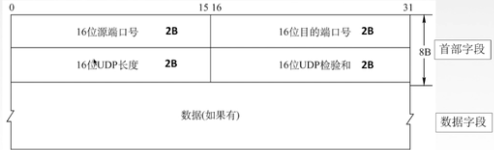
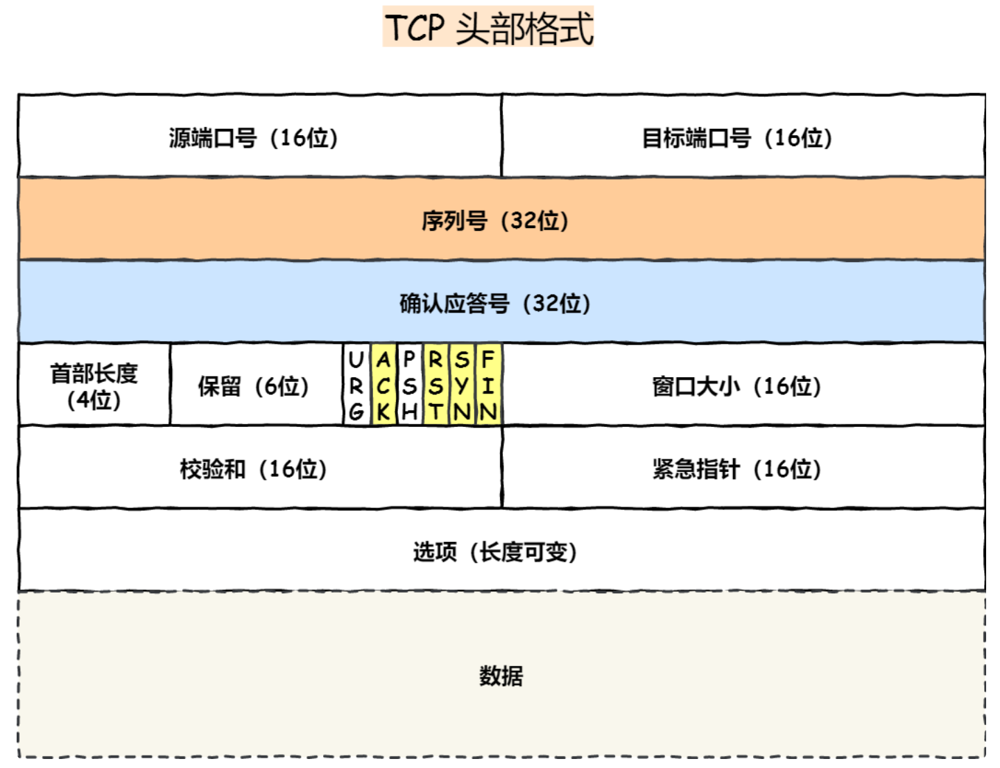
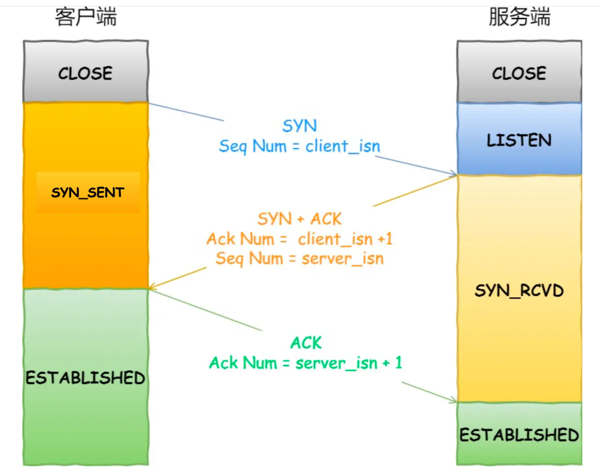
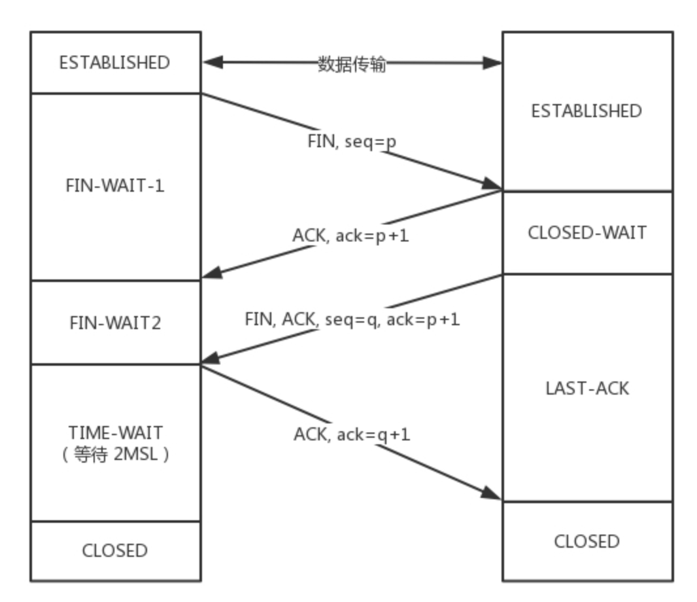

## 传输层的概念

* 传输层封装了网络层主机与主机之间的逻辑通信, 提供了进程和进程之间的逻辑通信.
* 表示进程的单位是端口号, 端口号有16bits, 最高可到65535:
  * DNS端口号: 53
  * HTTP端口号: 80

## UDP

* UDP协议的全称是User Datagram Protocol.
* UDP协议有如下几个特点:
  * UDP协议没有连接, 发送UDP报文不需要提前建立连接, 收到UDP报文后也不用给出确认.
  * UDP不保证可靠传输.
  * UDP没有拥塞控制, 适合很多实时应用.
* UDP的报文格式:

* UDP的首部是8个字节.
* UDP的长度指的是首部和数据部分加起来的长度.

## TCP

* TCP的全称是Transmission Control Protocol.

* TCP有如下特点:
  * TCP是面向连接的传输层协议.
  * TCP可以提供可靠交付的服务.
  * TCP提供**全双工通信**, 发送方和接收方都具有缓存.
  * TCP是面向字节流的协议.

* TCP报文的格式: TCP首部的大小是20字节.

* 序号(SEQ): 
  * 假设一个进程想要传输数据, 它会把数据中的每一个字节进行编号, 然后把某几个字节块用TCP报文封装并发出去.
  * TCP报文中的序号就表示我当前TCP报文的数据部分的第一个字节在我要传输的总数据上的编号是多少.
* 确认号(ACK):
  * 假设一个进程接收到了发送方的数据, 那么它会给发送方发送一个确认的报文, 确认报文中的ACK就表示: 下一个应该接收到的字节在总数据中的编号是多少.
* 数据偏移(Data offset): TCP报文段的数据部分距离TCP报文段起始有多远(以4B为单位).
* 各种控制位:
  * URG: 为1时, 表示报文段中有紧急数据, 应尽快传送, 不该在缓存中排队.
  * ACK: ACK为1时, 确认号才有效, TCP连接建立之后, 所有传送的报文段都必须把ACK设置为1. 
  * PSH: PSH为1时, 接收方需要尽快把这个TCP报文交给进程.
  * SYN: 为1时, 表示是一个连接请求/连接接收报文.
  * FIN: 为1时, 表示报文段发送方的数据已经发完, 需要释放了连接.
  * 窗口: 发送TCP报文段的一方接收窗口的大小.

### TCP连接管理

#### 三次握手

* 第一次: `SYN=1, seq=x(随机)`
  * 客户端发送连接请求报文段, 报文段没有应用层数据.
* 第二次: `SYN=1, ACK=1, ack=x+1, seq=y(随机)`
  * 服务端为TCP连接分配缓存, 并向客户端返回确认报文, 无应用层数据.
* 第三次 : `SYN=0, ACK=1, seq=x+1, ack=y+1`
  * 客户端为TCP连接分配缓存, 并向服务端返回确认报文, 这个时候就可以携带应用层数据.

> SYN泛洪攻击

* 攻击者发送TCP SYN报文, 服务端返回ACK后攻击者不进行确认, 服务端就会一致返回ACK, 浪费资源.

#### 四次挥手

* TCP连接中的双方都能终止连接, 连接结束之后, 缓存资源就会被释放.
* 第一次: `FIN=1, seq=x`
  * 客户端发送连接释放报文段, 没有应用层数据, 主动关闭TCP连接.
* 第二次: `ACK=1, ack=x+1`
  * 服务端返回一个确认报文段, 确认自己已经收到了客户端发来的终止报文.
  * 之后, 服务端继续发送数据.
* 第三次: `FIN=1, ACK=1, seq=y, ack=x+1`
  * 服务端发送完数据之后, 就发送主动释放连接的报文段.
* 第四次: `ACK=1, ack=y+1`
  * 客户端发送一个确认报文段, 然后等到2 * MSL(报文段最长寿命)之后(要保证服务端确实收到了, 没有重传), 再关闭连接.

#### 半连接队列与长连接队列

https://mp.weixin.qq.com/s/YpSlU1yaowTs-pF6R43hMw

#### TCP长连接和短连接

* TCP在真正开始进行数据传输之前，Server 和 Client 之间必须建立一个连接。当数据传输完成后，双方不再需要这个连接时，就可以释放这个连接。

* TCP连接的建立是通过三次握手，而连接的释放是通过四次挥手。所以说，每个TCP连接的建立和释放都是需要消耗资源和时间成本的。

* **TCP短连接: **一个TCP连接只互相发送一次数据, 发完之后就断开, 如果要发多次就建立多次连接.
* **TCP长连接: **一个TCP连接可以发送多个数据包, 在TCP连接保持期间，如果没有数据包发送，需要双方发检测包以维持此连接，一般需要自己做在线维持。

> TCP长连接和短连接的使用场景:

* 长连接: 用于频繁操作, 比如数据库的连接.
* 短连接: Web服务.

## 面试题

> TCP为什么是三次握手?

三次握手的核心是: Client和Server都要确认自己的发送/接收是正常的.

* 第一次握手:
  * Client什么都确认不了.
  * Server可以确认: Client发送正常, Server接收正常.
* 第二次握手:
  * Client可以确认: Client发送正常, Client接收正常, Server发送正常, Server接收正常.
  * Server可以确认: Client发送正常, Server接收正常.
* 第三次握手: 全部确认.

> TCP为什么是四次挥手?

* A和B打电话:
  * A: 我没什么要说的了.
  * B: 哦, 但是我还没说完.
  * B: 我没什么要说的了.
  * A: 哦.
