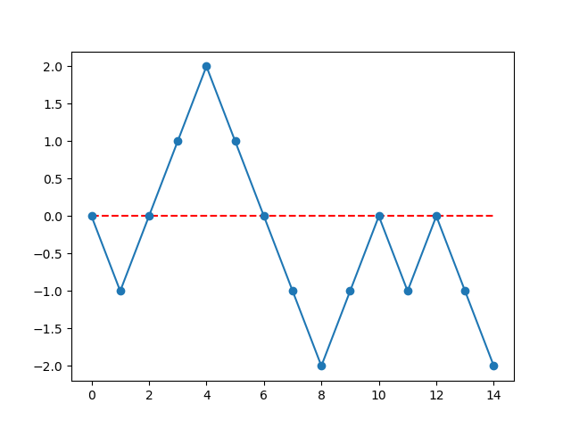

## 判断合法括号序列

> https://leetcode.cn/problems/valid-parentheses/

```cpp
class Solution {
public:
    bool isValid(string s) {
        stack<char> stk;
        for (auto c : s) {
            if (c == '(' || c == '{' || c == '[') stk.push(c);
            else {
                if (stk.size() == 0) return false;
                if (c == ')' && stk.top() == '(') stk.pop();
                else if (c == '}' && stk.top() == '{') stk.pop();
                else if (c == ']' && stk.top() == '[') stk.pop();
                else return false;
            }
        }
        return stk.size() == 0;
    }
};
```


## 最长合法括号子序列

> https://www.acwing.com/problem/content/description/4210/

1. 结论: 一个括号序列是合法括号序列, 等价于:
   * 左右括号数量相等.
   * 所有前缀中, 左括号数量大于等于右括号数量.
2. 实现时, 用一个计数器`cnt`, 遇到左括号就`cnt ++`, 遇到右括号就`cnt --`.
   * 左右括号数量相等等价于最终`cnt == 0`
   * 左括号数量大于等于右括号数量等价于遍历过程中, `cnt >= 0`始终成立.
3. 最长合法括号子序列等价于这个括号子序列中, 右括号最多.
4. 贪心算法: 当`cnt > 0`时, 右括号一定选.
5. 贪心算法证明:
   * 首先, 贪心解一定小于等于最优解, 那么剩下就只需要证明贪心解大于等于最优解.
   * 假设贪心解小于最优解:
     * 最优解选择的右括号比贪心解多, 不可能, 贪心解的策略是能选就选.
   * 因此, 贪心解大于等于最优解.

```cpp
#include <iostream>

using namespace std;

int main() {
    
    string s;
    cin >> s;
    
    int l = 0, r = 0;
    
    for (auto c : s) {
        if (c == '(') l ++;
        else if (l > 0) {
            l --;
            r ++;
        }
    }
    
    cout << r * 2 << endl;
    return 0;
}
```


## 最长合法括号子串

> https://leetcode.cn/problems/longest-valid-parentheses/
>
> https://www.acwing.com/problem/content/description/4201/

* 括号序列可以理解为如下的图形, 例如这样一个括号序列`)((())))(()())`

  * 横轴是数组下标, 纵轴是计数器`cnt`的值.

  

  * 按照上面所说的合法括号序列的等价条件, 一个合法的括号序列对应的折线必须满足两个条件:
    * 起点和终点在同一高度.
    * 起点和终点的连线必须在这个同一高度之上.

* 如果需要求最长合法括号序列子串, 那么对于图中的每个点来说, 我只需要向左, 找到第一个比这个点高度低的边, 这个边的右端点就是起点, 我选择的这个点就是终点, 那么起点和终点连接就是一个合法的括号序列子串, 遍历统计长度即可.

```cpp
#include <iostream>
#include <stack>

using namespace std;

const int N = 1000010;

char s[N];
stack<int> stk;

int main() {
    
    scanf("%s", s);
    
    int resl = 0, resc = 1;
    
    for (int i = 0; s[i]; i ++) {
        
        if (s[i] == ')' && stk.size() != 0 && s[stk.top()] == '(') stk.pop();
        else stk.push(i);
        
        int r = 0;
        if (stk.size() != 0) r = i - stk.top();
        else r = i + 1;
        
        if (r > resl) resl = r, resc = 1;
        else if (r > 0 && r == resl) resc ++;
    }
    
    printf("%d %d\n", resl, resc);
    return 0;
}
```


## 生成括号

> https://leetcode.cn/problems/generate-parentheses/

* 什么时候能枚举左括号: 只要目前序列左括号的数量小于n, 就可以.
* 什么时候能枚举右括号: 只要右括号的数量小于n, 并且前缀目前左括号的数量严格大于右括号的数量就可以.

```cpp
class Solution {
public:
    vector<string> ans;
    vector<string> generateParenthesis(int n) {
        dfs(0, 0, n, "");
        return ans;
    }
    void dfs(int lc, int rc, int n, string seq) {
        if (lc == n && rc == n) ans.push_back(seq);
        if (lc < n) dfs(lc + 1, rc, n, seq + '(');
        if (rc < n && lc > rc) dfs(lc, rc + 1, n, seq + ')');
    }
};
```
