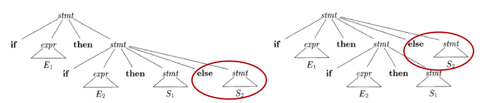

## 上下文无关文法

> 证明: 上下文无关文法比正则表达式可以表达的范围更广

1. 证明上下文无关文法生成的某个语言不能被正则表达式识别.

* 假设文法为: `S -> aSb | ab`, 这种文法描述的是$a^nb^n$类型的语言.
* 由于DFA无法实现计数, 因此无法表示.


2. 证明所有的正则语言都能够被上下文无关文法表示.

* 对于任何正则语言, 必然存在一个NFA, 那么对于NFA来说, 可以这样构造CFG:
  * 对于NFA的每个状态i, 创建非终结符$A_i$.
  * 如果i在输入a上有到达j的转换, 那么就有生成式: $A_i \rightarrow aA_j$.
    * 如果i在输入$\epsilon$后到达j, 那么就有生成式: $A_i \rightarrow A_j$.
  * 如果$A_i$是一个接受状态, 那么就有生成式: $A_i \rightarrow \epsilon$.
  * 如果i是开始状态, 那么$A_i$就是文法的开始符号.


* **程序语言的CFG**的要求:
  * 没有二义性: 一个语言只能对应一个AST.
  * 没有左递归: 就是没有$A \rightarrow A\alpha$​这种生成式.
    * 自顶向下方法不能处理左递归.
  * 提取左公因子.


### 消除二义性

> 为什么要消除二义性?

* 如果文法具有二义性, 自顶向下分析算法中, 预测表`M`中一个表项会有两个对应的生成式, 无法保证正确运行.


二义性没有通用的消除方法, 下面是几个例子:

* 四则运算表达式

假设四则运算的文法如下:

```
E -> E + E | E * E | id
```

那么`a + b * c`就有两颗AST对应.

改写:

```
E -> E + T | T
T -> T * F | F
F -> id
```

* 规定`*`的优先级高于`+`, 也就是归约为`+`操作时, 必须先通过`*`相关的生成式规约成`T`.


* `if-else`

假设`if-else`语句的文法如下:

```
stmt -> if Exp then stmt
			| if Exp then stmt else stmt
```

那么对于一个语句: `if E1 then if E2 then S1 else S2`, 就会出现两颗语法树与之对应:



如果要消除二义性, 只需要人为规定: `then`和`else`之间的语句必须是一个完全匹配好的`if else`结构, 文法如下:

```
stmt -> matched_stmt | open_stmt

matched_stmt -> if Exp then matched_stmt else matched_stmt

open_stmt -> if Exp then stmt | if Exp then matched_stmt else open_stmt
```


### 消除左递归

* 自顶向下分析无法处理含有左递归的文法, 因为会陷入无限循环, 因此要消除左递归.

* **消除立即左递归: **

  * 立即左递归: 例如$A \rightarrow A\alpha$.
  * 消除算法: 
    * 假设一个立即左递归形式为: $A \rightarrow A\alpha_1\ | ... |\ A\alpha_m |\ \beta_1\ |\ ...\ |\ \beta_n$.
    * 那么可以转成以下形式:
      * $A \rightarrow \beta_1 A' | ... | \beta_n A'$​
      * $A' \rightarrow \alpha_1 A'\ |\ ...\ |\ \alpha_m A'\ |\  \epsilon$​

* 通用的消除左递归的算法:

  * 有些情况下, 左递归不是一步就能退出来的, 可以通过多步推导得到左递归的生成式.

  * 通用的左递归消除算法:

    * 首先要保证文法中不含有环, 也就是$A \rightarrow A$.
    * 假设一个文法中的所有非终结符是$A_1, A_2, ..., A_n$.

    ```rust
    for i in 1..(n+1) {
    	for j in 1..i {
        if Ai -> Aj b这种形式的生成式存在 {
          对于任何Aj -> c1 | c2 | c3 | ... | ck
          将Ai的生成式变为Ai -> c1 b | c2 b | c3 b | ... | ck b
        }
      }
      消除Ai的立即左递归
    }
    ```

    

## 自顶向下分析

* 自顶向下分析对应最左推导, 过程如下:
  * 输入一个CFG, 一个语言.
  * 对于顶层非终结符, 选择右边最左侧的非终结符, 然后选择一个生成式, 逐步推导.
    * 生成式如果选错, 需要回溯.
  * 要求推导的最终结果和最终的语言一致.

例如:

* 文法: $S \rightarrow cAd; A\rightarrow ab |a$, 输入的语言是`cad`.
* 推导第一步: `S -> cAd`
* 第二步: `S -> cAd -> cad`.


### FIRST集

> 为什么会有FIRST集?

* 对于一个非终结符, 在选择生成式时, 可以通过往前看若干个符号来辅助选择哪个生成式.
* $FIRST(A)$就定义为: 对于非终结符$A$​, 它有可能最终推导出的所有句子中, 第一个符号的集合.
  * 如果存在生成式$A \rightarrow \epsilon$, 那么$\epsilon$也在$FIRST(A)$中.
* $FIRST$集的使用方法: 
  * 假设$A$有两个生成式: $A \rightarrow \alpha | \beta$, 并且$FIRST(\alpha)\ \bigcap\ FIRST(\beta) = \emptyset$.
  * 如果下一个符号是$a$, 如果$a \in FIRST(\alpha)$, 那么就可以选择$A \rightarrow \alpha$这个生成式.

* 求$FIRST(A)$的算法:
  * 如果$A$是终结符, 那么直接加入$FIRST(A)$中.
  * 如果$A$是非终结符, 那么看$A$的所有产生式:
    * 如果有产生式为$A \rightarrow \epsilon$, 那么把$\epsilon$加入$FIRST(A)$.
    * 如果产生式为: $A \rightarrow B_1B_2B_3...B_n$:
      * 首先, 递归求$FIRST(B_1), ..., FIRST(B_n)$.
      * 如果$\epsilon$同时存在于$FIRST(B_1), FIRST(B_2), ..., FIRST(B_n)$, 那么$\epsilon$就加入$FIRST(A)$.
      * 如果$\epsilon$同时存在于$FIRST(B_1), ..., FIRST(B_{i-1})$, 那么$FIRST(B_i)$就需要加入$FIRST(A)$.


### FOLLOW集

* $FOLLOW(A)$表示最终生成的句子中, 可能紧跟在$A$后面的符号集合.
* 求所有符号$FOLLOW$集的算法:
  * 首先把$\$$放到所有符号的$FOLLOW(A)$​中.
  * 然后, 求所有符号的$FIRST$集.
  * 然后不断遍历所有的生成式, 直到所有的$FOLLOW$集停止增长:
    * 如果存在生成式$A \rightarrow \alpha B \beta$, 那么$FIRST(\beta)$中的所有非$\epsilon$的符号都放到$FOLLOW(B)$​中.
      * 如果$\epsilon \in FIRST(\beta)$, 那么$FOLLOW(A)$中的所有符号应该放到$FOLLOW(B)$中.
    * 如果存在生成式$A \rightarrow \alpha B$, 那么$FOLLOW(A)$中的所有符号应该放到$FOLLOW(B)$中.


### LL(1)文法

* LL(1)文法的定义: 假设对于一个文法$G$, 对于其中的任何一个生成式$A \rightarrow \alpha | \beta$, 如果满足:

  * $FIRST(\alpha) \bigcap FIRST(\beta) = \empty$​.
    * 开头第一个符号不能有重合, 要不然没法通过前看一个符号确定.
  * 如果$\epsilon \in FIRST(\beta)$, 那么$FIRST(\alpha) \bigcap FOLLOW(A) = \empty$.
  * 如果$\epsilon \in FIRST(\alpha)$, 那么$FIRST(\beta) \bigcap FOLLOW(A) = \empty$​​.
    * 即使我知道了一个输入符号, 我也没办法保证这个符号是$A$推导出来的, 因为很可能要选择$A \rightarrow \epsilon$.
    * 这个时候, 直接看$FOLLOW(A)$, 我还要保证看$FOLLOW(A)$能唯一确定生成式, 因此就需要保证和其他分支的$FIRST$集合是$\empty$.

  那么这个文法就是LL(1)文法, 就可以通过前看一个符号唯一确定该选择哪个生成式.

* LL(1)文法不具有二义性.


### 递归下降分析

递归下降分析算法过程如下:

* 第一步: 求每个符号的$FIRST$集和$FOLLOW$集.
* 第二步: 构造预测分析表$M$:
  * 遍历所有的生成式$A \rightarrow \alpha$:
    * 对于$FIRST(\alpha)$的每个终结符$a$, $M[A, a] = A \rightarrow \alpha$.
    * 如果$\epsilon \in FIRST(\alpha)$, 那么对于$FOLLOW(A)$中的每个终结符$b$, $M[A, b] = A \rightarrow \alpha$.
  * 最后在所有的空白处填入Error.
* 之后, 对于每个非终结符$A$和输入符号$a$, 都准备一个函数, 函数的处理方式是:
  * 首先, 根据$M[A, a]$, 选择一个生成式$A \rightarrow B_1B_2...B_n$.
  * 之后, 遍历每个符号$B_i$:
    * 如果$B_i$和$a$相等, 那么就吃掉$a$.
    * 如果$B_i$是非终结符, 那么调用$B_i$的处理函数.

## 自底向上分析

