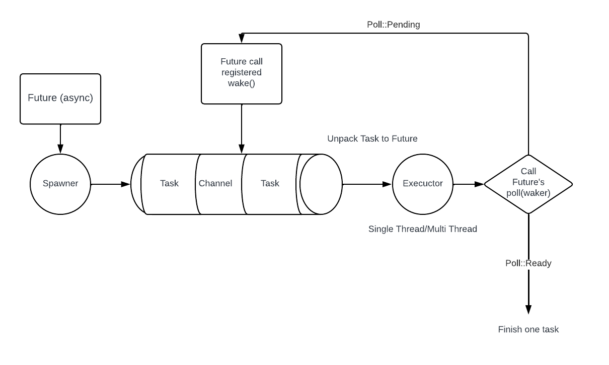

## Rust介绍

> Rust的优势?

* **Zero Cost Abstraction:** Rust引入的一些机制 (例如所有权机制/泛型), 并不会引入额外的运行时开销.
  * C++的template, inline functions也体现了Zero cost abstraction.

* **安全性**: 能够在编译时期, 防止空指针或者dangling pointer等内存问题.
* **工具链强大**: cargo.

## `rustc`

* rustc是Rust编译器.

* rustc通过目标三元组(Target Triplet)来描述运行平台, 格式是: `Architecture-Vendor-OS-Library`.

  * 可以通过`rustc --version --verbose`查看 (verbose在英文中是冗长的意思):

  ```
  rustc 1.76.0 (07dca489a 2024-02-04)
  binary: rustc
  commit-hash: 07dca489ac2d933c78d3c5158e3f43beefeb02ce
  commit-date: 2024-02-04
  host: aarch64-apple-darwin <- 运行平台
  release: 1.76.0
  LLVM version: 17.0.6
  ```

  * 使用`rustc --print target-list`可以查看这个版本的`rustc`总共可以支持多少个host.
    * 如果想要添加一个平台, 可以用: `rustup target add riscv64gc-unknown-none-elf`
      * `riscv64gc-unknown-none-elf`就是一个Target Triplet.


## 命名规范

> https://rust-lang.github.io/api-guidelines/naming.html

| 元素      | 命名方式            |
| --------- | ------------------- |
| 局部变量  | snake_case          |
| 函数      | snake_case          |
| 方法      | snake_case          |
| 模块(mod) | snake_case          |
| 结构体    | UpperCamelCase      |
| Trait     | UpperCamelCase      |
| 枚举      | UpperCamelCase      |
| 常量      | `SCREAM_SNAKE_CASE` |


## 常量

常量和**不可变的变量**有很大的不同.

* 常量需要使用`const`关键字, 并且**必须标注类型**.

  ```rust
  <pub> const MAX_NUM: i32 = 1000_i32;
  ```

* 常量可以定义在任意作用域, 包括全局作用域.

* 常量必须绑定到**常量表达式**, 必须在编译时期就要算出来.

* 数字的字面值可以用`_`分割.

* 尽量让程序中所有的硬编码值都变成常量, 方便后续维护/提高可读性.

常量尽量不要理解成“配置”, 因为可能会有需求说根据不同的配置运行benchmark看性能, 这个时候配置就是可变成分, 并不符合常量的定义.


## 基本数据类型


### 整数

* 整数类型:

  | 位数 | 有符号  | 无符号  |
  | ---- | ------- | ------- |
  | 8    | `i8`    | `u8`    |
  | 16   | `i16`   | `u16`   |
  | 32   | `i32`   | `u32`   |
  | 64   | `i64`   | `u64`   |
  | 128  | `i128`  | `u128`  |
  | 架构 | `isize` | `usize` |

* 如何知道`isize`和`usize`到底是多少位?

  * 使用`std::mem::size_of`

  ```rust
  fn main() {
    
    let isize_bits = std::mem::size_of::<isize>() * 8;
    let usize_bits = std::mem::size_of::<isize>() * 8;
  }
  ```

  * 一般下标的数据类型都是`usize`.

* Rust整数的默认类型是`i32`.

* 整数类型的字面值可以使用类型后缀:

  ```rust
  let a = 100_u8;
  ```

* 其他进制的字面值:

| 进制     | 字面值        |
| -------- | ------------- |
| 二进制   | `0b1000_0000` |
| 八进制   | `0o77`        |
| 十六进制 | `0xffff_ffff` |

* 将整数按照其他进制打印:
  
  * 二进制:
  
  ```rust
  println!("{:#b}", x);
  ```
  
  * 十六进制:
  
  ```rust
  println!("{:#x}", x);
  ```
  
  * 使用0填充, 最小宽度是`m`打印十六进制:
    * 注意, 这个`m`包含`0b`这个前缀的长度.
  
  
  ```rust
  println!("{:#0mx}", x);
  ```
  
* 整数溢出问题:

  * $n$位无符号数范围: $[0, 2^n - 1]$​
    * 首项是1, 公比是2的等比数列的前$n$项和是$S_n = 2^n - 1$.
  * $n$位有符号数范围: $[-2^{n-1}, 2^{n-1}-1]$​​​​
  * Rust在debug模式下, 遇到整数overflow会`panic`, 在release模式下, 不会`panic`, 直接按照循环溢出处理.


### 浮点数

* 浮点数类型: `f32`和`f64`, 默认是`f64`类型.

* 浮点数只实现了`std::cmp::PartialEq`, 并且不能直接使用`<, <=`进行比较.
  * 如果要比较, 需要`(0.1_f64 + 0.2 - 0.3).abs() < 0.00001`

* 特殊的浮点数: `NaN`.
  * 判断一个浮点数是否是`NaN`: `x.is_nan()`
  * 与`NaN`进行运算都会得到`NaN`.


### 类型转换

* 基本类型转换: `as`
  * 例如: `let a = 3.2 as u8;`
  * 注意整数之间转换需要注意范围, 尽量要保证小转大.
  * 类型转换永远是显式的, Rust永远不会偷偷地将一种类型转换为另一种类型.


### 字符

* 字符类型: `char`

  * 字符的字面值是`'a'`.

  * 所有的Unicode值, 都可以作为Rust中的char.

  * 由于Unicode值最多用4个字节进行编码, 因此, Rust中的字符类型占用4个字节.

  * 如果某个字符的Unicode值占用内存比4个字节小, 那么可以用`u8`来存储:

    ```rust
    // a是u8类型
    let a = b'a';
    ```

* 打印一个变量所占的内存空间(单位是字节):

  ```rust
  let a = 'a';
  println!("{}", std::mem::size_of_val(&a));
  ```


### 布尔

* 布尔类型: `bool`:
  * 只有两个字面值`true`和`false`.


### `Unit Type`

* 单元类型 (unit type): `()`

  * 这个类型用来占位, 不占用任何内存.
  * 本质上就是一个空的元组.
  * `main`函数和`println!`的返回值是`()`.
  
  * 在Rust中, 所有没有返回值的元素, 其实本质上的返回值都是Unit Type.


## 函数

* 函数的定义:

  ```rust
  fn add(a: i32, b: i32) -> i32;
  ```

  * 每一个参数, 以及返回值都需要标注类型.

* 函数体:

  * 函数体由一系列Statement (语句)以及最后的Expression (表达式)组成.

  ```rust
  fn add_with_extra(x: i32, y: i32) -> i32 {
      let x = x + 1; // 语句
      let y = y + 5; // 语句
      x + y // 表达式
  }
  ```

  * 语句会返回`()`类型, 最后的表达式是函数返回的结果.
  * 如果要在函数中间强制返回结果, 可以使用`return`.

* 函数返回`()`可以代表函数没有返回值, 但是真正没有返回值的函数在rust中叫做diverge function:

  ```rust
  fn dead_end() -> ! {
    panic("End of program");
  }
  ```

  * 返回值是`!`时, 这个函数就是diverge function, 表示没有返回值.
  * 这种函数一般会导致程序`panic`.


## 可变, 引用, 所有权

* 可变性:

  * 如果一个变量的值在后面可能会发生变化, 应该用`mut`修饰:

  ```rust
  let mut a = String::from("haha");
  ```

* 所有权:

  * Rust中, 每一个值都被一个变量所拥有, 这个变量有这个值的所有权(ownership).
  * 一个值只能拥有一个所有者.
  * 当所有者离开作用域时, 值会被释放.

* Rust中, 当一个变量赋值/当作函数参数传递/当作函数返回值传递时, 如果对应类型没有实现`Copy` trait, 则会发生所有权的转移.

  ```rust
  let a = String::from("haha");
  let b = a;
  // 此后, a不可使用, 否则会panic
  ```

  * 所有权的检查是在编译时期进行的, 对运行时的性能没有影响.
  * 实现了`Copy` trait的类型有:
    * 整数.
    * 浮点数.
    * 字符.
    * 布尔.
    * 所有元素都实现了`Copy trait`的元组.
    * 不可变引用`&T`.
  * 所有权的转移会涉及到变量地址的改变.

    * 如果要打印一个变量的内存地址, 可以使用: `println!("Memory address of x: {:p}", &x);`

    ```rust
    fn main() {
        let a = String::from("haha");
        println!("{:p}", &a);
        let b = a;
        println!("{:p}", &b);
    }
    ```

* 引用: 引用变量可以看作对原变量值的租借(borrowing), 租借不会引起所有权的转变, 分为两种类型:

  * 不可变引用`&T`: 可以使用原变量的值, 但是不可以改变值.

    ```rust
    let a = String::from("haha");
    let b = &a;
    ```

  * 可变引用`&mut T`: 可以读/写原变量的值, 要求原变量必须可变`mut`.

    ```rust
    let a = String::from("haha");
    let b = &mut a;
    ```

  * **借用规则:**

    * 不可以对不可变数据进行可变借用.

    * 同一作用域, 同一个值, 只能进行一次可变引用`&mut T`的借用.
    
      ```rust
      let mut v = vec![1, 2, 3];
      
      let b = &mut v[0];
      let c = &mut v[1];
      // 报错
      println!("{}, {}", b, c);
      ```
    
    * 同一作用域, 同一个值, 不能同时进行可变引用和不可变引用的借用.
    
    ```rust
    let mut v = vec![1, 2, 3];
    
    let b = &v[0];
    v.push(2);
    // 报错
    println!("{}", b);
    ```


## 元组

* 元组类型: `(T, U, E)`, 其中`T, U, E`是类型.

  * 创建元组:

  ```rust
  let tup: (i32, f64, u8) = (1, 1.1, 10);
  ```

  * 解构元组:

  ```rust
  let (x, y, z) = tup;
  // 用.0/.1/.2访问元素
  let z = tup.0
  ```

* 借助元组, 可以实现函数返回多个元素:

```rust
fn length(s: String) -> (String, usize) {
  let length = s.len();
  (s, length)
}

fn main() {
  let a = String::from("haha");
  let (s, l) = length(a);
}
```


## 切片

* 切片类型: `[T]` (`str`也是切片类型)

  * 切片可以表示对一个集合中的部分数据.
  * 在Rust中, 切片是一个动态类型(DST), 在编译时无法获取类型大小, 因此在代码中没法直接使用.

  ```rust
  // 报错
  let a : str = "haha";
  ```

  * 对于切片的访问, 只能通过切片的引用`&[T]`来进行访问(引用已知大小).

* 创建切片的语法: `&s[a..b]`, 获取`s`中`[a, b)`区间范围的数据 (`s`可以是数组, 或者是`String`类型).

  * `&s[..]`获取全部.
  * `&s[..b]`获取`[0, b)`.
  * `&s[a..]`获取`[a, s.len)`.


## 字符串

* 字符串类型: `&str`

  * 在Rust中, 语言层面只提供了`&str`类型作为字符串.

  ```rust
  // a是&str类型
  let a = "hahaha";
  ```

  * 字符串字面值`"hahaha"`被硬编码在二进制文件中, 并且不可变, `&str`就是对这个不可变的值的引用.

  * `&str`类型不可以用索引进行访问 (`String`也不能).

  * 对`&str`取切片引用, 得到的还是`&str`类型:

    ```rust
    let a = "hahaha";
    let b = &a[..];
    ```

* 更方便的字符串类型: `String`

  * `String`定义在标准库`std`中.

  * 字符串创建:

    ```rust
    let a = String::from("haha");
    let a = "haha".to_string();
    ```

  * 字符串修改 (需要定义字符串为`mut`): 参考文档.

  * `String`采用`UTF-8`进行编码, 底层采用`Vec<u8>`进行实现:

    * `String`类型也不可以用索引进行访问.
    * `String`类型可以取切片, 切片的类型是`&str`.
    * `String`类型取切片时, <font color=red>一定注意, 索引的边界要在UTF-8编码后字节的边界上</font>.

    ```rust
    let a = String::from("中国人");
    // 报错, 一个中文字符占3个字节, [0..2]正好在'中'的内部
    let b = &a[0..2];
    ```

    * 如果想获取`String`中的第`n`个字符, 可以使用如下方法:

    ```rust
    let a = String::from("haha");
    // b是Option<char>类型
    let b = a.chars().nth(0);
    
    // 遍历每一个字符 (a.chars()返回一个迭代器)
    for c in a.chars() {
      // c是char类型
      println!("{}", c);
    }
    ```

    


## 结构体

* 结构体类型:

  * 定义结构体:
    * 每一个参数都需要显式标注类型.

  ```rust
  struct Student {
    name: String,
    age: u32,
  }
  ```

  * 例化结构体:

    ```rust
    let mut stu = Student {
      name: String::from("haha"),
      age: 18
    };
    
    // 如果变量和结构体字段重名, 那么可以简化:
    let name = String::from("haha");
    let mut stu = Student {
      name,
      age: 18
    };
    ```

* 结构体的可变性: 如果结构体变量被设置为`mut`, 那么其中的每个字段都是可变.

* 结构体的权限: 结构体中的成员变量默认是private, 如果需要在其他`mod`使用需要变成`pub`:

  ```rust
  pub struct Student {
    pub name: String,
    pub age: i32
  }
  ```

* 元组结构体: 只有`struct`名字, 没有成员变量名字的结构体:

```rust
struct Color(i32, i32, i32);

let black = Color(0, 0, 0);
// 访问元素
black.0
black.1
black.2
```


## 枚举

* 枚举类型: `enum`

  * 定义枚举:

  ```rust
  enum IpAddr {
    IPv4,
    IPv6
  }
  ```

  * 访问枚举:

  ```rust
  let a = IpAddr::IPv4;
  ```

* 枚举中的元素可以和一个值绑定:

  ```rust
  enum IpAddr {
    IPv4(String),
    IPv6(String)
  }
  ```
  
  * 构造/获取其中的值:
  
    ```rust
    let a = IpAddr::IPv4(String::from("haha"));
    
    if let IpAddr::IPv4(s) = a {
      println!("{}", s);
    }
    ```


## 数组

* 数组类型: `[T; num]`

  * 数组是定长的, 创建语法:

    ```rust
    let a = [1, 2, 3, 4, 5];
    ```

  * 标注类型:

    ```rust
    let a: [i32; 5] = [1, 2, 3, 4, 5];
    ```

  * 创建一个包含多个重复值的数组:

    ```rust
    // a = [3, 3, 3, 3, 3]
    let a = [3; 5];
    ```

    * 注意: 如果采用这种写法, 数组中的元素需要实现`Copy trait`, 如果没有实现, 需要用`std::array::from_fn`.

* 可以通过索引访问数组元素.

  * Rust会在编译时和运行时都检查数组越界, 运行时出现会直接`panic`.

* 打印数组可以用`{:#?}`.

* 可以创建数组的切片:

  ```rust
  let a: [i32; 5] = [1, 2, 3, 4, 5];
  let slice: &[i32] = &a[1..3];
  // 字面值比较
  assert_eq!(slice, &[2, 3]);
  ```


## 控制流

* `Range`:

  * `Range<T>`是一个序列, 可以用`a..b`构造, 表示`[a, b)`
  * `for`循环可以使用`Range`来遍历集合.

  ```rust
  let a = vec![1, 2, 3, 4];
  
  for i in 0..a.len() {
    let b = a[i];
  }
  ```

* `for`循环与迭代器的语法糖: 

  * 如果要转移元素的所有权:

    ```rust
    // item为T类型
    for item in collection {
      
    }
    // 等价于
    for item in collection.into_iter() {
      
    }
    // 如果需要索引
    for (i, item) in collection.into_iter().enumerate() {
      
    }
    ```
    
  * 如果要用元素的不可变借用:
  
    ```rust
    // item为&T类型
    for item in &collection {
      
    }
    
    // 等价于
    for item in collection.iter() {
      
    }
    ```
  
  * 如果要用元素的可变借用:
  
    ```rust
    // item为&mut T类型
    for item in &mut collection {
      
    }
    
    // 等价于
    for item in collection.iter_mut() {
      
    }
    ```
  
* `for`循环遍历的性能问题:

  * 用迭代器遍历性能大于用索引, 因为索引访问需要引入判断数组越界访问.


## 模式匹配

* 模式匹配也是一种控制流, 它有两个功能:

  * 解构变量.
  * 根据变量的不同值, 采用不同的控制流.

* 模式可以是如下内容:

  * 字面值.
  * 解构的枚举值, 元组, 结构体.


### `match`表达式

* `match`表达式: 注意`match`表达式最终返回的是一个值.
  
    ```rust
    match VALUE {
        PATTERN => EXPRESSION,
        PATTERN => EXPRESSION,
        _ => EXPRESSION,
    }
    ```
    
    * 一个例子:
    
      ```rust
      // 例子
      enum Coin {
      	A, B, C, D, E
      }
      
      fn value_in_cents(coin: Coin) -> u8 {
        match coin {
          Coin::A => 1,
          Coin::B => 2,
          // | 表示两种情况
          Coin::C | Coin::D => { 3 },
          Coin::D => 4,
          _ => { 5 },
        }
      }
      ```
    
    * 用`match`来解构枚举值:
    
      ```rust
      enum Option<T> {
        Some(T),
        None,
      }
      
      let a = Some(3);
      let c = match a {
        Some(x) => {
          let b = x;
          b
        },
        None => {
          0
        }
      }
      ```


### 所有权问题与`ref`

* 在进行变量解构时, 可能会导致部分所有权的转移, 例如下面的代码:

  ```rust
  fn main() {
      let a = Some(String::from("haha"));
      let b = match a {
          Some(s) => {
              println!("{}", s);
              2
          },
          None => { 1 }
      };
      println!("{}", a.unwrap());
  }
  ```

  * 其中, `a`中的`String`变量`s`的所有权进行了转移, 会报错.

* 解决这个问题有两种方式:

  * 对这个变量的引用进行模式匹配: 对原变量使用引用, 模式匹配后得到的变量也是引用类型.

    ```rust
    fn main() {
        let a = Some(String::from("haha"));
        let b = match &a {
            Some(s) => {
              // 这里的s是&String类型
                println!("{}", s);
                2
            },
            None => { 1 }
        };
        println!("{}", a.unwrap());
    }
    ```

  * 使用`ref`关键字:

    ```rust
    fn main() {
    
        let a = Some(String::from("haha"));
    
        let b = match a {
          // s也是&String类型
            Some(ref s) => {
                println!("{}", s);
                2
            },
            None => { 1 }
        };
        println!("{}", a.unwrap());
    }
    ```

### `if let`表达式


* `if let`表达式: 只关心一种匹配情况的`match`, 最终返回的也是一个值.

    ```rust
    let c = if let Some(x) = a {
      let b = x;
      b
    }
    ```


​    

## 方法

* 方法是绑定在类型上的一系列函数, 方法可以访问类型中的元素.

  * 用`impl`定义方法:

  ```rust
  struct Student {
   	name: String,
    age: usize
  }
  
  impl Student {
    fn name(&self) -> String {
      self.name
    }
  }
  ```

  * `impl`可以分为多个, 可以按照逻辑组织`impl`.

* 方法的类型:

  * 关联函数: 方法签名中没有`self, &self, &mut self`.
    * 用来实现构造函数.
  * 其他方法: 方法签名中带有`self, &self, &mut self`.

* 方法的所有权问题:

  * `self`: 会拿走类型变量的所有权, 调用后原变量不可用.
  * `&self`: 对原变量采用不可变借用.
  * `&mut self`: 对原变量采用可变借用, 可以修改变量的字段值.

* 自动解引用(`Deref trait`): 

  * 如果方法中的参数是`&self, &mut self`, 在访问变量时, 应该加上解引用`(*stu).name`.
  * 但是, Rust会自动解引用, 因此可以直接`stu.name`访问.
  * 本质上是Rust对`Self`这种类型实现了`Deref trait`.

* 为枚举实现方法:

  ```rust
  enum Weekday {
    Monday, Thuesday, Wednesday
  }
  
  impl Weekday {
    
    fn show_mood(&self) {
      match self {
        Self::Monday => {},
        Self::Thuesday => {},
        //...
      }
    }
    
  }
  ```


## 泛型

* 泛型可以在函数, 结构体, 枚举, 方法中使用 (英语是Generics).

* 泛型需要在函数名/方法名/结构体名/枚举名后面声明泛型参数`T`, 然后再使用:

  * 函数:

    ```rust
    fn largest<T>(list: &[T]) -> T {
      
    }
    ```

  * 结构体:

    ```rust
    struct Point<T, U> {
      x: T,
      y: U
    }
    ```

  * 枚举:

    ```rust
    enum Result<T, E> {
      Ok(T),
      Err(E)
    }
    ```

  * 方法:

    ```rust
    impl<T, U> Point<T, U> {
      
    }
    // 如果方法要针对某种具体的类型
    impl Point<i32, i32> {
      //...
    }
    ```


## `Trait`

### 基本用法

* Trait是一种类型, 里面包含了若干个方法, 用来定义一个对象所必须满足的行为:

  ```rust
  trait Show {
    fn show(&self) -> String;
  }
  ```

* 可以将某一个Trait绑定到一个类型上:

  ```rust
  struct Student {
    name: String
  }
  
  impl Show for Student {
    fn show(&self) -> String {
      self.name
    }
  }
  ```

* Trait中可以提供默认实现的方法, 绑定的类型可以选择是否重载这个方法.

  ```rust
  trait Show {
    fn show(&self) -> String {
      String::from("Read more!")
    }
  }
  ```

### 孤儿规则

* 如果你要为一个类型`T`实现一个Trait, 那么Trait和`T`至少有一个需要定义在当前作用域.
  * 不能为外部的类型实现外部的Trait.
  * 英文叫Orphan Rule (OR).


#### `newtype`

* newtype可以绕过孤儿规则, 为外部类型实现外部trait.

* 使用方法:

  * 用一个元组结构体作为`Wrapper`, 包裹其中的外部类型.
  * 为这个元组结构体实现外部trait.

  ```rust
  struct Wrapper(Vec<String>);
  
  impl Display for Wrapper {
    // ...
  }
  // 之后可以使用Wrapper代替外部类型
  ```


### 特征约束


#### 泛型特征约束

* 泛型参数`T`在声明的时候, 可以限制这个泛型`T`必须实现某几种特征:

  * 实现一种特征:

    ```rust
    fn notify<T: Summary>(item: &T) {}
    ```

  * 实现两种特征: `+`

    ```rust
    fn notify<T: Summary + Display>(item: &T) {}
    ```

  * 实现好几种特征: `where`表达式

    ```rust
    fn notify<T, U>(item: &T, other: &U)
    	where T: Display + Clone,
    				U: Summary + Display
    {}
    ```

  * 在方法中进行特征约束的时候, 只需要在第一个`<>`中进行特征约束即可:

    ```rust
    impl<T: Display> Point<T> {}
    ```

* 语法糖: `impl A`

  * 表示实现了`A`这个Trait的对象.
    ```rust
    fn notify(item: &impl Summary) {}
    ```

  * 约束多个特征:
  
    ```rust
    fn notify(item: &(impl Summary + Display)) {}
    ```
  
  * 注意: `impl A`一般不可以作为函数返回值的类型:
  
    * 函数可能返回`T`这个具体类型的变量, 也可能返回`U`这个具体类型的变量, 都符合`impl A`的定义(假设类型`T`和`U`都实现了`A`这个trait), 但是函数返回值只能是一个具体类型(在编译时确定).
  
    * 函数返回值一般采用特征对象作为类型标注.
  
* 静态分发 (static dispatch):  无论是泛型的特征约束, 还是`impl A`, 都会在编译期处理完成, 编译器会为每一个泛型分配一个具体类型, 这就是静态分发.


#### trait特征约束

* 如果你要求: 一种类型在实现一个trait时, 需要先实现另一个trait, 可以使用trait特征约束:

  ```rust
  // 实现Show trait之前, 你需要为类型实现Display和Clone
  trait Show: Display + Clone {
    fn show(&self) -> String;
  }
  ```

  

### 特征对象

* 特征对象也表示实现了某个trait的对象, 但是与泛型的特征约束不同, 这个对象的具体类型在运行时才能确定下来.

* 特征对象类型: `dyn A`

  * 注意, 特征对象只能在运行时才能确定大小, 因此需要用引用`&dyn`或者`Box<dyn A>`的形式使用.

  ```rust
  // 定义一个trait
  trait Show {
    fn show(&self) -> String;
  }
  
  // 两个对象实现了这个trait
  impl Student for Show {
    fn show(&self) -> String {
      self.name
    }
  }
  impl Teacher for Show {
    fn show(&self) -> String {
      self.name
    }
  }
  
  // 定义一个函数, 参数是实现了Show trait的对象
  fn call_show(people: &dyn Show) { people.show(); }
  // 或者使用Box<dyn Show>
  fn call_show(people: Box<dyn Show>) { people.show(); }
  ```

* 不是所有的trait都可以有特征对象, 需要满足对象安全(object safety)条件:

  * trait中不能有`Self: Sized`约束.
  * trait中的方法没有泛型参数`T`.
  * trait的返回值不能是`Self`.
  


### 关联类型

* 在trait中一般不使用泛型, 一般用关联类型代替.

* 关联类型用`type`定义, 也可以用泛型约束.

  ```rust
  trait Show {
    type Item : Display + Clone;
    
    fn show(&self) -> Option<Self::Item>;
  }
  
  // 实现Show trait
  impl Show for Student {
    // 指定具体的关联类型
    type Item = String;
    
    //...
  }
  ```

  * 关联类型采用`Self::A`进行索引.


### 完全限定语法

* 如果一个类型实现了多个trait, 不同trait中有方法同名, 那么这个类型的对象在调用方法时, 可以使用完全限定语法(Fully Qualified Syntax)规定调用哪个方法.

  * 格式是: `<Type as Trait>::function(receiver_if_method, next_arg, ...);`

  ```rust
  // trait1
  trait Show1 {
    fn show(&self) -> String;
  }
  // trait2
  trait Show2 {
    fn show(&self) -> String;
  }
  // implement trait1 and trait2 for a type
  impl Show1 for Student {
    fn show(&self) -> String {}
  }
  impl Show2 for Student {
    fn show(&self) -> String {}
  }
  
  fn main() {
    let stu := Student {};
    // 调用trait1中的show
    <Student as Show1>::show(&stu);
    // 调用trait2中的show
    <Student as Show2>::show(&stu);
  }
  ```


## `Option`

* 在Rust中, 如果一个变量可能为`None`, 那么它的类型应该是`Option<T>`:

  ```rust
  enum Option<T> {
    Some(T),
    None
  }
  ```

* 可以利用`match`表达式和`if let`对`Option<T>`进行解构.

* `Option<T>`提供的解构方法:

  * `unwrap()`:

    * 对`Some(T)`: 可以直接拿到`T`类型的值.
    * 对`None`: 程序`panic`.

  * `expect("错误信息")`:

    * 与`unwrap()`用法相同, 但是可以自定制`panic`后的错误信息.

  * 如果想从`Option<T>`中拿到`&T`类型: 使用`as_ref()`:

    ```rust
    let a = Some(T);
    // b是&T类型
    let b = a.as_ref().unwrap();
    ```

  * 如果想从`Option<T>`中拿到`&mut T`类型: 使用`as_mut()`:

    ```rust
    let a = Some(T);
    // b是&mut T类型
    let b = a.as_mut().unwrap();
    ```


> `Option`的一个经典用法

* 如果在定义`struct`的字段时, 每次使用不想夺取这个字段的所有权, 但是又不想用引用, 可以用`Option<T>`包裹.
* 用`Option<T>`包裹后, 可以用`as_ref()/as_mut()`使用引用, 可以用`take()`夺走所有权.

## 异常处理

* Rust中的错误分为两种:

  * 可恢复的错误: Rust提供了`Result<T, E>`类型.
  * 不可恢复的错误: Rust提供了`panic!`宏.


### `panic!`

* `panic!`宏使用: `panic!("错误信息")`

  * `panic`有两种处理模式:

    * `unwind`: 程序会展开调用栈, 并且依次清理函数中的数据 (工作量较大).
    * `abort`: 程序直接终止调用栈, 数据由OS回收.

  * 在`release`模式下, 需要用`abort`模式 (可以让二进制文件更小), 在`Cargo.toml`中加上:

    ```toml
    [profile.release]
    panic = 'abort'
    ```

  * `panic`可能发生在源码中, 如果要定位源码的位置, 需要运行时将`RUST_BACKTRACE`设置为1.

  * `panic`的底层原理:

    * 在Rust中, 处理`panic!`的函数叫做`panic_handler`, 采用`#[panic_handler]`来进行标注:

      ```rust
      use core::panic::PanicInfo;
      
      // PanicInfo会保存程序的错误位置
      #[panic_handler]
      fn panic(_info: &PanicInfo) -> ! {
          // ....
      }
      ```


### `Result<T, E>`与`?`

* `Result<T, E>`: 如果一个操作可能会出现异常, 那么这个操作就会返回`Result<T, E>`类型.

  ```rust
  enum Result<T, E> {
    // 操作成功返回T类型
    Ok(T),
    // 操作失败返回E类型
    Err(E)
  }
  ```

* 处理`Result<T, E>`的几种方法:

  * `match`表达式:

    ```rust
    let f = File::open("hello.txt");
    
    let f = match f {
      Ok(file) => file,
      // 错误类型
      Err(error) => {
        panic!("Error opening file {}", error);
      }
    }
    ```

  * `unwrap()`: 直接提取`Ok(T)`中的`T`, 如果失败就会直接`panic`.

    ```rust
    let f = File::open("hello.txt").unwrap();
    ```

  * `expect()`: 在`unwrap()`的基础上, 可以DIY错误信息:

    ```rust
    let f = File::open("hello.txt").expect("错误信息");
    ```

  * 向上传递错误:

    * 在遇到错误的时候, 直接`return Err(e)`.

    * 函数的返回值需要变成`Result<T, E>`.

    * Rust中还提供了`?`宏, 专门用来传播错误:

      ```rust
      let mut f = File::open("hello.txt")?;
      ```

      * 如果函数返回`Ok(T)`, 那么`T`就会自动赋值给`f`.

      * 如果返回`Err(e)`, 那么函数就会直接`return Err(e);`

      * 如果一个函数内部有`?`, 那么最后函数需要写一个返回值`Ok(T)`.

      * 如果在`main`函数中需要使用`?`, 那么`main`函数的签名需要是:

        ```rust
        // Box<dyn Error>表示任何可能的错误类型
        fn main() -> Result<(), Box<dyn Error>> {
          
        }
        ```

    * `?`函数会隐式调用`From`函数, 将返回错误类型自动转换为函数签名所定义的错误类型.


### `Error`与自定义异常

* 自定义异常之后, 你就可以把你自定义的异常类型放到`Result<T, E>`中的`E`这里.

* 如果要自定义异常, 需要实现`std::error::Error`, 其中需要关心的方法是`source`方法:

  ```rust
  pub trait Error: Debug + Display {
    fn source(&self) -> Option<&(dyn Error + 'static)> { None }
  }
  ```

  * 通过`source()`方法, 可以将你的异常对象转换成更低级别的异常.

* 自定义异常的步骤:

  * 实现`Display` trait.
  * 实现`Debug` trait, 可以用`#[derive(Debug)]`.
  * 实现`std::error::Error` trait, 如果自定义的`Error`有子异常, 需要覆盖其中的`source()`方法:
    * `source()`方法返回`Some(子err)`.

* 例子:

  * 定义一个子异常`ChildError`: 

    * 子异常一般是更低级别的异常, 因为你的自定义异常基本也是由若干的子异常组成.

    ```rust
    #[derive(Debug)]
    struct ChildError;
    
    // 实现Display
    impl std::fmt::Display for ChildError {
      fn fmt(&self, f: &mut std::fmt::Formatter<'_>) -> std::fmt::Result {
        // write!(f, "{}", 你的字符串), 这个和println!使用方法差不多
        write!(f, "ChildError is here!");
      }
    }
    
    // 实现Error, ChildError如果没有子Error, 就不用覆盖source
    impl std::error::Error for ChildError {}
    ```
  
  * 自定义异常`MyError`, 子异常是`ChildError`:
  
    ```rust
    #[derive(Debug)]
    struct MyError {
      err: ChildError,
    }
    
    impl Display for MyError {
      // ...
    }
    // 返回子异常
    impl Error for MyError {
      fn source(&self) -> Option<&(dyn std::error::Error + 'static)> {
        Some(&self.err)
      }
    }
    ```

### 优雅处理异常

> https://github.com/baoyachi/rust-error-handle

* 首先, 把自定义异常定义为枚举, 枚举中的元素是组成自定义异常的若干异常:

  ```rust
  #[derive(Debug)]
  enum CustomError {
    ParseIntError(std::num::ParseIntError),
    UTF8Error(std::str::Utf8Error),
    IOError(std::io::Error)
  }
  ```

* 实现`Display`的时候, 对自定义异常进行模式匹配, 然后对子异常递归调用`Display`中的`fmt`方法:

  ```rust
  impl Display for CustomError {
    fn fmt(&self, &mut Formatter<'_>) -> std::fmt::Result {
      match &self {
        CustomError::IOError(ref e) => e.fmt(f),
        CustomError::UTF8Error(ref e) => e.fmt(f),
        CustomError::ParseIntError(ref e) => e.fmt(f),
      }
    }
  }
  ```

* 实现`Error`时, 同样对自定义异常进行模式匹配, 然后返回对应的子异常:

  ```rust
  impl Error for CustomError {
    fn source(&self) -> Option<&(dyn std::error::Error + 'static)> {
      match &self {
        CustomError::IOError(ref e) => Some(e),
        CustomError::UTF8Error(ref e) => Some(e),
        CustomError::ParseIntError(ref e) => Some(e),
      }
    }
  }
  ```

* 然后, 为自定义异常`CustomError`实现`From` trait, 让子异常能够自动转化到上级异常:

  ```rust
  impl From<ParseIntError> for CustomError {
    fn from(e: std::num::ParseIntError) -> Self {
      CustomError::ParseIntError(e)
    }
  }
  
  impl From<IOError> for CustomError {
    fn from(e: std::io::Error) -> Self {
      CustomError::IOError(e)
    }
  }
  
  impl From<UTF8Error> for CustomError {
    fn from(e: std::str::UTF8Error) -> Self {
      CustomError::UTF8Error(e)
    }
  }
  ```
  
* 之后, 假设有三个`utils`级别的子函数, 这三个子函数分别会抛出`ParseIntError`, `io::Error`和`std::str::UTF8Error`:

  ```rust
  fn read_file(path: &str) -> Result<String, io::Error> {
    // ...
  }
  fn to_u32(v: &str) -> Result<u32, UTF8Error> {
  	// ...  
  }
  fn to_utf8(v: &[u8]) -> Result<&str, ParseIntError> {
    // ...
  }
  ```

  * 然后, 把其中的子异常全部换成`CustomError`, 借助`From` trait, 子异常可以自动转换为`CustomError`:
  
    ```rust
    fn read_file(path: &str) -> Result<String, CustomError> {
      // ...
    }
    fn to_u32(v: &str) -> Result<u32, CustomError> {
    	// ...  
    }
    fn to_utf8(v: &[u8]) -> Result<&str, CustomError> {
      // ...
    }
    ```
  
  * 然后, 用类型表达式进一步简化:
  
    ```rust
    pub type MyResult<T> = Result<T, CustomError>;
    
    fn read_file(path: &str) -> MyResult<String> {
      // ...
    }
    fn to_u32(v: &str) -> MyResult<u32> {
    	// ...  
    }
    fn to_utf8(v: &[u8]) -> MyResult<&str> {
      // ...
    }
    ```
  
* 然后, 如果在你的逻辑中, 同时可能返回这三种异常, 就可以直接全部使用`?`, 异常会被自动转为自定义异常.

  ```rust
  fn my_func() -> MyResult<()> {
    
    let v = read_file("../")?;
    let x = to_utf8(v.as_bytes())?;
    let u = to_u32(x)?;
    Ok(())
  
  }
  ```

* 这样, 在每一层都会把比较底层的`Exception`进行一层封装, 然后抛出到上级, 在上级可以通过对`Exception`进行解析, 统一处理.

### 优雅处理`Option`

* 如果你认为`Option`变量如果是`None`的情况足以变成异常, 那么可以采用如下方法:

  * 首先自定义一个异常, 对应`Option`变量变成`None`的情况:

    ```rust
    struct NoneError;
    //...
    ```

  * 然后, 假设一个方法可能返回`Option`, 那么就用`ok_or`方法, 如果这个`Option`是`None`, 那么这个方法可以把对应的`Option`变成`Result`, 就可以使用`?`.

    ```rust
    let a = gen_option().ok_or(NoneError)?;
    ```

    


## 集合

### `Vector`

* Vector的类型是`Vec<T>`, 是由标准库提供的.

  * 可以存储多个值, 这些值的类型都必须相同.

  * 如果要存放不同的数据类型, 那么可以用枚举:

    ```rust
    enum Data {
      Int(i32),
      Float(f64),
      String(String),
    }
    
    let mut v = vec![
      Data::Int(3),
      Data::Float(3.3),
      Data::String("3"),
    ];
    ```

* 创建`Vec`:

  ```rust
  let v: Vec<i32> = Vec::new();
  ```

* 使用初始值创建`Vec`:

  ```rust
  let v = vec![1, 2, 3];
  ```

* 添加元素: `push`

  ```rust
  let mut v = Vec::new();
  v.push(1);
  ```

* 当`Vec<T>`离开作用域时, 会被清理掉, 但是其中的元素也会被清理掉.

  * 如果其他的地方有`Vec`中元素的引用, 就会发生问题, 需要格外注意.

* 访问`Vec`中元素的两种方式:

  * 索引: 如果索引超出范围, 程序就会`panic`, 不安全.
  * `get方法`: 返回值是`Option<T>`, 如果越界会返回`None`, 比较安全 .
  
* `Vec<T>`的`length`与`capacity`:

  * `length`表示`Vec<T>`中的元素个数, 而`capacity`表示`Vec<T>`中底层数组的容量.
  
  * 可以通过预先分配一定的`capacity`, 来减少动态数组扩容, 提高性能:
  
    ```rust
    let mut v = Vec::with_capacity(10);
    ```
  


### `HashMap`

* 引入:

  ```rust
  use std::collections::HashMap;
  ```

* 创建哈希表:

  ```rust
  let mut hashmap: HashMap<T, U> = HashMap::new();
  ```

  * HashMap中, 所有的Key必须是同一种类型, 所有的Value必须是同一种类型.
  * 数据存储在Heap上.

* 添加元素: `insert`

  ```rust
  let a = String::from("haha");
  let b = 1;
  
  let mut map: HashMap<String, i32> = HashMap::new();
  map.insert(a, b);
  ```

* HashMap的所有权问题:

  * 如果类型实现了Copy trait, 那么值会被复制到HashMap中.
  * 对于有所有权的值, 所有权会转移到HashMap中, 例如调用`insert`.
  * 如果将变量的引用插入HashMap, 那么HashMap有效的期间, 必须保证插入的引用有效.

* 根据键获取值: `get`

  * 参数: `&T`
  * 返回值: `Option<&V>`

  ```rust
  // 传入&T, 返回Option<&U>
  hashmap.get(&key);
  ```

* 遍历HashMap:

  ```rust
  // k, v都是&T, &U类型
  for (k, v) in &hashmap {
    
  }
  ```

* 更新HashMap: 

  * 首先判断Key是否存在:

    ```rust
    if hashmap.contains(&key) {
      // ...
    }
    else {
      
    }
    ```

  * 如果key存在:

    * 如果要用新值覆盖, 直接再次`insert`即可.

    * 如果要基于原来的值计算新值:

      ```rust
      // 得到原来的值的&mut
      let origin = hashmap.entry(&key).or_insert(0);
      // 然后用*origin就可以基于原值计算
      ```

  * 如果key不存在, 直接`insert`插入即可.


## 多文件编程

### `mod`树状结构

* Rust中, 一个`.rs`文件是一个`mod`, 名字和文件名一样.

  * `mod`中可以包含各种元素, 例如常量, 函数, 结构体, trait等.

* 在Rust的文件中, 声明`mod`的语句是:

  ```rust
  // A.rs
  mod B;
  
  // 声明+定义的方式
  mod B {
    pub fn add(a: i32, b: i32) -> i32 { a + b }
  }
  ```

  * 这个语句的含义是, A这个`mod`的子节点是B.

* Rust中, 一个文件夹也可以是一个`mod`, 需要在文件夹中添加`mod.rs`, 然后在其中声明文件夹内的所有`mod`:

  ```rust
  // mod.rs
  pub mod A;
  pub mod C;
  pub mod D;
  ```

* `mod`的根节点是`src/main.rs`或者是`src/lib.rs`, 根节点的名称叫做`crate`.


### 权限管理/`use`

* 如果一个`mod`中的元素需要被其他`mod`导入, 需要在前面加上`pub`.

  ```rust
  pub const MAX_NUM: i32 = 1000;
  
  pub fn notify<T>(item: &T) {}
  ```

* 如果需要导入其他`mod`中的元素, 可以使用`use`关键字:

  * 首先确定你用`mod`声明语句建立好了`mod`树.

  * 使用绝对路径: 从`crate`开始向下找:

    ```rust
    use crate::A::B;
    ```

  * 使用相对路径:

    * `super`: 表示当前`mod`的父亲`mod`.
    * `self`: 表示当前`mod`.


## 格式化输出

* `format!`可以用来生成`String`类型的格式化字符串:

  ```rust
  let a = String::from("hello");
  let b = String::from("world");
  
  let s = format!("{}, {}", a, b);
  ```

* `println!()`用来打印输出:

  * `{}`占位符适合实现了`Display` trait的类型.
  * `{:?}`或者`{:#?}`适合实现了`Debug` trait的类型.


> `{:?}`和`{:#?}`的区别?

* `{:?}`是单行输出, 一般信息比较紧凑.
* `{:#?}`是多行输出, 一般信息比较多, 比较美观.

### `Display`

* `Display`这个trait一般用来更加美化地输出一个类型信息:

  ```rust
  use std::fmt::Display;
  
  struct Student {
      name: String,
      age: usize
  }
  
  impl Display for Student {
      fn fmt(&self, f: &mut std::fmt::Formatter<'_>) -> std::fmt::Result {
        // 第二个参数是格式化字符串, 后面是具体的参数
        // 最后没有;
          write!(f, "Student Name {}, Student age {}", self.name, self.age)
      }
  }
  ```
  
  * 实现`Display` trait之后, 可以对一个对象调用`to_string()`方法, 生成`String` 来进行打印.
    * 也可以用`{}`占位符进行打印.

### `Debug`

* `Debug`用来输出与这个类型有关的调试信息:

  ```rust
  #[derive(Debug)]
  struct Student {
      name: String,
      age: usize
  }
  ```

  ```rust
  use std::fmt::Debug;
  
  struct Student {
      name: String,
      age: usize
  }
  
  impl Debug for Student {
    // 实现方式和Display相同
      fn fmt(&self, f: &mut std::fmt::Formatter<'_>) -> std::fmt::Result {
          write!(f, "Student Name {}, Student age {}", self.name, self.age)
      }
  }
  ```
  
  * 实现`Debug` trait之后, 可以使用`{:?}`或者`{:#?}`占位符来进行打印.

## 闭包

* 闭包(closure)是一种可以使用调用者捕获当前作用域变量的匿名函数, 本质上是一种类型.

  ```rust
  |param1: type1, param2: type2, param3: type3, ...| {
    Statement1;
    Statement2; // Statement中可以直接使用当前作用域的变量
    //...
    Expression
  }
  
  let a = |x: i32, y: i32| {
    	x + y
  };
  ```

* 闭包的所有权问题:

  * 闭包内可以使用调用者作用域的变量, 但是变量的所有权可能会发生转移, 里面涉及三个trait:
    * `FnOnce`: 闭包内会拿走外部作用域变量的所有权, 因此这个闭包只能运行一次.
    * `Fn`: 以不可变借用捕获外部作用域的变量.
    * `FnMut`: 以可变借用捕获外部作用域的变量.

* 闭包的类型表达式:

  * 闭包一般用`impl A`或者`Box(dyn A)`标注类型, 例如:
    * `Box<dyn FnOnce(i32, i32) -> i32>`.
    * `Box<dyn Fn(i32, i32) -> i32>`.
    * `Box<dyn FnMut(i32, i32) -> i32>`

> 如何确定一个闭包实现了哪个trait ?

* 取决于这个闭包内, 如何使用外部变量.

  * 所有闭包默认实现了`FnOnce`, 确保闭包能够调用一次.
  * 如果闭包内没有对变量进行改变, 那么就实现了`Fn`.
  * 如果闭包内对变量进行了改变, 并且没有返回变量的所有权, 那么就实现了`FnMut`.

* `move`关键字:

  * `move`关键字可以强制闭包夺取外部变量的所有权.

    ```rust
    let v = vec![1, 2, 3];
    let handle = thread::spawn(move || {
      println!("{:?}", v);
    });
    ```

  * 为什么需要`move`关键字:

    * 有些情况下, 闭包的生命周期可能比外部变量的更长 (例如多线程).
    * 如果不夺去所有权的话, 外部变量被回收内存后, 闭包中再使用这个变量的引用就会出问题.


## 迭代器

* 与迭代器相关的trait一共有两个:

  * `Iterator`: 如果一个类型实现了这个trait, 那么它就是迭代器:

    ```rust
    pub trait Iterator {
      type Item;
      fn next(&mut self) -> Option<Self::Item>;
    }
    ```

  * `IntoIterator`: 如果一个集合实现了这个trait, 那么它就可以转化为迭代器.

* 将集合转化为迭代器的方法:

  * `into_iter()`: 返回的元素类型是`T`, 会拿走集合变量的所有权.
  * `iter()`: 返回的元素类型是`&T`, 是集合变量的不可变引用.
  * `iter_mut()`: 返回的元素类型是`&mut T`, 是集合变量的可变引用.


### 迭代器消费者/收集者

* 如果要对一个集合中的元素进行运算, 并且将运算结果打包成一个新的集合, 可以使用迭代器消费者/收集者.

* 迭代器消费者负责运算, 生成新的迭代器
  * 迭代器消费者的参数可以是闭包类型.
  * 常见的迭代器消费者有`map, zip`等.
  
* 迭代器收集者负责将迭代器转换为指定类型的集合, 一般用`collect`函数.
  * 使用`collect`函数时, 一般需要进行类型标注.

* `map + collect`

  ```rust
  let v1 = vec![1, 2, 3];
  // _是什么类型会自动推断
  let v2: Vec<_> = v1.iter().map(|x| x + 1).collect(); 
  ```

* `zip + collect`

  ```rust
  let keys = ["h1","h2"];
  let values = [1, 2];
  
  let hashmap: HashMap<_, _> = keys.into_iter().zip(values.into_iter()).collect();
  ```

* `String`字符串逆序:

  ```rust
  let a = String::from("haha");
  let b: String = a.chars().rev().collect();
  ```


## 智能指针

### `Deref`

* `Deref`是一个trait, 实现了这个trait的类型可以具有智能指针的行为.

  * 一个类型为`T`的对象, 如果实现了`Deref<Target=U>`, 那么
    * 在使用`T`类型的对象时, 可以直接调用`U`类型的方法.
    * 在使用`&T/&mut T`类型或者`Box<T>`类型的引用时, 可以根据需要被自动转换成`&U`.


  ```rust
  use std::ops::Deref;
  
  pub trait Deref {
    type Target;
    // deref函数负责将原始类型的引用, 转换为Target类型的不可变引用
    fn deref(&self) -> &Self::Target;
  }
  ```

  * 如果需要将`&mut T`自动转换为`&mut U`, 需要`DerefMut<Target=U>` trait.

* `Deref`的优势:

  * 如果一个类型实现了`Deref`, 那么它的引用当作参数传递时, 会根据函数的签名自动解引用到对应的数据类型:

    ```rust
    fn display(s: &str) {
      println!("{}", s);
    }
    
    fn main() {
      let s = Box::new(String::from("hello world"));
      // &String类型会连续调用deref转换成&str.
      display(&s);
    }
    ```

### `Drop`

* 如果一个类型实现了`Drop`这个trait, 那么这个类型的变量在超出作用域后, 会自动执行一段代码.

  ```rust
  impl Drop for XXX {
    fn drop(&mut self) {}
  }
  ```

  * `Drop` trait一般用于回收内存资源, 以及做一些收尾工作.

* Rust基本为几乎所有的类型实现了`Drop`, 因此超过作用域后, 内存资源都会被释放:

  * 变量按照逆序进行释放.
  * 结构体中的变量按照顺序进行释放.

* 手动提前释放: 可以使用`std::mem::drop`

  ```rust
  let a = String::from("haha");
  // drop函数会拿走变量的所有权
  drop(a);
  ```

* 如果一个类型实现了`Copy`, 那么它就不能实现`Drop`.

* 在Rust中, 使用`File::open`/或者使用`socket`时, 不需要手动调用`close`等函数释放资源, 因为这些对象实现了`drop` .

* 程序`panic!`后, 也会自动调用`drop`.

### `Box<T>`

* `Box<T>`是一个智能指针类型, 可以强制让`T`类型的数据存储在堆上, 并且返回值的引用.

  ```rust
  // 3存储在堆上
  let a = Box::new(3);
  ```

  * 注意: `Box::new(T)`会拿走原始数据的所有权.

  ```rust
  let s = String::from("haha");
  // s的所有权转移到s_box
  let s_box = Box::new(s);
  ```

* `Box<T>`的使用场景:

  * 特征对象`Box<dyn T>`.
  * 将动态类型转换成已知大小的类型.
  * 实现了`Copy` trait的数据过大, 转移所有权时需要避免拷贝:

  ```rust
  let arr = Box::new([10; 1000]);
  // 此时arr所有权转移到arr_new, 并没有发生数据拷贝
  let arr_new = arr;
  ```

### `Rc<T>/Arc<T>`

* `Rc<T>`可以实现对于一个值, 有多个不可变引用, 并且只有所有不可变引用都被`drop`后, 值才会被`drop`.

  ```rust
  use std::rc::Rc;
  
  // 第一个引用, a
  let a = Rc::new(String::from("haha"));
  // 第二个引用
  let b = Rc::clone(&a);
  ```

  * `Rc<T>`变量同时实现了`Deref`和`Drop`.
  * `Rc<T>`类型没有实现`Send` trait, 因此无法在多线程间传递.

* `Arc<T>`是实现了`Send`的`Rc<T>`, 可以在多线程之间传递所有权.

  * 用法和`Rc<T>`一致.
  * 所在的包是`std::sync::Arc`.
  * `Arc<T>`采用了原子指令维护引用计数, 因此有一定的性能损耗.

### `RefCell<T>`

* `RefCell<T>`可以对不可变的变量进行可变借用.

  ```rust
  use std::cell::RefCell;
  
  let val = RefCell::new(10);
  *val.borrow_mut() += 1;
  ```

* 使用`RefCell<T>`依然要遵循Rust的借用规则, 如果不遵循, 会在运行时`panic`, 而不会编译器出错.

  ```rust
  let s = RefCell::new(String::from("haha"));
  // 报错, 不可变引用和可变引用同时存在
  let a = s.borrow();
  let b = s.borrow_mut();
  ```

* `Rc<T>`可以和`RefCell<T>`一起使用, 实现可变引用和不可变引用同时存在.

  ```rust
  let s = Rc::new(RefCell::new(String::from("haha")));
  
  // 对RefCell的多个不可变引用
  let a = Rc::clone(&s);
  let b = Rc::clone(&s);
  let c = Rc::clone(&s);
  
  // RefCell对内部的值进行可变借用
  c.borrow_mut().push_str("world");
  
  println!("{}", *s.borrow());
  ```

* `RefCell<T>`没有实现`Send` trait, 不能在多线程环境下使用.


## 并发编程

* Rust中的线程库是`std::thread`.

### 创建线程

* 创建线程可以使用`thread::spawn`:

  ```rust
  use std::thread;
  
  fn main() {
    
    let handle = thread::spawn(move || {
      println!("Hello World");
    });
    
    handle.join().unwrap();
  }
  ```

  * 由于Rust在编译时不确定线程会存活多久, 因此闭包中需要强制用`move`把外部变量的所有权拿走.
  * `main`线程需要等待所有子线程结束后再退出, 因此需要对子线程调用`join().unwrap()`.


### `Send/Sync`

* 如果一个类型`T`实现了`Send`特征, 那么这个类型可以在线程之间传递所有权.
* 如果一个类型`T`实现了`Sync`特征, 那么这个类型可以在线程之间, 通过引用进行共享.
* 特征约束: 如果`&T`实现了`Send`特征, 那么`T`就实现了`Sync`特征.
* Rust中, 绝大部分类型都实现了`Send/Sync` trait, 可以通过`#[derive()]`进行自动实现.
  * 没有实现的: `Rc`, `RefCell`.

### `Mutex<T>`

* Rust中的互斥锁是`std::sync::Mutex`, 可以保证一个线程修改临界区数据时, 不会被其他线程打断.

* `Mutex<T>`本质上是一种智能指针, 可以通过`Mutex<T>`创建数据的可变引用, 并且通过这个可变引用修改数据时, 不会被其他线程打断.

  ```rust
  let m = Mutex::new(3);
  
  // 上锁, 获取可变引用进行修改
  let mut value = m.lock().unwrap();
  *value += 2
  // 超过作用域后释放锁
  ```

  * `Mutex<T>`实现了`Sync` trait, 可以让多个线程以引用的形式共享一个`Mutex`.
  * `Mutex`有一个泛型约束, 要求`T`实现`Send` trait, 因为这个值不能仅仅停留在一个线程, 需要在多个线程中都能获取到.

* 如果一个类型`T`的数据要在多线程间共享, 那么应该使用`Arc<Mutex<T>>`类型.

  * `Arc`实现了`Send` trait, 可以在一个线程中对`Mutex<T>`创建多个不可变引用, 并且将这些引用转移到不同线程.
  * `Mutex<T>`实现了`Sync` trait, 可以让多个线程以引用的形式共享.
  * `Mutex<T>`还可以保证在线程中, 以可变引用的形式修改临界区数据`T`时, 不会被其他线程打断.

一个例子: 多线程从1数到10

```rust
use std::thread;
use std::sync::Arc;
use std::sync::Mutex;

fn main() {

    let m_main = Arc::new(Mutex::new(0));
    let mut handles = Vec::new();

    for i in 0..10 {
        let m = Arc::clone(&m_main);
        let handle = thread::spawn(move || {
            let mut value = m.lock().unwrap();
            *value += 1;
        });
        handles.push(handle);
    }
    for handle in handles {
        handle.join().unwrap();
    }
    println!("{}", m_main.lock().unwrap());
}
```

### `Condvar`

* 条件变量`Condvar`在`std::sync::Condvar`中, 可以保证一个线程在另一个线程满足一定条件后再执行.
* 由于`Condvar`也要在多个线程中共享, 因此也需要配合`Arc<T>`一起使用.
* 使用方式:
  * 首先创建`Arc<Condvar>`类型的条件变量, 然后`clone`到两个线程.
  * 其中一个线程中, 调用`wait`阻塞线程, 并且暂时释放锁.
  * 在另一个线程中, 如果满足条件, 调用`notify`唤醒线程.

一个例子: 等待计数器为10时, 唤醒线程:

```rust
use std::thread;
use std::time::Duration;
use std::sync::{Arc, Mutex, Condvar};

fn main() {

    let counter = Arc::new(Mutex::new(0));
    let cond = Arc::new(Condvar::new());

    let counter1 = Arc::clone(&counter);
    let counter2 = Arc::clone(&counter);

    let cond1 = Arc::clone(&cond);
    let cond2 = Arc::clone(&cond);

    // 等待counter变成10
    let handle1 = thread::spawn(move || {
        let mut m = counter1.lock().unwrap();
        if *m != 10 {
            println!("counter is not 10, wait...");
            m = cond1.wait(m).unwrap();
        }
        println!("counter is {}", *m);
    });

    // 将counter变成10
    let handle2 = thread::spawn(move || {
        let mut m = counter2.lock().unwrap();
        for _ in 0..10 {
            *m = *m + 1;
          // 1s加1次
            thread::sleep(Duration::from_secs(1));
        }
        cond2.notify_one();
    });
    handle1.join().unwrap();
    handle2.join().unwrap();
}
```

### `channel`

* `channel`可以用于本地两个线程之间的通信, 采用的是生产者-消费者模型.
* Rust中使用最多的是多生产者, 单消费者的`channel`, 在`std::sync::mpsc`中.

例子: 一个线程发送消息给另一个线程:
  ```rust
  use std::thread;
  use std::sync::mpsc;

  fn main() {

      let (tx, rx) = mpsc::channel();

      let handle1 = thread::spawn(move || {
          tx.send(1).unwrap();
      });
      let handle2 = thread::spawn(move || {
          let value = rx.recv().unwrap();
          println!("Receiver got {}", value);
      });
      handle1.join().unwrap();
      handle2.join().unwrap();
  }
  ```

* 其中, `tx, rx`分别是`mpsc::Sender<T>`和`mpsc::Receiver<T>`类型, 具体类型编译器会推导.
* 如果需要多个发送者, 只需要将`tx.clone()`即可.
* 调用`send`时, 原数据如果没有实现`Copy` trait, 会被夺走所有权.
* 如果`tx`被`drop`之后, `rx.recv()`会返回`Err`.


## `I/O`

* Rust中, 与I/O相关的元素大部分在`std::io`中.

### `Read/Write`

* 对于I/O来说, 最重要的两个trait是`Read/Write`, 它们在`std::io::{Read, Write}`.

  * `Read`: 实现了这个trait的类型叫做`Reader`, 可以使用`read`方法, 把数据读取到`&mut [u8]`中.

    ```rust
    // 返回值是成功写入的字节数
    fn read(&mut self, buf: &mut [u8]) -> Result<usize>;
    ```

  * `Write`: 实现了这个trait的类型叫做`Writer`, 可以用`write`把数据写入`&mut [u8]`:

    ```rust
    // 返回值是成功写入的字节数
    fn write(&mut self, buf: &[u8]) -> Result<usize>;
    ```

* 除了`read`和`write`, `Read/Write` trait中还提供了很多封装的方法, 用来将数据从`reader/writer`读取/写入.

### `I/O`异常

* `I/O`异常定义在`std::io::Result<T>`, 定义是:

  ```rust
  pub type Result<T> = Result<T, std::io::Error>;
  ```

* 处理`I/O`异常的一般方法:

  * 在`I/O`操作后面用`?`.
  * `I/O`操作所在函数的返回值就是`io::Result<T>`.

### `BufReader/BufWriter`

* 对于一个`reader/writer`, 如果你需要多次调用`read/write`方法, 那么就会涉及多次系统调用, 性能较低.
* 这时可以使用`BufReader/BufWriter`, 在每一次读/写时, 都会把一些多的数据读取到`Buffer`中, 下一次`read/write`就可以从`Buffer`中进行操作, 可以提高性能.

> 例子: 读取一个文件的每一行

```rust
fn main() -> std::io::Result<()> {
  
  let f = File::open("log.txt")?;
  let mut reader = BufReader::new(f);
  
  for line in reader.lines() {
    // ...
  }
}
```


### `PathBuf/Path`

* `PathBuf`和`Path`用来封装对文件系统路径的一些操作, 这个封装是跨平台的.

* `PathBuf`和`Path`在`std::path::{PathBuf, Path}`中.

* `PathBuf`和`Path`的关系类似于`String`和`&str`的关系, `PathBuf`能够自动`deref`到`Path`.

* 要封装一个`PathBuf`变量:

  ```rust
  let mut pathbuf = PathBuf::from("foo/bar/target.txt");
  ```

  * 之后, 操作`PathBuf`变量就和操作栈一样:
    * `pathbuf.push("/dir")`可以将目录更近一层, 变成`foo/bar/target.txt/dir`.
    * `pathbuf.pop()`可以变为上级路径: `foo/bar`.


### 网络`I/O`

* 网络`I/O`的包大部分在`std::net`中.


#### `TCP Client/Server`

* 如果要构建`TCP Server`, 需要使用`std::net::TcpListener`:

  ```rust
  let listener = TcpListener::bind("127.0.0.1:9999").unwrap();
  
  // 接收
  for stream in listener.incoming() {
    stream = stream.unwrap();
    // stream是reader和writer
    let mut stream = stream.unwrap();
    handle_connection(&mut stream);
    let mut buffer= [0; 1024];
    // 将数据读取到buffer, 调用这个方法之后, 上面的buffer类型会被自动推断为[u8; 1024]
    stream.read(&mut buffer).unwrap();
  }
  ```

  * 对`stream`调用`read/write`相当于通过`TCP`协议发送消息.

* 如果要构建`TCP Client`, 需要使用`std::net::TcpStream`:

  ```rust
  let mut stream = TcpStream::connect("127.0.0.1:9999").unwrap();
  // stream也是reader/writer
  // 发送一个response: String
  stream.write_all(response.as_bytes()).unwrap();
  ```


## 生命周期

* 在Rust中, 每一个变量都会有自己的生命周期, 只有在生命周期时, 使用引用变量`&T/&mut T`才有效.

* 在函数/方法/结构体中, 有隐含的生命周期约束:

  * 函数/方法的参数如果是引用, 那么引用参数对应的原变量的生命周期, 必须大于等于返回值变量的生命周期.
  * 结构体的字段如果是引用, 那么字段对应的原变量的生命周期, 必须大于等于结构体变量的生命周期.

* 但是, 在定义这种函数/结构体时, 往往无法在编译时确定生命周期的大小关系, 这时候就需要手动标注生命周期:

  * 标注生命周期的函数:
  
    ```rust
    fn longest<'a>(x: &'a str, y: &'a str) -> &'a str {
      if x.len() > y.len() {
        x
      }
      else {
        y
      }
    }
    ```
  
  * 结构体:
  
    ```rust
    struct Student<'a> {
      part: &'a str,
    }
    ```
  
* 生命周期消除语法: 有的时候, 函数参数是引用/结构体字段是引用并不需要标注, Rust可以采用消除语法来自动进行标注, 规则如下:

  * 每一个引用参数都会获得自己的生命周期参数`'a`.
  * 如果只有一个输入生命周期(函数的引用参数/结构体的引用字段), 那么这个引用参数`'a`就会自动被标注到所有的输出生命周期中.
  * 如果有多个输入生命周期, 但是有一个是`&self/&mut self`, 那么`&self/&mut self`的生命周期会被标注到所有的输出生命周期中.
  
  * 如果出现了其他情况, 就必须手动标注生命周期.


### 生命周期代码举例

* 观察下面的代码:

```rust
#[derive(Debug)]
struct Foo;

impl Foo {
    // 这个函数使用了不可变引用, 啥也没干
    fn method1(&self) {

    }
    // 这个函数使用了可变引用, 解引用又返回了不可变引用
    fn method2(&mut self) -> &Self {
        &*self
    }
}

fn main() {

    let mut foo = Foo;
    let a = Foo.method2();
    foo.method1();
    println!("{:?}", a);
}
```


## 类型系统

### `Sized/?Sized`

* `Sized` trait表示一个类型在编译时期可以知道大小.
  * 所有的泛型参数, 在使用时, 均隐式进行了泛型约束: `T: Sized`.
* `?Sized` trait表示一个类型可能是静态类型, 也可能动态类型.
  * 如果要使用动态类型, 需要`T: ?Sized`.

## 异步编程

* 异步编程包括两个元素: `Future`以及`Executor`:

  * `Future`可以理解为是一个异步任务.
  * `Executor`是`Future`的执行器, 负责调度多个`Future`进行执行.
  * 当`Future`被阻塞时, `Executor`可以调度其他的`Future`执行.

* Rust中最好的异步运行环境是`tokio`, 在`Cargo.toml`中加入:

  ```toml
  [dependencies]
  tokio = { version = "1", features = ["full"] }
  ```

### `async/.await`

* 使用`async`标注的函数/语法块, 调用后, 会产生一个`Future`对象.

* 在`async`函数/语法块内部, 调用其他的`async`函数可以使用`.await`:
  * 调用`.await`后, 只有等被调用的函数结束之后, 才能继续执行外层函数, `.await`可以规定`Future`之间执行的顺序.

例子: 异步打印1, 2, 3:

```rust
async fn print_one() {
    println!("1");
}
async fn print_two() {
    print_one().await;
    println!("2");
}
async fn print_three() {
    print_two().await;
    println!("3");
}

#[tokio::main]
async fn main() {
    tokio::spawn(print_three()).await.unwrap();
}
```


### 异步运行时的原理

#### `Future trait`

```rust
trait SimpleFuture {
    type Output;
    fn poll(&mut self, wake: fn()) -> Poll<Self::Output>;
}
enum Poll<T> {
    Ready(T),
    Pending,
}
```

* 其中`Output`是Future执行后返回值类型.
* `poll`方法是Executor调用, 来让`Future`执行的, 它有两种可能的返回结果:
  * `Ready(T)`: 表示Future执行完成了, 并且正确返回了结果.
  * `Pending`: Future无法在此次轮询中完成, 但是Executor给了他一个`wake`方法, 这个方法的语义是:
    * `Future`将来能执行的时候, 会调用`wake`, 唤醒Executor.
    * Executor被唤醒后, 再次调用这个`Future`的`poll`方法重新执行.

依照这个API模型, 我们可以构建多个`Future`并发运行, 和多个`Future`链式运行这两种模型:

并发运行的代码如下:

```rust
trait SimpleFuture {
    type Output;
    fn poll(&mut self, wake: fn()) -> Poll<Self::Output>;
}

enum Poll<T> {
    Ready(T),
    Pending,
}

// 存储两个并发异步Future的结构体
pub struct Join<FutureA, FutureB> {
    // 这里类型设置成Option, 是因为后面要用take把值拿走, 让成员编程NULL
    // 以便后面不再调用poll轮询
    a: Option<FutureA>,
    b: Option<FutureB>
}

impl<FutureA, FutureB> SimpleFuture for Join<FutureA, FutureB> 
where
    FutureA: SimpleFuture<Output=()>,
    FutureB: SimpleFuture<Output=()>,
{
    type Output = ();
    // a的poll只要不能完, 就直接退出跳到b, 这就是并发poll
    // 有一个没完, 那么就用wake注册, 等着这个poll还会被调用
    fn poll(&mut self, wake: fn()) -> Poll<Self::Output> {
        // 从a中取出Future
        if let Some(a) = &mut self.a {
            // 对a中的Future调用poll, 如果成功就用take把a变成None
            if let Poll::Ready(()) = a.poll(wake) {
                self.a.take();
            }
        }
        // 从b中取出Future
        if let Some(b) = &mut self.b {
            if let Poll::Ready(()) = b.poll(wake) {
                self.b.take();
            }
        }
        // 如果a, b完了, 就可以了
        if self.a.is_none() && self.b.is_none() {
            Poll::Ready(())
        }
        else {
            Poll::Pending
        }
    }
}

```

链式运行的实例代码如下:

```rust
pub struct AndThenFut<FutureA, FutureB> {
    first: Option<FutureA>,
    second: FutureB,
}

impl<FutureA, FutureB> SimpleFuture for AndThenFut<FutureA, FutureB>
where
    FutureA: SimpleFuture<Output = ()>,
    FutureB: SimpleFuture<Output = ()>,
{
    type Output = ();
    fn poll(&mut self, wake: fn()) -> Poll<Self::Output> {
        if let Some(first) = &mut self.first {
            match first.poll(wake) {
                // 我们已经完成了第一个 Future， 可以将它移除， 然后准备开始运行第二个
                Poll::Ready(()) => self.first.take(),
                // 第一个Future完不成直接退, 不会跳到第二个Future, 这样就能实现第二个Future等待第一个Future完成后执行
                Poll::Pending => return Poll::Pending,
            };
        }

        // 运行到这里，说明第一个Future已经完成，尝试去完成第二个
        self.second.poll(wake)
    }
}
```


#### `Executor`

* Executor负责执行Future, 它可以是单线程, 也可以是多线程.
* 具体的原理:



* Spawner负责包装Future, 生成Task, 并传输给Executor.

* Executor提取Future, 尝试调用`poll(waker)`.

  * 如果`Future`当时没有`ready`, 那么在他`ready`之后会调用`wake`方法, 让自己重新被发送给Executor.

  * 注意: Executor可能是多线程, 那么`Future`需要加`Mutex`.

* 结合IO多路复用(`epoll`)等机制, 如果返回`Poll::Pending`, 可以将`wake`函数传递到OS级别的I/O多路复用, 这样I/O好了之后, 就可以直接调用`wake`函数让`Future`可以执行.

### `Pin/Unpin`

在Rust中, 一个变量的内存地址是可能会被移动的. 这种移动会引发一些问题, 考虑以下几个场景:

* 场景1: **裸指针自引用结构体**

  * 考虑如下这个自引用结构体:

    ```rust
    struct SelfRef {
      value: String,
      // 这个裸指针指向成员变量value
      pointer_to_value: *mut String
    }
    ```

  * 如果`value`在内存中的位置发生了移动, 那么`pointer_to_value`存储的内存地址就不对了.

> 构造一个样例, 来解释变量在栈内存中的移动?

```rust
struct Data {
    data: usize
}

struct SelfRef {
    data: Data,
    data_ref: *const Data
}

impl SelfRef {
    fn new(data: Data) -> Self {
        Self {
            data,
            data_ref: std::ptr::null()
        }
    }
    fn init(&mut self) {
        self.data_ref = &self.data;
    }
    fn print_info(&self) {
        println!(
            "Actual Data Address: {:p}, Actual Data Content: {}, Value of data_ref: {:p}",
            &self.data,
            self.data.data,
            self.data_ref
        );
    }
}

// 在函数中, 将SelfRef变量的所有权返回, 那么原始变量在
// 栈中的内存会发生移动
fn test() -> SelfRef {
    let mut self_ref = SelfRef::new(Data { data: 1 });
    self_ref.init();
    self_ref.print_info();
    self_ref
}

fn main() {
    let self_ref = test();
    self_ref.print_info();
}
```

这段程序的运行结果如下:

```
Actual Data Address: 0x16eec2288, Actual Data Content: 1, Value of data_ref: 0x16eec2288
Actual Data Address: 0x16eec22b0, Actual Data Content: 1, Value of data_ref: 0x16eec2288
```

很明显, `Actual Data Address`已经发生了改变, 但是`Value of data_ref`没有改变, 再使用`data_ref`就会发生不可预期的错误.

> 构造一个样例, 解释变量在堆内存中的移动?


## `cargo`项目管理

### 注释与文档

### 单元测试

* 假设你在你的`.rs`文件中写好了函数, 现在需要测试函数的功能.
* 直接在`.rs`文件的最后, 加上这些: 其中`test_XXX1()`就是针对某个函数的测试函数.

```rust
#[cfg(test)]
mod tests {
  
  use super::*;
  
  // 测试函数, 可以写多个
  mod testset1 {
    
    use super::*;
    
    #[test]
  	fn test_XXX1() {
    	assert_eq!(...);
  	}
  
    #[test]
    fn test_XXX2() {
      assert_eq!(...);
    }
  }
  
  mod testset2 {
    
    use super::*;
    
    #[test]
    fn test_XXX1() {
      assert_eq!(...);
    }

    #[test]
    fn test_XXX2() {
      assert_eq!(...);
    }
  }
}
```

* 写好之后, 直接使用`cargo test`就可以进行测试.

* **更加friendly的 `assert_eq`**:

  * 如果使用原始的`assert_eq`, 如果你对比的是两个数组, 数组中有很多元素, 那么它会直接把所有的数组元素打出来, 非常不直观.

  * 可以使用第三方库:

    ```toml
    pretty_assertions = "1.0"
    ```

    然后: `use pretty_assertions:assert_eq;`, 这种方式会以`diff`色彩的方式显示.


## `Unsafe Rust`


### 裸指针

* Rust中, 裸指针(raw pointer)分为一下两种类型:

  * `*const T`: 不能通过裸指针修改原数据.

  * `*mut T`: 可以通过裸指针修改原数据.


* 打印变量的地址, 首先把它转成裸指针, 然后用`{:p}`打印.

```rust
let ptr = &a as *const T;
println!("{:p}", ptr);
```


## `Serde`

### `serde_json`

* 将一个`json`文件解析为`serde_json`中的`Value`结构体:

  ```rust
  pub fn json_to_serde_value(path: &str) -> Value {
      let file = File::open(path).unwrap();
      let reader = BufReader::new(file);
      let serde_value = serde_json::from_reader(reader).unwrap();
      return serde_value;
  }
  ```

  


## Rust的接口设计


### `Unsurprising`

* 实现`Debug` trait:

  * `Debug trait`可以采用`#[derive(Debug)]`进行实现.
  * 实现之后, 可以通过`{:?}`或者`{:#?}`进行打印.
  * 如果实现`Debug`的类型中有泛型参数`T`, 那么`T`也需要实现`Debug` trait, 否则就会报错.

* 实现`Send` trait:

  * 如果没有实现`Send`, 那么就不能被放入`Mutex`中, 也不能用于多线程环境.

* 实现`Clone` trait:

  * `#[derive(Clone)]`.
  * 可以调用`stu.clone()`方法为对象进行克隆.

* 实现`Default` trait:

  * `#[derive(Default)]`.
  
  * 可以调用`Student::default()`获取类型的默认值.
  
    ```rust
    impl Default for Student {
      fn default() -> Self {
        Self {
          //...
        }
      }
    }
    ```
  
* 实现`PartialEq` trait:

  * `#[derive(PartialEq)]`.
  * 实现之后, 可通过`==/assert_eq!`判断对象是否相等.
  
* 实现`PartialOrd` trait:

  * `#[derive(PartialOrd)]`.
  * 实现之后, 可通过`>, >=, <, <=`进行比较.
  
* 如果要实现`Ord`或者`Eq`这两个Trait:

  * 首先, 必须先实现`PartialOrd`和`PartialEq`这两个trait.
  
  * 之后, 判断类型是否满足要求:
  
    * 如果类型`T`可以实现`Ord` trait, 那么必须满足下面的要求:
      * 反身性 (Reflexivity): 对于任意类型`T`的对象`x`, `x == x` 必须为真.
      * 对称性 (Symmertry): 对于任意类型`T`的对象 `x, y`, 如果`x == y`, 那么`y == x`为真.
      * 传递性 (Transitivity): 对于任意类型`T`对象`x, y, z`, 如果`x == y && y == z`, 那么`x == z`为真.
  
    * 如果类型`T`可以实现`Eq` trait, 那么必须满足下面的要求:
      * 反身性 (Reflexivity): 对于任意类型`T`的对象`x`, `x <= x`和`x >= x` 必须为真.
      * 反对称性 (Anti-Symmertry): 对于任意类型`T`的对象 `x, y`, 如果`x <= y && y <= x`, 那么`x == y`为真.
      * 传递性 (Transitivity): 对于任意类型`T`对象`x, y, z`, 如果`x <= y && y <= z`, 那么`x <= z`为真.
  
  * 对于包装类型(`Wrapper`):
  
    * 实现`Deref` trait, 允许包装类型在使用`.`时, 会自动解引用为内部类型, 可以直接使用内部类型的方法:
  
      ```rust
      struct Wrapper(String);
      
      impl Deref for Wrapper {
        type Target = String;
        
        fn deref(&self) -> &Self::Target {
          &self.0
        }
      }
      
      let wrapper = Wrapper(String::from("haha"));
      // 可以直接调用内部String的len()
      let n = wrapper.len();
      ```
  
    * 实现`AsRef` trait, 可以让用户轻松通过外部类型获取内部引用:
  
      ```rust
      // Wrapper -> &str
      impl AsRef<str> for Wrapper {
        fn as_ref(&self) -> &str {
          &self.0
        }
      }
      ```
  
    * 为外部类型实现`From<内部类型>` trait, 方便使用`Wrapper::from()`转换为外部类型:
  
      ```rust
      // String -> Wrapper
      impl From<String> for Wrapper {
        fn from(s: String) -> Self {
          Wrapper(s)
        }
      }
      ```
  
    * 为内部类型实现`From<外部类型>` trait, 方便内部类型使用`into()`转为外部类型:
  
      ```rust
      // Wrapper -> String
      impl From<Wrapper> for String {
        fn from(wrapper: Wrapper) -> String {
          wrapper.0
        }
      }
      ```
  
      
  


### `Flexible`


### `Obvious`


### `Constrained`


## Code Example


### LeetCode算法


#### 两数之和

```rust
use std::collections::HashMap;

impl Solution {
    pub fn two_sum(nums: Vec<i32>, target: i32) -> Vec<i32> {

        let mut hash: HashMap<i32, i32> = HashMap::new();

        for (i, v) in nums.iter().enumerate() {
            if let Some(index) = hash.get(&(target - *v)) {
                return vec![i as i32, index.to_owned()];
            }
            hash.insert(v.to_owned(), i as i32);
        }
        return vec![];
    }
}
```


#### 字母异位词分组

```rust
use std::collections::HashMap;

impl Solution {
    pub fn group_anagrams(strs: Vec<String>) -> Vec<Vec<String>> {
        
        let mut hash: HashMap<String, Vec<String>> = HashMap::new();
        for str in &strs {
            let mut cv: Vec<char> = str.chars().collect();
            cv.sort();
            let os = cv.iter().collect::<String>();
            let vec: Vec<String> = Vec::new();
            let mut val = hash.entry(os).or_insert(vec);
            val.push(str.to_owned());
        }

        let mut ans: Vec<Vec<String>> = Vec::new();
        for vec in hash.values() {
            ans.push(vec.to_owned());
        }
        return ans;
    }
}
```


#### 最长连续序列

```rust
use std::cmp::max;
use std::collections::HashSet;

impl Solution {
    pub fn longest_consecutive(nums: Vec<i32>) -> i32 {
        
        let mut hash: HashSet<i32> = HashSet::new();
        for x in nums {
            hash.insert(x.to_owned());
        }
        let mut ans: i32 = 0;
        for x in &nums {
            if !hash.contains(&(*x - 1)) {
                let mut y = x.to_owned();
                while hash.contains(&(y + 1)) {
                    y = y + 1;
                }
                ans = max(ans, y - x + 1);
            }
        }
        return ans;
    }
}
```


#### 无重复字符的最长子串

```rust
use std::cmp::max;
use std::collections::HashMap;

impl Solution {
    pub fn length_of_longest_substring(s: String) -> i32 {
        
        let mut hash: HashMap<char, i32> = HashMap::new();
        let mut j: usize = 0;
    
        let mut ans: usize = 0;

        for (i, c) in s.chars().enumerate() {
            if hash.get(&c).is_none() {
                hash.insert(c, 1);
            } else {
                *hash.entry(c).or_insert(0) += 1;
            }
            while j < i {
                let ith_char = s.chars().nth(i).unwrap();
                let ith_char_cnt = hash.get(&ith_char).unwrap();
                if *ith_char_cnt <= 1 {
                    break;
                }

                let jth_char = s.chars().nth(j).unwrap();
                *hash.entry(jth_char).or_insert(0) -= 1;
                j = j + 1;
            }
            ans = max(ans, i - j + 1);
        }
        ans as i32
    }
}
```


#### 移动零

```rust
impl Solution {
    pub fn move_zeroes(nums: &mut Vec<i32>) {
        let mut k = 0;
        for i in 0..nums.len() {
            if nums[i] != 0 {
                nums[k] = nums[i];
                k = k + 1;
            }
        }
        while k < nums.len() {
            nums[k] = 0;
            k = k + 1;
        }
    }
}
```


#### 盛水最多的容器

```rust
use std::cmp::{ min, max };

impl Solution {
    pub fn max_area(height: Vec<i32>) -> i32 {

        let mut res = 0;
        let mut i = 0 as usize;
        let mut j = height.len() - 1;

        while i < j {
            res = max(res, min(height[i], height[j]) * (j - i) as i32);
            if height[i] < height[j] {
                i = i + 1;
            }
            else {
                j = j - 1;
            }
        }
        res
    }
}
```


#### 三数之和

```rust
impl Solution {
    pub fn three_sum(nums: Vec<i32>) -> Vec<Vec<i32>> {

        let n = nums.len();
        let mut res: Vec<Vec<i32>> = vec![];
        let mut nums = nums;
        nums.sort();

        for i in 0..nums.len() {
            if i != 0 && nums[i] == nums[i - 1] {
                continue;
            }
            let mut j = i + 1;
            let mut k = n - 1;

            while j < k {
                let t = nums[i] + nums[j] + nums[k];
                if t > 0 {
                    k = k - 1;
                    continue;
                }
                else if t < 0 {
                    j = j + 1;
                    continue;
                }
                else {
                    res.push(vec![nums[i], nums[j], nums[k]]);
                }
                j = j + 1;
                k = k - 1;
                while j < k && nums[j] == nums[j - 1] {
                    j = j + 1;
                }
                while j < k && nums[k] == nums[k + 1] {
                    k = k - 1;
                }
            }
        }
        res
    }
}
```


#### 两数相加

```rust
impl Solution {
    pub fn add_two_numbers(l1: Option<Box<ListNode>>, l2: Option<Box<ListNode>>) -> Option<Box<ListNode>> {

        let mut head = Some(Box::new(ListNode::new(-1)));
        let mut cur = &mut head;
        let mut t = 0;
        let mut cur1 = &l1;
        let mut cur2 = &l2;

        while cur1.is_some() || cur2.is_some() || t != 0 {
            if cur1.is_some() {
                t = t + cur1.as_ref().unwrap().val;
                cur1 = &cur1.as_ref().unwrap().next;
            }
            if cur2.is_some() {
                t = t + cur2.as_ref().unwrap().val;
                cur2 = &cur2.as_ref().unwrap().next;
            }
            let next_node = ListNode::new(t % 10);
            t = t / 10;
            cur.as_mut().unwrap().next = Some(Box::new(next_node));
            cur = &mut cur.as_mut().unwrap().next;
        }

        head.unwrap().next
    }
}
```
### 线程池

#### 一些预备知识

* `JoinHandle<T>`类型:
  * 使用`let handle = thread::spawn(|| {})`的返回值是`JoinHandle<T>`类型, 其中`T`是线程的返回值类型.
  * 可以通过`handle.join()`获取线程的返回值, 返回值类型是`Result<T, E>`.

#### 线程池的设计

* 工作线程结构体`Worker`:
  * 字段: 需要有一个`id`和一个封装的线程对象.
    * 线程对象
  * 方法: 需要有一个构造方法, 参数有`id`以及消息队列接收者的引用`rx`.
    * `rx`需要在多个工作线程之间共享, 因此类型需要是`Arc<Mutex<T>>`类型.
    * 构造方法中创建线程, 持续尝试获取`rx`的互斥锁, 获取成功后执行任务.
* 线程池对象`ThreadPool`:
  * 字段: 
    * 需要有一个`Vec`存储所有的`Workers`.
    * 需要有一个`tx`用来发送任务.
  * 方法:
    * 构造方法: 初始化线程池, 参数就一个线程池中线程个数就行.
    * 执行任务: 注意, 任务这个闭包需要实现`FnOnce() + Send + 'static`
      * `'static`是因为任务不知道什么时候结束, 生命周期不确定.
  * 实现`drop`:
    * 首先需要`drop`掉`sender`, 这样工作线程调用`rx.recv()`时就会出现`Err`, 自动退出.
    * 然后遍历工作线程, 调用`join()`, 保证工作线程获取结果, 全部退出销毁后, 线程池再销毁.


#### 线程池的源代码

```rust
use std::thread;
use std::sync::{Arc, Mutex, mpsc};

// Job是一个闭包类型
type Job = Box<dyn FnOnce() + Send + 'static>;

struct Worker {
    // 工作线程的id
    id: usize,
    // 实际的OS线程
    thread: Option<thread::JoinHandle<()>>
}

impl Worker {
    // 每一个Worker有一个接收端, 接收线程池发送的Job
    fn new(id: usize, receiver: Arc<Mutex<mpsc::Receiver<Job>>>) -> Worker {
        // 每一个Worker持续尝试获取receiver的lock, 获取后尝试执行job
        let thread = thread::spawn(move || loop {
            let message = receiver.lock().unwrap().recv();
            match message {
                Ok(job) => {
                    println!("Worker {id} got a job; executing");
                    job();
                }
                Err(_) => {
                    // 线程池drop后
                    println!("Worker {id} disconnected, shutting down");
                    break;
                }
            }
        });
        Worker { id, thread: Some(thread) }
    }
}

pub struct ThreadPool {
    // 线程池中所有的工作线程
    workers: Vec<Worker>,
    // 工作线程从线程池中获取Job
    sender: Option<mpsc::Sender<Job>>, 
}

impl ThreadPool {

    pub fn new(size: usize) -> Self {
        assert!(size > 0);
        
        // 线程池通过channel给Worker分配任务
        let (tx, rx) = mpsc::channel();

        // 让每一个Worker都能持有rx
        let rx = Arc::new(Mutex::new(rx));

        // 创建所有的Worker线程
        let mut workers = Vec::with_capacity(size);

        // 把receiver的copy发送给Worker
        for id in 0..size {
            workers.push(Worker::new(id, Arc::clone(&rx)));
        }

        ThreadPool { workers, sender: Some(tx) }
    }

    // 执行时, 根据闭包创建Job, 然后通过channel发送
    pub fn execute<F>(&self, f: F) where F: FnOnce() + Send + 'static {
        let job = Box::new(f);
        // 注意unwrap会拿走所有权, 需要用as_ref转成引用
        self.sender.as_ref().unwrap().send(job).unwrap();
    }
}

impl Drop for ThreadPool {
    fn drop(&mut self) {
        // drop sender, 这样所有worker线程的channel都会报错
        drop(self.sender.take());
        // 对所有的线程调用join, 等待所有工作线程结束后再结束
        for worker in &mut self.workers {
            println!("Shutting down worker {}", worker.id);
            // take方法可以拿走Option中值的所有权
            if let Some(thread) = worker.thread.take() {
                thread.join().unwrap();
            }
        }
    }
}
```
