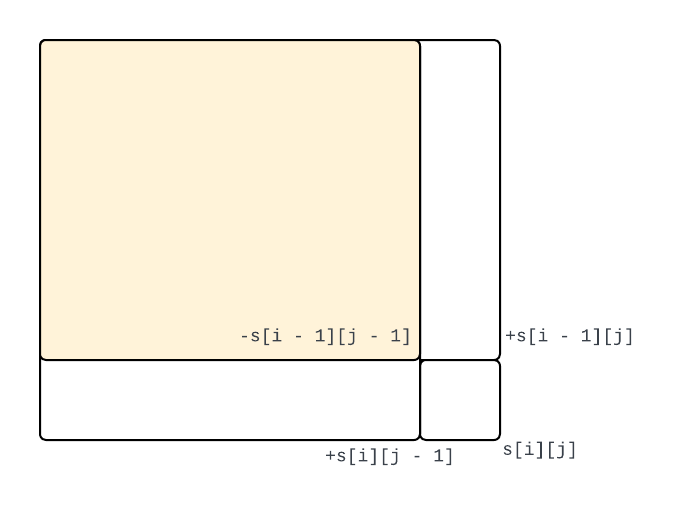
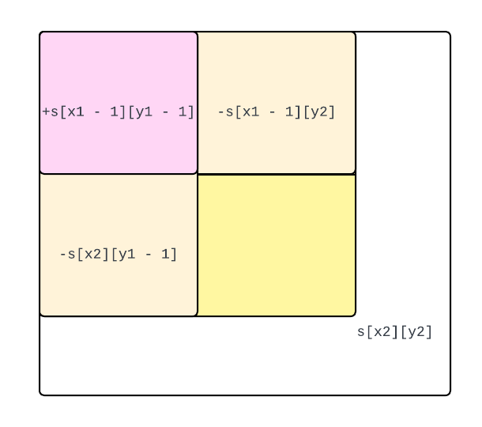
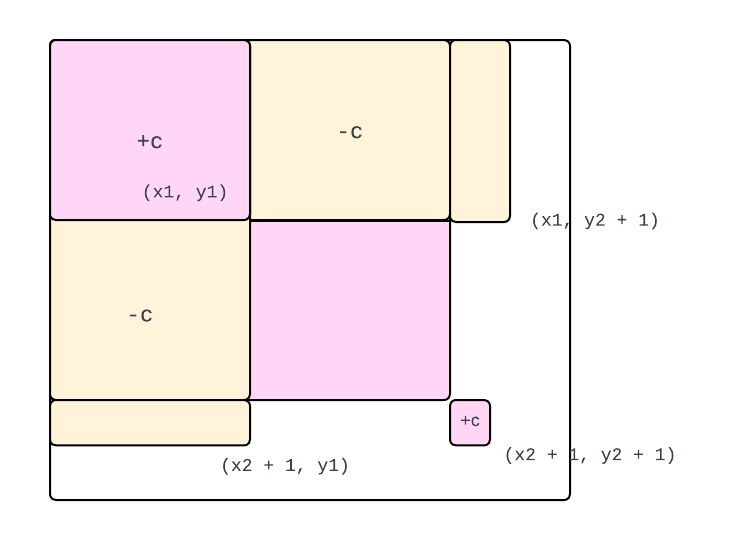

## 一维前缀和模板

> https://www.acwing.com/problem/content/797/

一维前缀和能够在$O(n)$预处理数组的前提下, 用$O(1)$的时间复杂度获取数组子串$[l, r]$的元素之和.

```cpp
#include <iostream>

using namespace std;

const int N = 100010;

int n, m;
int s[N];

int main()
{
    cin >> n >> m;
    /* 下标从1开始 */
    for (int i = 1; i <= n; i ++)
    {
        cin >> s[i];
        s[i] += s[i - 1];
    }
    
    while (m --)
    {
        int l, r;
        cin >> l >> r;
        cout << s[r] - s[l - 1] << endl;
    }
    return 0;
}
```


## 二维前缀和模板

> https://www.acwing.com/problem/content/798/

二维前缀和能够在预处理数组的前提下, 用$O(1)$的时间复杂度获取子矩阵元素之和.

预处理的示意图:



计算的示意图:



```cpp
#include <iostream>

using namespace std;

const int N = 1010;

int n, m, q;
int s[N][N];

int main()
{
    cin >> n >> m >> q;
    
    for (int i = 1; i <= n; i ++)
        for (int j = 1; j <= m; j ++)
        {
            cin >> s[i][j];
            s[i][j] += s[i - 1][j] + s[i][j - 1] - s[i - 1][j - 1];
        }
    
    while (q --)
    {
        int x1, y1, x2, y2;
        cin >> x1 >> y1 >> x2 >> y2;
        
        printf("%d\n", s[x2][y2] + s[x1 - 1][y1 - 1] - s[x1 - 1][y2] - s[x2][y1 - 1]);
    }
    return 0;
}
```


## 一维差分模板

> https://www.acwing.com/problem/content/799/

一维差分能够在预处理数组的前提下, 用$O(1)$的时间复杂度将子数组中的所有元素加上一个$c$.

```cpp
#include <iostream>

using namespace std;

const int N = 100010;

int n, m;
int a[N];

void insert(int l, int r, int c)
{
    a[l] += c;
    a[r + 1] -= c;
}

int main()
{
    cin >> n >> m;
    /* 注意下标是1 */
    for (int i = 1; i <= n; i ++)
    {
        int x;
        cin >> x;
        insert(i, i, x);
    }
    
    while (m --)
    {
        int l, r, c;
        cin >> l >> r >> c;
        insert(l, r, c);
    }
    
    for (int i = 1; i <= n; i ++) a[i] += a[i - 1];
    for (int i = 1; i <= n; i ++) printf("%d ", a[i]);
    
    return 0;
}
```


## 二维差分模板

> https://www.acwing.com/problem/content/800/



```cpp
#include <iostream>

using namespace std;

const int N = 1010;

int n, m, q;
int a[N][N];

void insert(int x1, int y1, int x2, int y2, int c)
{
    a[x1][y1] += c;
    a[x1][y2 + 1] -= c;
    a[x2 + 1][y1] -= c;
    a[x2 + 1][y2 + 1] += c;
}

int main()
{
    cin >> n >> m >> q;
    for (int i = 1; i <= n; i ++)
        for (int j = 1; j <= m; j ++)
        {
            int x;
            cin >> x;
            insert(i, j, i, j, x);
        }
    
    while (q --)
    {
        int x1, y1, x2, y2, c;
        cin >> x1 >> y1 >> x2 >> y2 >> c;
        insert(x1, y1, x2, y2, c);
    }
    
    for (int i = 1; i <= n; i ++)
        for (int j = 1; j <= m; j ++)
            a[i][j] += a[i - 1][j] + a[i][j - 1] - a[i - 1][j - 1];
    
    for (int i = 1; i <= n; i ++)
    {
        for (int j = 1; j <= m; j ++)
            printf("%d ", a[i][j]);
        puts("");
    }
    return 0;
}
```


## 和为K的子数组

> https://leetcode.cn/problems/subarray-sum-equals-k/

要统计数组中有多少个子区间之和是$k$, 等价于在前缀和数组中, 假设固定$i$, 求有多少个$j \in [0, 1, ..., i - 1]$, 使得$s[i] - s[j] = k$, 也就是求有多少个$s[j]$, 使得$s[j] = s[i] - k$, 这个可以用哈希表来做.

```cpp
class Solution {
public:
    int subarraySum(vector<int>& nums, int k) {
        int n = nums.size();
        vector<int> s(n + 1);

        for (int i = 1; i <= n; i ++) s[i] = s[i - 1] + nums[i - 1];

        int res = 0;
        unordered_map<int, int> hash;
        // s[0] = 0出现1次
        hash[0] = 1;
        
        for (int i = 1; i <= n; i ++) {
            res += hash[s[i] - k];
            hash[s[i]] ++;
        }
        return res;
    }
};
```

