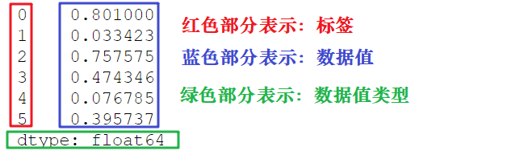
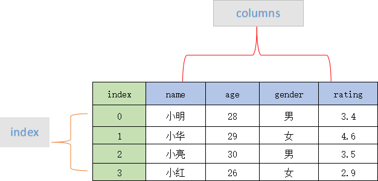

## `Series`

Pandas中用Series描述一维数组, 其中包含三个部分:



创建Series需要用:

```python
s = pd.Series(data, index, dtype)
```

* `data`: 一般是一个一维的列表.
* `index`: 标签, 可以是对应的字符串列表, 如果没有传递默认是`range(n)`.
* `dtype`: 没有传会自动推断.

可以用字典为基础创建Series:

```python
data = {
  "a": 0,
  "b": 1,
  "c": 2
}

s = pd.Series(data)
```

* Series可以用位置下标`data[0]`访问, 也可以用标签访问`data['a']`.


## `DataFrame`

Pandas中用`DataFrame`描述表格类的数据结构, `DataFrame`同时具有两个维度的标签:



### 创建DataFrame

创建DataFrame的api是:

```python
pd.DataFrame(data, index, column, dtype)
```

* 其中`index`和`column`是行列标签, 如果没有就会指定成`range(n)`.

一般来说, 这里的`data`常见的有如下形式:

* 二维数组/字典数组: 数组中的每个元素是DataFrame中的一行数据:

  ```python
  # 二维数组
  import pandas as pd
  data = [['Alex',10],['Bob',12],['Clarke',13]]
  df = pd.DataFrame(data,columns=['Name','Age'])
  
  #      Name      Age
  #0     Alex      10
  #1     Bob       12
  #2     Clarke    13
  
  # 字典数组
  import pandas as pd
  data = [{'a': 1, 'b': 2},{'a': 5, 'b': 10, 'c': 20}]
  df = pd.DataFrame(data)
  print(df)
  
  #    a    b      c
  # 0   1   2     NaN
  # 1   5   10   20.0
  ```

* 字典: 字典中每一个键值对对应一列, key就表示列标签:

  ```python
  import pandas as pd
  data = {'Name':['Tom', 'Jack', 'Steve', 'Ricky'],'Age':[28,34,29,42]}
  df = pd.DataFrame(data)
  print(df)
  
  #      Age      Name
  #0     28        Tom
  #1     34       Jack
  #2     29      Steve
  #3     42      Ricky
  ```


### 列标签操作

* 用`df['column_key']`可以拿到DataFrame中的一列, 数据格式是Series.
* `df['column_key'] = value`可以在DataFrame中插入一列.


### 行标签操作

* 用`df.loc['row_key']`可以拿到DataFrame中一行, 数据格式也是Series.
* 可以用`df.iloc[2]`拿到第3行, 整数索引.


## 描述性统计

* 计算方向:

  * `axis=0`: 每一列当一个Series, 求一个值, 最终保留列标签.
  * `axis=1`: 每一行当一个Series, 求一个值, 最终保留行标签.

  

* 常见的函数:
  * `mean()`: 均值.
  * `std()`标准差.


## `loc`和`iloc`

* `loc[]`:
  * `loc`只能使用标签索引.
  * `.loc['a']`: 行标签拿到一行.
  * `.loc['a':'d']`: 从`a`行到`d`行的数据, 闭区间.
  * `loc[:, 'a']`: 拿到`a`这一列.
    * 也就是说, 第一个是行相关的位置信息, 第二个是列相关的位置信息.
* `iloc[]`: `iloc`和`loc`用法基本相同, 不同在于:
  * `iloc[]`里面只能是整数.
  * `iloc[]`用的切片是前闭后开的区间.


## 统计函数

* 相关系数: `df.corr()`可以显示每一列的相关系数.
  * `df['b'].corr(df['c'])`可以求两个Series之间的相关系数.


## 窗口函数

* 什么意思: 窗口函数表示在某个方向上(`axis`), 在某一个窗口中, 按照某种函数, 把窗口内的值变成一个值, 然后存储在窗口最后一个元素的位置上.
  * 不够窗口大小的前几个值就是`NaN`.

* API: `df.rolling(window=3).mean()`: 窗口均值函数:

  ```python
                     A         B         C        D
  2020-12-01  0.580058 -0.715246  0.440427 -1.106783
  2020-12-02 -1.313982  0.068954 -0.906665  1.382941
  2020-12-03  0.349844 -0.549509 -0.806577  0.261794
  2020-12-04 -0.497054  0.921995  0.232008 -0.815291
  2020-12-05  2.658108  0.447783  0.049340  0.329209
  2020-12-06 -0.271670 -0.070299  0.860684 -0.095122
  2020-12-07 -0.706780 -0.949392  0.679680  0.230930
  2020-12-08  0.027379 -0.056543 -1.067625  1.386399
  
  # 处理之后
                     A         B         C         D
  2020-12-01       NaN       NaN       NaN       NaN
  2020-12-02       NaN       NaN       NaN       NaN
  2020-12-03 -0.128027 -0.398600 -0.424272  0.179317
  2020-12-04 -0.487064  0.147147 -0.493745  0.276481
  2020-12-05  0.836966  0.273423 -0.175076 -0.074763
  2020-12-06  0.629794  0.433160  0.380677 -0.193734
  2020-12-07  0.559886 -0.190636  0.529901  0.155006
  2020-12-08 -0.317024 -0.358745  0.157580  0.507402
  ```


## 处理NaN

* 用0替换NaN: `df.fillna(0)`
* 向前填充: 这个`NaN`用上一行的非NaN数据进行填充: `df.fillna(method='ffill')`, 也有向后填充, `method`是`bfill`.
* `df.dropna()`: 如果某一行存在NaN, 删除整行.
  * `axis=1`: 如果某一列存在NaN, 删除整列.


## 时间处理

### 日期字符串转为`datetime`

* 用`datetime`中的`strptime()`方法:

  ```python
  from datetime import datetime
  
  #将日期定义为字符串    
  date_str1 = 'Wednesday, July 18, 
  
  #将日期转化为datetime对象 
  dmy_dt1 = datetime.strptime(date_str1, '%A,%B%d,%Y') 
   
  #处理为相同格式，并打印输出
  print(dmy_dt1) 
  
  ```

  * 需要提供日期字符串和占位符.
  * 其中, 每一种日期都有对应的占位符, 可以自己查, 例如`%y`表示两位数年份, `%d`表示月内的某一天.


## 画图

Pandas对matplotlib做了简单的封装.


### 折线图

* 直接用`df.plot()`, 每一列都是一个曲线, 横轴是行标签, 有很多曲线.


