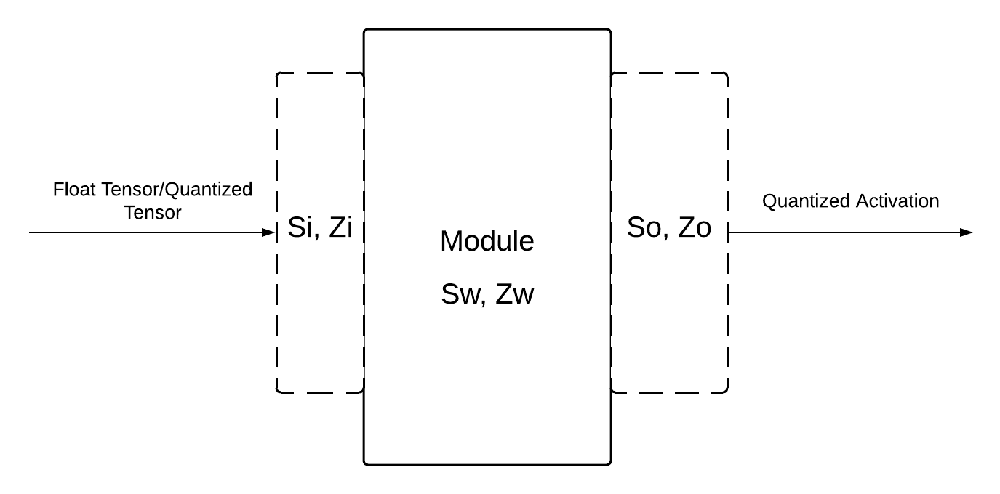

[toc]


## 模型量化的理论基础


### 基本公式

* 浮点数量化本质上是一个离散化算法, 这个算法将范围内的浮点数映射到整数.
  * 假设整数的取值范围是$[I_{min}, I_{max}]$, 浮点数的取值范围是$[f_{min}, f_{max}]$.
  * 对于一个浮点数$f$, 映射到对应整数$I$的方式可以是一种线性量化:

$$
I = round[I_{min} + \frac{I_{max} - I_{min}}{f_{max} - f_{min}} \times (f - f_{min})]
$$

* 这种线性量化方式有两个问题:

  * $[f_{min}, f_{max}]$过于庞大, 导致很多浮点数都会映射到同一个整数$I$, rounding error过大.
    * 解决方案: 在进行量化之前, 对于张量中的浮点数, 动态统计$f_{min}$和$f_{max}$, 然后映射, 统计的过程叫做Calibration.
  * $f_{min}$和$f_{max}$距离数据分布集中的地方较远
    * 解决方案: Calibration的过程中, 将$f_{min}$和$f_{max}$的值设置成数据分布集中区域的下界和上界, 超出上下界的部分直接映射成上下界, 这个过程叫clip.

* 实际的线性量化一般有两个参数分别是$s, z$, 其中$s$都是浮点数而$z$是整数, 量化方式为:
  $$
  I = clip[round(\frac{f}{s} + z),\ INT\_MAX,\ INT\_MIN]
  $$

  * 其中, $s = \frac{f_{max} - f_{min}}{q_{max} - q_{min}}$, 其中$q_{max}, q_{min}$表示量化后整数数据类型的最大/最小值, $f_{max}, f_{min}$表示经过Calibration统计出的浮点数最大值和最小值.
  * $z$表示浮点数的0.0映射到整数的位置.


### 矩阵乘法的量化

* 假设矩阵乘法$C = A \times B$, 每个矩阵的量化参数分别为:

  * $A: S_a, Z_a$
  * $B: S_b, Z_b$
  * $C: S_c, Z_c$

  * 注意: 在AI模型中, 其中的一个矩阵一般是Weights, 另一个矩阵是Activation, 得到的计算结果是下一层的Activation, Weights和Activation的量化参数一般是在Calibration阶段得到的.

* 矩阵乘法可以写成:

$$
S_c(Q_c - Z_c) = S_a(Q_a - Z_a) \times S_b(Q_b - Z_b)
$$

* 整合后可以变成:
  $$
  Q_c = \frac{S_aS_b}{S_c}(Q_a - Z_a)(Q_b - Z_b) + Z_c = MQ + Z_c
  $$

* 其中, 除了$M = \frac{S_aS_b}{S_c}$以外, 所有的运算都是整数运算, $Q$可以提前计算好, 那么如何将$M$进行量化?

  * 首先, 经过大量实验统计, $M$的范围都在$(0, 1)$范围内, 那么$M$就可以写成$M = M_0 \times 2^{-n}$, 相当于把一个整数小数点向左移动$n$位, $n$可以提前计算出来.

* 自此, 就完成了矩阵乘法的量化, 卷积可以等价为矩阵乘法, 也可以量化.


### 量化模型的基本结构



* 输入量化模型的Tensor可以是浮点/量化后的Activation.
* 模型的每一层前后都会保存输入的Activation和输出的Activation的量化参数(量化参数可以体现Tensor的分布).
* 每次infer时, 都会通过$Q_c = M_0 \times 2^{-n}(Q_a - Z_a)(Q_b - Z_b) + Z_c$进行输出, 输出的结果是量化后的Activation.


### ReLU的量化

* 没有量化的ReLU是:
  $$
  ReLU(x) = max(x, 0)
  $$

* 量化后的ReLU是:
  $$
  ReLU(x) = max(x, Z_o) = max(x, Z_i)
  $$
  
* 推导:
  * ReLU之后, 数据的分布会发生变化, 小于0的部分都会消失, 那么经过Calibration, $S_o, Z_o$都会发生变化.
  * 但是实际上, 大于0的部分都没有变化, 如果要将这部分反量化, 就必须用原来的$S_i, Z_i$.
  * 因此, 对于ReLU这个模块, 必须让$S_i = S_o, Z_i = Z_o$.


### Conv2d+BatchNorm

* 在推理阶段, `Conv2d`层可以和`BatchNorm`层进行合并.

* BatchNorm的计算过程如下, 假设batch size是`m`, $X_i, i \in [1, m]$是Batch中的一个数据.

  * 首先计算均值和标准差:
    $$
    \mu = \frac{1}{m} \sum_{i=1}^mX_i\\\sigma = \sqrt{\frac{1}{m}\sum_{i=1}^{m}(X_i - \mu)^2}
    $$
    
  * 然后将Batch中的每一个张量进行变换:
    $$
    Y_i = \gamma\frac{X_i  - \mu}{\sigma + \epsilon} + \beta
    $$
    
    * 其中$\gamma$和$\beta$是BatchNorm的可学习参数, 在推理阶段, 参数是固定的.
  
* 卷积层的计算过程可以表示为: $Z = WX_i + B$.

* 卷积层和BatchNorm层的输出可以表示为:
  $$
  Y_i = \gamma\frac{WX_i + B  - \mu}{\sigma + \epsilon} + \beta = \\ \frac{\gamma W}{\sigma + \epsilon}X_i + \frac{\gamma (B - \mu)}{\sigma + \epsilon} + \beta
  $$

  * 在推理的阶段, 所有的参数都是固定的, 只要把BatchNorm的参数合并到Conv2d即可.


### Conv2d+ReLU

* `Conv2d`和`ReLU`只有在量化的时候才能合并, 如果是全精度模型则无法合并.

* 假设一个网络模块是`->Conv2d -> ReLU->`.
  * 此时, 我不统计`Conv2d->ReLU`之间的这个Activation的量化参数, 只统计输入`Conv2d`的量化参数$S_i, Z_i$, 和ReLU输出的量化参数$S_o, Z_o$.
  * 然后, 我把`Conv2d->ReLU`合并成一个模块`Conv2dReLU`, 直接用$S_i, Z_i, S_o, Z_o$作为前后Activation的量化参数, 就完成了Conv2d和ReLU的合并.
  * 这个操作的本质是利用量化本身的`clip`操作实现ReLU.


### Eltwise Add量化

* Eltwise Add就是对相同尺寸/广播之后相同尺寸的张量, 按照元素级别进行相加.

* 首先对于$f_3 = f_1 + f_2$, 用量化的式子展开:
  $$
  S_3(Q_3 - Z_3) = S_1(Q_1 - Z_1) + S_2(Q_2 - Z_2)
  $$

* 整理之后, 可以变成:
  $$
  Q_3 = \frac{S_1}{S_3}(Q_1 - Z_1) + \frac{S_2}{S_3}(Q_2 - Z_2) + Z_3
  $$
  

* 其中的$\frac{S_1}{S_3}$和$\frac{S_2}{S_3}$可以用定点模拟.


### Concat量化

* Concat操作就是拼接两个张量, 例如:
  $$
  f_3 = [f_1, f_2]
  $$
  

* 量化:
  $$
  S_3(Q_3 - Z_3) = [S_1(Q_1 - Z_1), S_2(Q_2 - Z_2)]
  $$
  

* 那么最后结果就是:
  $$
  Q_3 = [\frac{S_1}{S_3}(Q_1 - Z_1) + Z_3, \frac{S_2}{S_3}(Q_2 - Z_2) + Z_3]
  $$
  


## 模型量化pipeline


### 指定量化后端

* 首先, 需要明确模型需要跑在什么架构上, 然后指定后端:

  ```python
  # x86架构
  torch.backends.quantized.engine = 'x86'
  # ARM架构
  torch.backends.quantized.engine = 'qnnpack'
  ```


### 量化分类

* 量化大体上可以分为两类:

  * Post Training Quant: 训练结束后, 将模型进行量化.
  * Quant-Aware Training: 量化参数会作为可学习参数, 让模型进行训练.

* Pytorch中, 有两种执行模式, 分别是Eager Mode和FX Graph Mode, 两种执行模式下量化的实现方式不同.

  * 如果需要用FX Graph Mode, 模型需要满足`symbolic traceable`, 判定条件是下面的代码不会出现异常:

    ```python
    import torch
    traced_model = torch.fx.symbolic_trace(model)
    ```

    * `einops`中的`Rearrange, rearrange`操作不满足`symbolic traceable`, 可以用`torch`的原生操作`permute`或者`view`代替.
    * 一般来说, 不含控制流的模型都可以满足`symbolic traceable`, 例如CV类模型.

### Observer

* Observer是一种算法, 用于根据观测到的浮点数据调整量化参数.

  * pytorch中是: `torch.ao.quantization.observer`.

* Observer是一个类, 其中常用的参数是:

  * `dtype`: 量化的数据类型, 默认是`torch.quint8`.

  * `quant_min`: 指定量化后数据的最小值, 默认是`None`, 表示使用0.

  * `quant_max`: 指定量化后数据的最大值, 默认是`None`, 表示使用255 (`torch.quint8`的最大值).

  * `qscheme`: 用来指定量化的类型和粒度, 常用的有如下几个:

    * `torch.per_tensor_affine`
    * `torch.per_channel_affine`
    * `torch.per_tensor_symmetric`
    * `torch.per_channel_symmetric`

  * `reduce_range`: 是一个`bool`值, 如果是`True`, 那么会在原来的量化范围下进行缩减, 具体看下表:

    | 类型                   | `quant_min` | `quant_max` |
    | ---------------------- | ----------- | ----------- |
    | `qint8`                | -128        | 127         |
    | `qint8 reduced range`  | -64         | 63          |
    | `quint8`               | 0           | 255         |
    | `quint8 reduced range` | 0           | 127         |

    

* Activation常用的Observer:

  * Activation一般使用`torch.quint8`类型.
  * Activation一般采用`torch.per_tensor_affine`量化.
  * `HistogramObserver`: 会采用一个直方图记录Activation的分布情况, 并且根据分布情况计算出最合适的`scale`和`zero point`.

* Weights常用的Observer:

  * Weights一般使用`torch.int8`类型.
  * Activation一般采用`torch.per_channel_symmetric`量化.
  * Weights可以直接采用封装好的Observer: `torch.ao.quantization.default_fused_per_channel_wt_fake_quant`来调试.


### FakeQuantize

* `FakeQuantize`是一个模块, 用来模拟量化和反量化的操作:

  * 这个模块在: `torch.ao.quantization.fake_quantize`中.

  * 这个模块的运算是:

    ```txt
    x_out = ( 
    	clamp( 
    		round( x / scale + zero_point ), quant_min, quant_max
    	) - zero_point
    ) * scale
    ```

* `FakeQuantize`也是一个类, 最常用的参数是`observer`, 用来指定需要用到的`Observer`类.

### QConfig/QConfigMapping

* `QConfig`用来配置Activation和Weights所用到的FakeQuantize类.

  * `QConfig`在`torch.ao.quantization`中.
  * `QConfig`有`weight`和`activation`两个参数, 用来指定对应的FakeQuantize类.

* `QConfigMapping`用来将模型不同模块映射到不同的`QConfig`.

  ```python
  # 对模型所有模块用一个QConfig
  qconfig_mapping = QConfigMapping().set_global(global_qconfig)
  ```


### Post Training Quant

#### FX Graph Mode

```python
import torch
from tqdm import tqdm
from torchinfo import summary
from torch.ao.quantization import QConfig, QConfigMapping
from torch.ao.quantization.fake_quantize import FakeQuantize
from torch.ao.quantization.observer import HistogramObserver
from torch.ao.quantization.quantize_fx import prepare_fx, convert_fx
from torch.profiler import profile, record_function, ProfilerActivity


def calibration(dataset, model):
	logger.info('FX static calibration...')
	with torch.inference_mode():
    # 选取一些典型的input, 放到这里进行推理
		for i in tqdm(range(20)):
			data, target = dataset.signal_list[i], dataset.target_list[i]
			data = data.unsqueeze(0)
			output = model(data)

# 测试模型性能
def evaluate_performance(model):
	torch.set_num_threads(1)
	example_input = torch.randn(1, 8, 500)
	with profile(activities=[ProfilerActivity.CPU], record_shapes=True) as prof:
		with record_function("model_inference"):
			model(example_input)
  # 函数会打印模型的CPU time
	print(prof.key_averages().table(sort_by="cpu_time_total", row_limit=10))


# 指定量化的后端
torch.backends.quantized.engine = 'qnnpack'

# Activation的量化配置
act_fake_quant = FakeQuantize.with_args(observer=HistogramObserver.with_args(
	reduce_range=False,
	dtype=torch.quint8, quant_min=0, quant_max=255,
	qscheme=torch.per_tensor_affine,
))

# Weight的量化配置
wt_fake_quant = torch.ao.quantization.default_fused_per_channel_wt_fake_quant

# 构建QConfigMapping
global_qconfig = QConfig(
	activation=act_fake_quant, weight=wt_fake_quant
)
qconfig_mapping = QConfigMapping().set_global(global_qconfig)

example_input = torch.randn(1, 8, 500)
fake_quant_model = prepare_fx(model, qconfig_mapping, (example_input,))

dataset = Benchmark()

# Calibration确定量化参数
calibration(dataset, fake_quant_model)

# 将Fake Quantized模型转换为真实的int8模型
quant_model = convert_fx(fake_quant_model)
torch.save(quant_model.state_dict(), 'model/fx_static_model.pth')

logger.info('Evaluating PTQ FX Mode Static Quant...')

# 测试量化后模型的准确率和推理时间
evaluate_performance(quant_model)
evaluate_accuracy(quant_model, dataset)

```


#### Eager Mode


### Quant-Aware Training

#### FX Graph Mode

```python
import torch
from tqdm import tqdm
from torchinfo import summary
from torch.ao.quantization import QConfig, QConfigMapping
from torch.ao.quantization.quantize_fx import prepare_fx, convert_fx, prepare_qat_fx
from torch.profiler import profile, record_function, ProfilerActivity
from torch.ao.quantization.observer import HistogramObserver, PerChannelMinMaxObserver
from torch.ao.quantization._learnable_fake_quantize import _LearnableFakeQuantize as LearnableFakeQuantize


# 设置后端
torch.backends.quantized.engine = 'qnnpack'
# 利用
act_learnable = lambda range: LearnableFakeQuantize.with_args(
		observer=HistogramObserver,
		quant_min=0,
		quant_max=255,
		dtype=torch.quint8,
		qscheme=torch.per_tensor_affine,
		scale=range / 255.0,
		zero_point=0.0,
		use_grad_scaling=True,
)
# Weight中如果有Conv2d, 那么这个模块就有channel, 用per channel
wt_learnable = lambda channels: LearnableFakeQuantize.with_args(
		observer=PerChannelMinMaxObserver,
		quant_min=-128,
		quant_max=127,
		dtype=torch.qint8,
		qscheme=torch.per_channel_symmetric,
		scale=0.1,
		zero_point=0.0,
		use_grad_scaling=True,
		channel_len=channels,
)

# 全局的一些量化配置
act_fake_quant = LearnableFakeQuantize.with_args(observer=HistogramObserver.with_args(
	reduce_range=False,
	dtype=torch.quint8, quant_min=0, quant_max=255,
	qscheme=torch.per_tensor_affine,
))
wt_fake_quant = torch.ao.quantization.default_fused_per_channel_wt_fake_quant
global_qconfig = QConfig(
	activation=act_fake_quant, weight=wt_fake_quant
)
qconfig_mapping = QConfigMapping().set_global(global_qconfig)

# 给卷积模块设置activation和weight的LearnableFakeQuantize
for name, module in model.named_modules():
	if hasattr(module, 'out_channels'):
		qconfig = torch.quantization.QConfig(
			activation=act_learnable(range=2),
			weight=wt_learnable(channels=module.out_channels)
		)
		qconfig_mapping.set_module_name(name, qconfig)

example_input = torch.randn(1, 8, 500)
qat_model = prepare_qat_fx(model, qconfig_mapping, (example_input,))

# Training on qat_model
trainer = Trainer(qat_model)
qat_model = trainer.start_train()

# Convert it to true model
quant_model = convert_fx(qat_model)
logger.info('Saving Quant Model...')
torch.save(quant_model.state_dict(), 'model/qat_model.pth')

dataset = Benchmark()
logger.info('Evaluating QAT Quant...')
evaluate_performance(quant_model)
evaluate_accuracy(quant_model, dataset)
```


#### Eager Mode


## Pytorch量化的一些问题

> 在卷积等操作中, 会出现相乘再相加这种情况, 如果若干个`int8`相乘相加, 可能会爆`int8`, 怎么办?

* 用`int32`来存储中间结果.
* 最后再通过`Requantize`这个操作, 将`int32`转为`int8`.


> 量化涉及到哪些计算图层面的优化?

* 在可量化的算子序列前后插入了`Quantize`和`Dequantize`模块.
* 可量化的算子序列中, 有可能会出现算子融合.


> 量化后的`int8`模型总会带来推理速度的提升吗?

* 不一定, `Quantize`和`Dequantize`模块插入过多, 会对量化造成影响.
* 如果可量化的算子比较分散, 那么`Quantize`和`Dequantize`会过多, 可能推理速度会下降.


> 量化后的`int8`模型的精度下降太多, 可能有哪些原因? 怎么改进?

* Calibration的数据集不够具有代表性.
* 某些浮点算子不应该被量化, 例如`softmax`函数.
