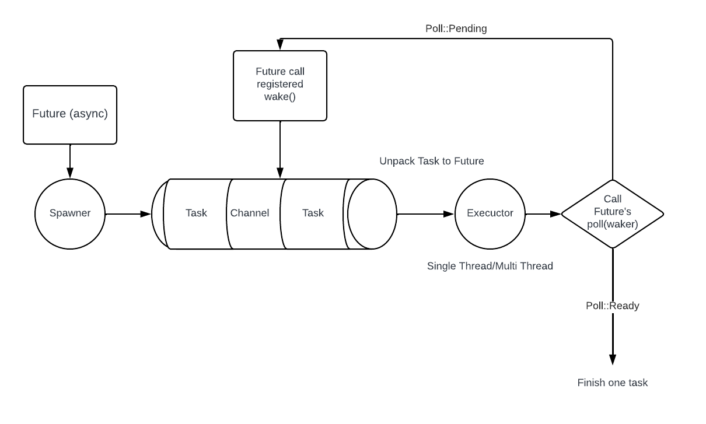

## 依赖

```toml
# Cargo.toml
[dependencies]
futures = "0.3"
```


## async/await

* 在Rust中, 使用`async`标记的语法, 会被转换为实现了`Future` trait的状态机.
  * 调用`async`函数会返回`impl Future`.

* 当`Future`执行遇到阻塞, 会让出当前线程的执行权, 转去执行其他`Future`.

* 对一个`Future`进行`.await`, 可以让一个`Future`等待另一个`Future`的完成, 这种等待不会阻塞当前线程, 也会让出执行权.
* Rust中的`Future`是惰性的, 需要有一个执行器/调用`.await`的时候才会执行.

```rust
use futures::executor::block_on;

async fn hello_world() {
    println!("hello world");
}

async fn hello_new_world() {
    // 对一个Future进行await
    hello_world().await;
    println!("Hello new world");
}

fn main() {
    let future = hello_new_world();
    // Future的执行器block executor
    block_on(future);
}
```


## 异步运行时的原理

### Future trait

```rust
trait SimpleFuture {
    type Output;
    fn poll(&mut self, wake: fn()) -> Poll<Self::Output>;
}
enum Poll<T> {
    Ready(T),
    Pending,
}
```

* 其中`Output`是Future执行后返回值类型.
* `poll`方法是Executor调用, 来让`Future`执行的, 它有两种可能的返回结果:
  * `Ready(T)`: 表示Future执行完成了, 并且正确返回了结果.
  * `Pending`: Future无法在此次轮询中完成, 但是Executor给了他一个`wake`方法, 这个方法的语义是:
    * `Future`将来能执行的时候, 会调用`wake`, 唤醒Executor.
    * Executor被唤醒后, 再次调用这个`Future`的`poll`方法重新执行.

依照这个API模型, 我们可以构建多个`Future`并发运行, 和多个`Future`链式运行这两种模型:

并发运行的代码如下:

```rust
trait SimpleFuture {
    type Output;
    fn poll(&mut self, wake: fn()) -> Poll<Self::Output>;
}

enum Poll<T> {
    Ready(T),
    Pending,
}

// 存储两个并发异步Future的结构体
pub struct Join<FutureA, FutureB> {
    // 这里类型设置成Option, 是因为后面要用take把值拿走, 让成员编程NULL
    // 以便后面不再调用poll轮询
    a: Option<FutureA>,
    b: Option<FutureB>
}

impl<FutureA, FutureB> SimpleFuture for Join<FutureA, FutureB> 
where
    FutureA: SimpleFuture<Output=()>,
    FutureB: SimpleFuture<Output=()>,
{
    type Output = ();
    // a的poll只要不能完, 就直接退出跳到b, 这就是并发poll
    // 有一个没完, 那么就用wake注册, 等着这个poll还会被调用
    fn poll(&mut self, wake: fn()) -> Poll<Self::Output> {
        // 从a中取出Future
        if let Some(a) = &mut self.a {
            // 对a中的Future调用poll, 如果成功就用take把a变成None
            if let Poll::Ready(()) = a.poll(wake) {
                self.a.take();
            }
        }
        // 从b中取出Future
        if let Some(b) = &mut self.b {
            if let Poll::Ready(()) = b.poll(wake) {
                self.b.take();
            }
        }
        // 如果a, b完了, 就可以了
        if self.a.is_none() && self.b.is_none() {
            Poll::Ready(())
        }
        else {
            Poll::Pending
        }
    }
}

```

链式运行的实例代码如下:

```rust
pub struct AndThenFut<FutureA, FutureB> {
    first: Option<FutureA>,
    second: FutureB,
}

impl<FutureA, FutureB> SimpleFuture for AndThenFut<FutureA, FutureB>
where
    FutureA: SimpleFuture<Output = ()>,
    FutureB: SimpleFuture<Output = ()>,
{
    type Output = ();
    fn poll(&mut self, wake: fn()) -> Poll<Self::Output> {
        if let Some(first) = &mut self.first {
            match first.poll(wake) {
                // 我们已经完成了第一个 Future， 可以将它移除， 然后准备开始运行第二个
                Poll::Ready(()) => self.first.take(),
                // 第一个Future完不成直接退, 不会跳到第二个Future, 这样就能实现第二个Future等待第一个Future完成后执行
                Poll::Pending => return Poll::Pending,
            };
        }

        // 运行到这里，说明第一个Future已经完成，尝试去完成第二个
        self.second.poll(wake)
    }
}
```


### Executor

* Executor负责执行Future, 它可以是单线程, 也可以是多线程.
* 具体的原理:



* Spawner负责包装Future, 生成Task, 并传输给Executor.

* Executor提取Future, 尝试调用`poll(waker)`.

  * 如果`Future`当时没有`ready`, 那么在他`ready`之后会调用`wake`方法, 让自己重新被发送给Executor.

  * 注意: Executor可能是多线程, 那么`Future`需要加`Mutex`.

* 结合IO多路复用(`epoll`)等机制, 如果返回`Poll::Pending`, 可以将`wake`函数传递到OS级别的I/O多路复用, 这样I/O好了之后, 就可以直接调用`wake`函数让`Future`可以执行.

