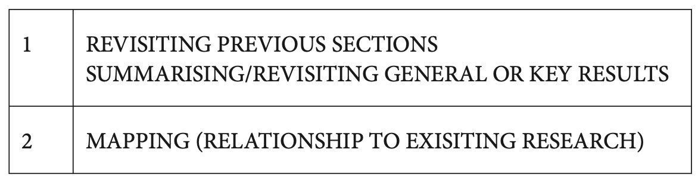
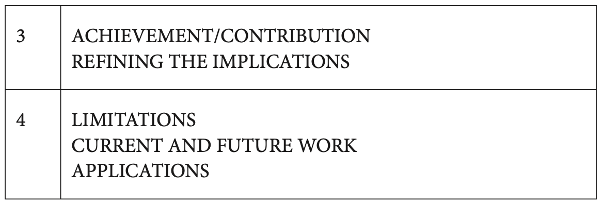

## Writing Model for Conclusion

### Basics

在这一部分, 要格外注意**情态动词**的用法, 一般有如下几个点:

* can和be able to:
  * can表示generally能, 但是be able to则有仅仅在某些场合下能, be able to更加安全一点.
* may/might:
  * 当你在使用may/might表示推测的时候, 你可以在后面加一个well, 表示stronger belief:
    * This may well be due to leakage.
  * might的推测确信度比may要小一点.
* can not和cannot:
  * 注意这两个完全不一样:
    * can not表示可能不行, 有推测成分, 和may not / might not一样.
    * cannot表示不可能, 和coult not, could not have, cannot have是一类的.
* must not表示不允许的意思, 而不是不可能的意思.

### Model

