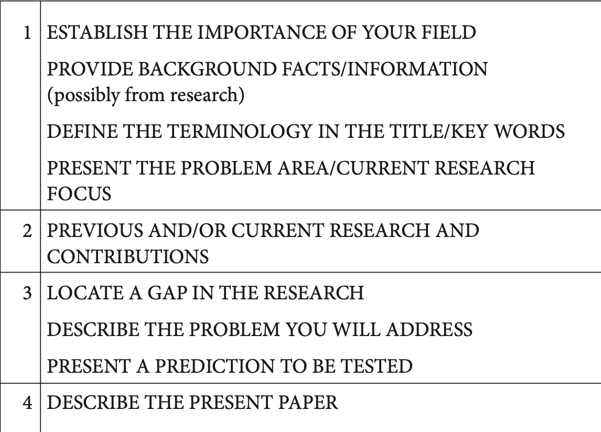

>原书链接: https://b1uedrops.github.io/static/books/sci-writing.pdf

## A Writing Model for Introduction

### Basics

#### Tense

在这一部分, 需要注意一下一般过去时, 一般现在时, 现在进行时和现在完成时.

1. 一般现在时和一般过去时:

   * 看如下两句话:
     * *We found that the pressure* **increased** *as the temperature* **rose**, which **indicated** *that temperature* **played** a significant role in the process.
     * *We found that the pressure* **increases** *as the temperature* **rises**, which **indicates** *that temperature* **plays** *a significant role in the process.*
   * 如果用一般现在时, 表示你认为你的成果, 是公认的事实, 如果你没有这个自信, 那么就用一般过去时, 表示这个finding仅局限于你自己的研究.

2. 一般过去时和现在完成时:

   * 如果用一般过去时, 那么表明你不在乎这个事情对目前的影响. 但是如果你用现在完成时, 说明你强调你叙述的这个事情对现在的影响., 例如下面这一段:

   *For example, Penney et al.* **showed** *that PLA composites could be prepared using blending techniques*6 *and more recently, Hillier* **established** *the toughness of such composites.*7 *However, although the effect of the rubber particles on the mechanical properties of copolymer systems* **was demonstrated** *over two years ago,*8 *little attention* **has been paid** *to the selection of an appropriate rubber component.*

   这里, 只有最后用了现在完成时, 说明只有最后这句话是和作者论文研究密切相关的, 作者要狠狠强调.

#### Sentence Connection

论文的句与句之间, 要注意一些Connection, 不要让句与句之间完全独立, 没有关系, 有一些方法:

* 前后句之间有重复关键词: *The pattern of inflammation during an asthma attack is different from that seen in stable asthma. In* **stable asthma** *the total number of inflammatory cells does not increase.*
* 用一些代词指代前句的对象: *Many researchers have suggested ways of reducing cost without affecting the quality of the image.* **These methods** *rely on data structures built during a preprocessing step.*
* 用`;`或者which从句连接句子:
  * *The procedure for testing whether components are operationally safe usually takes many hours;* *this means that tests are rarely repeated.*
  * *It has received much attention over the past few decades due to its biodegradable properties,* **which** *offer important economic benefits.*
* 用一些逻辑词进行连接.

#### Passive/Dummy Subject

* 你可以使用we来表示你的research team, 但是不能代表全人类(as we all know这种), 如果你想代表全人类, 那么就用被动语态, 例如It is known that, It is thought that...
* 当你想用`I`的时候, 用Dummy Subject代替, 例如This article, The present paper.

### Model

注意, 这个图的意思是, Introduction可以分四个部分, 每一个部分你可以写其中的任意一个主题, 具体要写什么主题需要看你要投的期刊/杂志的风格.

