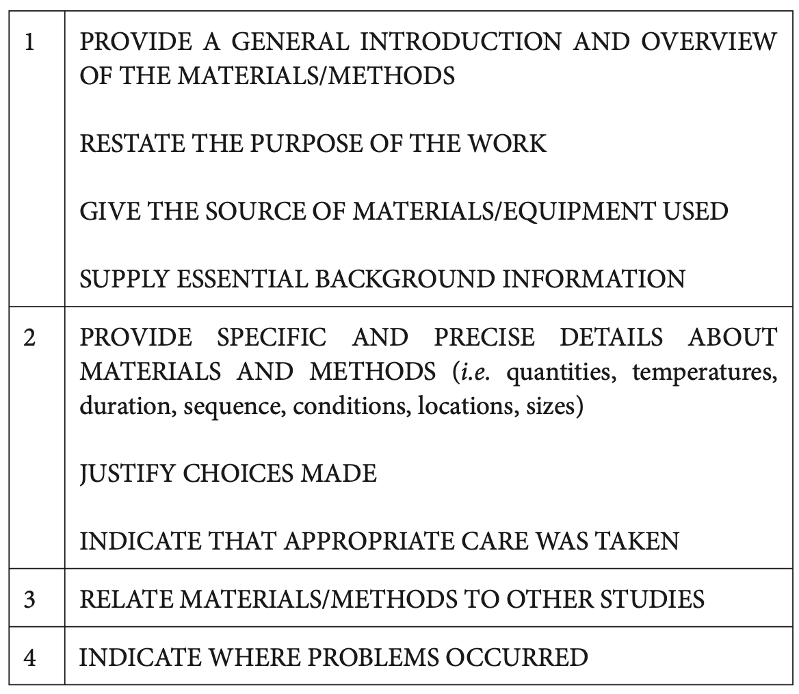

## Writing Model for Methodology

### Basics

1. **主动和被动语态的问题**:
   * 在这一部分, 如果你的paper是以团队为单位的, 那可以用主动语态, 比如we collected...
   * 但是, 如果这个paper是你solo的, 你不能说I collected..., 不合适, 因此就用被动语态(... was collected).
   * 一般的被动语态都是agent less passive, 即后面不加by ...
2. **一般现在时和一般过去时**: 当你在描述你的实验设置和实验过程时, 可以使用这两种时态, 但是怎么使用需要区分:
   * **一般现在时**: 如果实验的某些步骤/设置是墨守陈规, 大家都知道要这么做的, 那么就需要用一般现在时.
   * **一般过去时**: 如果实验中有你创新性/独立性的一些设置, 那就用一般过去时.
   * 这一部分可以尽量使用被动语态.
   * 如果你在比较你自己的工作和其他人的工作, 描述其他人工作的时候, 也需要使用一般过去时.
3. 上面通过时态区分你的工作和常规工作不太直观, 可以使用In this study, .../In this experiment, ...这种标志性的短语来标志你的工作, 同理, 其他人的工作用In their work/In that model.
4. **a和the的使用规则:**
   * 当你和你的reader都能够知道这是什么的时候, 用the.
     * 例1: *I bought a new computer but* **the** *keyboard was faulty.*
       * 当你提到computer这个概念的时候, 对于keyboard, 你和你的reader都知道这是什么, 用the.
   * 当你提到的这个东西, 只可能有一种东西对应的时候, 用the.
     * 例1: *Government policy is committed to protecting* **the** *environment.*
   * 当你提到的这个东西不重要的时候, 用a:
     * 例1: *The subject then spoke to an interviewer.* 
       * 是哪个Interviewer根本不重要.
   * 当你表达general truth的时候, 使用a, the和不用冠词没啥区别:
     * The electroencephalograph is a machine for measuring brain waves. 
     * An electroencephalograph is a machine for measuring brain waves. 
     * Electroencephalographs are machines for measuring brain waves.
   * 一个例子:
     * (a) *The nodes should be attached to* *two adjacent receptor sites*. (There are many receptor sites and any two adjacent ones will do.)
     * (b) *The nodes should be attached to* **the** *two adjacent receptor sites*. (There are only two receptor sites.)
   * 同时要狠狠注意a/an元音辅音的问题, a UV ray, an MRI.
5. **副词短语位置问题:**
   * 副词短语如果位置不合适很容易造成歧义:
     * *The patient was discharged from hospital after being shot in the back with a 9 mm gun.*
       * 这难道是在医院被射击的吗?
     * *He gave a lecture about liver cancer at the hospital last January.*
       * 这个句子介绍的是医院里的liver cancer还是在医院介绍liver cancer? 还是介绍的上个1月的liver cancer?
   * 因此, 尽量修改副词短语的位置, 让语义变得更加清晰:
     * *Last January he gave a lecture at the hospital; his subject was liver cancer*

### Model

