>
>
>原书链接: https://b1uedrops.github.io/static/books/sci-writing.pdf

## A Writing Model for Introduction

### Basics

#### Tense

在这一部分, 需要注意一下一般过去时, 一般现在时, 现在进行时和现在完成时.

1. 一般现在时和一般过去时:

   * 看如下两句话:
     * *We found that the pressure* **increased** *as the temperature* **rose**, which **indicated** *that temperature* **played** a significant role in the process.
     * *We found that the pressure* **increases** *as the temperature* **rises**, which **indicates** *that temperature* **plays** *a significant role in the process.*
   * 如果用一般现在时, 表示你认为你的成果, 是公认的事实, 如果你没有这个自信, 那么就用一般过去时, 表示这个finding仅局限于你自己的研究.

2. 一般过去时和现在完成时:

   * 如果用一般过去时, 那么表明你不在乎这个事情对目前的影响. 但是如果你用现在完成时, 说明你强调你叙述的这个事情对现在的影响., 例如下面这一段:

   *For example, Penney et al.* **showed** *that PLA composites could be prepared using blending techniques*6 *and more recently, Hillier* **established** *the toughness of such composites.*7 *However, although the effect of the rubber particles on the mechanical properties of copolymer systems* **was demonstrated** *over two years ago,*8 *little attention* **has been paid** *to the selection of an appropriate rubber component.*

   这里, 只有最后用了现在完成时, 说明只有最后这句话是和作者论文研究密切相关的, 作者要狠狠强调.

#### Sentence Connection

论文的句与句之间, 要注意一些Connection, 不要让句与句之间完全独立, 没有关系, 有一些方法:

* 前后句之间有重复关键词: *The pattern of inflammation during an asthma attack is different from that seen in stable asthma. In* **stable asthma** *the total number of inflammatory cells does not increase.*
* 用一些代词指代前句的对象: *Many researchers have suggested ways of reducing cost without affecting the quality of the image.* **These methods** *rely on data structures built during a preprocessing step.*
* 用`;`或者which从句连接句子:
  * *The procedure for testing whether components are operationally safe usually takes many hours;* *this means that tests are rarely repeated.*
  * *It has received much attention over the past few decades due to its biodegradable properties,* **which** *offer important economic benefits.*
* 用一些逻辑词进行连接.

#### Passive/Dummy Subject

* 你可以使用we来表示你的research team, 但是不能代表全人类(as we all know这种), 如果你想代表全人类, 那么就用被动语态, 例如It is known that, It is thought that...
* 当你想用`I`的时候, 用Dummy Subject代替, 例如This article, The present paper.

### Model

1. **Importance/Usefulness of the research topic.**
   
   * 一个例子: *Polylactide (PLA) has received much attention in recent years due to its biodegradable properties, which offer important economic benefits*.
   
   * 时态一般使用**现在完成时**或者**一般现在时**.
   
   * 一些句型储备:
   
     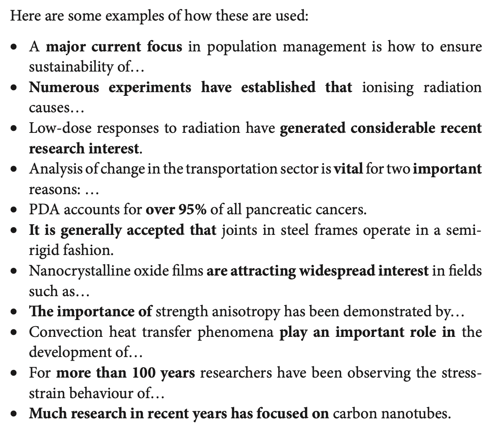
   
   * 一些词汇储备:

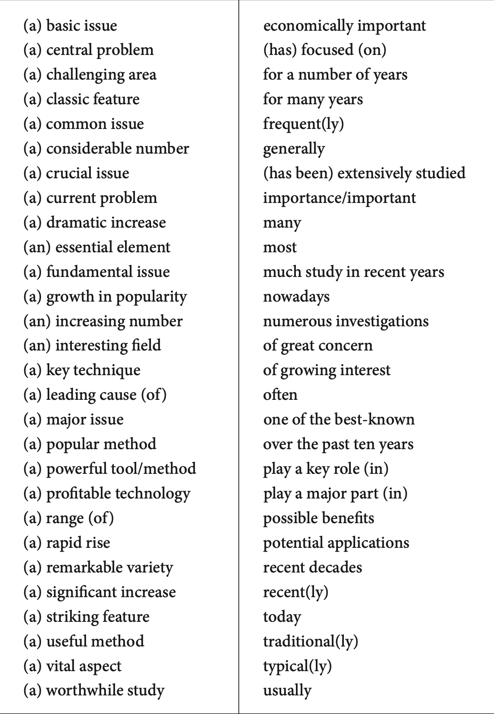

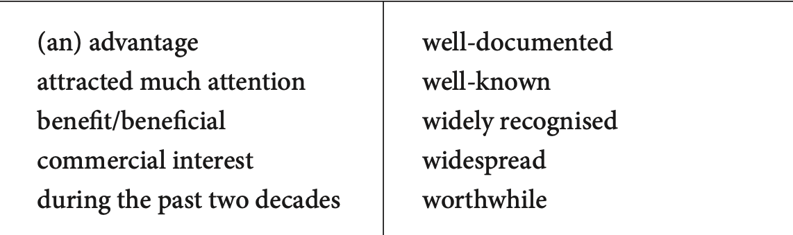

2. **Providing general background Information.**
   * 一个例子: *PLA is a polymer obtained from corn and is produced by the polymerisation of lactide*.
   * 如果你需要介绍多个背景信息, 从最简单, 最general的信息开始.
3. **Use reference to support the background info and your research importance/usefulness.**
   * 一个例子: *PLA has many possible uses in the biomedical field*[1] *and has also been investigated as a potential engineering material* [2],[3].
   * 注意, 这里引用的文献/作者需要比较专业一点, 因为要让你的读者一看这些文献, 就知道你们领域的主要玩家.
4. **Describe the big/general problem (using reference).**
   * 一个例子: *However, it has been found to be too weak under impact to be used commercially.*
   * 注意, 这里描述的问题越泛越好.
   * 至于参考文献, 如果这个问题大家都知道, 那就没必要引.
5. **Transition from general problem to literature review of methods.**
   * 一个例子: *One way to toughen polymers is to incorporate a layer of rubber particles.*
   * 这一部分就是从对大问题的描述转移到对经典解法的一个宏观review.
6. **Providing brief overview of key research projects in this area.**
   * 一个例子: *For example, Penney et al. showed that PLA composites could be prepared using blending techniques*6 *and more recently, Hillier*7 *established the toughness of such composites.*
   * 这一部分就是用参考文献对上面经典解法的review进行一个细致说明.

Review之前方法的时候可以使用这些词汇:

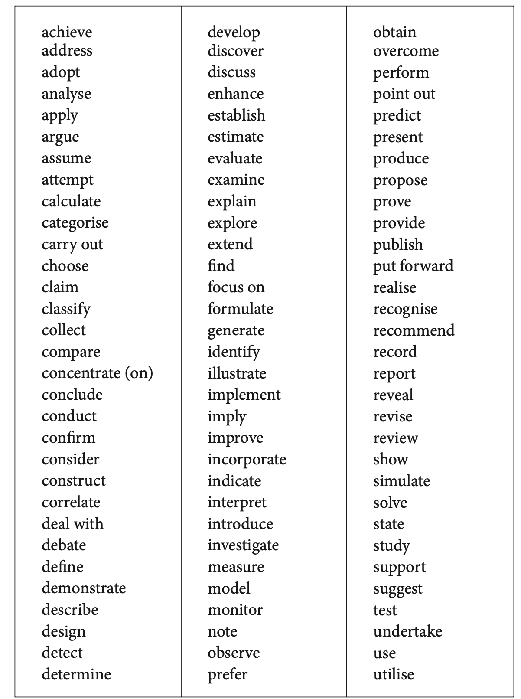

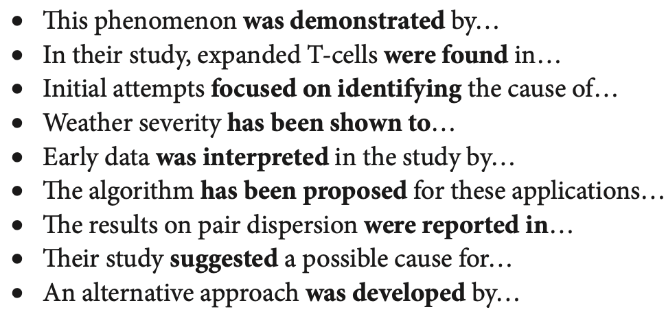

7. **Describe the gap in the research.**

   * 一个例子: *For example, Penney et al. showed that PLA composites could be prepared using blending techniques*6 *and more recently, Hillier*7 *established the toughness of such composites.*

   * 这一部分就是介绍之前的研究有什么缺点, 这一部分缺点和你的研究应该要密切相关.

批判别人论文用的词汇句型(注意, 有些词汇可能不太礼貌, 用的时候要仔细选择):

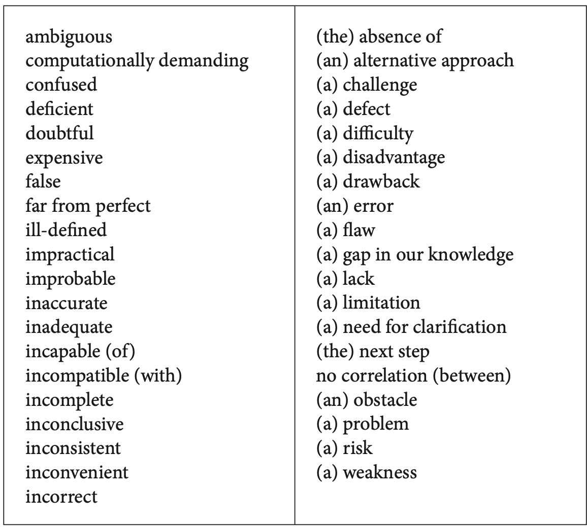

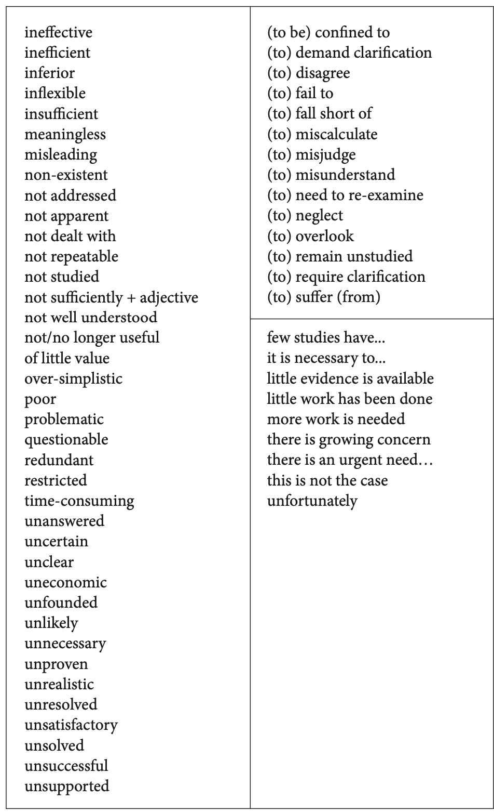

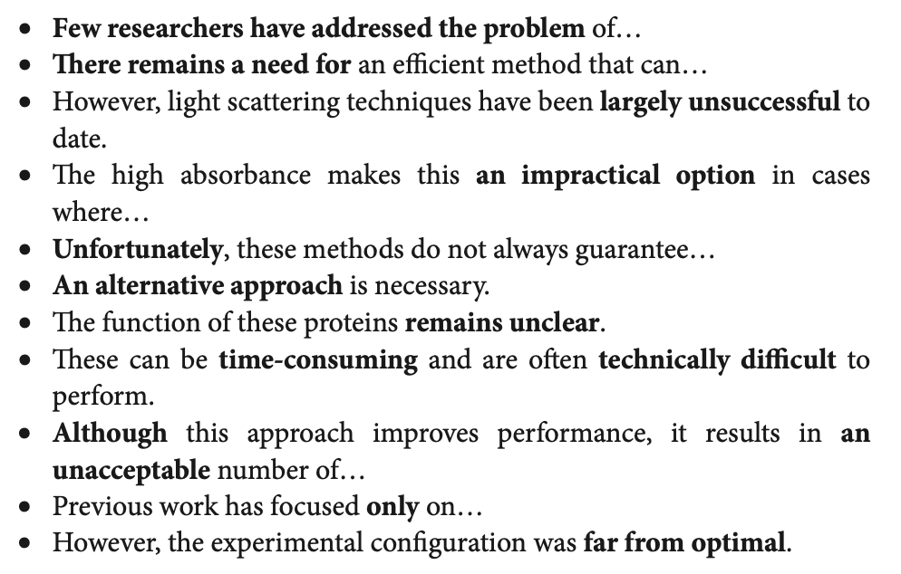

8. **Briefly Describe your paper.**

   * 一个例子: *The present paper presents a set of criteria for selecting such a component.*

   * 这一部分需要笼统地介绍一下你的paper是干什么, 例如目的是什么, 结构是怎样.

   * 注意, 介绍论文目的的时候需要区分:
     * 如果这个论文, 实现了所有的目的, 用一般过去时, 因为目的总是在论文之前有, 更加严谨.
     * 如果这个论文, 没有实现所有目的, 用一般现在时.

   * 介绍其他客观信息可以用一般现在时.

9. **Details about your methodology in your paper.**

   * 一个例子: *On the basis of these criteria it then describes the preparation of a set of polymer blends using PLA and a hydrocarbon rubber(PI).*

   * 这一部分需要介绍一些涉及你论文方法的细节, 但是不要太细节.

10. **Announces the findings.**

    * 一个例子: *This combination of two mechanistically distinct polymerisations formed a novel copolymer in which the incorporation of PI significantly increased flexibility*.

    * 介绍论文最终取得什么成果.

介绍自己论文可以用的词汇和句型:

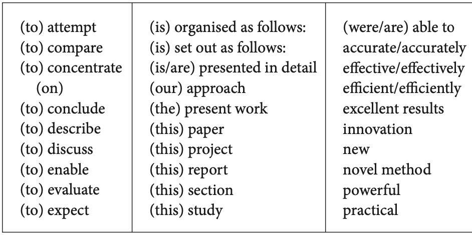

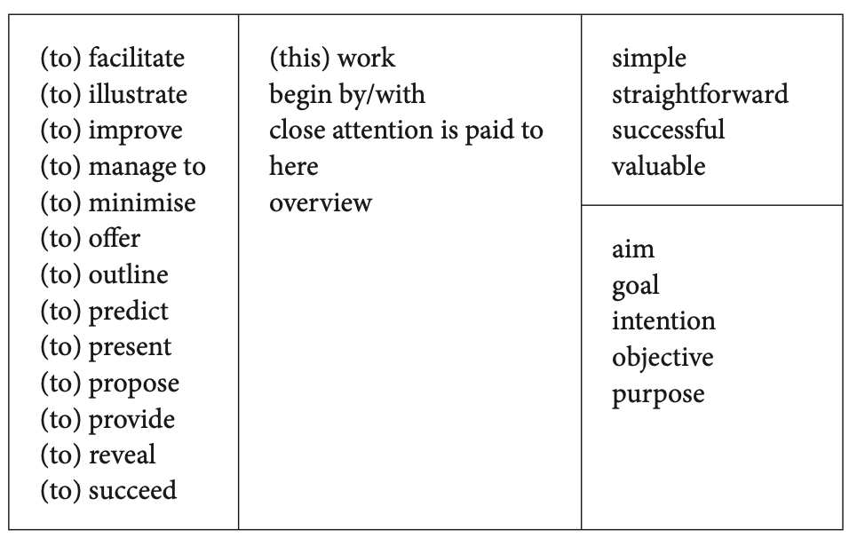

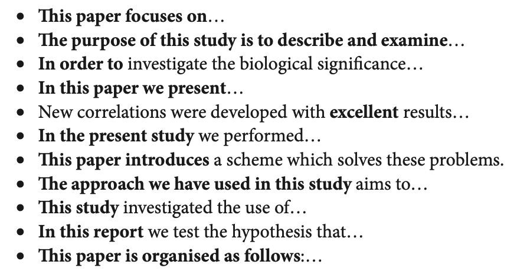
