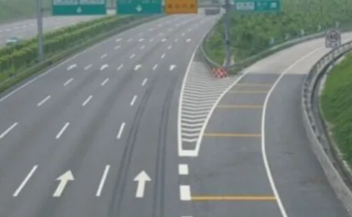
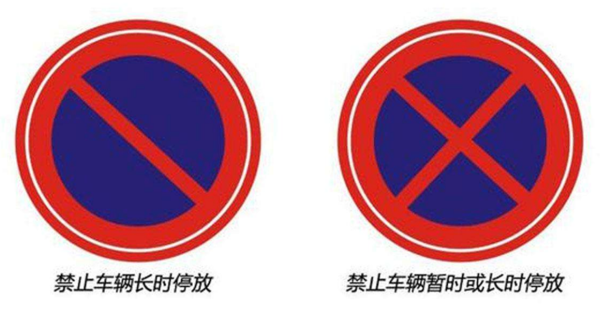

* 高速公路的最高限速是120公里/小时.

* 高速上出了故障, 驾驶员应该在护栏外面等候, 不能再高速上.

* 这个是高速的匝道(ramp):

  

* **高速转向失效**:

  * 抢挂低速档.
  * 开双闪.
  * 避免急刹车.

* 高速服务区有加油站, 如果有火灾不能驶向服务区.

* 小客车最多9人, 中客车最多10-19人(包含19人), 大客车可以20人以上, 最高需要特殊限制, 这个限制值叫做**核载值**.

  * 货车不能用来载客.

* 冰雪路面/泥泞路面时, 车速不能超过30公里/小时.

* **如何看交警的手势?**

  * 首先看脸的方向, 脸朝向哪里, 就是在指挥哪个方向的车.
  * 左手高举, 掌心向前是停车.
  * 手掌向前🖐️, 另一只手每动作是直行.
  * 手掌向前🖐️, 如果另一只手有动作, 那么就是左/右转.

* **鸣喇叭问题: **

  * 拥堵路段尽量不要鸣喇叭.
  * 驼峰桥这种拱桥会车需要鸣喇叭.
  * 如果遇到雨天, 提醒撑伞的行人可以适当鸣喇叭.
  * 急转弯时需要鸣喇叭提醒对面车.

* 载客客车驾驶时间超过4小时应该有不少于20分钟的休息, 疲劳驾驶一次9分.

* 大客车是A1驾驶证.

* 图标颜色问题:

  * 蓝底是指示性标志.
  * 黄色是警告标志.

* 路口50m以内不能停车, 加油站, 公交站这些站30m以内不能停车.
* 停车泊就是停车位.
* **隧道行驶的一些问题: **
  * 在照明不足, 影响视距的隧道前需要鸣喇叭示意.
  * 
  * 减速, 注意眼睛的暗适应和明适应.
  * 进入隧道前提前开启近光灯.
  * 出隧道时, 可以适当鸣喇叭提醒.
  * 隧道内较潮湿, 路面附着力低, 要减速.
* **快爆胎的处理方式: **仪表盘胎压过大/过小
  * 轻点刹车降速 (不要急刹防止侧翻).
  * 右转向灯停车.
* **礼让校车: **与校车同车道/相邻一个车道的都应该停车等待.
* **机动车的三种制动方式: **
  * 行车制动器(刹车)
  * 发动机制动: 不给油自然停下来.
  * 驻车制动器(手刹)

* 踩刹车时, 汽车后面的刹车灯会亮, 这个车灯需要仔细检查.
* 下坡持续用刹车后, 刹车片会发热, 导致刹车效果下降.
  * 积水道路刹车的效果也会降低.
* 在轮胎上, 会标有轮胎的最大安全充气气压.
* 路面的网状线表示: 严禁一切车辆停车, 防止交通拥堵, 不能驶入网状线.
* 冰雪天气起步要开近光灯.
* **定速巡航: **不用踩油门就可以保持车速, 适用于人流较少的高速.
* 安全带的作用, 知识减轻驾驶员的受伤程度, 其他没有任何作用.
* **侧滑: **
  * 前轮侧滑向侧滑反方向滑动, 后轮就是同方向.
* 刚下雨时的路面最容易发生侧滑, 因为水和泥混在一起, 下一阵的话泥就会被冲开.
* 抱死就是车轮在动, 但是车子不动.