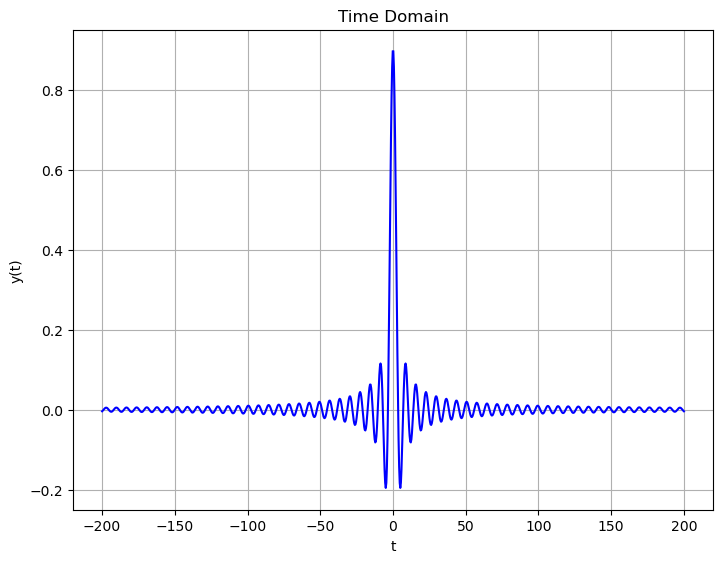

[TOC]

## 信号分类/常见信号

* 连续信号: $x(t)$: 其中$t$是连续的时间.
* 离散信号: $x[n]$: 其中$n$是采样点.
* 周期信号:
  * 连续: $x(t) = x(t + mT)$, 其中$m \in Z$, $T$是最小正周期.
  * 离散: $x[n] = x[n + mN]$.
* 奇信号:
  * $x(t) = -x(-t)$.
  * $x[n] = -x[-n]$.
* 偶信号:
  * $x(t) = x(-t)$.
  * $x[n] = x[-n]$.

> 任何一个信号都可以拆分成奇信号和偶信号拼接的形式, 并且拆法唯一.

$$
x(t) = \frac{x(t) + x(-t)}{2} + \frac{x(t) - x(-t)}{2}
$$

* 信号的能量: $E = \int_{t_0}^{t_1}x(t)^2dt$

* 信号的功率: $P = \frac{1}{t_1 - t_0}E$.

* 单位阶跃信号: 
  $$
  u(t) = \begin{cases}
  1 & t > 0 \\
  0 & t < 0
  \end{cases}
  $$

  * $u(t)$在$t = 0$​处没有定义, 可以等于任何值.
  * 区间$[a, b]$上的, 高度为1的方波可以表示为: $u(t - a) - u(t - b)$.
  
* 冲激信号:
  $$
  \delta(t) = \begin{cases}
  +\infty & x = 0\\
  0 & x \neq 0
  \end{cases}
  $$

  * $\delta(t) = \frac{du(t)}{dt}$.
  * $\int_{-\infty}^{\infty} \delta(t)dt = 1$.

* 抽样函数:
  $$
  Sa(t) = \begin{cases}
  \frac{sin(t)}{t} & t \neq 0 \\
  1 & t = 0
  \end{cases}
  $$

  * $\int_{-\infty}^{\infty}Sa(t)dt = \pi$.
  * $\int_{0}^{+\infty}Sa(t)dt = \frac{\pi}{2}$​.
  * $\int_{0}^{+\infty} \frac{sin(\omega t)}{t} dt = \frac{\pi}{2}, \omega > 0$.
  * $Sa(t)$​是一个偶函数.


> 证明$\int_{0}^{\infty}Sa(t)dt = \frac{\pi}{2}$

* 令$I(a) = \int_{0}^{+\infty}Sa(t)e^{-at} dt$​.

* 然后求:

$$
\frac{dI(a)}{da} = - \int_{0}^{+\infty}sin(t) e^{-at}dt
$$


* 然后用$sin(t) = \frac{e^{jt} - e^{-jt}}{2j}$​带入积分, 可以求得:

$$
\frac{dI(a)}{da} = \frac{1}{2j} \int_{0}^{+\infty} [e^{-(j+a)t} - e^{-(j-a)t}] dt = \frac{-1}{1 + a^2}
$$


* 最终, $I(a) = -arctan(a) + \frac{\pi}{2}$.

* $I(0) = \int_{0}^{+\infty}Sa(t)dt = \frac{\pi}{2} = \frac{\pi}{2}$.


> 用Python画出$Sa(t)$的图像:

```python
import numpy as np
import matplotlib.pyplot as plt


def sample_function(t):
    return np.where(t == 0, 1, np.sin(t) / t)


x = np.linspace(-100, 100, 1000)
y = sample_function(x)

fig = plt.figure()
ax = fig.add_axes([0, 0, 1, 1])
ax.set_title('Sample Function')
ax.set_xlabel('t')
ax.set_ylabel('y(t)')
ax.plot(x, y)
```


## 信号的自变量变换

* 假设信号是$x(t)$, 那么信号$x(at + b)$应该如何确定?
  * 变为标准形式: $x(a(t + \frac{b}{a}))$
  * 如果$a < 0$, 左右反转.
  * 如果$|a| > 1$, 压缩, 如果$|a| < 1$拉伸.
  * 如果$\frac{b}{a} > 0$, 向左平移, 否则向右平移.
* 任何信号可以表示成冲激信号与原信号的卷积:
  * $x(t) = \int_{-\infty}^{\infty}x(u)\delta(t-u)du$.
  * $x[n] = \sum_{k=-\infty}^{\infty}x[k]\delta[n-k]$.


## 系统的性质

### 线性系统

* 线性系统的定义: 假设一个系统$x(t)\rightarrow y(t)$, 如果满足:

  * 齐次性: $\forall a \in R, ax(t) \rightarrow ay(t)$.
  * 叠加性: $x_1(t) + x_2(t) \rightarrow y_1(t) + y_2(t)$.

  那么就是线性系统.

* 线性系统的判据: 假设系统是$y(t) = f(x(t))$

  * 每一项都必须是$x$.
  * 每一项的$x$都必须是一次.


### 时不变系统

* 时不变系统的定义: 假设一个系统$x(t) \rightarrow y(t)$, 如果满足:

  * $\forall t_0 \in R, x(t - t_0) \rightarrow y(t - t_0)$.

  那么就是时不变系统.

* 时不变系统的判据:

  * $t$只能在$x$的括号里.
  * $t$只能是$t$, 不能是$-t, 2t, -2t, t^2...$.


### 因果系统

* 因果系统定义: 输出$y(t)$在输入$x(t)$之后发生.

* 因果系统的判据: $x$括号中的数恒小于等于$y$括号中的数.


### 无记忆系统

* 无记忆系统定义: 一个系统无记忆, 是指$y(t)$的值仅仅依赖于$x(t)$的值.
* 无记忆系统一定是因果系统.


### 可逆系统

* 定义: $x(t)$能够唯一写成$y(t)$的表达形式.


### 稳定系统

* 定义: 对于一个系统$x(t) \rightarrow y(t)$, 如果$x(t)$有界能够推出$y(t)$有界, 那么这个系统就是稳定系统.
* 有界的定义: $\forall t \in R, \exist M, |x(t)| < M$, 那么$x(t)$就是有界.

## LTI系统

* LTI系统的全称是线性时不变系统(Linear Time invarient System, LTI).


### 稳定性

* LTI系统稳定的充要条件是: $\int_{-\infty}^{\infty}|h(t)|dt < +\infty$​.

* 证明:

> 充分性: 如果$\int_{-\infty}^{\infty}|h(t)|dt < +\infty$, 那么如果$x(t)$有界, 能够推出$y(t)$有界.

$|y(t)| = |x(t) * h(t)| = |\int_{-\infty}^{\infty}x(\tau)h(t - \tau)d\tau| \leqslant \int_{-\infty}^{\infty}|x(\tau)||h(t-\tau)|d\tau$.

* 由于$x(t)$和$h(t)$都是有界的, $y(t)$也是有界的.


> 必要性: 如果$x(t)$有界能够推出$y(t)$有界, 那么$\int_{-\infty}^{\infty}|h(t)|dt < +\infty$.

* 取$x(t) = \begin{cases} 1 & h(-t) < 0 \\ -1 & h(-t) > 0 \end{cases}$.
* $y(0)$有界, 并且$y(0) = \int_{-\infty}^{\infty}x(\tau)h(-\tau)d\tau = \int_{-\infty}^{\infty}|h(-\tau)|d(-\tau)$, 因此, $\int_{-\infty}^{\infty}|h(t)|dt < +\infty$.

### 因果性

* LTI系统是因果系统的充要条件是: 当$t < 0$时, $h(t) = 0$​.
  * 如果$t < 0$时, $h(t)$​有一些离散的值, 这个定理依然成立 (勒贝格积分).
  
* 证明:
  
  * 系统因果性的定义是$\forall t_0$, 系统在$t_0$时刻的值$y(t_0)$仅由$t_0$及其之前时刻的$x(t)$值决定.
  
  * $y(t_0) = x(t_0) * h(t_0) = \int_{-\infty}^{\infty}x(\tau)h(t_0 - \tau)d\tau$.
  * 如果$\tau > t_0$, 那么$h(t_0 - \tau) = 0$, 积分就等于0, 因此$y(t_0) = \int_{-\infty}^{t_0}x(\tau)h(t_0 - \tau)d\tau$, 是一个因果系统.

## 卷积公式

这里的卷积公式是针对线性时不变系统(Linear Time invarient System, LTI).

对于一个LTI系统, 只要知道了一组信号$x(t)$和$y(t)$之间的对应关系, 就可以知道整个系统的对应关系.

### 离散卷积公式

* 离散系统的单位脉冲序列定义为:
  $$
  \delta[n] = \begin{cases}
  1 & n = 0\\
  0 & n \neq 0
  \end{cases}
  $$

* 离散系统的单位脉冲响应定义为: $h[n]$, $\delta[n] \rightarrow h[n]$, 也就是这个系统对于单位脉冲序列的输出.

* 对于一个LTI系统, $h[n]$就是这个系统的唯一标识, 系统的表达式是: $y[n] = x[n] *h[n] = \sum_{k=-\infty}^{+\infty}x[k]h[n-k]$.


> 离散卷积公式的证明

* 首先, 有$\delta[k] \rightarrow h[k]$​.
* 然后, 根据时不变系统定义: $\delta[n - k] \rightarrow h[n - k]$.
* 然后, 根据线性系统齐次性: $x[k]\delta[n-k] \rightarrow x[k]h[n-k]$.
* 然后, 再根据线性系统叠加性: $\sum_{k=-\infty}^{+\infty}x[k]\delta[n-k] \rightarrow \sum_{k=-\infty}^{+\infty}x[k]h[n-k]$​
* 即: $x[n] \rightarrow y[n]$.

那么离散卷积公式就是: $x[n] * h[n] = \sum_{k=-\infty}^{\infty}x[k]h[n-k]$.

* 离散卷积的计算:
  * 首先求系统的$h[n]$.
  * 然后, 如果已知$x[k]$, 求$y[k]$:
    * 首先把$h[n]$左右翻转.
    * 然后向右移动$k$个单位, 然后从后向前相乘相加到$k$​.

> 离散卷积的信号长度

* 假设$x_1[n]$有$N_1$个元素, $x_2[n]$有$N_2$个元素, 那么$x_1[n] * x_2[n]$有$N_1+ N_2 - 1$​个元素.
* 假设$x_1[n]$在$[a_1, b_1]$有值, $x_2[n]$在$[a_2, b_2]$有值, 那么$x_1[n] * x_2[n]$在$[a_1 + a_2, b_1 + b_2]$有值.


### 连续卷积公式

* 假设$x(t) \rightarrow y(t)$是LTI系统.
* **单位脉冲信号的原始形态 **: 任意一个连续函数$x(t)$, 都能通过很多个无限窄的方波来逼近, 这个无限窄的阶梯函数就是$\delta(t)$.
  * 方波函数的原始形态是$\delta_{\Delta}(t)$, 宽度是$\Delta$, 高度是$\frac{1}{\Delta}$.
  * $\lim\limits_{\Delta\rightarrow0} \delta_{\Delta}(t) = \delta(t)$​.
* 对于一个连续函数$x(t)$, 可以通过方波 的形式来划分$x_{\Delta}(t) = \sum_{k=-\infty}^{\infty}x(k\Delta)\delta_{\Delta}(t-k\Delta) \Delta$.
  * 对于任意一个$x_{\Delta}(t)$, 我都可以通过平移$\delta_{\Delta}(t)$来进行构造.
  * $\lim\limits_{\Delta\rightarrow 0}x_{\Delta}(t) = x(t)$.
* 假设$\delta_{\Delta}(t)\rightarrow h_{\Delta}(t)$, 那么根据LTI的性质:
  * $\lim\limits_{\Delta \rightarrow 0}\delta_{\Delta}(t) \rightarrow \lim\limits_{\Delta \rightarrow 0}h_{\Delta}(t)$.
  * 假设极限$\lim\limits_{\Delta \rightarrow 0}h_{\Delta}(t)$​​存在.


> 连续卷积公式推导

* 首先: $\delta_{\Delta}(t)\rightarrow h_{\Delta}(t)$
* 根据时不变性: $\delta_{\Delta}(t - k\Delta)\rightarrow h_{\Delta}(t - k\Delta)$.
* 根据齐次性: $x_{\Delta}(t)\delta_{\Delta}(t - k\Delta)\Delta \rightarrow x_{\Delta}(t)h_{\Delta}(t - k\Delta) \Delta$​
* 根据叠加性: $\sum_{k=-\infty}^{\infty}x_{\Delta}(t)\delta_{\Delta}(t - k\Delta)\Delta \rightarrow \sum_{k=-\infty}^{\infty}x_{\Delta}(t)h_{\Delta}(t - k\Delta)\Delta$​
  * 即$x_{\Delta}(t) \rightarrow \sum_{k=-\infty}^{\infty}x_{\Delta}(t)h_{\Delta}(t - k\Delta)\Delta$

* 然后, $x(t) = \lim\limits_{\Delta\rightarrow 0} x_{\Delta}(t) \rightarrow \lim\limits_{\Delta\rightarrow 0}\sum_{k=-\infty}^{\infty}x_{\Delta}(t)h_{\Delta}(t - k\Delta)\Delta = \int_{-\infty}^{\infty}x(\tau)h(t-\tau)d\tau = y(t)$​.
* 那么卷积公式就是: $y(t) = x(t) * h(t) = \int_{-\infty}^{\infty}x(\tau)h(t-\tau)d\tau$

其中$h(t)$就是系统的单位脉冲响应, 可以唯一标识一个连续的LTI系统.


## 勒贝格定义

* 勒贝格定义: 两个函数$f_1(t)$和$f_2(t)$相等是指, 对于任意函数$y(t)$, 都有:
  $$
  \int_{-\infty}^{\infty}y(t)f_1(t)dt = \int_{-\infty}^{\infty}y(t)f_2(t)dt
  $$

* 勒贝格定义说明, 如果两个函数只在有限个点的函数值不相等, 那么它们仍然可以是相等函数.

* 假设两个系统的单位脉冲响应分别是$h_1(t)$和$h_2(t)$, 如果在勒贝格定义下, $h_1(t) = h_2(t)$, 那么就有$x(t) * h_1(t) = x(t) * h_2(t)$.

* 如果要证明一个$f(t)是$$\delta(t)$, 只需要证明: 对于任意函数$y(t)$, 都有$\int_{-\infty}^{\infty}y(t)f(t)dt = y(0)$​.


> 证明: 假设$f(t) = \lim\limits_{\omega \rightarrow \infty}\frac{sin\omega t}{\pi t} = \delta(t)$

* 引理: 如果$x(t)$不是无限震荡函数, 那么有:

$$
\lim\limits_{\omega \rightarrow +\infty}\int_{-\infty}^{\infty}x(t)cos(\omega t)dt = 0 \\
\lim\limits_{\omega \rightarrow +\infty}\int_{-\infty}^{\infty}x(t)sin(\omega t)dt = 0
$$

* 引理的证明: 假设$x(t)$​可导, 那么:

  * 分部积分法: $\int udv = uv - \int vdu$

  $$
  \int_{-\infty}^{\infty}x(t)cos(\omega t)dt = \frac{1}{\omega}\int_{-\infty}^{\infty}x(t)dsin(\omega t) = \frac{1}{\omega}x(t)sin(\omega t) - \frac{1}{\omega}\int_{-\infty}^{\infty}sin(\omega t)x^{'}(t)dt
  $$

  * 当$\omega \rightarrow +\infty$​时, 这个式子等于0 (因为`-`两边都是有界变量乘无穷大的形式).

* 下面回到原定理的证明:

$$
\int_{-\infty}^{\infty} y(t)f(t)dt = \int_{-\infty}^{\infty}y(t)\lim\limits_{\omega \rightarrow \infty}\frac{sin\omega t}{\pi t} dt = \lim\limits_{\omega \rightarrow \infty} \int_{-\infty}^{\infty}\frac{y(t)}{\pi t}  sin\omega t dt
$$

* 对于这个式子, 可以写成:
  $$
  \lim\limits_{\omega \rightarrow \infty} \int_{-\infty}^{\infty}\frac{y(t) - y(0)}{\pi t}sin\omega t dt + y(0) \lim\limits_{\omega \rightarrow \infty} \int_{-\infty}^{\infty} \frac{sin\omega t}{\pi t} dt
  $$

  * 左边, 由于$\frac{y(t) - y(0)}{\pi t}$不是无限震荡函数(在0处的极限可以通过洛必达法则求出), 根据引理, 等于0.
  * 右边, 根据$\int_{-\infty}^{\infty} \frac{sin\omega t}{\pi t} dt = 1$(采样函数的性质), 等于$y(0)$.

* 因此, 证明成功.

## 冲激信号的性质


### 性质1

> 证明: $\int_{-\infty}^{\infty}\delta(t)dt = 1$

* $\int_{-\infty}^{\infty}\delta(t)dt = \int_{-\infty}^{\infty}[\lim\limits_{\Delta\rightarrow 0}\delta_{\Delta}(t)]dt = \lim\limits_{\Delta\rightarrow 0}\int_{-\infty}^{\infty}\delta_{\Delta}(t)dt = 1$.


### 性质2

> 证明: $\int_{-\infty}^{\infty}x(t)\delta(t)dt = x(0)$

$$
\int_{-\infty}^{\infty}x(t)\delta(t)dt = \int_{-\infty}^{\infty}x(t)\lim\limits_{\Delta\rightarrow0}\delta_{\Delta}(t)dt = \lim\limits_{\Delta\rightarrow0}\int_{-\infty}^{\infty}x(t)\delta_{\Delta}(t)dt = \lim\limits_{\Delta\rightarrow0}\int_{0}^{\Delta}x(t)\delta_{\Delta}(t)dt
$$

$$
\lim\limits_{\Delta\rightarrow0}\int_{0}^{\Delta}x(t)\delta_{\Delta}(t)dt = \lim\limits_{\Delta\rightarrow0}\frac{1}{\Delta}\int_{0}^{\Delta}x(t)dt
$$

* 根据积分中值定理, 可以得到:

$$
\lim\limits_{\Delta\rightarrow0}\frac{1}{\Delta}\int_{0}^{\Delta}x(t)dt = \lim\limits_{\Delta\rightarrow0}\frac{1}{\Delta}x(\epsilon) \Delta = \lim\limits_{\Delta\rightarrow0}x(\epsilon), \epsilon \in (0, \Delta)
$$

* 当$\Delta \rightarrow 0$时, 最终的结果就是$x(0)$.


### 性质3

> 证明: $x(t)\delta(t) = x(0)\delta(t)$

* 根据勒贝格定义, 证明左边等于右边只需要证明左边的函数和右边的函数相等.

左边:
$$
\int_{-\infty}^{\infty}y(t)[x(t)\delta(t)]dt = y(0)x(0)
$$
右边:
$$
\int_{-\infty}^{\infty}y(t)[x(0)\delta(t)]dt = x(0)\int_{-\infty}^{\infty}y(t)[\delta(t)]dt = x(0)y(0)
$$
因此两边相等.

根据这个式子可以得到: $x(t)\delta(t - t_0) = x(t_0)\delta(t - t_0)$


### 性质4

*  $\delta(f(t)) = \sum_{\forall f(t_0) = 0} \frac{1}{|f^{'}(t_0)|}\delta(t - t_0)$, $t_0$是$f(t)$的零点.


### 性质5

> 证明: $\lim\limits_{N \rightarrow 0} \frac{sinNt}{\pi t} = \delta(t)$​

* 在勒贝格定义下, 证明两个函数相等, 只需要证明$\int_{-\infty}^{\infty}y(t)\lim\limits_{N \rightarrow 0} \frac{sinNt}{\pi t} dt = y(0)$.

$$
\int_{-\infty}^{\infty}y(t)\lim\limits_{N \rightarrow 0} \frac{sinNt}{\pi t} dt = \lim\limits_{N \rightarrow 0}\int_{-\infty}^{\infty}\frac{y(t)}{\pi t}sinNt\ dt = \lim\limits_{N \rightarrow 0}\int_{-\infty}^{\infty}\frac{y(t)}{\pi t}sinNt\ dt
$$

* 这个式子可以写成:
  $$
  \lim\limits_{N \rightarrow 0}\int_{-\infty}^{\infty}\frac{y(t) - y(0)}{\pi t}sinNt\ dt + y(0)\lim\limits_{N \rightarrow 0}\int_{-\infty}^{\infty}\frac{sinNt}{\pi t}\ dt = y(0)
  $$
  

## 卷积的性质

* 交换律: $x(t) * h(t) = h(t) * x(t)$.
* 结合律: $[x(t) * h_1(t)] * h_2(t) = x(t) * [h_1(t) * h_2(t)]$​.
* 分配律: $x(t) * [h_1(t) + h_2(t)] = x(t) * h_1(t) + x(t) * h_2(t)$​​.
* 平移: $x(t + t_0) * h(t - t_0) = x(t) * h(t)$​​.
  * 理解: 左边界不变, 右边界不变, 面积不变.

* 卷积的导数: $\frac{d[x(t) * h(t)]}{dt} = x(t) * \frac{dh(t)}{dt} = \frac{dx(t)}{dt} * h(t)$​
  * 证明可以用微分是LTI和$\delta^{'}(t)$来证明.


## 常见的卷积

### 积分


* 积分器: $\int_{-\infty}^{t}x(\tau)d\tau = x(t) * u(t)$​
  * 积分是一个LTI系统, 其中$h(t) = u(t)$.

### 微分


* 微分器: $\frac{dx(t)}{dt} = x(t) * \delta^{'}(t)$
  * 微分也是一个LTI系统, 其中$h(t) = \delta^{'}(t)$​.

* 其中$\delta^{'}(t) = \frac{d\delta(t)}{dt}$.

> 证明: $\int_{-\infty}^{\infty} y(t)\delta^{'}(t)dt = -y^{'}(0)$

$$
\int_{-\infty}^{\infty} y(t)\delta^{'}(t)dt = \int_{-\infty}^{\infty} y(t)d\delta(t) =y(t)\delta(t) |_{-\infty}^{\infty} - \int_{-\infty}^{\infty} y^{'}(t)\delta(t)dt = -y^{'}(0) 
$$


## 函数的正交分解

* 内积运算: 如果一个运算$<*>$满足下面四个性质, 就是一个内积运算:
  * 交换律: $<x, y> = \bar{<y, x>}$​
  * 齐次性: $<\lambda x, y> = \lambda <x, y>$
  * 叠加性: $<x + y, z> = <x, z> + <y, z>$
  * 非负性: $<x, x> \geqslant 0$ 当且仅当$x = 0$时等号成立.
  
* 函数的正交运算:
  * $f(t)$和$g(t)$的内积$<f(t),g(t)>$定义为: $\int_{a}^{b} f(t)\bar{g(t)}dt$​.

* 正交函数族:

  * 若函数族$\{f_k(t)\}, k \in (-\infty, \infty), k \in Z$​满足:

    * $\forall k \in Z, <f_k(t), f_k(t)> \geqslant 0$.
    * $\forall k_1, k_2 \in Z, <f_{k_1}(t), f_{k_2}(t)> = 0$.

    那么这个函数族就是正交函数族.

  * 标准正交函数族: 在正交函数族的基础上加上$\forall k \in Z, <f_k(t), f_k(t)> = 1$, 那么就是标准正交函数族.

* 函数正交分解: 把一个函数在区间$T_0$上变成标准正交函数族的线性组合的过程就是函数的正交分解.

  * $x(t) = \sum_{k=-\infty}^{\infty} a_k f_k(t)$, 其中, $a_k = <x(t), f_k(t)>$

$$
<x(t), f_i(t)>\ =\ <\sum_{k=-\infty}^{\infty} a_k f_k(t), f_i(t)> = \sum_{k=-\infty}^{\infty}a_k<f_k(t), f_i(t)> = a_i
$$


## 傅立叶级数

> 证明: 函数族$\{e^{jk\omega_0 t}\}, k \in Z, k \in (-\infty, +\infty)$​是正交函数族.

* $<e^{jk\omega_0 t}, e^{jk\omega_0 t}> = \int_{T_0} e^{jk\omega_0 t}e^{-jk\omega_0 t}dt = T_0$.
* $\forall k_1, k_2 \in Z, k_1 \neq k_2$, $<e^{jk_1\omega_0 t}, e^{j k_2\omega_0 t}> = \int_{T_0} e^{j(k_1 - k_2)\omega_0 t}dt = \frac{1}{j(k_1 - k_2)\omega_0} e^{j (k_1 - k_2)\omega_0 t}|_{t=0}^{T_0}$​.
  * 将$T_0 = \frac{2\pi}{\omega_0}$带入(傅立叶级数针对的是周期函数), 结合欧拉公式可以求出该式为0.


> 证明: 假设周期函数$f(t)$的周期是$T_0$, 那么在这个周期内, 函数$f(t)$​可以被正交分解.

* $f(t)$可以表示成: $f(t) = \sum_{k=-\infty}^{\infty} a_k e^{jk\omega_0 t}$

* $<f(t), e^{jk\omega_0 t}> = T_0 a_k$, 因此, $a_k = \frac{1}{T_0}<f(t), e^{jk\omega_0 t}> = \frac{1}{T_0}\int_{T_0}f(t)e^{-jk\omega_0t}dt$

这个分解就是傅立叶级数, 只针对周期为$T_0$​的周期函数.

总结来说, 傅立叶级数的表达式就是:
$$
a_k = \frac{1}{T_0} \int_{T_0} f(t) e^{-jk\omega_0t}dt \\
f(t) = \sum_{k=-\infty}^{\infty} a_k e^{jk\omega_0 t}
$$


## 傅立叶变换

* 对于无穷维空间中的一个向量$(v_1, v_2, ..., v_{\infty})$.

  * 注意, 这里下标虽然是$1, 2, 3, 4$, 但是实际的下标是按实数进行分布.
  * 这一个向量都可以唯一映射到二维空间中的一个曲线.
  * 如果无穷维空间对内积操作是完备的, 那么这个无穷维空间就叫做希尔伯特空间.

* 对于函数$f(t)$, 它可以对应希尔伯特空间上的一个点/向量.

* 我可以选一组函数$d_{\omega}(t), \omega \in R$, 这组函数互相正交, 然后将$f(t)$进行正交分解.

* 假设我选择的函数是$e^{j\omega t}, \omega \in R$.

  * 对于两个的$\omega_1, \omega_2$:

  $$
  \int_{-\infty}^{\infty} e^{j(\omega_1 - \omega_2)t} dt = \int_{-\infty}^{\infty} e^{j\Delta \omega t} dt = \lim\limits_{T\rightarrow \infty} \frac{1}{j\Delta \omega} (e^{j\Delta \omega T}  - e^{-j\Delta \omega T}) = \lim\limits_{T\rightarrow \infty} \frac{1}{j\Delta \omega} (e^{j\Delta \omega T}  - e^{-j\Delta \omega T}) = \\ \lim\limits_{T\rightarrow \infty} \frac{1}{j\Delta \omega} (2jsin\Delta \omega T) = \lim\limits_{T\rightarrow \infty} \frac{2sin\Delta \omega T}{\Delta \omega} = 2\pi \delta(\Delta \omega)
  $$

  * 如果$\omega_1 \neq \omega_2$, 那么上述积分等于$2\pi$​.
  * 如果$\omega_1 = \omega_2$​​, 那么上述积分等于0.
  
* 下面将函数$f(t)$在$\frac{1}{2\pi}e^{j\omega t}$上进行正交分解:

  * 首先, $f(t)$正交分解的形式是:
    $$
    f(t) = \frac{1}{2\pi}\int_{-\infty}^{\infty} F(\omega) e^{j\omega t} d\omega
    $$
    
  * 如果要计算$F(\omega)$​, 只需要计算$f(t)$​和$e^{j\omega t}$​的内积, 这个内积应该等于$F(\omega)$​, 因为不相等的$\omega$​内积都会等于0, 因此:
    
    $$
    \int_{-\infty}^{\infty} f(t) e^{-j\omega t} dt = F(\omega)
    $$
    
  * 因此, 傅立叶变换的表达式就是:
    $$
    F(\omega) = \int_{-\infty}^{\infty} f(t) e^{-j\omega t} dt \\
    f(t) = \frac{1}{2\pi}\int_{-\infty}^{\infty} F(\omega) e^{j\omega t} d\omega
    $$
    


<font color=red>**也就是说, 傅立叶变换的本质, 就是一个希尔伯特空间, 到另一个希尔伯特空间的映射, 只不过两个空间的基向量不同, 时域信号的基向量就是稠密的单位脉冲信号组成的.**</font>


## 常见信号的傅立叶变换


| 原信号                                | 傅立叶变换                                                   |
| ------------------------------------- | ------------------------------------------------------------ |
| $\delta(t)$                           | 1                                                            |
| 1                                     | $2\pi \delta(\omega)$                                        |
| $e^{-at}u(t)$                         | $\frac{1}{a + j\omega}$                                      |
| $\frac{sin\omega_ct}{\pi t}$          | 方波, 偶函数, 宽度是$2\omega_c$, 高度是1                     |
| 方波, 偶函数, 宽度是$\tau$, 高度是$E$ | $E\tau Sa(\frac{\tau}{2} \omega)$                            |
| $cosw_0t$                             | $\pi [\delta(\omega - \omega_0) + \delta(\omega + \omega_0)]$ |
| $sinw_0 t$                            | $\frac{\pi}{j} [\delta(\omega - \omega_0) - \delta(\omega + \omega_0)]$ |
| $u(t)$                                | $\frac{1}{j\omega} + \pi \delta(\omega)$                     |
|                                       |                                                              |

> 用Python画出所有信号和傅立叶变换

* $y=e^{-2t} u(t)$​

```python
import numpy as np
import matplotlib.pyplot as plt

def function(t):
    return np.where(t >= 0, np.exp(-2 * t), 0)

x = np.linspace(-2, 2, 1000)
pos_y = function(x[x >= 0])
neg_y = function(x[x < 0])

# Time domain
fig = plt.figure()
ax = fig.add_axes([0, 0, 1, 1])
ax.set_title("Time Domain")
ax.set_xlabel('t')
ax.set_ylabel('y(t)')
ax.grid(True)
ax.plot(x[x >= 0], pos_y, 'b')
ax.plot(x[x < 0], neg_y, 'b')

# Freq domain
y = function(x)
fft_result = np.abs(np.fft.fft(y))
dt = x[1] - x[0]
n = len(x)
freq = np.fft.fftfreq(n, dt)

fig = plt.figure()
ax = fig.add_axes([0, 0, 1, 1])
ax.set_title("Freq Domain")
ax.set_xlabel('t')
ax.set_ylabel('w')
ax.grid(True)
ax.plot(freq, fft_result, 'b')
```


| 原信号                                            | 傅立叶变换                                             |
| ------------------------------------------------- | ------------------------------------------------------ |
|  |  |

* $\frac{sint}{\pi t}$

| 原信号                                                 | 傅立叶变换                                             |
| ------------------------------------------------------ | ------------------------------------------------------ |
|  |  |

* 方波:

| 原信号                                                 | 傅立叶变换                                             |
| ------------------------------------------------------ | ------------------------------------------------------ |
|  |  |

* $y = cos(5t)$

| 原信号                                                 | 傅立叶变换                                             |
| ------------------------------------------------------ | ------------------------------------------------------ |
|  |  |


### 证明

> $\delta(t)$的傅立叶变换是1.

$$
F(\omega) = \int_{-\infty}^{\infty} \delta(t) e^{-j\omega t} dt = \int_{-\infty}^{\infty} \delta(t) dt = 1
$$

* 用到的性质: $f(t)\delta(t) = f(0)\delta(t)$​.


> 1的傅立叶变换是$2\pi \delta(\omega)$

$$
F(\omega) = \int_{-\infty}^{\infty} e^{-j\omega t} dt = \lim\limits_{N\rightarrow \infty} \int_{-N}^{N} e^{-j\omega t} dt = \lim\limits_{N\rightarrow \infty}\frac{1}{j\omega} (e^{j\omega N} - e^{-j\omega N})
$$

根据欧拉公式:
$$
F(\omega) = \lim\limits_{N\rightarrow \infty} \frac{2sin(\omega N)}{\omega} = 2\pi \delta(\omega)
$$


## 傅立叶变换的性质

* 线性: $af_1(t) + bf_2(t)$的傅立叶变换是$aF_1(\omega) + bF_2(\omega)$.
* 时移性质: $f(t - t_0)$的傅立叶变换是$F(\omega)e^{j\omega t_0}$.
* 频移性质: $f(t)e^{j\omega_0 t}$的傅立叶变换是$F(\omega - \omega_0)$.

* 时域微分性质: $\frac{df(t)}{dt}$的傅立叶变换是$j\omega F(\omega)$​
* 频域微分性质: $tx(t)$的傅立叶变换是$j\frac{dF(\omega)}{d\omega}$.
* 时域卷积性质: $f(t) * h(t)$的傅立叶变换是$F(\omega)H(\omega)$​​​ (时域卷积等于频域相乘).
  * 已知LTI系统的$y(t)$和$x(t)$, 怎么求出$h(t)$?
    * 首先求$y(t)$和$x(t)$的傅立叶变换$Y(\omega)$和$X(\omega)$​.
    * 然后, 根据$H(\omega) = \frac{Y(\omega)}{X(\omega)}$, 求出$H(\omega)$​.
    * 最后, 用傅立叶反变换求出来$h(t)$.

* 调制性质: $f_1(t)f_2(t)$的傅立叶变换是$\frac{1}{2\pi} F_1(\omega) * F_2(\omega)$​ (频域卷积等于时域相乘).
* 尺度变换: $f(at)$的傅立叶变换是$\frac{1}{|a|}F(\frac{\omega}{a})$.
  * 时域越瘦, 频域越胖.
* 帕斯瓦尔定理: 傅立叶变换能量守恒.
  * $\int_{-\infty}^{\infty} |f(t)|^2 dt = \frac{1}{2\pi}\int_{-\infty}^{\infty}|F(\omega)|^2 d\omega$​
* 共轭对称性:
  * 如果$f(t)$是实函数, 并且是偶函数, 那么$F(\omega)$也是实函数, 也是偶函数 (只有$cos\omega t$分量).
  * 如果$f(t)$是实函数, 并且是奇函数, 那么$F(\omega)$是虚函数, 也是奇函数 (只有$sin\omega t$​分量).
  * 如果$f(t)$是实函数, 那么$F(\omega)$实部是偶函数, 虚部是奇函数.
  * 如果$f(t)$是实函数, 并且$F(\omega) = |F(\omega)|e^{j\theta(\omega)}$, 那么$|F(\omega)|$是偶函数, $\theta(\omega)$是奇函数.


## 信号的调制与解调

通信系统如果要传输某个信号$x(t)$, 就需要对这个信号进行调制(modulation)和解调(demodulation).

* 首先: $y(t) = x(t)cos(\omega_c t)$, 其中$\omega_c$​叫做载波(carrier).
  * 根据欧拉公式: $y(t) = \frac{1}{2}x(t)e^{j\omega_c t} + \frac{1}{2}x(t)e^{-j\omega_c t}$.
  * 根据频移性质, $x(t)e^{j\omega_0 t}$的傅立叶变换是$X(\omega - \omega_0)$, 对于原信号$X(\omega)$, $Y(\omega) = \frac{1}{2}X(\omega - \omega_c) + \frac{1}{2}X(\omega + \omega_c)$​
    * 也就相当于把原始的信号向左向右平移了$\omega_c$个单位.
  * 这个过程叫做调制(modulation).
* 解调: 接收到$y(t)$之后, 令$w(t) = y(t)cos(\omega_c t) = x(t) cos^2(\omega_c t) = \frac{1}{2}x(t) + \frac{1}{2}x(t)cos(2\omega_c t)$.
  * 使用这种方法解调之后, 可以用低通滤波器滤掉$\frac{1}{2}x(t) cos(2\omega_c t)$, 最终可以得到$\frac{1}{2}x (t)$.

## 离散傅立叶变换

* 离散傅立叶变换(DFT)能够将一个离散的序列转换成一个频域上的连续函数.

* 离散傅立叶变换为:

$$
F(\omega) = \sum_{n=-\infty}^{\infty}x[n]e^{-j\omega n}\\
x[n] = \frac{1}{2\pi}\int_{2\pi}F(\omega) e^{j\omega n} d\omega
$$

> 证明: $F(\omega)$是一个周期是$2\pi$​的周期函数.

* $e^{j2k\pi} = cos(2k\pi) + jsin(2k\pi) = 1$

* $F(\omega + 2\pi) = \sum_{n=-\infty}^{\infty}x[n]e^{-j(\omega + 2\pi)n} = \sum_{n=-\infty}^{\infty}x[n]e^{-j\omega n}e^{-j2\pi n} = F(\omega)$.


## 常见序列的离散傅立叶变换


## 离散傅立叶变换的性质

* 线性: $ax_1[n] + bx_2[n]$的离散傅立叶变换是$aF_1(\omega) + bF_2(\omega)$.


## 快速傅立叶变换

* 离散傅立叶变换的表达式是: $F(\omega) = \sum_{n=-\infty}^{\infty}x[n]e^{-j\omega n}$.
* 首先, 计算机不能处理无限, 所以假定, $x[n]$只在$0, 1, ..., N - 1$上有定义.
  * 此时, 离散傅立叶变换就是: $F(\omega) = \sum_{n=0}^{N-1}x[n]e^{-j\omega n}$, 并且$F(\omega)$的周期也是$2\pi$.

* $F(\omega)$是一个虚假的连续信号:
  * 对于$F(\omega)$, 我只需要知道这个函数在一个周期内$N$个点的值, 就可以知道$F(\omega)$的所有值.


> 证明:

* 假设我们知道$F(\omega)$在$[-\pi, \pi)$上$N$个不同点的值, 分别是$F(\omega_1), F(\omega_2), ..., F(\omega_{N-1})$​.
* 那么, $F(\omega_k) = \sum_{n=0}^{N-1}x[n]e^{-j\omega_k n}, k \in [0, N - 1]$实际上是关于$x[0], x[1], ..., x[N-1]$的$N$元一次方程组. 这个方程组用矩阵的形式为:

$$
\begin{pmatrix}
F(\omega_0)\\
F(\omega_1)\\
...\\
F(\omega_{N-1})\\
\end{pmatrix}= 
\begin{pmatrix}
1 & e^{-j\omega_0} & ... & e^{-j(N-1)\omega_0}\\
1 & e^{-j\omega_1} & ... & e^{-j(N-1)\omega_1}\\
...\\
1 & e^{-j\omega_{N-1}} & ... & e^{-j(N-1)\omega_{N-1}}\\
\end{pmatrix}
\begin{pmatrix}
x[0]\\
x[1]\\
...\\
x[N-1]
\end{pmatrix}
$$

* 中间这个矩阵是范徳蒙矩阵, 只要保证$\omega_0, \omega_1, ..., \omega_{N-1}$是不同的$N$个点, 那么这个矩阵就是可逆的.

* 也就是说, 我如果知道了一个序列中$N$个不同的元素值, 我就知道了频域上$N$个不同的点, 假设频域上不同的$n$个点对应的序列名称重新定义成$a[k]$.

* 用$x[n]$中不同的$N$个点, 求出$a[k]$的时间复杂度可以达到$O(NlogN)$, 这种算法叫做快速傅立叶变换(FFT).

> 证明: 快速傅立叶变换的时间复杂度是$O(nlogn)$.

* 首先, 取$\omega_k = \frac{2\pi}{N}k, k \in [0, 1, ..., N-1]$.

$$
F(\omega_k) = \sum_{n=0}^{N-1}x[n]e^{-j\frac{2\pi}{N}kn}, k \in [0, N-1]
$$

然后, 证明一个引理:
$$
\sum_{k=0}^{N-1} e^{j\frac{2\pi}{N}k(n_1 - n_2)} = \begin{cases} N & n_1 = n_2 \\ 0 & n_1 \neq n_2 \end{cases}
$$

* 如果$n_1 \neq n_2$, 那么这可以看成一个首项是$1$, 公比是$e^{j\frac{2\pi}{N}(n_1 - n_2)}$的等比数列的前$n$项和, 等于$\frac{1 - e^{2\pi(n_1 - n_2)}}{1 - e^{j\frac{2\pi}{N}(n_1 - n_2)}} = 0$.

* 然后, 证明:

$$
x[n] = \frac{1}{N}\sum_{k=0}^{N-1}F(\omega_k) e^{j\frac{2\pi}{N}kn}
$$

$$
\frac{1}{N}\sum_{k=0}^{N-1}F(\omega_k) e^{j\frac{2\pi}{N}kn} = \frac{1}{N}\sum_{k=0}^{N-1}
(\sum_{u=0}^{N-1}x[u]e^{-j\frac{2\pi}{N}ku})
e^{j\frac{2\pi}{N}kn} = 
\frac{1}{N}\sum_{u=0}^{N-1}
x[u]
\sum_{k=0}^{N-1}
e^{j\frac{2\pi}{N}k(n-u)}
$$

* 只有当$u = n$时, $e^{j\frac{2\pi}{N}k(n-u)}$才等于$N$, 否则为0, 那么这个式子最终就等于$\frac{1}{N} x[n] \times N = x[n]$.

* 因此, 快速傅立叶变换可以表示成:

$$
F(\omega_k) = \sum_{n=0}^{N-1}x[n]e^{-j\frac{2\pi}{N}kn}, k \in [0, N-1] \\\\
x[n] = \frac{1}{N}\sum_{k=0}^{N-1}F(\omega_k) e^{j\frac{2\pi}{N}kn}
$$

> 证明: 快速傅立叶变换的时间复杂度是$O(NlogN)$.

* 首先, 快速傅立叶变换的表达式是:

$$
F(\omega_N^{k}) = \sum_{n=0}^{N-1} x[n]e^{-j\frac{2\pi}{N}kn}
$$

* 然后, 如果要对$F(\omega_N^k)$所有的偶数项进行傅立叶变换 (假设$N$是偶数), 那么表达式为:

$$
F_2(\omega_{\frac{N}{2}}^{\frac{k}{2}}) = \sum_{n=0}^{\frac{N}{2}-1} x[2n+1]e^{-j\frac{2\pi}{{N}}kn}, k \in [0, \frac{N}{2}-1]
$$

* 如果对所有的奇数项进行快速傅立叶变换:

$$
F_1(\omega_{\frac{N}{2}}^{\frac{k}{2}}) = \sum_{n=0}^{\frac{N}{2}-1} x[2n]e^{-j\frac{2\pi}{{N}}kn}, k \in [0, \frac{N}{2}-1]
$$

* 那么从偶数项和奇数项的傅立叶变换可以组合成原始的傅立叶变换:

$$
F(\omega_N^k) = F_1(\omega_{\frac{N}{2}}^{k}) + e^{-j\frac{2\pi}{N}k}F_2(\omega_{\frac{N}{2}}^k)
$$

* 如果$N$是奇数:

  * 奇数项的快速傅立叶变换是:

  $$
  F_1(\omega_{\frac{N+1}{2}}^{\frac{k}{2}}) = \sum_{n=0}^{\frac{N+1}{2}} x[2n]e^{-j\frac{2\pi}{N + 1} {k} n}, k \in [0, \frac{N+1}{2}-1]
  $$

  
  
  * 偶数项的快速傅立叶变换是:

  $$
  F_2(\omega_{\frac{N-1}{2}}^{\frac{k}{2}}) = \sum_{n=0}^{\frac{N-1}{2}} x[2n + 1]e^{-j\frac{2\pi}{N-1} {k} n}, k \in [0, \frac{N-1}{2}-1]
  $$
  
  * 从奇数项和偶数项的傅立叶变换合成原始的傅立叶变换:
  
  $$
  F(\omega_N^k) = F_1(\omega_{\frac{N+1}{2}}^{k}) + e^{-j\frac{2\pi}{N}k}F_2(\omega_{\frac{N-1}{2}}^k)
  $$


## Nyquist采样定理

* Nyquist采样定理: 假设一个信号$x(t)$是一个带限信号 (频域内只在$[-\omega_M, \omega_M]$处有值), 如果我的采样频率$\omega_S > 2\omega_M$, 那么我就可以根据采样点唯一恢复原始信号.


## 滤波器的设计


### 理想低通滤波器

* 将一个信号$x(t)$与采样函数$\frac{sin(\omega_c t)}{\pi t}$进行卷积, 等价于频域上乘上一个$[-\omega_c, \omega_c]$的方波, 就可以只保留$[-\omega_c, \omega_c]$频段的信号, 这种操作叫做低通滤波(low-pass filter).
  * $\omega_c$叫做截止频率.
* 高保真音响的$\omega_c = 22150$Hz.
