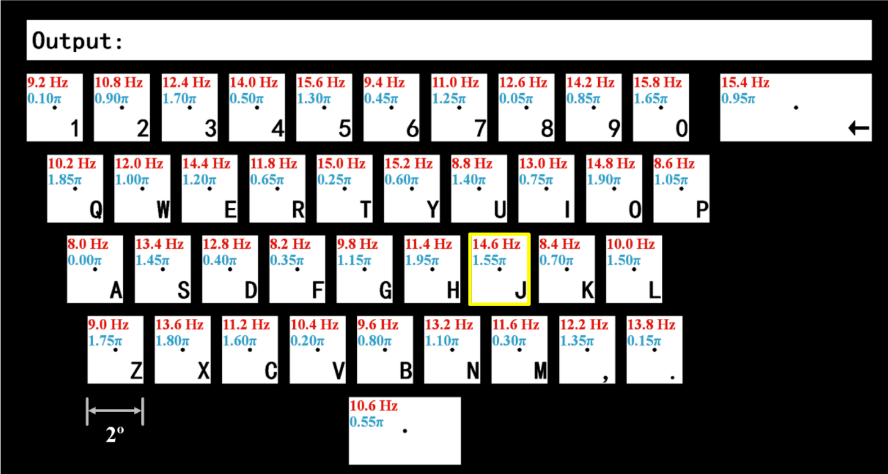

## 设计标准

* 设计成键盘形状, 被试比较熟悉键盘布局, 容易更快(less distraction) 地找到对应的target.
* 被试需要在灯光暗的房间里(dim room), 坐在舒适的椅子上(comfortable chair).
* 视距60cm时, 信号质量会比较高.
  * 如果有条件的话, 刺视距和刺激光强可以相互调节. 实现Adaptive.
  * 当有多个target时, 视距会影响两个相邻target之间的视角.
* 预处理包括50Hz陷波滤波和4-50Hz带通滤波.
* SSVEP刺激的频率在4-50Hz:
  * 低频率段10Hz附近左右, SSVEP信号较显著, 但是被试不舒适, 有可能引发疾病.
  * 高频段30Hz-50Hz, SSVEP信号不太显著, 但是被试舒适.
* SSVEP信号处理主要基于倍频特征, 尽量避免信号中出现7Hz, 14Hz这种倍数的信号.
* 刺激频率$f$和显示器刷新率$R$的关系:
  * $f = \frac{R}{n}, n \geqslant 2$.

* 刺激还可以有多种波形, 例如正弦波, 方波, 三角波等, 这些波还具有不同的参数.