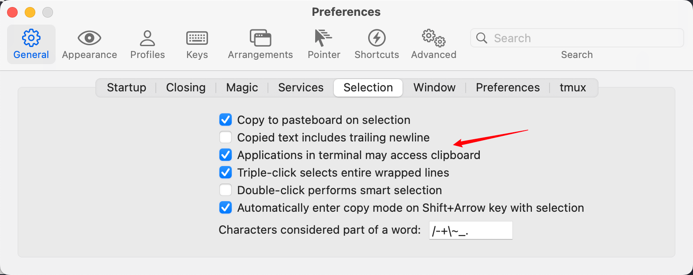

## tmux键位

tmux的前缀键是`ctrl+a`.

| 键位            | 功能                        |
| --------------- | --------------------------- |
| `prefix+j/l`    | 向下/向右创建pane           |
| `prefix+m`      | 将pane全屏/分屏             |
| `prefix+n`      | 创建window                  |
| `prefix+r`      | 重新载入tmux配置文件        |
| `prefix+方向键` | 调整pane大小                |
| `ctrl+h,j,k,l`  | 在分屏之间移动              |
| `prefix+[]`     | 在window之间移动            |
| `prefix+s`      | 查看session-window-pane结构 |

## tmux的复制模式

注意, 如果使用tmux复制模式, 需要把iTerm2中的这一项打上勾.

