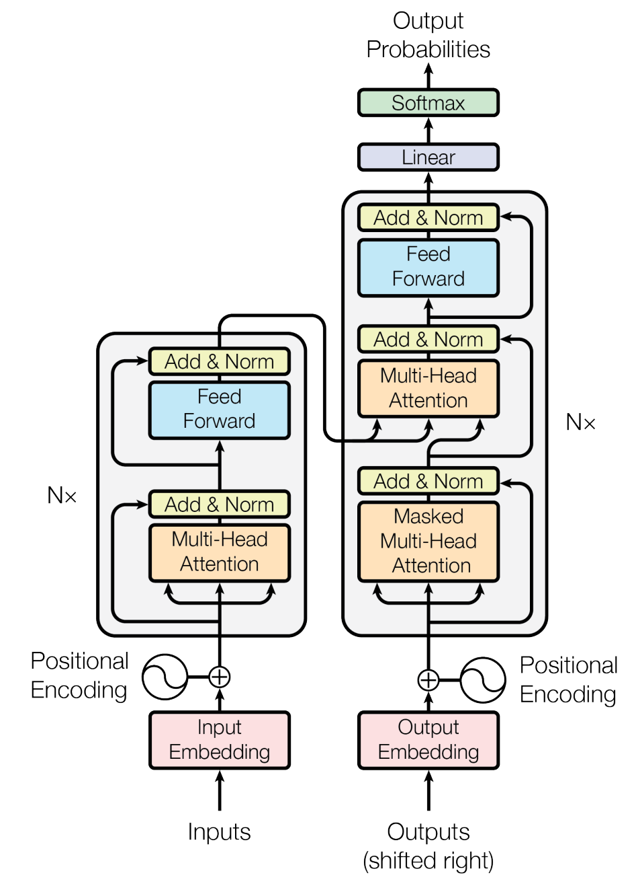

## `Embedding/Positional Encoding`

* 假设有一个token序列: `(token_1, token_2, ..., token_n)`.

* 首先通过Embedding, 将每一个`token_i`映射为一个列向量$E_i$, 映射后, 组成一个矩阵$E$, 维度是$(e, n)$, $e$是`embedding size`, 也就是经过Embedding后向量的维度数.
  $$
  E = (E_1, E_2, ..., E_n)
  $$

* 之后, 经过Positional Encoding层进行残差连接, 将每一个列向量的位置信息编码进$E$中.


## `SelfAttention`

* 输入`SelfAttention`中的矩阵$E$, 维度是$(n, e)$.

  * 可以看作是一个$n$个节点的完全图 (任意亮点之间互相连接), 每个节点通过`Node2Vec`成了一个$e$维的向量.

* 之后, 我要想办法建立图之间的边权, Transformer中学习的方法是:

  * 计算: $Q = EW_Q$, $K = EW_K$.

  * $W_Q, W_K$都是$(e, e)$的矩阵.

  * $Q$中的每一个行向量都是一个节点向其他节点的查询, $K$则表示向其他节点提供的信息.

  * 节点$i$与任意其他节点$j$的边权则定义为它们的匹配度, 可以用内积计算.

* 那么, 这个完全图的邻接矩阵就是:
  $$
  \begin{bmatrix} 
  Q_1\cdot K_1 & Q_1 \cdot K_2 & ... & Q_1 \cdot K_n \\ 
  Q_2\cdot K_1 & Q_2 \cdot K_2 & ... & Q_2 \cdot K_n \\ 
  ...\\
  Q_n\cdot K_1 & Q_n \cdot K_2 & ... & Q_n \cdot K_n \\ 
  \end{bmatrix} = QK^T
  $$
  

* 之后, 要根据这个邻接矩阵, 去做消息传递, 就需要把节点$E_i$周围的边权与这个节点本身的特征信息进行综合.

  * 首先把边权映射成概率分布, 方便作为权重: $softmax(\frac{QK^T}{\sqrt{e}})$, $softmax$是对这个矩阵的每一行单独进行.

  * 节点本身的特征信息通过$V = W_VE$进行映射, 这个$V$则表示节点用于消息传递的信息.

  * 然后进行消息传递, 就得到了最终结果:
    $$
    \Delta E = softmax(\frac{QK^T}{\sqrt{e}})V
    $$
    


* 之后, 如果要更新原矩阵$E$, 则可以使用$E' = E + \Delta E$.
  * 这个在网络结构中体现为残差连接. 

* **`Attention`模块, 本质上是完全图的一次消息传递.**

## `MultiHeadAttention`

* 假设有$h$个头, 那么对于原来输入的维度是$(n, e)$的完全图, 会被拆分成$d = \frac{e}{h}$个完全图.
* 对于这$d$个完全图, 分别计算$\Delta E$.
* 之后, 将所有的$\Delta E$拼接后, 加入$E$, 即可更新.

* 代码:
  

```python
class MultiHeadAttention(nn.Module):
	def __init__(self, num_heads, embedding_size):
		super().__init__()
		self.num_heads = num_heads
		self.embedding_size = embedding_size

		self.W_Q = nn.Linear(self.embedding_size, self.embedding_size)
		self.W_K = nn.Linear(self.embedding_size, self.embedding_size)
		self.W_V = nn.Linear(self.embedding_size, self.embedding_size)
		self.projection = nn.Linear(self.embedding_size, self.embedding_size)

		self.attention_drop = nn.Dropout(0.5)

	def forward(self, x_in):

		Q = self.W_Q(x_in)
		K = self.W_K(x_in)
		V = self.W_V(x_in)

		# MultiHeads
		Q = rearrange(Q, 'b n (h d) -> b h n d', h=self.num_heads)
		K = rearrange(K, 'b n (h d) -> b h n d', h=self.num_heads)
		V = rearrange(V, 'b n (h d) -> b h n d', h=self.num_heads)

		attention_scores = torch.einsum('bhnd, bhmd -> bhnm', Q, K)
		attention_scores = attention_scores / torch.sqrt(self.embedding_size)
		attention_scores = F.softmax(attention_scores, dim=-1)
		attention_scores = self.attention_drop(attention_scores)
		attention_scores = torch.einsum('bhnm, bhmd -> bhnd', attention_scores, V)
		attention_scores = rearrange(attention_scores, 'b h n d -> b n (h d)')
		output = self.projection(attention_scores)
		return output

```


## `Transformer`架构

* Transformer的架构图如下:

  

* Transformer Encoder-Decoder的工作流程:
  * 输入序列, 首先经过多次`MultiHeadAttention`, 经过多次消息传递, 最终可以得到$K, V$.
    * 得到的$K$和$V$, 能够提供更多关于序列的信息.
  * 之后, 在Decoder中输入目标序列, 经过`Masked Multi-Head Attention`, 经过一次消息传递, 可以得到目标序列的初始图结构.
    * 之所以是`masked`, 是因为当前节点的`Query`, 只能让前面节点的`Key`回答.
  * 之后, 目标序列的图发起提问, 计算出$Q$, 此时, 需要用Encoder中的$K, V$来计算$\Delta E$.
    * 也就是借助“先验”的知识来协助新图的建立.
    * 这种机制叫做`Cross Attention`.
  * 迭代多次Decoder后, 可以将生成的新图$E'$, 映射到所有token的概率分布, 从而生成新序列.
