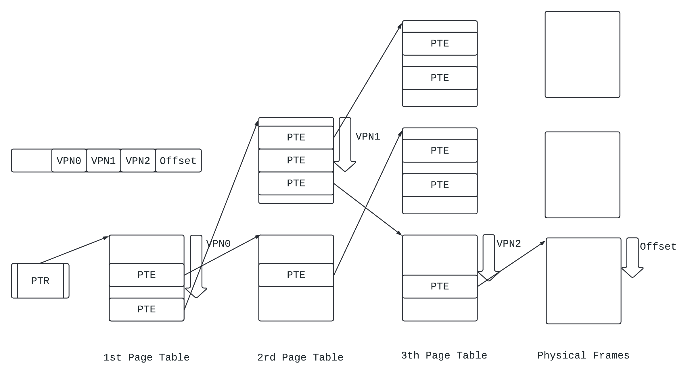

## 虚拟/物理内存的映射

虚拟地址空间, 取决于CPU的位数, 例如对于32位CPU, 虚拟地址空间是4GB, 地址空间的范围是: `[0, 0xffffffff]`.

物理地址空间一般小于虚拟地址空间.

对于物理地址空间, 一般划分为若干个Frame, 称为Physical Frame.

对于虚拟地址空间, 一般划分为若干个Page, 称为Virtual Page.

Physical Frame的大小和Virtual Page的大小相等, 典型值为4KB.

对于一个虚拟地址, 它可以被划分为两部分:

* VPN (Virtual Page Number): 这个字节在第几个Virtual Page.
* Offset: 这个字节在这个Virtual Page的偏移量.

同样, 对于一个物理地址, 它也可以被划分为两部分:

* PFN (Physical Frame Number): 这个字节在第几个Physical Frame.
* Offset: 这个自己在Physical Frame中的偏移量.

内存的虚拟化, 本质上就是将每一个Virtual Page, 映射到Physicl Frame以及磁盘. 再本质上来说, 就是建立VPN到PFN的映射.

CPU中, 完成VPN到PPN映射的硬件就是MMU (Memory Management Unit).

## 线性页表映射

在CPU中, 用页表(Page Table)来存储VPN到PFN的映射关系, 页表一般位于物理内存之中, 当进程创建时, 会自动在物理内存中分配一块作为页表的空间.

线性页表就是使用一个页表存储所有VPN到PFN的映射.

### 为什么使用页表?

页表能够使得一个Virtual Page能够和任意一个Physical Frame建立映射关系.

### 页表如何寻址?

CPU中有一种寄存器叫做PTR (Page Table Register), 存储了页表的起始物理地址, 当页表被创建时, PTR也会被设置好.

理想情况下, 页表应该能够存储所有Virtual Page的映射关系, 那么页表项(Page Table Entry, PTE)的个数就是: `2^{VPN的位数}`.

那么, 如果要定位一个页表项, 就可以用: `PTR + VPN * (一个页表项的大小)`.

如果是线性页表, 那么页表项中就会存储对应的PFN, `{PFN, Offset}`就是最终翻译完成的物理地址.

### 线性页表的缺陷

一个进程需要的页表空间是: `PTE个数 * PTE大小 = 2 ^ {VPN的位数} * PTE大小`.

一般系统中要运行特别多进程, 采用线性页表太费内存.

## 多级页表映射

假设以三级页表为例.

如果要采用多级页表映射, 首先需要对虚拟地址进行重新划分:

* 虚拟地址中的VPN, 从高到低被划分成VPN0, VPN1, VPN2.
* VPN0存储一级页表页表项的编号.
* VPN1存储二级页表页表项的编号.
* VPN2存储三级页表页表项的编号.

页表存储的内容不同:

* 一级页表PTE存储二级页表起始物理地址.
* 二级页表PTE存储三级页表起始物理地址.
* 三级页表PTE存储PFN.

地址转换示意图如下:

> 为什么多级页表可以省物理内存?

* VPN0占用的比特少, 一级页表中的页表项就少很多.
* 后面的二级页表, 三级页表可以按需创建.

## Page Fault

### 进程的swap空间

当创建一个进程时, OS会在磁盘上为这个进程开辟一块空间, 专门用来存储一个进程的所有Physical Frame.这个空间叫做进程的swap空间.

开辟swap空间后, OS还会在物理内存中创建一个swap表, 用来记录VPN和磁盘位置的映射关系, 这个表格的结构和页表类似.

### 物理内存的写入

物理内存本质上是磁盘的Cache, 当进程尝试写某一个Physical Frame时, 对应的页表项的Dirty bit就会设置为1.

当这个Physical Frame被移出物理内存时, 对应的内容就会被写入磁盘的swap空间.

但是, 如果CPU使用了Write Back类型的D-Cache, 那么还需要在写入磁盘前, 检查一下D-Cache中是否存储有这个Physical Frame的数据, 并且Dirty bit是否为1, 如果是, 那么需要将D-Cache的内容同步到Physical Frame, 然后再写入.

* 这样就要求CPU提供对应指令, 让OS能够管理D-Cache.

### Page Fault的处理流程

在页表项中一般有一位叫做Valid, 如果是1, VPN已经和某一个PFN建立了映射关系.

当进行地址转换时, 如果发现PTE的Valid为0, 那么这个VPN就没有和PFN建立映射关系, MMU就会触发Page Fault.

Page Fault的处理流程如下:

* MMU会向CPU报告Page Fault, 然后将导致Page Fault的虚拟地址存储到一个寄存器中.
* 跳转到OS中对于Page Fault的处理程序.
* 如果D-Cache采用了Write Back:
  * 如果硬件提供了相应的位来实现LRU算法, 那么OS会首先将D-Cache中所有的操作同步到PTE中.

* OS通过页面置换算法选择一个Victim Physical Frame, 解除它与VPN的映射关系, 并建立VPN与磁盘swap空间的映射 (写入swap表).
  * 如果D-Cache中这个Physical Frame被写过了, 那么还需要先将数据从D-Cache同步到Physical Frame.
  * 如果这个Victim Physical Frame的Dirty bit为1, 将其内容写入swap空间.
* OS会根据导致Page Fault的虚拟地址, 查询表格, 在swap空间找到对应的Physical Frame, 放入物理内存, 解除swap空间与VPN的映射关系, 建立VPN与PFN的映射(写入页表).
* CPU从Page Fault Handler返回, 导致Page Fault的指令重新执行, CPU会再次将虚拟地址发送给MMU.

### 页面置换算法

实际的页面置换算法是硬件和软件协同实现的, 采用的算法是伪LRU算法.

* 硬件: PTE提供了一个use bit, 如果一个Physical Frame被访问过了, 那么use bit置1.

* 软件:

  * OS会周期性地将页表的use bit清0.
  * 当需要置换Physical Frame时, OS如果发现如果某个PTE的use bit为0, 那么它在最近就没有没使用过, 直接置换.

  * 注意: 当OS需要查询PTE的use bit时, 如果D-Cache是Write Back类型的, 那么就需要先将D-Cache中所有Dirty的Cache Line同步到物理内存, 才能再次查询PTE.

## 内存保护

在系统中运行着不同的进程, 这些进程会运行在不同的权限(privilege mode). 

* 用户进程不能随便修改操作系统的内容, 但是可以读取操作系统的一些内容, 例如系统调用等.
* 物理内存可以专门划分一块特权区域供OS使用, OS可以直接使用物理地址寻址这个区域(不用页表), 这个区域不允许用户进程使用.

因此, 不同进程对于相同的Physical Frame来说, 访问权限是不一样的.

这种功能一般在硬件上进行实现, PTE会预留若干比特, 专门存储Physical Frame的访问权限.

* 如果采用多级页表, 可以实现粗粒度和细粒度结合的权限控制. 例如一级页表可以控制大范围Physical Frame的权限, 二级页表可以更加细粒度.

如果违反了访问权限, MMU会向CPU报告异常, 然后进入OS对应的Exception Handler, OS可以选择终止进程.

## 禁止缓存

在某些情况下, 如果使用虚拟地址读取数据后, Physical Frame中对应的内容是不能被缓存到Cache中的.

* 例如, 虚拟地址对应外设寄存器.

此时, 可以在PTE中添加一个bit, 标记这个Physical Frame是不可以被缓存的(Cacheable), MMU经过地址转换后就不会让这个Physical Frame中的数据送到Cache中.

## TLB

### TLB的必要性

进行地址转换需要多次访问页表(物理内存), 耗时很长, 因此需要为页表准备一个Cache, 用来缓存最近使用过的PTE, 这个缓存就叫TLB (Translation Lookahead Buffer).

* 地址转换具有明显的时间相关性(现在访问的Physical Frame有可能将来再访问), 但是没有明显的空间相关性 (不用Prefetch).

### TLB的架构

TLB本质上也是一个Cache.

* Tag部分就是VPN.
* Data部分就是PTE.

在CPU中, 一般采用两级TLB:

* 第一级TLB是全相连Cache (Fully Associative Cache), 分为I-TLB和D-TLB, 容量较小.
* 第二级TLB是组相连Cache, 指令和数据共享, 容量较大.

### TLB的工作原理

CPU会拿着虚拟地址的VPN去TLB中找:

* 如果TLB Hit, 那么直接读出PFN, 就可以得到最终的物理地址.
* 如果TLB Miss, 那么就有三种情况:
  * 对应的Physical Frame不在物理内存.
  * 对应的Physical Frame在内存, 有PTE, 但是PTE没有放到TLB中.
  * 对应的Physical Frame在内存, 有PTE, PTE被TLB踢出来了.

要解决TLB Miss, 本质上就是从页表中找到VPN和PFN的映射关系, 并且放到TLB中.

在CPU中, 如果TLB Miss, 那么CPU会产生一个异常, 并且将导致TLB Miss的虚拟地址存储到寄存器中, 然后跳转到Exception Handler.

Exception Handler会进行Page Table Walk, 找到VPN和PFN的映射关系, 然后写入TLB中, 如果Exception Handler处理时没有找到PTE, 那么异常会嵌套, 转变成Page Fault.

Page Table Walk可以采用硬件实现, 也可以采用软件实现:

* 软件实现:
  * 优点: 可以实现一些灵活的TLB替换算法, 减少硬件复杂度.
  * 缺点: 
    * 在处理TLB Miss时, 会有两个延时, 导致性能受限:
      * Exception Handler执行的延时.
      * 恢复流水线的延时.
    * 需要CPU特殊支持TLB的写入指令.
  * 注意: 为了防止Exception Handler再次发生TLB Miss, 这一部分程序直接使用物理地址寻址, 一般内置在OS中.
* 硬件实现:
  * 优点: 延时较低, 只需要将流水线stall, 然后等待TLB Miss处理完之后再让流水线执行即可.
* 如何选择?
  * 当CPU流水线深度不深时, 可以采用软件实现, 因为当TLB Miss时, 从流水线中被flush的指令也不会很多.

### TLB的置换算法

TLB一般采用Random替换算法, 采用Clock Algorithm实现的伪随机算法.

### TLB的写入

> TLB的写入是什么意思?

当读内存时, 需要把对应的PTE的use位设置成1.

当写内存时, 需要把对应的PTE的use, dirty位设置成1.

但是, 如果TLB采用了Write Back, 那么这些操作会先被同步到TLB中.

* 将dirty bit设置成1表示这个页的内容被改变过了, 但是这个dirty bit不会马上同步到PTE中, 而是先写入TLB中.

当TLB中的某个PTE被踢出去后, 数据才会同步到页表的PTE中.

> TLB使用Write Back写入时的问题?

在页表中, 所有PTE的use, dirty位的信息可能过时, 最新信息可能在TLB中.

但是发生Page Fault时, OS需要利用这些信息去选择Physical Frame进行置换.

因此, OS需要先将TLB的信息同步到Physical Frame, 然后在进行页面置换, 同步的过程需要大量访问物理内存, 效率低.

因此, 可以有这个假设: 所有被TLB缓存的PTE对应的Physical Frame都不允许被置换. OS可以想办法知道哪些PTE是存储在TLB中的.

> TLB写入的另一个问题

当发生Page Fault时, PTE中存储的信息可能不是最新的, 它的最新信息可能在两个地方:

* TLB.
* D-Cache (Physical Frame本身的信息也可能不是最新的, 可能在D-Cache中).

对于读物理内存来说, 只有TLB会记录use bit, 对于写物理内存来说, TLB和D-Cache都会记录use bit和dirty bit.

由于TLB记录的PTE对应的Physical Frame不允许置换, 因此当发生Page Fault时, TLB记录的这些信息就不用被同步到对应的PTE, 只有D-Cache中的信息被同步到PTE和Physical Frame即可.

当TLB Miss并且TLB满了时, 需要从TLB中踢出一个PTE, 提出后的PTE的所有操作需要同步到页表, 这一步和D-Cache没有关系.

总结来说:

* TLB同步到页表的操作只有在TLB中的PTE被踢出去后发生.
* D-Cache到PTE和Physical Frame的同步在发生Page Fault后进行:
  * 首先要同步use bit和dirty bit.
  * 选中Physical Frame后, 如果这个Frame的数据在D-Cache中有, 并且dirty bit为1, 还要同步这个写入.
  * 需要CPU提供D-Cache的管理指令, 让OS控制D-Cache.
* 由于TLB缓存的PTE对应的Physical Frame不参与页面置换, 所以不需要在Page Fault时同步TLB的操作.

### TLB的管理指令

如果一个VPN到PFN的映射在页表中不存在了, 那么它在TLB中也不应该存在.

一般来说, 如果VPN到PFN的映射不存在, 可能会是如下原因:

* 发生Page Fault, 出现了页面置换.
* 进程结束, 这个进程对应的所有映射失效.

这两种情况基本上需要OS软件处理, 因此要求CPU提供TLB的管理指令, 通常的管理指令需要实现以下功能:

* 将I-TLB和D-TLB的所有表项置为无效.
* 将某个进程的I-TLB和D-TLB中所有表项置为无效.
* 将某个VPN对应的I-TLB和D-TLB中的表项置为无效.

## 使用虚拟地址的Cache

### 虚拟缓存的设计问题

#### 重名问题(Aliasing)

重名问题是指: 不同进程, 不同的虚拟地址可以映射到同一个物理地址.

例如两个进程的`printf`函数, 两个进程中`printf`函数的虚拟地址可能不一样, 但是物理地址是一样的.

此时, 如果这两个不同的虚拟地址占用了两个不同的Cache Line, 那么就会出现重名问题.

这样对于Cache来说有两个影响:

* 浪费Cache空间: 两个不同的虚拟地址可能会占用不同的Cache Line, 但存储的数据是相通的.
* 同步问题: 写入Cache时, 如果对其中一个虚拟地址的Cache Line写入, 这个写入需要同步到映射到同一个物理地址的所有虚拟地址对应的Cache Line.

并不是所有的虚拟Cache都会有重名问题, 是否有重名问题取决于Cache的大小和页的大小.

* 页的大小决定了虚拟地址转换为物理地址时, 后面有多少位是不变的, 假设页的大小是4KB, 那么虚拟地址和物理地址最后12位是一样的.
* Cache的大小决定了索引Cache用到了虚拟地址的多少位, 假设Cache是Dirtected Mapped Cache.
  * 假设Cache的大小小于4KB, 那么索引Cache的地址就小于12位, 那么即使两个不同的虚拟地址映射到了同一个物理地址, 它们在Cache中也会映射到同一个Cache Line.
  * 假设Cache的大小大于4KB, 假设是8KB, 索引Cache的地址就超过12位, 是13位, 如果两个不同的虚拟地址映射到了同一个物理地址, 那么虚拟地址不同的部分可能是前面多出来的1位, 而这1位可能就决定了两个不同的虚拟地址会映射到不同的Cache Line.

> 如何解决重名问题?

解决重名问题的核心, 就是想办法保证: 如果两个虚拟地址映射到同一个物理地址, 那么它们也会映射到同一个Cache Line.

现在假设索引Cache的地址位数大于虚拟地址Offset所占的位数, 多出了$n$位.

那么, 我就将原来的Cache等分成$2^n$个Cache Bank.

当来一个虚拟地址VA时, 我可以根据Offset位, 从$2^n$个Cache Bank读出$2^n$个Cache Line, 这些Cache Line就是可能与这个VA映射到同一个物理地址的所有虚拟地址所在的Cache Line.

在读取这些Cache Line的同时, TLB/MMU会进行地址转换, 得到对应的物理地址.

在物理地址的PFN中, 取最后的$n$位, 送入多路选择器, 选择出来的Cache Line就是最终的Cache Line.

之后, PFN中剩余的比特当作Tag, 用来判断Cache是否命中.

如果两个虚拟地址映射到了同一个物理地址, 那么:

* 他们Offset相同, 那么他们对应的Cache Line一定是这$2^n$个Cache Line中的其中一个.
* 他们物理地址相同, 那么最终多路选择器只会选择出来一个Cache Line, 因此他们就映射到了同一个Cache Line.

设计缺点:

* 随着Cache容量增大, 需要的bank数目也会增大.
* Cache的输入需要送到所有bank读出数据, 输入端负载变大, 功耗大.

本质上, 这个就是VIPT类型的Cache的基本思想.

#### 同名问题(Homonyms)

同名问题就是不同的进程, 相同的虚拟地址会映射到不同的物理地址. 进程切换后, 需要对Cache中的数据进行调整.

解决方法: 将虚拟地址进行扩展, 新的虚拟地址又两部分组成:

* 第一部分: PID
* 第二部分: 原来的虚拟地址.

因此, 可以考虑增加一个页表, 这个页表使用PID来进行寻址.

如果采用的多级页表(假设是四级页表):

* 一级页表的PTE通过PID来寻址.
* 二级页表的PTE通过VPN0寻址, 此时, PTR中就存储二级页表的基地址.
* 三级页表的PTE通过VPN1寻址.
* 四级页表的PTE通过VPN2寻址.

ISA中会有一个专门的寄存器用来保存当前运行的PID值.

四级页表的页表项中, 会有一个bit叫做Global, 表示这个页是否是多个进程共享的.

* 如果Global bit是1, 那么TLB在缓存时, 就不会缓存PID的信息.
* MMU查询TLB时, 会查询当前进程的PID与TLB中缓存的PID是否一致, 以及Global bit的情况.

PID由OS进行管理:

* 当进程总数大于PID能表示的范围时, OS需要选择一个进程, 将它的TLB, 以及PTR清空(页表的内容还在, 因为这个进程没被杀死), 并且将这个PID分配给新的进程.
* OS还需要保留原来进程的页表PTR, 当恢复进程时需要恢复PTR.

### 对Cache的控制

有下面几种情况需要对Cache进行控制:

* 当DMA要把数据从物理内存搬到其他地方 (物理内存中的数据的最新版本可能还在Cache中).
* 当DMA要把数据从其他地方搬到物理内存, 此时物理内存的地址又在Cache中缓存了, 那么需要把对应的Cache Line置为无效.
* 当发生Page Fault时, OS选出一个victim page, 如果这个victim page在Cache中有缓存并且是脏的, 需要先把Cache的操作同步到物理内存中.

因此, 对于I-Cache的D-Cache总共有以下几种操作:

* 将I-Cache所有Cache Line置为无效.
* 将I-Cache中某个Cache Line置为无效.
* 将D-Cache中所有Cache Line置为无效.
* 将D-Cache中某个Cache Line置为无效.
* 将D-Cache中所有Cache Line同步到物理内存.
* 将D-Cache中某个Cache Line同步到物理内存.
* 将D-Cache中所有Cache Line同步到物理内存, 并置为无效.
* 将D-Cache中某个Cache Line同步到物理内存, 并置为无效.

### 几种缓存流水线设计

#### PIPT

TLB用来缓存虚拟地址到物理地址的映射, Cache用来缓存物理地址到数据的映射, 如果采用PIPT (Physically Index, Physically Tagged Cache), 就要先从TLB/MMU中进行完地址转换, 然后在用物理地址索引Cache, 这两个操作对应流水线的两个stage.

缺点: 

* 对于D-Cache来说, 增加了load指令的延时.
* 对于I-Cache来说, 流水线级数增加, 会增加分支预测失败的penalty.

因此, 可以让Cache直接缓存虚拟地址到数据的映射, 当Cache Miss时, 再通过TLB/MMU转换后访问物理内存.

#### VIPT

VIPT的全称是Virtually Indexed, Physical Tagged. 也就是说, 使用虚拟地址的一部分寻址Cache, 使用物理地址的一部分作为Tag来判断是否Cache Hit. 这样做有如下好处:

* 访问Cache的过程和TLB/MMU进行地址转换的过程可以同时进行.

VIPT可以分为三种情况: 分类依据是页的大小和Cache大小的关系, 这两者的关系决定了VIPT Cache是否会有重名问题.

* 如果页大小大于等于Cache大小, 那么索引Cache的位数就小于虚拟地址中Offset的位数, 因为虚拟地址和物理地址的Offset是相同的, 因此这种情况本质上就是使用物理地址索引Cache.

  * 这种情况下, 限制Cache的大小不能超过页的大小, 如果要扩大Cache容量, 需要增加Way的个数 (因为增加Way的个数不会增加索引Cache的地址的长度).
* 如果页的大小小于Cache大小, 那么可以采用如下策略:
  * 将Cache分bank解决重名问题, 前面已经介绍过.
  * 使用L2 Cache实现.
  

> 使用L2 Cache解决重名问题.

首先, L1 Cache和L2 Cache的关系需要是inclusive的.

L2 Cache一般采用PIPT的方式实现.

假设索引Cache所用的位数比虚拟地址Offset的位数多$n$位.

当一个虚拟地址索引L1 Cache时(此时TLB/MMU同时会进行地址转换), 假设Cache Miss:

* 如果在L2 Cache中也出现了Cache Miss, 那么写入L2 Cache时, 会将虚拟地址中多出来的那$n$位也写入L2 Cache对应的Cache Line.
* 如果在L2 Cache中Hit了, 那么L2 Cache会检查那多存储的$n$位:
  * 如果这$n$位和我这个虚拟地址的$n$位不相等, 那么就说明L1 Cache中存在一个Cache Line, 对应的虚拟地址和我重名, 此时需要:
    * 根据L2 Cache中存的这$n$位, 以及虚拟地址的Offset从L1 Cache中找到对应的Cache Line.
      * 直接把这两部分拼起来索引L1 Cache就行.
    * 如果在L1 Cache中找到的这个Cache Line是dirty的, 那么需要先将它的修改同步到L2 Cache.
    * 然后将这个Cache Line置为无效.
  * 然后, 将L2 Cache对应的Cache Line再搬到刚才找到的, L1 Cache中的对应位置.

通过这种方法, 就能保证所有重名的虚拟地址只有一个在L1 Cache中.

## 总结

对于虚拟地址和Cache来说, 总共有四种结构:

* TLB
* 页表
* D-Cache
* 物理内存

它们有如下几种关系:

* TLB Hit, 页表必然Hit.
* 页表Hit, 物理内存必然Hit.
* D-Cache Hit, 物理内存必然Hit.

最好情况: 当TLB和D-Cache同时Hit时, load/store指令的流水线最短, 并且不需要访问物理内存.

最坏情况: 当TLB和D-Cache同时Miss, 并且页表也Miss(发生Page Fault).

* 一般来说, 如果Page Fault后, 进程需要从磁盘读数据, 这个时间会很长, OS会把这个进程切换为其他进程, 当磁盘读取完发生中断后, OS才会把这个进程切换回来.

